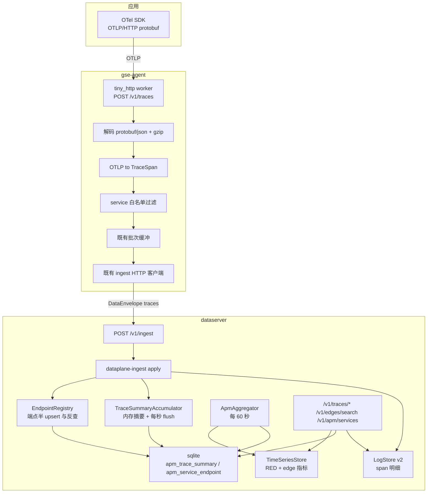

# APM trace 采集与查询

Feature Name: apm-tracing
Updated: 2026-09-23

## Description

在既有采集链路上增加 APM：`gse-agent` 内置 OTLP/HTTP receiver 接收应用 trace，把 OTLP span 转为 `TraceSpan`（OTel 语义，见 `observability-data-model`），复用既有批次缓冲与直连 `dataserver` 上报；`dataserver` 把 span 明细写入 `LogStore`（按 `trace_id` 索引）、把 trace 摘要与端点半写入 sqlite，并每 60 秒聚合出 RED 指标与拓扑边指标写入 `TimeSeriesStore`；前端在 `@vectorman/dataplane` 增加 trace 列表、trace 详情、服务拓扑、APM 指标四个页面，并在既有日志页增加 trace 跳转。

设计前提（本期只交付设计，不写代码）：

- `data_type=traces` 与 `TraceSpan` 模型、指标命名、端点反查规则取自 `observability-data-model`，本文不重复定义。
- 前置依赖：`LogStore` 索引版本 v2（索引字段 `trace_id`/`service`/`data_id` + `search_indexed`）、sqlite 观测表初始化。前者是硬前置：没有它 trace 详情取不全。
- 聚合指标的保留与删除依赖同期交付的 `/.monkeycode/specs/dataplane-ts-retention/`：`TimeSeriesStore` 新增 `delete_series` 与全局保留窗口，`ts_retention_days` 缺省 30 天。
- eBPF 兜底不在本 feature 内，只约定拓扑合并口径（指标 `source` label）。

实施顺序（两份观测 spec 的约定）：`LogStore` 索引 v2 → `dataplane-ts-retention` → 本 feature → `ebpf-observability`。

## Architecture



关键取舍：

- 上行沿用既有通路（Agent 缓冲 → 直连 dataserver）。OTLP 不经控制面，`gse-server` 只负责把 `apm_otlp` 采集项下发到 Agent，不承载 trace 字节。
- Agent 只做转封与过滤，不做采样、不做聚合、不感知 trace 完整生命周期（span 分批到达，汇总在 dataserver 完成）。
- dataserver 的 trace 摘要是「内存累计 + 周期 flush」，不是每 span 一次 sqlite 读改写；崩溃最多丢 1 秒或 500 条的摘要增量，明细不受影响。

## Components and Interfaces

### Workspace 变更

| 路径 | 职责 |
| --- | --- |
| `crates/dataplane-ingest` | `TraceSpan` DTO（`src/trace.rs`）；`DataType::Traces`；`apply` 分支：明细写 LogStore、摘要交 accumulator、端点交 registry |
| `crates/dataplane-apm`（新） | `TraceSummaryAccumulator`、`EndpointRegistry`、`ApmAggregator`、trace/edge/service 查询实现、sqlite 建表与版本检查 |
| `crates/dataplane-log` | 索引版本 v2：索引字段提升与 `search_indexed`（前置依赖，见共享模型） |
| `crates/gse-agent-core` | `collect/otlp.rs`（receiver + 转封 + 过滤）、Agent 配置项、采集项类型 `apm_otlp` |
| `bins/dataserver` | 装配 `dataplane-apm`、新增路由与后台任务、APM 配置项 |
| `bins/dpc` | `traces`、`trace <trace_id>`、`edges` 子命令 |
| `frontend/apps/dataplane` | 新增 `/traces`、`/traces/:trace_id`、`/topology`、`/apm` 四页；日志页加 trace 跳转 |

依赖方向：`dataplane-apm` → `dataplane-ingest`、`dataplane-log`、`dataplane-sql`、`dataplane-ts`、`dataplane-kv`、`dataplane-core`。`gse-agent-core` 不依赖 `dataplane-apm`（只依赖 `dataplane-ingest` 的 DTO 与 HTTP 客户端），保持「Agent 不打开本地引擎」的既有约束。

### Agent：OTLP receiver

新增依赖（构建约束见 Pitfalls）：

| 依赖 | 用途 |
| --- | --- |
| `tiny_http` | 阻塞式 HTTP 服务，独立 OS 线程，不引入 axum/hyper 与新的 tokio runtime 假设 |
| `opentelemetry-proto` | prost 生成的 OTLP 消息类型，避免在 CI 里引入 `protoc` |
| `flate2` | 请求体 gzip 解压 |
| `prost` | protobuf 解码（随 `opentelemetry-proto` 传递） |

```rust
struct OtlpReceiverConfig {
    listen: String,          // 0.0.0.0:4318（应用在容器/Pod 内，无法访问 Agent 的 127.0.0.1）
    max_body_bytes: usize,   // 8 MiB
    token: String,           // 空表示不校验；非空校验 Authorization: Bearer
    allowed_cidrs: Vec<String>, // 空表示不限来源
    batch_max_records: usize,
    flush_interval_secs: u64,
    service_allowlist: Vec<String>,
    service_denylist: Vec<String>,
    attribute_allowlist: Vec<String>,
    item_id: String,         // 采集项 item_id，写入 data_id
}
```

监听与网络形态（默认 `0.0.0.0:4318` 的直接原因）：应用与 Agent 不在同一容器网络命名空间，两典型部署下 `127.0.0.1` 均不可达。

| 应用部署形态 | 应用侧配置 | Agent 侧要求 |
| --- | --- | --- |
| 同主机 docker compose | `OTEL_EXPORTER_OTLP_ENDPOINT=http://<宿主 IP>:4318`，或给容器加 `extra_hosts: ["host.docker.internal:host-gateway"]` 后使用 `host.docker.internal`；`--network host` 的容器可直接 `127.0.0.1` | 监听 `0.0.0.0:4318`；宿主机防火墙放行 4318 |
| 同节点 k8s Pod | `OTEL_EXPORTER_OTLP_ENDPOINT=http://$(NODE_IP):4318`（用 `fieldRef: status.hostIP` 注入环境变量） | 同上；不要求 Pod 使用 hostNetwork，也不要求 DaemonSet 特权 |
| Agent 与应用同 netns（少数场景） | `http://127.0.0.1:4318` | 可将 `otlp_listen` 改回 `127.0.0.1:4318` |

安全：默认监听全网卡且默认无鉴权（与既有 `/v1/ingest` 无鉴权一致，接入令牌校验仍属后续范围）。生产建议至少启用 `otlp_allowed_cidrs`（例如只放行集群 Pod CIDR 与 docker 网桥）或 `otlp_token`；两者为空时 dataserver 与 Agent 均启动一行 warn，提醒该端口对同网段开放。

处理流程（`POST /v1/traces`）：

1. 校验 `Content-Type`：`application/x-protobuf` 或 `application/json`；`Content-Encoding: gzip` 时先解压。
2. 鉴权与来源限制：`token` 非空时校验 `Authorization: Bearer <token>`（不匹配 HTTP 401）；`allowed_cidrs` 非空时校验对端 IP（不匹配 HTTP 403）。两者都只计数不打日志全文。
3. 解析 `ExportTraceServiceRequest`。
4. 逐 `ResourceSpans` → `ScopeSpans` → `Span` 转换：

| OTLP 字段 | TraceSpan | 说明 |
| --- | --- | --- |
| `resource.attributes["service.name"]` | `service` | 与共享模型一致 |
| `resource.attributes` | `resource` | AnyValue 字符串化后入 map |
| `scope.name` / `scope.version` | `scope_name` / `scope_version` | `ScopeSpans.scope` |
| `Span.trace_id` / `span_id` | 同名字段 | 字节转小写 hex；长度不符则该条丢弃并计数 |
| `Span.parent_span_id` | `parent_span_id` | 全零或不存在的形式统一为空串（根） |
| `Span.start_time_unix_nano` / `end_time_unix_nano` | 直取 | `timestamp = start / 1000` |
| `Span.kind` | `kind` | 枚举转小写字符串 |
| `Span.status` | `status_code` / `status_message` | 经共享映射表 |
| `Span.attributes` | `attributes` | `attribute_allowlist` 非空时只保留名单内 key，其余丢弃并计数 |
| `Span.events` / `Span.links` | 同名字段 | 全量 |
| `dropped_attributes_count` 等 | `dropped_*` | 直取 |

4. `service` 命中 `service_denylist` 或 `service_allowlist` 非空且不在名单 → 丢弃该条并计数（每秒汇总 stderr 一行，不做逐条日志）。
5. 合法 span 按 `batch_max_records`（默认 100）或 `flush_interval_secs`（默认 5 秒）攒成 `data_type=traces` 批次，`data_id = item_id`，交既有缓冲。
6. 返回 `ExportTraceServiceResponse{partial_success: None}`。解析失败返回 HTTP 400 + OTLP 错误体。

生命周期：`enabled=true` 的 `apm_otlp` 采集项存在时启动 worker 线程，采集项列表变化时按 `item_id` 对齐启停；无此类采集项则端口不监听。

### dataserver：接入分支

`dataplane-ingest::apply` 增加 `DataType::Traces` 分支，顺序固定：

1. 校验信封（`data_type` / `agent_id` / 非空 records）→ 既有逻辑。
2. 逐条解析 `TraceSpan`；缺 `trace_id`/`span_id`、hex 长度不符、序列化超 256 KiB → 记 `failures`，继续。
3. 幂等判断：`KvStore.exists("ingest/{record_id}")`；已存在则计入 `accepted` 并跳过后续所有写入。
4. 明细：把 span 映射为 `LogRecord` 写 `LogStore`。映射规则：

| LogRecord 字段 | 取值 |
| --- | --- |
| `id` | `record_id`（`{trace_id}:{span_id}`） |
| `timestamp` | `TraceSpan.timestamp` |
| `level` | `status_code=error` → `error`；否则 `info` |
| `message` | `"{service} {name} {duration_micros}us"`（与既有 `apm` 映射风格一致） |
| `labels` | `data_type=traces`、`agent_id`、`data_id`、非空 `host_id`、`trace_id`、`span_id`、`parent_span_id`、`service`、`kind`、`status_code` |

`LogRecord.payload` 保存 span 原文（完整 OTel JSON），标签只做检索投影；索引字段 `trace_id`/`data_type`/`service`/`data_id` 由 `LogStore::append` 内部从 `labels` 提升，因此既有 logs/apm/ebpf 写入也自动获得按 `data_id` 的索引检索与更快的清理。

5. 摘要：`TraceSummaryAccumulator::observe(span, agent_id, host_id, data_id)`（内存）。
6. 端点：`EndpointRegistry::observe(&span.resource, &span.service)`（内存缓存 + 周期 upsert sqlite，60 秒或 500 条触发）。
7. `KvStore.set("ingest/{record_id}", [])`；更新 `stream/{agent_id}/traces/{data_id}` 的 `last_seen`（沿用既有流索引）。
8. 返回 `IngestReply`，语义与既有类型一致（`ok` / `partial`）。

### dataserver：TraceSummaryAccumulator

内存结构：

```rust
struct TraceAcc {
    trace_id: String,
    start_ts: i64,
    max_end_ts: i64,
    root: Option<(i64, String, String)>, // (start_ts, service, operation) 取 start 最小者
    span_count: u32,
    error_count: u32,
    services: BTreeSet<String>,
    agent_id: String,
    host_id: String,
    data_id: String,
    collector: String,
    dirty: bool,
}
```

- 容量上限 `max_live_traces`（默认 20_000）：超限时先 flush，再按 `max_end_ts` 升序淘汰**已落库的干净条目**（淘汰安全：flush 是「读回已有行 + 合并内存增量」，条目重建后从库里的绝对值继续累加）。
- 根 span 的 `start_ts` 必须落库（`apm_trace_summary.root_start_ts`，schema v2）：根可能比普通 span 晚到，也可能跨多次 flush 才到，只存 `root_service`/`root_operation` 无法比较出更早的根。
- 端点表的 `last_seen_ts` 用**墙上时钟**（观察时刻），而摘要用 span 时间戳：两者的清理窗口语义不同，不要混用同一个「now」。
- flush 触发：每 1 秒、或累计 500 个 `dirty` 项、或进程退出（best effort）。
- flush 语句（`max_end_ts` 列见本文 Data Models，共享模型 DDL 同步）：

```sql
INSERT INTO apm_trace_summary
  (trace_id, start_ts, max_end_ts, duration_micros, root_service, root_operation,
   span_count, error_count, status, services_json, collector, agent_id, host_id, data_id, updated_ts)
VALUES (?1, ?2, ?3, ?4, ?5, ?6, ?7, ?8, ?9, ?10, ?11, ?12, ?13, ?14, ?15)
ON CONFLICT(trace_id) DO UPDATE SET
  start_ts        = MIN(apm_trace_summary.start_ts, excluded.start_ts),
  max_end_ts      = MAX(apm_trace_summary.max_end_ts, excluded.max_end_ts),
  duration_micros = MAX(apm_trace_summary.max_end_ts, excluded.max_end_ts) - MIN(apm_trace_summary.start_ts, excluded.start_ts),
  span_count      = apm_trace_summary.span_count + excluded.span_count,
  error_count     = apm_trace_summary.error_count + excluded.error_count,
  status          = CASE WHEN apm_trace_summary.error_count + excluded.error_count > 0 THEN 'error' ELSE 'ok' END,
  root_service    = COALESCE(apm_trace_summary.root_service, excluded.root_service, 'unknown_service'),
  root_operation  = COALESCE(apm_trace_summary.root_operation, excluded.root_operation, ''),
  updated_ts      = excluded.updated_ts
```

参数绑定顺序：`?1`=trace_id、`?2`=start_ts、`?3`=max_end_ts、`?4`=duration_micros、`?5`=root_service、`?6`=root_operation、`?7`=span_count、`?8`=error_count、`?9`=status、`?10`=services_json、`?11`=collector、`?12`=agent_id、`?13`=host_id、`?14`=data_id、`?15`=updated_ts。`services_json` 在 `VALUES` 中直接绑定合并后的值（不依赖 `excluded`），因此在 `DO UPDATE` 中不需要额外赋值。

`services_json` 与「根 span 取 start 最小者」需要读改写，实现顺序：

1. `SELECT start_ts, max_end_ts, root_service, root_operation, services_json FROM apm_trace_summary WHERE trace_id = ?`。
2. 在内存合并（`start_ts` 取小、`max_end_ts` 取大、根按 `start_ts` 比较、`services` 取并集）。
3. 写回整行（`INSERT OR REPLACE` 语义，`span_count`/`error_count` 用累加值）。

为避免每 span 一次读写，`TraceSummaryAccumulator` 内的合并已在内存完成，flush 时每个 trace 只做一次「读 + 写」；同一 trace 在同一秒内多次 flush 也只合并成一次。冷启动（dataserver 重启）：启动时 `SELECT ... WHERE max_end_ts > ?`（now - 5 分钟）回载入 accumulator，覆盖 span 分批到达跨重启的场景；更早的 trace 视为已结束，后续新 span 走新累加，`span_count` 可能偏低，此时详情响应靠 `partial=true` 提示。

一致性取舍（写进文档、不隐藏）：崩溃最多丢 1 秒或 500 项的摘要增量；明细已在 `LogStore`，因此详情页可显示实际条数多于 `span_count`，前端以实际返回条数为准并在不一致时提示。

### dataserver：EndpointRegistry

- 写入：从 span 的 `resource` 取 `service.name`、`service.instance.id`（缺省用 `{service}@{pod_name}`）、`k8s.pod.name`、`k8s.node.name`、`host.ip`；`listen_port` 取 `attributes["server.port"]` 或 `attributes["net.host.port"]`，缺失为 0。
- 内存 map 键为 `(service, instance_id)`，值带 `dirty` 标记；60 秒或 500 条变更触发批量 upsert：
  ```sql
  INSERT INTO apm_service_endpoint (service, instance_id, pod_name, node_name, host_ip, listen_port, collector, first_seen_ts, last_seen_ts)
  VALUES (?,?,?,?,?,?,?,?,?)
  ON CONFLICT(service, instance_id) DO UPDATE SET
    pod_name = excluded.pod_name, node_name = excluded.node_name,
    host_ip = excluded.host_ip, listen_port = excluded.listen_port,
    collector = excluded.collector, last_seen_ts = excluded.last_seen_ts
  ```
- 反查（供 eBPF 边与拓扑兜底使用）按固定顺序：① 静态映射 `apm_service_alias`（`process_name` → `process_prefix` → `pod_prefix` → `cidr`，同类取 `updated_ts` 最新）；② `lookup_by_ip_port(host_ip, listen_port)`；③ `lookup_by_pod(pod_name)`；都不命中落 `unknown-<ip>`。结果（含未命中的负面结果）缓存 60 秒，dataserver 重启后缓存为空，第一轮查询回源 sqlite。
- 静态映射 CRUD：`GET/POST/PUT/DELETE /v1/apm/service-aliases`（同源 SQL 口），写入后递增内存版本号使反查缓存失效，无需重启。校验：`match_value`/`service` 非空、`cidr` 合法、`match_kind` 在枚举内，否则 `invalid_argument`。
- 静态映射只影响 eBPF 边与 `unknown-*` 归一，不覆盖 OTLP span 自带的 `service`。
- 保留期：`apm_endpoint_retention_days`（默认 30），每小时清理 `last_seen_ts < now - retention` 的行。

### dataserver：静态服务名映射

`apm_service_alias` 的 CRUD 在 dataserver 的 `/v1/apm/service-aliases`；`alias_id` 由
`match_kind:match_value` 派生（同一匹配条件天然去重，upsert 幂等）。`AliasCache` 缓存
启用中的映射，写入/删除时通过版本号自增失效；反查优先级固定为
`process_name → process_prefix → pod_prefix → cidr`（同类取 `updated_ts` 最新），
命中即返回，否则落到端点表，最后才是 `unknown-<ip>`。`PUT` 不允许改
`match_kind`/`match_value`（否则等于换主键），需要改就删掉重建。

### dataserver：接入保护

- **限流**：`BatchLimiter`（固定秒窗计数）只作用于 `data_type=traces` 批次；超限回 HTTP 429 + `code=unavailable`，Agent 按既有退避重试（不丢批）；计数进 `dataserver_apm_ingest_throttled_batches_total` / `_throttled_records_total`。`apm_ingest_max_batches_per_sec=0` 表示不限。锁中毒时保守放行（宁可写入也不静默丢观测数据）。
- **明细阈值**：策略由 `TraceSink::detail_min_duration_micros`（即 `ApmSinkConfig.detail_min_duration_micros`）持有，ingest 侧只执行——低于阈值的 span **仍然** `observe_span`（进摘要与聚合），只是不落 `LogStore`。详情页据此把「一条明细都没有」区分为 `detail_filtered`（trace 自身耗时低于阈值）或 `retention_expired`。
- 采样仍由应用侧 SDK 决定，两侧都不改动 `trace_flags`，也不因过滤破坏幂等（去重键仍是 `ingest/{record_id}`）。

### dataserver：ApmAggregator

每 `apm_agg_interval_secs`（默认 60）运行一轮，处理「上一分钟桶」，只读 sqlite 与内存：

1. 桶起点 `bucket_start = floor(now / 60s) * 60s - 60s`，桶终点 `bucket_end = bucket_start + 60s`。
2. 服务维度：`SELECT root_service, root_operation, span_count, error_count, duration_micros, status FROM apm_trace_summary WHERE start_ts >= ? AND start_ts < ?`。注意此处粒度是 trace 级，因此 `apm_service_*` 的 `operation` 用 `root_operation`，`span_kind` 固定 `server`（根 span 语义）。
3. span 维度（用于 `span_kind`/`status` 更细的 RED 与 P50/P95/P99）：从 `TraceSummaryAccumulator` 的分钟快照取；accumulator 在 flush 时按分钟桶把 `(service, operation, kind, status, duration_micros)` 样本累加到内存直方图（`Vec<i64>`，每组上限 20_000 样本，超限按蓄水池采样，桶结束时丢弃）。
4. 边维度：`SELECT ... FROM apm_edge_summary WHERE bucket_start = ?`（表见 Data Models），由 span 配对产生。
5. 写点：每个 measurement 一个 `TsPoint`；`timestamp = bucket_start`；**多值指标用 label `field` 区分**（`field_name` 固定 `value`），其余 label 严格按共享模型命名表；`source=otlp`。
   - 服务计数按 `status` 拆分写入 `apm_service_requests_total{status}`；
   - **服务耗时按 `(service, operation, span_kind)` 合并**（labels 里没有 `status`，按状态分别写会互相覆盖），错误率由计数侧体现；
   - 边计数/耗时和取 `apm_edge_summary`（跨重启不丢），`p95` 取内存边样本。
6. 失败处理：单轮失败记 stderr 一行并跳过该桶，不回填；下一轮照常。自监控指标累加失败次数。

分位数算法：排序后取最近秩（nearest-rank），P50/P95/P99 分别为 `ceil(p/100 * n) - 1` 下标；样本数为 0 时不写该 `field_name`。

### dataserver：span 配对与边摘要

配对在 accumulate 阶段完成，避免聚合任务里做全量 join：

- 收到 `kind=server` 的 span 时，按 `(trace_id, parent_span_id)` 记入内存 `parent_index`（LRU，容量 `max_live_traces * 8`）。
- 收到 `kind=client` 的 span 时，查 `parent_index` 取 `(trace_id, span_id)` 匹配的 server span：
  - 命中：边 `src_service = client.service`、`dst_service = server.service`。
  - 未命中：用 `attributes["server.address"]` / `["net.peer.name"]` / `["net.peer.ip"]` 兜底，值前缀 `unknown:`；都缺失用 `unknown`。
- 边摘要写 sqlite `apm_edge_summary`（每分钟桶聚合一行，含 `calls`、`errors`、`duration_sum`、`duration_max`）。为控制表规模，样本列表不入库，只存 `calls`/`errors`/`sum`/`max`，P95 用「accumulator 内存直方图」在聚合任务里算，因此边指标要求聚合任务与 accumulator 在同一进程（本设计成立）。
- server span 与 client span 到达顺序不保证，因此配对索引两个方向都保留：client 先到则按 `(trace_id, span_id)` 等 server，server 先到则按 `(trace_id, parent_span_id)` 等 client（反向补齐）。
- **兜底边的判定时机是「桶关闭」**：配对是异步的，只有等 client 所在的分钟桶结束（`timestamp + 60s <= now`）才能判定「找不到对端」。因此 `unknown*` 目标在 flush 时产生；同一 client 一旦计数就进入去重集合，晚到的 server 不会再产生第二条边（一次调用只计一次，代价是这一条边的目标名可能是 `unknown*`）。
- 待配对 span 与去重记录都有 TTL（120 秒）与容量上限，超限按时间淘汰并计数；跨 TTL 晚到的 server 属于已放弃的配对。

### dataserver：HTTP 路由

在既有 `api_routes` 增加（同源 SQL 口）：

| 方法 | 路径 | 说明 |
| --- | --- | --- |
| POST | `/v1/traces/search` | trace 列表，见 requirements Requirement 5 |
| GET | `/v1/traces/{trace_id}` | trace 详情，见 Requirement 6 |
| POST | `/v1/edges/search` | 边列表，`source` 可过滤 `otlp`/`ebpf`，`source` 为空时两路合并返回并按 `(src_service, dst_service)` 汇总 |
| GET | `/v1/apm/services` | 服务清单与端点信息（前端下拉与拓扑图例） |
| GET | `/v1/apm/service-aliases` | 静态服务名映射列表（可按 `match_kind`、`enabled` 过滤） |
| POST | `/v1/apm/service-aliases` | 新建映射，服务端生成 `alias_id` |
| PUT | `/v1/apm/service-aliases/{alias_id}` | 修改映射（含 `enabled` 开关） |
| DELETE | `/v1/apm/service-aliases/{alias_id}` | 删除映射 |

任一写操作（POST/PUT/DELETE）成功后递增内存中的 alias 版本号，使 `EndpointRegistry` 的反查缓存立即失效。

`POST /v1/traces/search` 请求/响应：

```json
{
  "from_ts": 1710000000000000,
  "to_ts": 1710003600000000,
  "service": "order-api",
  "operation": "GET /orders/{id}",
  "status": "error",
  "min_duration_micros": 500000,
  "agent_id": null,
  "host_id": null,
  "data_id": null,
  "sort": "duration_micros",
  "order": "desc",
  "limit": 50,
  "offset": 0
}
```

```json
{
  "total": 128,
  "traces": [
    {
      "trace_id": "4bf92f3577b34da6a3ce929d0e0e4736",
      "start_ts": 1710000000000000,
      "duration_micros": 12345,
      "root_service": "gateway",
      "root_operation": "GET /checkout",
      "span_count": 12,
      "error_count": 1,
      "status": "error",
      "services": ["gateway", "order-api", "payment"]
    }
  ]
}
```

`GET /v1/traces/{trace_id}` 响应：

```json
{
  "partial": false,
  "expected_span_count": 12,
  "summary": { "trace_id": "...", "start_ts": 0, "duration_micros": 0, "root_service": "gateway", "root_operation": "GET /checkout", "span_count": 12, "error_count": 1, "status": "error", "services": ["gateway"], "collector": "otlp" },
  "spans": [ { "trace_id": "...", "span_id": "...", "parent_span_id": "", "name": "GET /checkout", "kind": "server", "start_unix_nano": 0, "end_unix_nano": 0, "status_code": "ok", "attributes": {}, "events": [], "links": [], "resource": {}, "dropped_events": 0 } ]
}
```

`partial` 的 `reason` 取 `index_rebuild`、`retention_expired`、`detail_filtered` 三者之一。

### dpc

```bash
dpc traces --service order-api --min-duration-ms 500 --status error --limit 20
dpc trace 4bf92f3577b34da6a3ce929d0e0e4736
dpc edges --src gateway --dst order-api --source otlp
```

全部通过 `--sql-url`（默认 `http://127.0.0.1:8081`）调用上述接口，stdout 打印 JSON。

### frontend/apps/dataplane

新增页面与数据来源：

| 路径 | 页 | 数据来源 | 交互 |
| --- | --- | --- | --- |
| `/traces` | trace 列表 | `POST /v1/traces/search` | 时间范围、服务、操作、状态、最小耗时、排序切换（`start_ts` / `duration_micros`）、分页；行点击进详情 |
| `/traces/:trace_id` | trace 详情 | `GET /v1/traces/{trace_id}` | span 瀑布图（按 `parent_span_id` 构树，时间轴按纳秒对齐）、span 详情抽屉（attributes/resource/events/links/dropped）、「查看该服务日志」 |
| `/topology` | 服务拓扑 | `api/v1/query` 上的 `sum by (src_service, dst_service) (apm_edge_requests_total)` 与 `apm_edge_duration_micros{field="p95"}` | `source` 切换（全部 / otlp / ebpf）、边宽度按 QPS、颜色按错误率、点击边跳 `/traces` |
| `/apm` | APM 指标 | `api/v1/query_range` 上的 `apm_service_*` | 服务与操作选择、QPS/错误率/P50/P95/P99 图、「查看 trace」跳转 |
| `/settings/service-aliases` | 服务名映射 | `GET/POST/PUT/DELETE /v1/apm/service-aliases` | 列表（启用开关、编辑、删除）、新建/编辑表单（`match_kind` 下拉、匹配值、服务名、备注）、批量导入（三列文本，导入前显示新增/覆盖条数） |

实现约束：

- 图表复用仓库既有的**手绘 SVG** 方案，不引入图表库：`ui/line-chart.tsx` 已实现多序列折线 + 悬停读数（指标曲线直接复用），新增 `ui/waterfall.tsx` 画 span 瀑布图，拓扑图同样手绘 SVG。理由：仓库既有组件已覆盖曲线需求、拓扑与瀑布图都需要确定性坐标（图表库的默认布局反而要绕开）、且可避免 1 MB+ 的新依赖；后端口径不变，只返回 Prom 形状数据点与 span 原文。
- 拓扑与瀑布图的坐标计算放在 `src/features/apm/layout.ts`（`waterfallRows` / `layeredTopology`），纯函数、可单测；`layeredTopology` 按「上游层号最大值 + 1」分层、层内按服务名字典序、坐标均分，同一份数据渲染结果完全一致。
- 页面通过 `Runtime` 注入的 `ApmAdapter`（`@vectorman/adapters`）访问接口；时间戳一律用 `formatTimestamp(String(micros))`，耗时用 `formatDuration(micros)`。
- 查询通过既有 `@vectorman/adapters` HttpClient，接口封装进 `src/features/apm/`，页面只做渲染与参数拼装。
- 刷新由按钮显式触发（与既有指标页/日志页一致，无定时器）。
- 空态与 `partial` 提示按 Requirement 13 第 11、13 条实现。

## Data Models

### 与共享模型的关系

`TraceSpan`、`EbpfEdge`、指标命名、`apm_service_endpoint`、`apm_service_alias` 与 `obs_schema_meta` 定义在 `observability-data-model`，本文只补充 APM 独有的表。`apm_service_alias` 的 CRUD 由本 feature 实现（`/v1/apm/service-aliases`），`ebpf-observability` 只消费它的反查结果。

### apm_edge_summary

span 配对产生的分钟级边摘要，是 `apm_edge_*` 指标与 `/v1/edges/search`（`source=otlp`）的数据源。

```sql
CREATE TABLE IF NOT EXISTS apm_edge_summary (
  bucket_start    INTEGER NOT NULL,
  src_service     TEXT NOT NULL,
  dst_service     TEXT NOT NULL,
  span_kind       TEXT NOT NULL,
  calls           INTEGER NOT NULL,
  errors          INTEGER NOT NULL,
  duration_sum    INTEGER NOT NULL,
  duration_max    INTEGER NOT NULL,
  agent_id        TEXT NOT NULL DEFAULT '',
  data_id         TEXT NOT NULL DEFAULT '',
  PRIMARY KEY (bucket_start, src_service, dst_service, span_kind, agent_id)
);
CREATE INDEX IF NOT EXISTS apm_edge_summary_svc ON apm_edge_summary(src_service, dst_service, bucket_start);
```

### apm_trace_summary 的列补充

共享模型已定义该表，本 feature 需要 `max_end_ts` 才能在不重扫明细的前提下维护 `duration_micros`，因此共享 DDL 同步增加一列：

```sql
max_end_ts INTEGER NOT NULL DEFAULT 0
```

`start_ts` 语义为「该 trace 全部 span 的最小 start」（而非仅根 span 的 start），`duration_micros` 在 flush 时按 `max_end_ts - start_ts` 重算。

### ApmRetention：过期 + 容量上限淘汰

```rust
struct ApmRetentionConfig {
    default_retention_days: u32,   // 3
    endpoint_retention_days: u32,  // 30
    max_bytes: u64,                // 0 = 不限
    evict_step_secs: i64,          // 3600（最小步长）
    max_rounds: usize,             // 24
}
```

每轮先按天过期（明细/摘要/边摘要/端点/聚合墓碑），再处理容量上限：计量 `data_path` 递归大小，超限时**抬高**删除时间界（删除条件是 `ts < cutoff`，抬高才会删更多），步长取 `max(保存窗口 / max_rounds, evict_step_secs)`，逐轮删除 APM 数据并重新计量，直到回到预算内、或时间界推进到 `now`（`no_apm_data_left`）、或轮数用尽（`max_rounds_reached`）。只删 APM 数据；日志/eBPF/自监控不在删除范围内，超限删不动时如实上报而不是越权删除。

### 清理

| 数据 | 保留期 | 清理方式 |
| --- | --- | --- |
| span 明细（LogStore） | `retention_days`（缺省 3） | `delete_matching(IndexedLogFilter{data_id, to_ts})` 循环直到返回 0；`data_id` 用索引 |
| trace 摘要（sqlite） | 同上 | `DELETE FROM apm_trace_summary WHERE start_ts < ?` |
| 边摘要（sqlite） | 同上 | `DELETE FROM apm_edge_summary WHERE bucket_start < ?` |
| 端点半（sqlite） | 30 天 | `DELETE FROM apm_service_endpoint WHERE last_seen_ts < ?` |
| 聚合指标（TimeSeriesStore） | `ts_retention_days`（缺省 30） | 依赖 `dataplane-ts-retention`：tsink 全局保留窗口执行 + 按采集项 `retention_days` 的 `delete_series` 定时删除 |

删除采集项时沿用既有 `retain/{item_id}` 机制：清理任务对该 `item_id` 使用 `until_micros` 作为上界，到期后删除 `retain/` 键。

## Correctness Properties

- span 明细与摘要一致：稳态下（无重启、无保留期淘汰）`apm_trace_summary.span_count` 等于 `search_indexed({trace_id})` 的条数。
- 幂等：同一 `record_id` 重放不新增明细、不增加 `span_count`、不重复计入端点 `last_seen`。
- 时间正确：`start_ts = min(start_unix_nano)/1000`（向下取整），`max_end_ts = max(end_unix_nano)/1000`，`duration_micros >= 0`。
- 根唯一：多个 `parent_span_id` 为空的 span 中，`root_service`/`root_operation` 取自 `start_ts` 最小者；同 `start_ts` 时按 `span_id` 字典序取小，保证可重现。
- 状态单调：`error_count > 0` 时 `status=error`；不会从 `error` 回退为 `ok`。
- 边配对方向：边的 `src_service` 恒为 `kind=client` 一侧，`dst_service` 恒为 `kind=server` 一侧（或 `unknown*` 兜底），不存在方向翻转。
- 聚合不重复：同一分钟桶重复跑聚合任务时，写出的点集合相同（覆盖写入同一 `(measurement, labels, timestamp)`）。
- 合并可加：`sum by (src_service, dst_service) (apm_edge_requests_total)` 在只跑 otlp 时等于 `source="otlp"` 的单值。
- 采样不改语义：`dataserver` 不修改 `trace_flags`，`apm_min_duration_micros_for_detail` 只影响明细是否写入，不影响摘要与聚合。
- 开关隔离：`apm_enabled=false` 时既有 SQL/Prom/日志检索/指标采集行为与开关前一致。

## Error Handling

| 场景 | 行为 |
| --- | --- |
| OTLP 请求体超 `otlp_max_body_bytes` | HTTP 413，Agent stderr 一行；应用侧按 OTLP 标准自行重试或丢弃 |
| OTLP 解析失败 | HTTP 400，Agent 计数并 stderr 一行（每秒汇总），不重试 |
| span `trace_id`/`span_id` 非法 | Agent 转换阶段丢弃并计数；若在 dataserver 侧发现则记 `failures`，`status=partial` |
| `service` 被名单过滤 | Agent 丢弃并计数，不上报 |
| 单条 span 超 256 KiB | dataserver 记 `failures`，不截断 |
| 限流（`apm_ingest_max_batches_per_sec` 超限） | HTTP 429 + `code=unavailable`，Agent 退避重试不丢批 |
| sqlite 写失败（摘要/端点） | 不回退接入应答：明细已写入且是权威数据，整批重试只会造成明细重复（`LogStore::append` 不按 id 幂等）。改为 stderr 一行 + 自监控计数；accumulator 保留 `dirty` 标记等下轮 flush |
| 内存 accumulator 超 `max_live_traces` | 强制 flush 最旧项；仍不足则丢弃最旧项并向 stderr 记录一行 |
| 配对未命中 server span | 用 `server.address` 等属性兜底为 `unknown:*`，再由端点半反查归一；仍失败落 `unknown` |
| 端点反查失败 | 保留 `unknown:*` 原值，前端拓扑图例单列「未识别」 |
| 聚合任务失败 | stderr 一行，跳过该桶不回填，自监控计数 +1 |
| 清理任务单次达扫描上限 | 循环调用直到返回 0；超过 10 轮则记 stderr 一行并下轮继续 |
| `apm_enabled=false` | 写入路由返回 `unavailable`，查询路由返回 `unavailable`，聚合/清理任务不启动 |
| 聚合点超出 `ts_retention_days` 窗口 | `TimeSeriesStore::write` 返回 `invalid_argument`，接入应答记入 `failures`；属异常（Agent 积压或时钟偏移），自监控计数 |
| 聚合指标维度爆炸到 `ts_cardinality_limit` | 写入返回 `query_failed` 含 `cardinality`，接入应答记入 `failures`；`dataserver_ts_series_count` 逼近上限时告警 |
| 应用与 Agent 网络不通（跨命名空间、防火墙、`allowed_cidrs` 拒绝） | Agent 计拒绝数并暴露自监控；链路页提示 OTLP 监听地址与来源限制配置 |
| `otlp_token` 不匹配 / 来源不在 `allowed_cidrs` | HTTP 401 / 403，计数不记全文；应用侧 OTLP SDK 自行重试或丢弃 |
| 索引版本不是 v2 | 由 `LogStore` 升级流程处理（新建 `logs-v2/`），trace 详情可能 `partial=index_rebuild` |

## Test Strategy

单元与集成测试（实现阶段执行）：

- OTLP 解码：protobuf 与 JSON 两种编码、gzip、`Content-Type` 缺失、超 body 上限、非法 protobuf，各断言 HTTP 状态与 OTLP 响应形状。
- 映射表：构造含 `resource`、`attributes`（int/float/bool/array/嵌套对象）、`events`、`links`、`dropped_*_count` 的 span，逐行断言 `TraceSpan` 字段（共享模型的映射测试在这一层复用）。
- 过滤：`service_allowlist` 命中/未命中、`attribute_allowlist` 裁剪后 `attributes` 只留名单内 key、`denylist` 优先。
- 幂等：同批重放与跨批重放，断言明细条数、`span_count` 不变。
- 摘要累加：乱序写入 12 条 span（含 2 个根候选、1 条 error），断言 `start_ts` 取最小、`duration_micros` 取 `max_end - min_start`、`status=error`、`services_json` 去重有序、`root_*` 取 start 最小者。
- flush 与冷启动：flush 后重启 accumulator，5 分钟内的 trace 能继续累加；6 分钟前的不回载。
- 详情查询：写 3 个 trace，断言 `GET /v1/traces/{trace_id}` 只回该 trace 的 span、按 `start_unix_nano` 升序、条数等于 `span_count`；`limit=10000` 不被截断；非 hex `trace_id` 返回 400、无摘要返回 404。
- 列表查询：分页 `offset/limit`、`sort=duration_micros` 排序、`status=error` 过滤、默认时间范围为最近 1 小时、`from_ts > to_ts` 返回 400。
- 配对：`client → server` 正常配对、server 先到（反向补齐）、未配对兜底 `unknown:*`、端点半反查归一为真实服务名、一条 client 匹配多条 server 时 `calls` 累加。
- 聚合：造 1 分钟数据，断言 5 个 `field_name` 点、label 集合、单位量级、空桶不写零值；重复跑同一桶结果一致。
- 合并查询：otlp 与 ebpf 同时写边指标（ebpf 侧用桩），`sum by (src_service,dst_service)` 等于两者之和。
- 清理：明细 4 天前 + 摘要 4 天前 + 边摘要 4 天前，跑清理后三者都不再命中；端点半 31 天前被删、29 天前保留；删除采集项后按 `retain/` 到期清理。
- 限流：`apm_ingest_max_batches_per_sec=1` 时第二批返回 429 + `unavailable`，Agent 侧不出队（用既有缓冲测试夹具）。
- 明细阈值：`apm_min_duration_micros_for_detail` 高于某 trace 耗时时，摘要与指标仍写入、详情返回 `partial=true` 且 `reason=detail_filtered`。
- 开关：`apm_enabled=false` 时写入/查询返回 `unavailable`，既有 `POST /v1/sql` 与 `GET /api/v1/query` 正常。
- 前端（vitest + jsdom）：列表页过滤参数拼装、瀑布图按 `parent_span_id` 构树与时间轴比例、`partial` 提示、拓扑页 `source` 切换改变了 PromQL 表达式、日志页 `trace_id` 跳转 URL。
- 集成：起 gse-server + dataserver + agent + 一个 OTLP 桩应用，断言 trace 列表可见、详情 span 数一致、`apm_service_requests_total` 可被 Prom 查询命中、日志页能跳到该 trace。

## Pitfalls

- `opentelemetry-proto` 若启用需要 `protoc` 的 feature，会破坏现有 musl 静态构建与 CI（仓库现有约束：不改动链接器配置）。实现时必须确认依赖是否自带生成代码；否则改用仓库内随附的 `.proto` + 预生成 Rust 文件，不在构建期调用 `protoc`。
- Agent 现有 HTTP 客户端是阻塞的 `ureq`，不要为 OTLP receiver 引入第二套异步 runtime；用 `tiny_http` 独立线程即可。
- `LogStore` 索引字段提升必须在 `append` 内部实现（对既有调用方零改动），否则同一份日志写入路径会出现两套行为。
- `apm_service_*` 的 `operation` 用根 span 的 `name`，而 `span_kind` 固定 `server`；若后续要按内部 span 统计，需要新增 measurement，不要改写既有语义。
- 边 P95 依赖聚合任务与 accumulator 同进程的内存直方图；不要把样本写进 sqlite 再算，规模会失控。
- 兜底边由「待配对 span」在桶关闭时产生，因此**触发时机不能只看「已配对边是否脏」**：`flush` 的提前返回条件必须同时考虑待配对队列，否则没有配对成功的调用永远不会落库（这类 bug 只在端到端断言里才暴露）。
- 兜底边不要试图在 `observe` 阶段就产生：此时无法区分「对端还没到」与「对端不存在」，会把每一条正常调用的边都写成 `unknown*`。
- `TsPoint.field_name` **不是序列身份**：同 measurement + labels 的两条点即使 `field_name` 不同也会互相覆盖（实测 instant 查询只剩最后写入的值）。多值指标必须把区分维度放在 label（本设计用 `field`），或拆成不同 measurement。
- 写同一 measurement 的多组点时，先确认 label 集能区分它们：`apm_service_duration_micros` 的 labels 里没有 `status`，所以按 `status` 分组写入就会互相覆盖——这类冲突不会报错，只表现为「值不对/随机」。
- 容量淘汰的方向容易写反：删除条件是 `ts < cutoff`，所以超限时必须把 cutoff **抬高**向 `now` 推进；往下推只会删得更少（我第一版就是 `cutoff -= step`，表现为「报 no_apm_data_left 但一行都没删」）。同时步长必须能覆盖整个保存窗口，否则近期数据永远在界外。
- 删除/统计类接口不能靠 `RelationalStore::execute` 的返回行数：`DELETE` 不返回行，受影响行数要用同一连接上的 `SELECT changes()` 取（`sqlite` 的 `changes()` 是连接级状态）。
- 根 span 判定不要用「`parent_span_id` 为空且是第一个到达」，必须按 `start_ts` 比较，否则乱序到达时摘要不稳定。
- `LogStore::append` **不按 id 幂等**：同一 `id` 追加两次会产生两个文档（只有 `delete_term(id)` 才清掉）。所以 `traces` 分支的顺序固定为「写明细 → 派生数据（best effort）→ KvStore 标记去重」，且派生数据失败不能当成整批失败；同样原因，接入重试不能依赖「明细会被去重」，幂等完全靠 KvStore 的 `ingest/{record_id}` 先于写入的判断。
- 归一化必须同时处理 `record_id`：只小写 `trace_id`/`span_id` 而保留入参的 `record_id` 会让「record_id == trace_id:span_id」校验失败，看起来像 Agent 发错了。
- 前端拓扑页不要用 echarts 的力导向布局（`layout: 'force'`）：布局随机性会让同一份数据每次渲染不同，拓扑页用 `layout: 'none'` 加前端自算坐标。
- OTLP 默认监听 `0.0.0.0:4318`。上线前必须确认宿主机防火墙与集群网络策略，否则等于对同网段开了一个无鉴权的写入端点；生产至少配 `otlp_allowed_cidrs`。
- k8s 场景不要默认给 Agent 开 `hostNetwork` 来“解决”网络问题：那会改变 Agent 的各类采集语义（`log_k8s_stdout`、`metrics_host` 的 `host.ip`）。用节点 IP + 监听 `0.0.0.0` 即可。
- 静态服务名映射只该用于无插桩场景。若某个服务同时有 OTLP span 与 eBPF 边，不要用 alias 去“纠正” OTLP 的服务名，那会造成同一服务在拓扑里分裂。

## References

[^1]: 共享数据模型 - 当前工作区 `/.monkeycode/specs/observability-data-model/design.md`
[^2]: 需求 - 当前工作区 `/.monkeycode/specs/apm-tracing/requirements.md`
[^3]: 采集接入与信封 - 当前工作区 `/.monkeycode/specs/gse-dataplane-ingest/design.md`
[^4]: eBPF 兜底与拓扑另一路 - 当前工作区 `/.monkeycode/specs/ebpf-observability/design.md`
[^5]: 日志存储与索引 - 当前工作区 `crates/dataplane-log/src/lib.rs`
[^6]: Agent 采集框架 - 当前工作区 `crates/gse-agent-core/src/collect/mod.rs`
[^7]: 时序保留与删除 - 当前工作区 `/.monkeycode/specs/dataplane-ts-retention/design.md`
[^8]: OpenTelemetry Trace 数据模型与语义约定 - `https://opentelemetry.io/docs/specs/otel/trace/api/`
