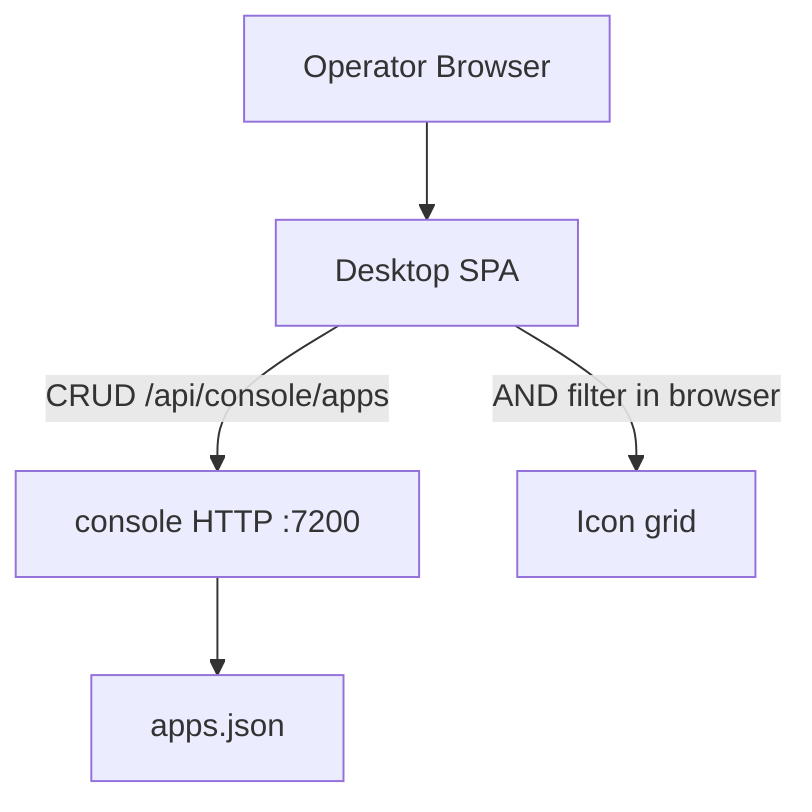

# Console App Tags

Feature Name: console-app-tags
Updated: 2026-09-13

## Description

给 Console App 目录增加 `tags` 字段。运维在新建/编辑表单里自由输入 Tag（每 App 最多 10 个）；桌面图标下方展示 Tag；网格上方用多选 Chip 做 AND 筛选。筛选在前端完成，`GET /api/console/apps` 仍返回完整目录。缺 `tags` 的旧 `apps.json` 按空列表读入。

## Architecture



Tag 是 App 记录上的字符串数组，没有独立 Tag 表或 Tag CRUD API。筛选不改变持久化数据，只改变当前网格可见集合。

## Components and Interfaces

### bins/console `catalog.rs`

`App` 增加 `tags: Vec<String>`。`serde` 反序列化缺字段时默认为 `[]`，旧文件可直接 `open`。

`create` / `update` 增加 `tags: Vec<String>` 参数，写入前调用 `normalize_tags`：

1. 每个元素去掉首尾空白
2. 长度为 0 或超过 32：`CatalogError::InvalidTag`
3. 规范化后条数超过 10：`CatalogError::TagLimitExceeded`
4. 文本全等的重复项只保留第一次出现的顺序

常量：`TAG_MAX_LEN = 32`，`TAGS_PER_APP_MAX = 10`。

`CatalogError::code`：

| 变体 | `error` |
| --- | --- |
| `InvalidTag` | `invalid_tag` |
| `TagLimitExceeded` | `tag_limit_exceeded` |

两者映射 HTTP 400。

### bins/console `http.rs`

`AppInput` 增加 `tags: Option<Vec<String>>`。省略时按空列表。POST/PUT 把 `tags.unwrap_or_default()` 交给 catalog。成功响应体含 `tags`。`GET /api/console/apps` 无筛选查询参数。

### frontend/apps/desktop

`DesktopApp.tags: string[]`。`createApp` / `updateApp` 请求体带 `tags`。

桌面状态：

- `selectedTags: string[]`：当前 AND 筛选集合，空表示展示全部
- 筛选条选项：`全部` + 当前目录全部 Tag 去重后 `localeCompare` 排序
- 点 `全部`：`selectedTags = []`
- 点某个 Tag：若已在集合中则移除，否则追加
- 可见 App：`selectedTags` 为空则全部；否则 `selectedTags.every(t => app.tags.includes(t))`

表单：Chip 列表 + 文本框。回车把当前输入加入 Tag 列表（先做与后端相同的 trim / 去重 / 上限提示）。图标区域在名称下展示该 App 的 Tag；空列表时只展示名称。

点击图标仍 `window.open(url, "_blank", "noopener,noreferrer")`。点 Tag Chip 不打开 URL。

## Data Models

`apps.json` 中 App 对象：

```json
{
  "app_id": "app-1789140000000000-1",
  "name": "GSE",
  "url": "https://vectorman.example.top",
  "tags": ["prod", "gse"],
  "created_at": "1789140000000000",
  "updated_at": "1789140000000000"
}
```

HTTP POST/PUT 请求体：`{ "name": "...", "url": "...", "tags": ["prod", "gse"] }`。`tags` 可省略。响应 App 对象与上表字段相同。

缺 `tags` 的旧记录读入后视为 `[]`；下次成功写入时补上 `"tags": []`。

## Correctness Properties

- 同一 App 内规范化后的 Tag 文本唯一，顺序为首次出现顺序。
- 缺 `tags` 的 `apps.json` 能被 `Catalog::open` 加载，对应 App 的 Tag 列表为空。
- 校验失败的请求不改 `data_file`。
- 筛选只影响桌面可见集合，不删除 App、不改 `apps.json`。
- 选中 Tag 集合 T 时，网格中每个可见 App 的 `tags` 都包含 T 中每一个元素。

## Error Handling

| 场景 | 行为 |
| --- | --- |
| Tag 空白或长度超过 32 | HTTP 400 `invalid_tag` |
| 规范化后 Tag 超过 10 个 | HTTP 400 `tag_limit_exceeded` |
| 旧 `apps.json` 无 `tags` | 视为空列表，进程正常启动 |
| 前端筛选后无匹配 App | 网格为空，保留筛选条与添加入口 |
| 写盘失败 | 与现网一致：HTTP 500 `persist_failed`，回滚内存 |

## Test Strategy

- 后端：省略 `tags` 创建后列表字段为 `[]`；重复与首尾空白被规范化；超长 / 超个数返回对应错误码且文件不变；缺 `tags` 的文件 `open` 成功。
- 前端：表单可增删 Tag 并随 POST/PUT 提交；筛选条多选 AND 后只渲染同时命中的图标；点 `全部` 恢复全量；图标下方渲染 Tag。

## References

[^1]: `.monkeycode/specs/console-app-tags/requirements.md` - 本特性需求
[^2]: `.monkeycode/specs/console-desktop/design.md` - App 目录、HTTP 与桌面基线
[^3]: `bins/console/src/catalog.rs` - 现有 App 结构与落盘
[^4]: `frontend/apps/desktop/src/app/App.tsx` - 现有桌面表单与图标网格
