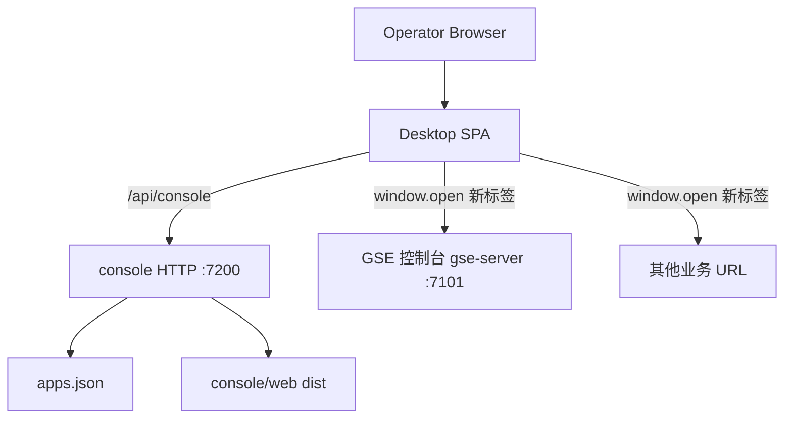

# Console 桌面门户

Feature Name: console-desktop
Updated: 2026-09-11

## Description

新增独立进程 `console`：同一 HTTP 端口托管桌面前端与 App 目录 API。运维在桌面图标墙上新增/编辑/删除 App（名称 + URL），点击后用新浏览器标签打开目标 URL。GSE 控制台仍由 gse-server 托管，作为用户手动添加的一个 App。v1 无鉴权、无 iframe 窗口、安装不预置 App。

## Architecture



Console 服务只保存链接并打开链接。节点台账、作业执行仍在 gse-server。浏览器直连目标 URL，console 不反向代理 App 流量。

现有 `@vectorman/console` 继续作为 GSE 控制台唯一 Vite 产物，打包进 `gse-server/web/`。本特性新增 `@vectorman/desktop`，打包进 `console/web/`。两个前端互不 import。

## Components and Interfaces

### bins/console

新 workspace member，HTTP 形态对齐 `gse-server` 的管理端口（axum + 静态目录 + SPA fallback）：

- `src/main.rs`：读配置、绑定监听、进程入口。
- `src/lib.rs`：配置、App 目录、校验、落盘、HTTP 路由，供单元测试直接调用。

配置 `console.toml`：

| 字段 | 默认 | 说明 |
| --- | --- | --- |
| `listen` | `0.0.0.0:7200` | HTTP 监听 |
| `web_dir` | `web` | 桌面 dist 目录，需含 `index.html` |
| `data_file` | `apps.json` | App 目录 JSON；相对路径相对工作目录 |

环境变量覆盖（`CONSOLE_` 前缀）：`CONSOLE_CONFIG`、`CONSOLE_LISTEN`、`CONSOLE_WEB_DIR`、`CONSOLE_DATA_FILE`。配置非法时进程退出码 1。

TLS 终止放在前置反代。console 进程只提供 HTTP。

### HTTP API

| 方法与路径 | 行为 |
| --- | --- |
| `GET /health` | `{"status":"ok"}` |
| `GET /api/console/apps` | 返回 App 数组，按 `created_at` 升序 |
| `POST /api/console/apps` | body `{name,url}`，201 + 完整 App |
| `PUT /api/console/apps/{app_id}` | body `{name,url}`，200 + 完整 App |
| `DELETE /api/console/apps/{app_id}` | 204 |

错误 JSON：`{"error":"<code>","message":"<human>"}`。v1 不校验鉴权头。

校验：

- `name`：去掉首尾空白后长度 1..64；与已有 App 名称全等则 409 `name_conflict`
- `url`：`http://` 或 `https://`，长度 1..2048，用标准 URL 解析成功，否则 400 `invalid_url`
- 目录条数达到 100 时 POST 返回 400 `limit_exceeded`
- 未知 `app_id`：404 `not_found`

写成功路径：先写入 `data_file`（临时文件 + rename），再返回 HTTP。

### frontend/apps/desktop

新 Vite 应用 `@vectorman/desktop`：

- 首页为桌面：全屏壁纸 + 图标网格 + 「添加」入口
- 图标：名称首字；无 Ant Design 侧栏布局
- 单击图标：`window.open(url, "_blank", "noopener,noreferrer")`
- 添加/编辑：表单字段仅名称与 URL
- 删除：二次确认后 `DELETE`
- 空目录：展示添加入口，不展示假图标
- `vite.config`：`server.proxy['/api']` 指向 `http://127.0.0.1:7200`；`server.allowedHosts` 含 `.monkeycode-ai.online`

桌面通过同源 `/api/console` 访问 API。开发期由 Vite 反代；生产由 console 进程同端口托管 `web/`。

### 打包与安装

- `Cargo.toml` workspace `members` 增加 `bins/console`
- `packaging/build-package.sh`：`COMPONENTS` 增加 `console`；前端增加 `npm run build:desktop`，产物拷到 `console/web/`
- `gse-server/web/` 仍来自 `npm run build:console`
- `install.sh` 接受 `console`，`all` 包含 `console`；`--with-systemd` 安装 `vectorman-console.service`
- `ctl.sh console start|stop|status|restart` 按常驻进程管理（与 gse-server 相同，与 dpc/vmctl 不同）
- musl 链接：只设 `CC_x86_64_unknown_linux_musl=musl-gcc`，不设 musl-gcc 为 rustc linker

## Data Models

`apps.json`：

```json
{
  "apps": [
    {
      "app_id": "app-1789140000000000-1",
      "name": "GSE",
      "url": "https://vectorman.example.top",
      "created_at": "1789140000000000",
      "updated_at": "1789140000000000"
    }
  ]
}
```

`app_id` 格式 `app-<unix_micros>-<seq>`，进程内 seq 单调递增。时间戳为微秒 epoch 十进制字符串，与 gse ledger 一致。文件缺失时视为 `{"apps":[]}`。

HTTP 响应中的 App 对象字段与上表相同。POST/PUT 请求体只有 `name`、`url`。

## Correctness Properties

- 同一 `data_file` 内 `app_id` 唯一，`name` 唯一。
- 持久化成功后，进程重启加载的列表与写成功时一致。
- 校验失败的请求不改 `data_file`。
- 打开目标 URL 只发生在浏览器新标签；console 进程不发起对该 URL 的服务端请求。
- GSE 控制台路由与构建入口保持 `frontend/apps/console` -> `gse-server/web`。

## Error Handling

| 场景 | 行为 |
| --- | --- |
| 配置 TOML 非法或必填路径不可用 | 进程退出码 1，stderr 含 `config_invalid` |
| `data_file` 损坏无法解析 | 进程启动失败，退出码 1，避免用空目录覆盖用户数据 |
| 监听端口占用 | 进程退出码 1 |
| `web_dir` 缺少 `index.html` | 仅提供 API，stderr 提示 web 未托管 |
| API 校验失败 | HTTP 400/409 + `error`/`message` |
| 写盘失败 | HTTP 500 `persist_failed`，目录内存状态与落盘保持一致（写失败则回滚内存） |
| 前端列表加载失败 | 桌面展示错误文案与重试按钮 |

## Test Strategy

- 后端：名称/URL 校验；名称冲突 409；上限 100；缺 id 404；写盘后重启再 load 条数与字段一致；损坏 `apps.json` 启动失败。
- 前端：空目录展示添加入口；提交后网格出现新图标；点击调用 `window.open` 且 target 为 `_blank`；删除确认后图标消失。
- 打包冒烟：`install.sh console --no-systemd` 后 `ctl.sh console start` 进程可 `GET /health`。

## References

[^1]: `.monkeycode/specs/console-desktop/requirements.md` - 本特性需求
[^2]: `.monkeycode/specs/frontend-layered-architecture/design.md` - GSE 控制台仍为唯一 gse web 产物
[^3]: `.monkeycode/specs/deploy-packaging/design.md` - 安装包组件布局与 ctl.sh
[^4]: `frontend/apps/console/src/app/App.tsx` - 现有 GSE 控制台路由，本特性不改其信息架构
