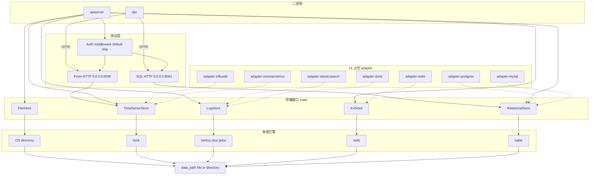
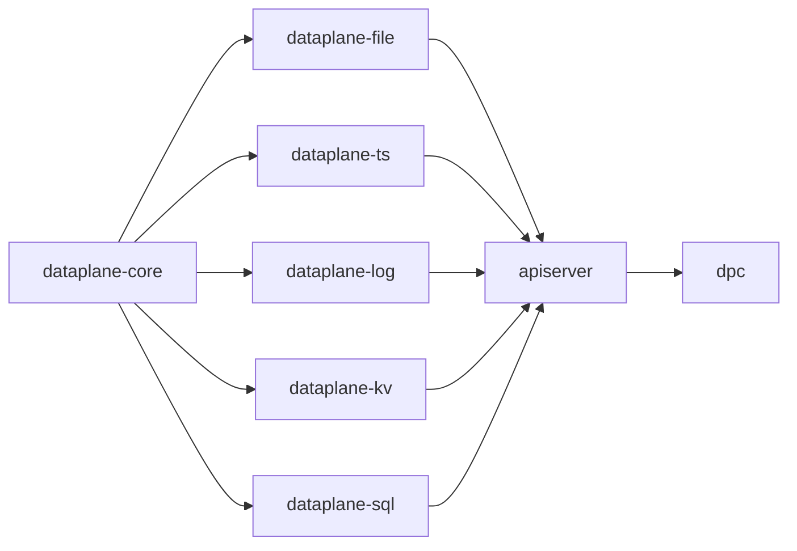

# dataplane 分层本地数据平面

Feature Name: dataplane-layered-storage
Updated: 2026-09-05

## Description

dataplane 是可嵌入的本地数据平面。调用方通过五个 async trait 访问文件、时序、日志、KV 与关系型数据。v1 用本地引擎实现这些 trait；后续用同名 trait 接到外部数据库。

`apiserver` 单进程监听两个 HTTP 端口：SQL JSON API 与 Prometheus 查询子集。`dpc` 只通过 HTTP 访问这两个端口，做健康检查与简单查询。KV、文件、日志与时序写入在 v1 不暴露网络协议。

## Architecture

分层自上而下：二进制 -> 协议适配 -> 存储接口 -> 引擎实现 -> 数据路径。



crate 依赖方向只允许向下：`bins` 依赖协议与 core；引擎依赖 core；adapter 依赖 core。引擎之间互不依赖。



`dpc` 只依赖 HTTP 客户端与共享 DTO，不依赖本地引擎 crate。

## Components and Interfaces

### Workspace 布局

```text
dataplane/
  Cargo.toml
  config.toml.example
  crates/
    dataplane-core/          # 错误类型、配置模型、公共 DTO
    dataplane-file/          # FileStore + 本地目录实现
    dataplane-ts/            # TimeSeriesStore + tsink + Prom 投影
    dataplane-log/           # LogStore + tantivy/jieba
    dataplane-kv/            # KvStore + redb
    dataplane-sql/           # RelationalStore + sqlite
    dataplane-adapter-postgres/
    dataplane-adapter-mysql/
    dataplane-adapter-redis/
    dataplane-adapter-elasticsearch/
    dataplane-adapter-doris/
    dataplane-adapter-influxdb/
    dataplane-adapter-victoriametrics/
  bins/
    apiserver/
    dpc/
```

### dataplane-core

职责：统一错误、配置、数据路径解析、鉴权中间件 trait。

错误码（`DataplaneError.code`，稳定字符串）：

| code | 含义 |
| --- | --- |
| `not_found` | 对象或键不存在 |
| `invalid_argument` | JSON/SQL/PromQL 无法解析或缺字段 |
| `query_failed` | SQL 或 Prom 查询执行失败 |
| `unimplemented` | 占位 adapter 或未实现的 Prom 函数 |
| `engine_init_failed` | 启动时引擎打不开 |
| `config_invalid` | TOML 缺失或无法解析 |
| `unavailable` | 对端不可达（dpc 使用） |

鉴权：`trait AuthN { async fn check(&self, req: &RequestMeta) -> Result<(), DataplaneError>; }`。v1 提供 `NoopAuth`，`check` 直接返回 `Ok(())`。apiserver 在两个 HTTP 端口的请求链最外层调用该 trait。

配置模型：

```toml
data_path = "./data"

[sql_http]
listen = "0.0.0.0:8081"

[prom_http]
listen = "0.0.0.0:9090"

[auth]
enabled = false
```

环境变量覆盖：`DP_DATA_PATH`、`DP_SQL_HTTP_LISTEN`、`DP_PROM_HTTP_LISTEN`、`DP_AUTH_ENABLED`。后写覆盖前写：默认值 -> TOML -> 环境变量 -> CLI `--config` 只换文件路径。

数据路径：配置值为文件或目录。启动时若路径不存在且父目录可写，按“无扩展名或明确为目录”创建目录；sqlite/redb 可在目录内自建文件 `sql.sqlite`、`kv.redb`。子路径约定：

| 引擎 | 相对位置 |
| --- | --- |
| 文件 | `{data_path}/files/` |
| 时序 | `{data_path}/ts/` |
| 日志 | `{data_path}/logs/` |
| KV | `{data_path}/kv.redb` |
| SQL | `{data_path}/sql.sqlite` |

若 `data_path` 指向已存在的文件，v1 仅允许该文件作为 sqlite 单库，其余引擎返回 `config_invalid`。推荐用法是目录。

### 五个存储 trait

均定义在对应 crate，`async_trait` + `Send + Sync`。同步引擎用 `tokio::task::spawn_blocking`。

`FileStore`：

- `put(path, bytes, content_type) -> Result<()>`
- `get(path) -> Result<Object>`（bytes、content_type、size）
- `head(path) -> Result<ObjectMeta>`
- `delete(path) -> Result<()>`
- `list(prefix) -> Result<Vec<String>>`

路径为相对 POSIX 路径。实现拒绝 `..` 与绝对路径，错误码 `invalid_argument`。

`KvStore`：

- `get(key: &[u8]) -> Result<Vec<u8>>`
- `set(key, value) -> Result<()>`
- `delete(key) -> Result<()>`
- `exists(key) -> Result<bool>`
- `scan_prefix(prefix) -> Result<Vec<(Vec<u8>, Vec<u8>)>>`

无 TTL。`get` 对缺失键返回 `not_found`。

`RelationalStore`：

- `execute(sql: &str, params: &[SqlValue]) -> Result<SqlResult>`

`SqlResult { columns: Vec<String>, rows: Vec<Vec<SqlValue>> }`。一次调用一条语句。sqlite 用 rusqlite + spawn_blocking。

`TimeSeriesStore`：

- `write(point: TsPoint) -> Result<()>`
- `query_instant(expr, eval_time) -> Result<PromResult>`
- `query_range(expr, start, end, step) -> Result<PromResult>`

`TsPoint { measurement, tags: BTreeMap<String,String>, field_name, field_value: f64, timestamp }`。v1 一个 point 一个 numeric field。查询层：`metric = measurement`，`labels = tags`，样本值 = `field_value`。

PromQL 子集解析器放在 `dataplane-ts`：selector、label matcher（`=` `!=` `=~` `!~`）、`sum/avg/max/min` 与 `by`。遇到 `rate` 等函数返回 `unimplemented`，错误信息包含函数名。HTTP JSON 顶层对齐 Prometheus：`{ "status": "success"|"error", "data": ... }`，失败时另有 `errorType` 与 `error`。

`LogStore`：

- `append(record: LogRecord) -> Result<()>`
- `search(filter: LogFilter) -> Result<Vec<LogRecord>>`

`LogRecord { id, timestamp, level, message, labels: BTreeMap<String,String> }`。`id` 由实现生成 UUID。tantivy schema：timestamp(i64)、level(bytes)、message(text, jieba tokenizer)、labels(json 扁平为 `label.<k>` keyword)。

### adapter 占位

每个 `dataplane-adapter-*` 实现对应 trait，所有方法返回 `DataplaneError { code: "unimplemented", message }`。crate 可编译，不链接外部客户端 SDK。后续实现时只改 adapter crate。

产品到 trait 映射：

| crate | trait |
| --- | --- |
| adapter-postgres / adapter-mysql | RelationalStore |
| adapter-redis | KvStore |
| adapter-elasticsearch / adapter-doris | LogStore |
| adapter-influxdb / adapter-victoriametrics | TimeSeriesStore |

文件存储后续对接对象存储时新增 `dataplane-adapter-s3`，v1 不建该 crate。

### apiserver

tokio 多线程运行时。启动顺序：读配置 -> 建数据路径 -> 初始化五引擎（任一失败则进程退出）-> 装配 `NoopAuth` -> 绑定两端口 -> 标准输出一行：`sql_http=... prom_http=...`。

SQL 端口路由：

- `GET /health` -> `{"status":"ok"}`
- `POST /v1/sql` body `{"sql":"...","params":[...]}` -> `{"columns":[],"rows":[]}` 或 `{"error":"...","code":"..."}`

Prom 端口路由：

- `GET /health` -> `{"status":"ok"}`
- `GET /api/v1/query?query=&time=`
- `GET /api/v1/query_range?query=&start=&end=&step=`

两端口共享同一组 store 实例（`Arc`）。v1 跨进程并发访问同一 `data_path` 不做文件锁；文档写明由调用方保证。

HTTP 框架用 axum。SQL 失败 HTTP 状态：参数问题 400，执行失败 422，引擎不可用 503。Prom 端口保持 Prometheus 惯例：HTTP 200 + `status=error`，便于现有客户端解析。

### dpc

clap 子命令：`health`、`sql`、`query`。全局参数 `--sql-url`（默认 `http://127.0.0.1:8081`）、`--prom-url`（默认 `http://127.0.0.1:9090`）。

- `dpc health`：并行 GET 两个 `/health`，stdout 打印两行 JSON；任一失败 exit 1。
- `dpc sql --stmt 'SELECT 1'`：POST `/v1/sql`。
- `dpc query --expr 'up'`：GET `/api/v1/query`。

不可达时 stderr：`url=... reason=...`，code `unavailable`。

## Data Models

### Object / ObjectMeta

```text
ObjectMeta { content_type: String, size: u64 }
Object { meta: ObjectMeta, bytes: Vec<u8> }
```

content-type 缺省为 `application/octet-stream`。size 以字节计，等于 `bytes.len()`。

### SqlValue

`Null | Integer(i64) | Real(f64) | Text(String) | Blob(Vec<u8>)`。JSON 请求里 params 用 JSON 值映射：`null`、number、string；blob 用 `{"b64":"..."}`。响应 rows 用同样规则。

### TsPoint / PromResult

写入 Influx 形，查询 Prom 形。`PromResult` 的 `resultType` 为 `vector` 或 `matrix`，`result` 数组元素含 `metric` 对象与 `value`/`values`。

### LogRecord / LogFilter

```text
LogFilter {
  from_ts: Option<i64>,
  to_ts: Option<i64>,
  level: Option<String>,
  message_query: Option<String>,
  labels: BTreeMap<String, String>
}
```

时间戳统一 Unix 微秒（i64）。keyword 查询走 jieba 分词后的 AND。

## Correctness Properties

- 存储 trait 的实现不互相调用；跨引擎事务 v1 不提供。
- `FileStore` 路径规范化后仍落在 `{data_path}/files/` 内。
- `KvStore.set` 后同键 `get` 读到最后一次写入的字节。
- `TimeSeriesStore.write` 在 field 数量不为 1 时返回 `invalid_argument`。
- Prom 查询只读取已成功 `write` 的样本；不保证跨进程可见性。
- `LogStore.append` 成功后，用同一 `id` 或匹配的 filter `search` 能查到该记录（refresh 在 append 内提交索引）。
- `RelationalStore.execute` 一次一条语句；多语句字符串返回 `invalid_argument`。
- 占位 adapter 不产生副作用，不打开网络连接。
- 默认 `auth.enabled=false` 时，所有 HTTP 请求在鉴权层直接通过。

## Error Handling

| 场景 | 行为 |
| --- | --- |
| 配置文件缺失或 TOML 非法 | 进程退出码 1，stderr 含 `config_invalid` 与路径 |
| 数据路径无法创建 | 退出码 1，stderr 含路径 |
| 任一引擎 init 失败 | 退出码 1，stderr 含引擎名与原因 |
| SQL JSON 缺 `sql` | HTTP 400，`code=invalid_argument` |
| SQL 执行失败 | HTTP 422，`code=query_failed` |
| Prom 语法不支持的函数 | HTTP 200，`status=error`，`error` 含函数名，`code` 对应 `unimplemented` |
| KV/File get 缺失 | trait 返回 `not_found` |
| dpc 连不上 | 退出码 1，stderr 含 url |

引擎内部 panic 视为 bug；blocking 任务 panic 转为 `query_failed`。

## Test Strategy

- `dataplane-core`：配置覆盖顺序、错误码序列化。
- 各本地引擎 crate：tempdir 上的 trait 往返测试（put/get、set/get、write/query、append/search、SQL SELECT）。
- `FileStore`：拒绝 `../` 路径。
- `TimeSeriesStore`：单 field 成功；0 或 2 个 field 失败；Prom 子集 `sum by` 聚合；`rate()` 返回 unimplemented。
- `LogStore`：中文 message 用 jieba 能搜到关键词。
- adapter crates：调用任意方法得到 `unimplemented`。
- apiserver：httptest 打 `/health`、`/v1/sql`、`/api/v1/query`。
- dpc：对 mock HTTP 端口跑 `health`/`sql`/`query`，断言退出码。

集成测试用 `#[tokio::test]` + 临时数据目录。不要求跨进程并发测试。

## References

[^1]: Requirements - 当前工作区 `/.monkeycode/specs/dataplane-layered-storage/requirements.md`
[^2]: Prometheus HTTP API - query / query_range JSON 形状
[^3]: 后续协议（v1 不实现）- Redis RESP、S3 HTTP、Elasticsearch REST、Influx write HTTP
