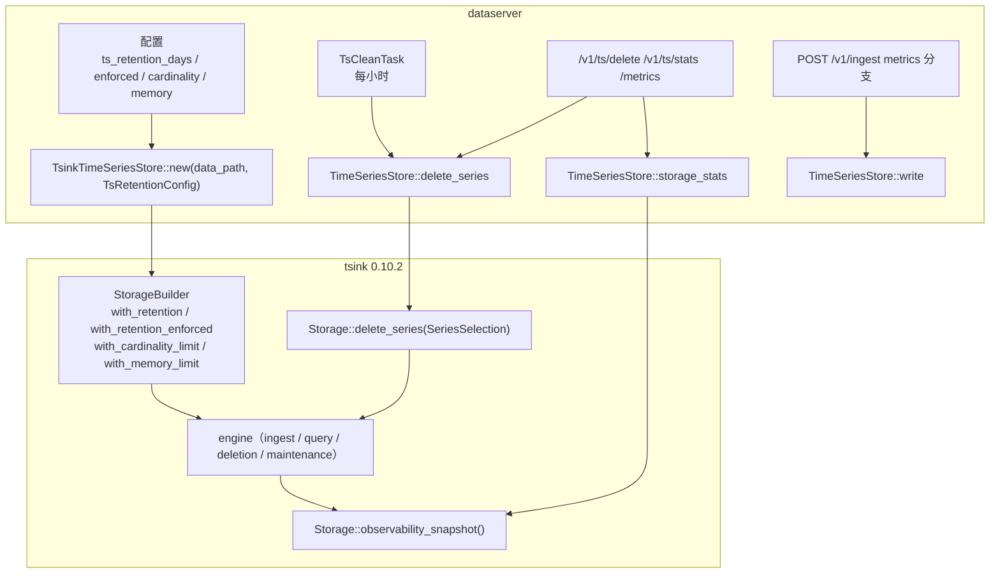

# 时序存储保留与删除

Feature Name: dataplane-ts-retention
Updated: 2026-09-23

## Description

把 tsink 0.10.2 已有的保留与删除能力透出到 `TimeSeriesStore`：`TsinkTimeSeriesStore::new` 接受保留配置并显式开启保留执行，trait 新增 `delete_series` / `storage_stats`，`dataserver` 增加配置项、每小时清理任务、删除接口与统计暴露。`apm-tracing` 与 `ebpf-observability` 的聚合指标清理依赖本 feature。

不做：降采样、冷热分层/对象存储、快照恢复、按序列差异化保留窗口（用删除任务补齐）。

## Architecture



数据流：写入路径不变（`write` → `insert_rows`），新增的是三处旁路——构造期把保留与上限配置传进 `StorageBuilder`；删除路径把 `TsSeriesSelection` 翻成 `tsink::SeriesSelection` 调 `Storage::delete_series`；统计路径把 `observability_snapshot()` 的子结构投影成 `TsStorageStats`。

## Components and Interfaces

### Workspace 变更

| 路径 | 职责 |
| --- | --- |
| `crates/dataplane-ts` | `TsRetentionConfig`、`TsSeriesSelection` / `TsMatcher` / `TsDeleteReport` / `TsStorageStats`；trait 新增 `delete_series`（默认实现返回 `query_failed`）与 `storage_stats`（默认返回零值）；`TsinkTimeSeriesStore::new` 签名扩展；`Storage::delete_series` 与 `observability_snapshot` 的适配与错误映射 |
| `bins/dataserver` | 配置项、构造调用、`POST /v1/ts/delete`、`GET /v1/ts/stats`、自监控指标 `dataserver_ts_*`、`TsCleanTask` |
| `bins/dpc` | `ts stats`、`ts delete` 子命令 |

依赖方向不变：`dataplane-ts` 只依赖 `dataplane-core` 与 `tsink`。

### dataplane-ts：类型与 trait

```rust
#[derive(Debug, Clone)]
pub struct TsRetentionConfig {
    pub retention_days: u32,      // 0 表示不设窗口（仅当 enforced=false 时允许）
    pub enforced: bool,
    pub cardinality_limit: usize, // 0 表示不限
    pub memory_limit_bytes: usize,
    pub wal_size_limit_bytes: usize,
}

impl Default for TsRetentionConfig {
    fn default() -> Self {
        Self { retention_days: 30, enforced: true, cardinality_limit: 0, memory_limit_bytes: 0, wal_size_limit_bytes: 0 }
    }
}

#[derive(Debug, Clone, Copy, PartialEq, Eq)]
pub enum TsMatcherOp { Equal, NotEqual, RegexMatch, RegexNoMatch }

#[derive(Debug, Clone)]
pub struct TsMatcher { pub name: String, pub op: TsMatcherOp, pub value: String }

#[derive(Debug, Clone)]
pub struct TsSeriesSelection {
    pub measurement: Option<String>,
    pub matchers: Vec<TsMatcher>,
    pub from_ts: i64,
    pub to_ts: i64,
}

#[derive(Debug, Clone, Copy, Default, PartialEq, Eq)]
pub struct TsDeleteReport { pub matched_series: u64, pub tombstones_applied: u64 }

#[derive(Debug, Clone, Default)]
pub struct TsStorageStats {
    pub series_count: u64,
    pub memory_used_bytes: usize,
    pub memory_budget_bytes: usize,
    pub wal_size_bytes: u64,
    pub retention_days: u32,
    pub retention_enforced: bool,
    pub expired_segments_total: u64,
    pub future_skew_points_total: u64,
    pub background_errors_total: u64,
    pub degraded: bool,
    pub last_background_error: Option<String>,
}

#[async_trait]
pub trait TimeSeriesStore: Send + Sync {
    // 既有三个方法不变
    async fn write(&self, point: TsPoint) -> Result<(), DataplaneError>;
    async fn query_instant(&self, expr: &str, eval_time: Option<i64>) -> Result<PromResult, DataplaneError>;
    async fn query_range(&self, expr: &str, start: i64, end: i64, step: i64) -> Result<PromResult, DataplaneError>;

    /// 新增：默认实现返回 query_failed，避免其它实现被迫改动。
    async fn delete_series(&self, selection: TsSeriesSelection) -> Result<TsDeleteReport, DataplaneError> {
        let _ = selection;
        Err(DataplaneError::new(ErrorCode::QueryFailed, "delete_series is not implemented"))
    }

    /// 新增：默认返回零值统计。
    async fn storage_stats(&self) -> Result<TsStorageStats, DataplaneError> {
        Ok(TsStorageStats::default())
    }
}
```

### dataplane-ts：tsink 适配

构造期：

```rust
pub fn new(data_path: impl AsRef<Path>, retention: TsRetentionConfig) -> Result<Self, DataplaneError> {
    let mut builder = StorageBuilder::new()
        .with_data_path(data_path)
        .with_timestamp_precision(TimestampPrecision::Microseconds)
        .with_retention_enforced(retention.enforced);
    if retention.retention_days > 0 {
        builder = builder.with_retention(Duration::from_secs(retention.retention_days as u64 * 86_400));
    }
    if retention.cardinality_limit > 0 {
        builder = builder.with_cardinality_limit(retention.cardinality_limit);
    }
    if retention.memory_limit_bytes > 0 {
        builder = builder.with_memory_limit(retention.memory_limit_bytes);
    }
    if retention.wal_size_limit_bytes > 0 {
        builder = builder.with_wal_size_limit(retention.wal_size_limit_bytes);
    }
    let storage = builder.build()?;
    // engine 不变
}
```

注意顺序：`with_retention_enforced(false)` 必须在 `with_retention(...)` 之后调用（`with_retention` 内部会把 `retention_enforced` 置为 true），因此上面先设 `enforced` 再按需设窗口仍会被 `with_retention` 覆盖。正确写法是：先 `with_retention(days)`（若 `days > 0`），最后调用 `with_retention_enforced(config.enforced)` 落地最终值。实现时必须按此顺序，并在单测里断言 `enforced=false` 时超窗点仍可写入。

删除期：

```rust
let mut sel = tsink::SeriesSelection::new();
if let Some(metric) = &selection.measurement { sel = sel.with_metric(metric); }
for m in &selection.matchers {
    let op = match m.op {
        TsMatcherOp::Equal => SeriesMatcherOp::Equal,
        TsMatcherOp::NotEqual => SeriesMatcherOp::NotEqual,
        TsMatcherOp::RegexMatch => SeriesMatcherOp::RegexMatch,
        TsMatcherOp::RegexNoMatch => SeriesMatcherOp::RegexNoMatch,
    };
    sel = sel.with_matcher(SeriesMatcher::new(m.name.clone(), op, m.value.clone()));
}
let sel = sel.with_time_range(selection.from_ts, selection.to_ts);
let r = storage.delete_series(&sel)?;  // DeleteSeriesResult { matched_series, tombstones_applied }
```

错误映射：

| tsink 错误 | DataplaneError |
| --- | --- |
| `TsinkError::InvalidTimeRange`（`from_ts >= to_ts`） | `invalid_argument`，消息含 from/to |
| `TsinkError::InvalidConfiguration("delete_series is not implemented ...")` | `query_failed`，消息原样透出 |
| 墓碑落盘失败（IO / WAL / persistence 错误） | `query_failed` |
| 基数上限拒绝写入（`write` 路径） | `query_failed`，消息含 `cardinality` |
| 保留窗口拒绝写入（`write` 路径） | `invalid_argument`，消息含点时间与窗口下界 |

统计期：`storage.observability_snapshot()` 取 `memory.budgeted_bytes`、`memory.active_and_sealed_bytes`（加 `registry_bytes` 作为 used）、`wal.size_bytes`、`flush.expired_segments_total`、`retention.future_skew_points_total`、`health.background_errors_total`、`health.degraded`、`health.last_background_error`。`series_count` 取 `list_metrics()` 的长度（大基数下成本高，因此 `storage_stats` 只在被调用或每小时清理后采样一次，不放进每次写入路径）。

### dataserver：配置与任务

配置项（`DATASERVER_` 前缀环境变量覆盖）：

| 配置 | 缺省 | 说明 |
| --- | --- | --- |
| `ts_retention_days` | 30 | 全局保留窗口；0 表示不设窗口（需同时 `ts_retention_enforced=false`） |
| `ts_retention_enforced` | true | 是否真正拒绝/过滤超窗点 |
| `ts_cardinality_limit` | 2_000_000 | 序列数上限；0 表示不限 |
| `ts_memory_limit_bytes` | 0 | 不限 |
| `ts_wal_size_limit_bytes` | 0 | 不限 |
| `ts_clean_interval_secs` | 3600 | 清理任务周期 |

`TsCleanTask`（新增后台任务，与 APM 的清理任务分开，避免耦合）：

1. 拉取 `collect_items`（经 `gse_admin_url`）与 `KvStore` 的 `retain/` 前缀。
2. 对每个 `metrics` 类采集项：若其 `retention_days` 对应的天数小于全局窗口，则调用 `delete_series(TsSeriesSelection{ measurement: None, matchers: [item_id == <id>], from_ts: 0, to_ts: now - retention })`。
3. 对 `retain/{item_id}` 已删除项：用 `until_micros` 作 `to_ts` 删除，删除成功后删键。
4. 输出一行日志：`{item_id, matched_series, tombstones_applied, elapsed_ms}`。
5. 统计采样：调用 `storage_stats()` 缓存结果，供 `GET /v1/ts/stats` 与自监控使用。
6. matcher 命中长期为 0 时按 Requirement 4 第 5 条输出提示。

自监控指标（既有自监控口）：

| 指标 | 类型 |
| --- | --- |
| `dataserver_ts_series_count` | gauge |
| `dataserver_ts_memory_used_bytes` | gauge |
| `dataserver_ts_wal_size_bytes` | gauge |
| `dataserver_ts_tombstones_applied_total` | counter |
| `dataserver_ts_clean_runs_total` / `_errors_total` | counter |
| `dataserver_ts_degraded` | gauge（0/1） |

### dataserver：HTTP

| 方法 | 路径 | 说明 |
| --- | --- | --- |
| POST | `/v1/ts/delete` | 请求体 `TsSeriesSelection`，响应 `TsDeleteReport` |
| GET | `/v1/ts/stats` | 返回 `TsStorageStats` |

`/v1/ts/delete` 请求示例：

```json
{
  "measurement": "apm_service_requests_total",
  "matchers": [{ "name": "service", "op": "equal", "value": "order-api" }],
  "from_ts": 0,
  "to_ts": 1710000000000000
}
```

不做鉴权增强（与既有 v1 接口一致，接入令牌校验仍属后续范围）；接口不挂前端常规入口。

### dpc

```bash
dpc ts stats
dpc ts delete --metric apm_service_requests_total --matcher service=order-api --from-ts 0 --to-ts 1710000000000000
```

## Data Models

### 保留语义

- tsink 的保留窗口是**全局**的（单一 `retention` Duration），不是按序列。因此「每个采集项不同保留期」只能靠 `delete_series` 的 periodic tombstone 实现，这是本设计的核心取舍。
- 打开 `enforced` 后，写入超窗点会失败。观测链路（APM span 派生指标、eBPF 边指标）都是近实时写入，正常路径不会触发；触发时说明 Agent 侧积压或时钟严重偏移，属需要暴露的异常。
- 墓碑写入后查询立即过滤；磁盘回收依赖 compaction，接口不承诺立即释放。`flush.expired_segments_total` 可用来说明日志空间回收进度。

### TsStorageStats 来源映射

| TsStorageStats 字段 | tsink 来源 |
| --- | --- |
| `series_count` | `list_metrics()?.len()`（按需采样） |
| `memory_used_bytes` | `observability_snapshot().memory.active_and_sealed_bytes + registry_bytes` |
| `memory_budget_bytes` | `observability_snapshot().memory.budgeted_bytes` |
| `wal_size_bytes` | `observability_snapshot().wal.size_bytes` |
| `expired_segments_total` | `observability_snapshot().flush.expired_segments_total` |
| `future_skew_points_total` | `observability_snapshot().retention.future_skew_points_total` |
| `background_errors_total` | `observability_snapshot().health.background_errors_total` |
| `degraded` | `observability_snapshot().health.degraded` |
| `last_background_error` | `observability_snapshot().health.last_background_error` |
| `retention_days` / `retention_enforced` | 本地配置回显（tsink 未透出该字段） |

## Correctness Properties

- `enforced=true` 且 `retention_days=n` 时，写入早于 `now - n` 天的点返回 `invalid_argument`，且该点查询不到。
- `enforced=false` 时，同一写入成功，查询可见（兼容性不变）。
- `delete_series` 后，被删时间范围内的点立即查询不到；范围外的同序列点仍可见。
- 重复删除同一 selection：第二次 `tombstones_applied = 0`，`matched_series` 与第一次一致（前提是没有新数据写入该范围）。
- `from_ts >= to_ts` 恒返回 `invalid_argument`，不产生墓碑。
- 未实现 `delete_series` 的后端返回 `query_failed`，不返回 `Ok` 空报告。
- 基数达到上限后，新序列写入失败且老序列读写正常；`series_count` 不超过上限。
- `storage_stats` 的 `series_count` 不超过 `cardinality_limit`；`degraded` 与 `last_background_error` 一致（有错误则 degraded 为 true）。
- 清理任务对同一采集项重复运行是幂等的：第二轮 `tombstones_applied` 为 0。
- 打开保留执行不改变既有 Prom 查询语义，只影响超窗数据是否存在。

## Error Handling

| 场景 | 行为 |
| --- | --- |
| `retention_days=0` 且 `enforced=true` | 启动时以 `config_invalid` 退出，提示需要关闭 `ts_retention_enforced` 或给出窗口 |
| tsink 构造失败（路径不可写、WAL 损坏按 Strict 模式） | 启动失败，`query_failed` 或 `config_invalid`，原样透出 tsink 错误 |
| 写入超窗点 | `invalid_argument`，消息含点时间与窗口下界；接入应答记入 `failures`，Agent 视为需改采集侧（不无限重试） |
| 写入超基数上限 | `query_failed`，消息含 `cardinality`；接入应答记入 `failures` |
| 删除时间范围非法 | `invalid_argument`，不写墓碑 |
| 底层不支持删除 | `query_failed`，消息含 `delete_series is not implemented` |
| 墓碑落盘失败 | `query_failed`，`/v1/ts/delete` 返回 HTTP 500 与 `code` |
| 清理任务某轮失败 | stderr 一行，`dataserver_ts_clean_errors_total` +1，下轮继续，不清 `retain/` 键 |
| `list_metrics` 采样过慢 | 统计仅按需/每小时采样；`GET /v1/ts/stats` 返回上次采样值并带 `sampled_at_ts` 字段说明新鲜度 |
| 基线上限长期打满 | 自监控 `dataserver_ts_series_count` 逼近上限，`degraded` 视 background errors 而定；前端与文档提示检查指标维度 |

## Test Strategy

- 保留：`retention_days=1, enforced=true`，写入 2 天前的点被拒（`invalid_argument`）且消息含窗口下界；写入当前点成功。
- 兼容：`enforced=false` 时写入 2 天前的点成功且可查询。
- 构造顺序：断言 `with_retention` 之后再 `with_retention_enforced(false)` 生效（防止被 `with_retention` 覆盖），即超窗点仍可写入。
- 删除：写 3 个序列各 3 个点，按 `measurement + matcher service=order-api + [t0, t1)` 删除，断言返回 `matched_series` 与 `tombstones_applied`，且范围内查询为空、范围外与其它序列不受影响。
- 幂等：同一 selection 删两次，第二次 `tombstones_applied=0`。
- 非法范围：`from_ts == to_ts` 与 `from_ts > to_ts` 都返回 `invalid_argument`。
- 未实现后端：用一个只实现既有三方法的桩，断言 `delete_series` 返回 `query_failed`、`storage_stats` 返回零值。
- 基数：`cardinality_limit=10`，写 10 个序列成功、第 11 个失败且消息含 `cardinality`，既有序列仍可写可查。
- 统计：`storage_stats` 各字段与 `observability_snapshot()` 对应项一致；`degraded` 与 `last_background_error` 同步。
- 清理任务：两个 `metrics` 采集项（一个保留 1 天、一个保留 30 天）写旧点后跑一轮，断言只删了短保留项的点、日志含统计、重复跑第二轮 `tombstones_applied=0`；`retain/` 到期后键被删除。
- HTTP：`POST /v1/ts/delete` 正常与非法范围；`GET /v1/ts/stats` 形状；`dpc ts stats` / `ts delete` 输出。
- 集成：dataserver 写入 `apm_service_requests_total` 旧点 → 清理任务删除 → `GET /api/v1/query` 不再命中。

## Pitfalls

- **tsink 默认不执行保留**：`StorageBuilder` 缺省 `retention = 14 天` 但 `retention_enforced = false`，既不拒绝也不过滤。必须显式设置，否则功能看起来配了却完全不生效（现状就是如此）。
- `with_retention(...)` 内部会把 `retention_enforced` 置为 true。若想「有窗口但暂不执行」，必须最后调用 `with_retention_enforced(false)`；顺序写反会导致配置被静默覆盖。
- `Storage::delete_series` 在 trait 上是返回 `InvalidConfiguration` 的默认方法。本地引擎的实现位于 engine 的 `deletion` 模块，若构建特性或后端变化导致默认方法被用到，会得到「删了但没报错」的错觉——实现必须显式检查返回值与错误码，测试里覆盖「未实现后端」路径。
- `SeriesSelection` 的时间范围必须同时给 `start` 与 `end` 且 `start < end`（`normalized_time_range` 会校验），只给一端会被判为 `InvalidConfiguration`。上层 `TsSeriesSelection` 因此把 `from_ts`/`to_ts` 都设为必填。
- 删除只写墓碑，磁盘不会立刻下降；不要用磁盘占用下降来验证删除成功，用查询结果与 `tombstones_applied` 验证。
- 墓碑本身占内存（`memory.tombstone_bytes`）与磁盘，极端高频删除会放大开销。清理任务按小时运行、按采集项聚合，不要按序列逐条删。
- 基数上限是「拒绝新序列」而不是「淘汰旧序列」。指标维度爆炸时表现为写入失败，而不是查询变慢——监控必须看 `dataserver_ts_series_count`，不要等报错。
- `with_memory_limit` 是内存预算而非磁盘预算，设小了会频繁驱逐 sealed chunk（性能下降但不出错）；设大了对 OOM 无保护。默认不设，依赖宿主机限制。
- `list_metrics()` 在大基数下昂贵（需要遍历序列注册表）。`storage_stats` 不要放在写入路径或每次查询路径。
- APM/eBPF 的 P95 等分位点是**预算好的标量点**，与 tsink 的 `RollupPolicy` 降采样是两条不同路线；本期不要为「省空间」引入 rollup，那会改变查询语义并需要额外对齐。
- 保留执行开启后，任何补传历史点的路径（Agent 缓冲重试跨窗口、离线补数）都会失败。观测链路是近实时，风险低，但要在发布说明与排障文档里写明。

## References

[^1]: 需求 - 当前工作区 `/.monkeycode/specs/dataplane-ts-retention/requirements.md`
[^2]: 存储分层总设计 - 当前工作区 `/.monkeycode/specs/dataplane-layered-storage/design.md`
[^3]: 共享可观测数据模型 - 当前工作区 `/.monkeycode/specs/observability-data-model/design.md`
[^4]: 时序存储实现 - 当前工作区 `crates/dataplane-ts/src/lib.rs`
[^5]: tsink Storage trait（含 `delete_series`、`observability_snapshot`）- `https://docs.rs/tsink/0.10.2/tsink/storage/trait.Storage.html`
[^6]: tsink StorageBuilder（`with_retention`、`with_retention_enforced`、`with_cardinality_limit`、`with_memory_limit`）- `https://docs.rs/tsink/0.10.2/tsink/storage/struct.StorageBuilder.html`
[^7]: tsink engine 模块（`deletion`、`maintenance`、`tiering`）- `https://docs.rs/tsink/0.10.2/tsink/engine/index.html`
