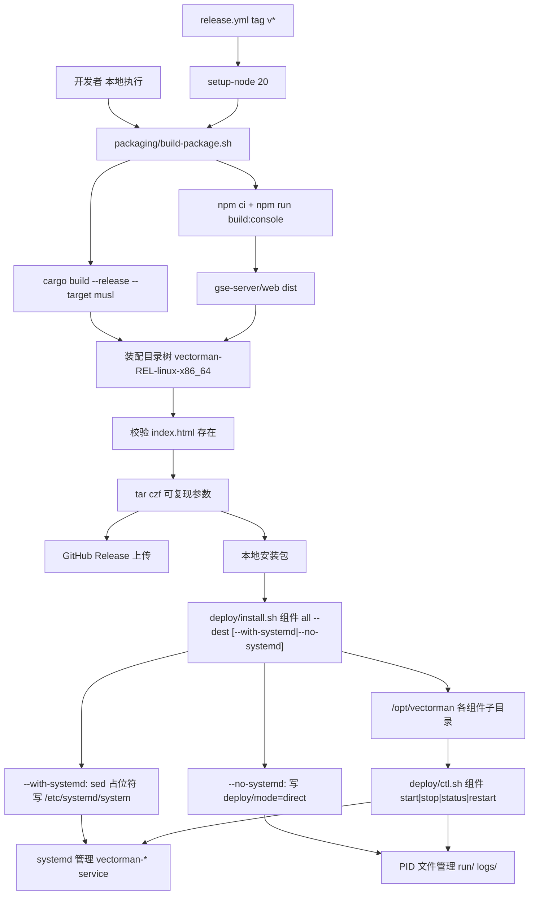

# 部署脚本与打包执行方案

Feature Name: deploy-packaging
Updated: 2026-09-09

## Description

把打包逻辑从 `.github/workflows/release.yml` 内联 shell 收敛为仓库内 `packaging/build-package.sh`（本地与 CI 共用唯一入口），安装包在现有四组件 `bin/ + conf/` 布局上新增 `gse-server/web/`（`@vectorman/console` 的 vite dist）与 `deploy/`（install.sh、ctl.sh、systemd unit 模板）。目标机用 `install.sh <组件|all>` 安装到默认 `/opt/vectorman`，`--with-systemd` 安装 unit，`--no-systemd` 走无 systemd 的 PID 文件模式；进程管理统一走 `ctl.sh <组件> <start|stop|status|restart>`（按 `deploy/mode` 选择 systemd 或 direct 后端）。dpc 为一次性 CLI，无 unit、ctl 拒绝管理。

## Architecture



本地与 CI 走同一条 `packaging/build-package.sh` 路径，差异只在工具链安装步骤属于 workflow。打包产物即分发物，`deploy/` 随包走，目标机上脚本之间以安装根目录结构为唯一契约。

## Components and Interfaces

### 仓库新增目录

```text
packaging/
  build-package.sh                # 唯一打包入口（本地 + CI）
  deploy/
    install.sh                    # 目标机安装：组件复制 + 实例配置生成 + unit 安装
    ctl.sh                        # 进程管理：systemd 封装
    units/
      vectorman-apiserver.service.in
      vectorman-gse-server.service.in
      vectorman-gse-agent.service.in
```

### build-package.sh 接口

```bash
packaging/build-package.sh [--version <v>]
# --version 缺省时取 git describe --tags --always
```

执行步骤（`set -euo pipefail`，每步失败以 `step <名称> failed` 非零退出）：

1. `cargo build --release --workspace --target x86_64-unknown-linux-musl`（静态链接，不依赖目标机 glibc；需 `musl-tools` + `rustup target add`。`CC_x86_64_unknown_linux_musl=musl-gcc` 编译 C 依赖；不要把 `CARGO_TARGET_X86_64_UNKNOWN_LINUX_MUSL_LINKER` 设成 musl-gcc，ring/ureq 二进制会 SIGSEGV）
2. 前端构建：`cd frontend && npm ci && npm run build:console`（统一入口 `@vectorman/console` 产出 `apps/console/dist`）
3. 装配目录树 `vectorman-<REL>-linux-x86_64/`（布局见 Data Models）
4. 校验 `gse-server/web/index.html` 存在，缺失则终止
5. `strip` 各二进制（失败忽略），并用 `ldd` 校验未链接 glibc
6. `tar -czf`（可复现参数：`--sort=name --owner=0 --group=0 --numeric-owner --mtime='UTC 1970-01-01'`）
7. stdout 打印产物绝对路径与大小

可测试性钩子：`--bin-dir <dir>` 跳过步骤 1，用现成二进制装配（本地验证与 CI 缓存场景）；`--dist-dir <dir>` 跳过步骤 2，用现成 dist 装配。两参数仅供测试，CI 不传。

### install.sh 接口

```bash
deploy/install.sh <apiserver|dpc|gse-server|gse-agent|all> [--dest /opt/vectorman] [--with-systemd|--no-systemd]
```

- 组件来源：脚本自身位于包内 `deploy/`，按 `script_dir/../<组件>` 定位。
- 复制 `<组件>/{bin,conf,web}` 到 `<dest>/<组件>/`（包树即安装目录时跳过自复制，避免嵌套）；`--with-systemd` 时对守护进程将 unit 模板 `@INSTALL_ROOT@` 占位符 `sed` 替换为 `<dest>/<组件>` 后写入 `/etc/systemd/system/vectorman-<组件>.service`，执行 `systemctl daemon-reload`；dpc 传 `--with-systemd` 时打印无 unit 提示并继续。
- 进程管理后端由 `--with-systemd` / `--no-systemd` 选择（两者互斥）：`--no-systemd` 写 `<dest>/deploy/mode=direct`，由 ctl.sh 用 PID 文件直接管理，不写 unit；缺省为 `systemd`。`--with-systemd` 与 `--no-systemd` 同时出现以 `conflicting flags` 非零退出。
- 实例配置生成：`<dest>/<组件>/conf/<name>.toml` 缺失时由同名 `.example` 复制生成；已存在则保留并打印 `config kept`。
- 需要 root（写 `/opt` 与 `/etc/systemd/system`），非 root 且涉及对应写入时以 `root required` 报错退出。
- 完成后打印该组件 `ctl.sh` 启动与状态命令。

### ctl.sh 接口

```bash
deploy/ctl.sh <apiserver|gse-server|gse-agent> <start|stop|status|restart>
```

- 定位安装根：脚本复制到 `<dest>/deploy/ctl.sh`（install.sh 保留包内相对位置），按 `script_dir/..` 推导。
- 后端选择：读 `<dest>/deploy/mode`（缺省 `systemd`）。
  - `systemd`：`command -v systemctl` 且 `-d /run/systemd/system`，任一不满足即报错退出（`systemd required`，退出码非零）；操作映射为 `systemctl <动作> vectorman-<组件>.service`。
  - `direct`：不依赖 systemd，用 `<dest>/run/<组件>.pid` 记录 PID、`<dest>/logs/<组件>.log` 收集输出；`start` 以组件目录为 CWD 并注入 `GSE_SERVER_CONFIG` / `GSE_AGENT_CONFIG` 后后台启动，`stop` 先 SIGTERM 再超时 SIGKILL，`status` 按 PID 存活返回 0/3。
- dpc 一律拒绝并提示 CLI 工具。
- unit 模板统一 `Restart=on-failure`、`RestartSec=5`、`WorkingDirectory=@INSTALL_ROOT@`（使 `config.toml`、`gse-server.db`、`web` 等相对路径全部落在组件目录内）；direct 模式以 CWD=组件目录等价复现该相对路径语义。

unit 环境注入对照：

| unit | WorkingDirectory | 配置注入 |
| --- | --- | --- |
| vectorman-apiserver | `@INSTALL_ROOT@/apiserver` | CWD 默认读 `config.toml`（install.sh 已生成） |
| vectorman-gse-server | `@INSTALL_ROOT@/gse-server` | `Environment=GSE_SERVER_CONFIG=@INSTALL_ROOT@/gse-server/conf/gse-server.toml` |
| vectorman-gse-agent | `@INSTALL_ROOT@/gse-agent` | `Environment=GSE_AGENT_CONFIG=@INSTALL_ROOT@/gse-agent/conf/gse-agent.toml` |

### release.yml 修改

1. checkout 增加 `fetch-depth: 0`（保证 `git describe` 得到 tag 版本）。
2. 新增 `actions/setup-node@v4`（node 20）。
3. 原内联装配 step 替换为 `packaging/build-package.sh --version "$VERSION"`。
4. `gh release create/upload` 步骤保持不变。

## Data Models

安装包目录树（打包产物，同时是 install.sh 的输入契约）：

```text
vectorman-<REL>-linux-x86_64/
  README.md
  deploy/
    install.sh
    ctl.sh
    units/vectorman-{apiserver,gse-server,gse-agent}.service.in
  apiserver/
    bin/apiserver
    conf/config.toml.example
  dpc/
    bin/dpc
    conf/                      # 保持空目录，dpc 无配置文件
  gse-server/
    bin/gse-server
    conf/gse-server.toml.example
    web/index.html
    web/assets/*
  gse-agent/
    bin/gse-agent
    conf/gse-agent.toml.example
```

安装后布局（`/opt/vectorman` 默认）：

```text
/opt/vectorman/
  deploy/ctl.sh               # install.sh 从包内 deploy/ 复制
  gse-server/
    bin/gse-server
    conf/gse-server.toml      # 由 .example 生成
    conf/gse-server.toml.example
    web/...
  gse-agent/...
  apiserver/...
```

相对路径约定：gse-server `db = "gse-server.db"`、`http_web_dir = "web"` 均相对进程 CWD；unit 的 `WorkingDirectory` 保证 CWD 即组件目录，相对路径在 systemd 与手工 `cd <组件目录> && ./bin/gse-server` 两种方式下行为一致。

## Correctness Properties

- 同一 commit 下，本地与 CI 执行 `build-package.sh` 产出的包内容一致（tar 使用排序与固定 mtime 参数）。
- `build-package.sh` 在 `gse-server/web/index.html` 缺失时必然失败。
- unit 模板占位符仅有 `@INSTALL_ROOT@`，install.sh 替换后模板内残留 `@` 视为缺陷。
- `ctl.sh` 对 dpc 的任何管理动作都以非零退出。
- `install.sh` 重复执行幂等：已存在的实例配置不被覆盖。
- 打包脚本任何步骤失败时安装包 tar 不产出（先装配校验后打包）。

## Error Handling

| 场景 | 行为 |
| --- | --- |
| cargo 构建失败 | `step cargo-build failed`，非零退出，无 tar 产出 |
| npm ci / 前端构建失败 | `step frontend-build failed`，非零退出 |
| web 产物缺 index.html | `web dist invalid`，终止打包 |
| `git describe` 失败（非 git 目录） | 报错提示必须显式传 `--version` |
| install.sh 非 root 且目标不可写 | `root required`，非零退出 |
| install.sh 同时传 `--with-systemd` 与 `--no-systemd` | `conflicting flags`，非零退出 |
| ctl.sh 处于 systemd 模式但无 systemd | `systemd required`，非零退出（改用 `--no-systemd` 走 direct 模式） |
| unit 安装后 `daemon-reload` 失败 | 报错并提示手动执行 `systemctl daemon-reload` |
| dpc 被 ctl.sh 管理 | `dpc is a one-shot CLI tool`，非零退出 |

## Test Strategy

1. **布局装配测试（本地快路径）**：`build-package.sh --version test --bin-dir target/debug --dist-dir frontend/apps/console/dist` 秒级产出包，断言目录树、index.html、可执行位、conf 示例齐全。
2. **安装测试**：解包到临时目录，`install.sh gse-server --dest /tmp/vm-test`（无 systemd 步骤），断言实例配置生成、重复执行不覆盖、输出包含 ctl 用法；包树即安装目录时验证原地重装不报错、不产生嵌套目录。
3. **ctl.sh 负向测试**：本沙箱无运行 systemd，systemd 模式 `ctl.sh gse-server start` 应报 `systemd required` 非零退出；`ctl.sh dpc start` 应报 CLI 提示。
4. **direct 模式测试**：`install.sh gse-server --no-systemd --dest <tmp>` 后 `ctl.sh gse-server start|status|stop` 应正确管理 PID 文件与日志，`status` 停止时返回 3；`mode` 文件内容为 `direct`。
4. **冒烟测试**：安装后 `cd /opt/vectorman/gse-server && GSE_SERVER_CONFIG=conf/gse-server.toml ./bin/gse-server`，curl `/health`、`/api/gse/agents`、`/`（200 text/html），验证 unit WorkingDirectory 语义与手工方式一致。
5. **CI 全路径**：push 测试 tag（如 `v0.0.0-test`）观察 workflow 全绿后删除测试 release；正式验证交给下一次真实 tag。

## References

[^1]: (Filename) - [本 feature 需求](.monkeycode/specs/deploy-packaging/requirements.md)
[^2]: (Filename) - [现打包流程](.github/workflows/release.yml)
[^3]: (Filename) - [gse-server 配置示例（web_dir 键名随本 feature 修正为 http_web_dir）](bins/gse-server/gse-server.toml.example)
[^4]: (Filename) - [前端构建脚本定义](frontend/package.json)
[^5]: (Filename) - [apiserver 配置加载（CWD config.toml）](bins/apiserver/src/main.rs)
