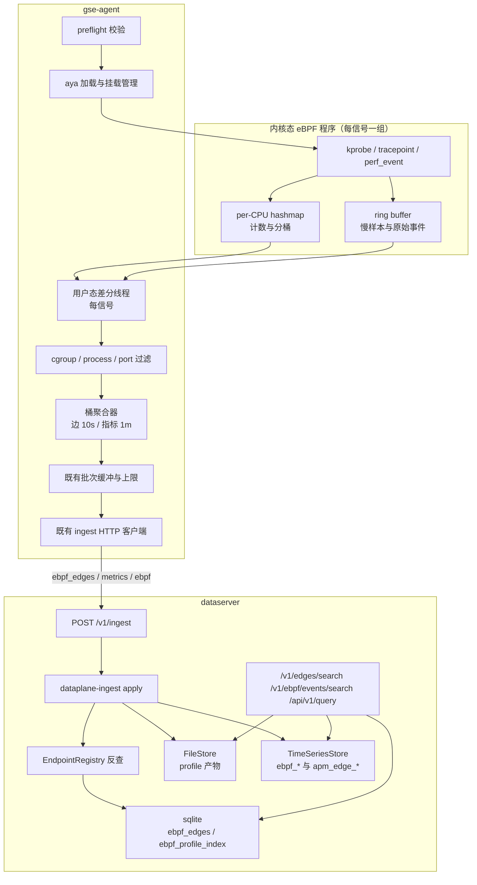

# eBPF 可观测采集

Feature Name: ebpf-observability
Updated: 2026-09-23

## Description

在 `gse-agent` 内新增 eBPF 采集能力：内核态程序在 kprobe/tracepoint 上做 per-CPU 计数聚合，用户态按周期差分出增量，形成 `EbpfEdge`（10 秒桶连接边）、`metrics`（网络/进程/TCP/IO/DNS 指标）与可选 `ebpf`（原始事件）；CPU profile（P3）走周期性栈采样并把折叠栈压缩后独立上行。数据沿用既有采集信道直连 `dataserver`，由 `dataserver` 做服务名反查、落库与查询，前端在 `@vectorman/dataplane` 增加 eBPF 页并与 APM 拓扑页共享边指标。

设计前提（本期只交付设计，不写代码）：

- 数据模型、指标命名、服务名反查、拓扑合并口径取自 `observability-data-model`，本文不重复定义。
- 技术选型 aya（纯 Rust）；内核基线 5.8 + BTF；Agent 需 root 或 `CAP_BPF`（+ `CAP_PERFMON`）。
- 与 `apm-tracing` 的分工：两侧写同一个 measurement，用 `source` label 区分。
  **实现期修正**：边指标（`ebpf_edge_*`、`ebpf_tcp_*`、`apm_edge_*{source=ebpf}`）**由 dataserver 从
  `ebpf_edges` 按分钟派生**，不是 Agent 产 —— 这些点的 `src_service`/`dst_service` 维度只有 dataserver
  能反查；Agent 侧若也发同名点会形成缺服务维度的第二套序列。Agent 只发边记录（`ebpf_edges`）、
  能力状态（`agent_ebpf_capability`）、进程指标与（可选的）原始事件。
- 聚合指标的保留与删除依赖同期交付的 `/.monkeycode/specs/dataplane-ts-retention/`：`TimeSeriesStore` 新增 `delete_series` 与全局保留窗口（`ts_retention_days` 缺省 30 天），不再是外部依赖。
- 服务名归一首选静态映射表 `apm_service_alias`（由 `apm-tracing` 提供 CRUD，本 feature 只消费）。

实施顺序：`LogStore` 索引 v2 → `dataplane-ts-retention` → `apm-tracing` → 本 feature。

## Architecture



关键取舍：

- 高频路径不进用户态：连接建立/字节/重传只在 per-CPU map 累加；用户态每 `flush_interval_secs`（默认 10 秒）读一次快照做差分。
- 只上行聚合：一条边一个桶一条记录，规模与「活跃连接对不同数」成正比，而不是与包数或事件数成正比。
- 原始事件默认关闭：打开后按 `raw_events_sample_ratio`（默认 0.01）抽样，落 `LogStore`，用于排查具体连接或 exec。
- eBPF 与 OTLP 互不依赖：`apm-tracing` 未部署时 eBPF 的边与指标照常可用；反之亦然。

## Components and Interfaces

### Workspace 变更

| 路径 | 职责 |
| --- | --- |
| `crates/gse-ebpf-programs`（新） | 内核态程序源码（`#![no_std]`，aya-bpf），按信号分模块；构建产物嵌入用户态二进制 |
| `crates/gse-agent-ebpf`（新） | preflight 校验、aya 加载与挂载管理、map 结构定义、差分与聚合、过滤、退避重试 |
| `crates/gse-agent-core` | 装配 eBPF 采集项运行时（按 `item_id` 对齐启停）、新增采集项类型与配置项 |
| `crates/dataplane-ingest` | `EbpfEdge` DTO（`src/edge.rs`）、`EbpfProfile` DTO（`src/profile.rs`）、`DataType::EbpfEdges` / `DataType::EbpfProfiles` 分支 |
| `crates/dataplane-apm` | 复用其中的 `EndpointRegistry` 做 eBPF 边反查；`ebpf_edges` / `ebpf_profile_index` 建表与查询 |
| `bins/dataserver` | 装配 `ebpf_edges` / `ebpf_profiles` 写入与查询路由、`/v1/ebpf/*` |
| `bins/dpc` | `edges`、`ebpf-events` 子命令 |
| `frontend/apps/dataplane` | 新增 `/ebpf` 页（边/事件两视图），`/topology` 增加 `source` 切换 |

依赖方向：`gse-agent-ebpf` → `aya`、`gse-ebpf-programs`（字节产物）、`dataplane-ingest`（仅 DTO）；`gse-agent-core` → `gse-agent-ebpf`。`dataserver` 侧不依赖 aya。

### 前置校验（preflight）

`preflight()` 返回 `Ok(())` 或带原因的错误，检查项与实现：

| 检查 | 实现 | 失败行为 |
| --- | --- | --- |
| 内核版本 ≥ 5.8 | `libc::uname` 解析 `release`，按 `major.minor` 比较 | 禁用该 Agent 全部 eBPF 采集项 |
| BTF 可用 | `std::fs::metadata("/sys/kernel/btf/vmlinux")` 可读 | 同上 |
| 权限 | 读 `/proc/self/status` 的 `CapEff`，检查 bit 39（`CAP_BPF`）与 bit 38（`CAP_PERFMON`），或 euid 为 0 | 同上 |

校验结果上报：Agent 在流索引上报一个 `data_type=metrics` 的采集状态点（measurement `agent_ebpf_capability`，`field_name` 为检查项名，值 1/0，tags 带 `agent_id`、`reason`），链路页据此展示。校验只做一次（进程启动）+ 采集项启用时复查（内核热升级后可能变化）。

内核态程序加载失败（`EPERM`/`EINVAL`/验证器拒绝）时：在 Agent 日志输出 warn 一行（含 `item_id`、错误码、`errno` 文本与建议动作），进入退避重试（30 秒起，×2，上限 10 分钟），成功后恢复正常采集并清零退避。卸载时先 detach 再 drop links，最后删除 map（aya 的 `Ebpf` drop 语义），保证重复启停幂等。

权限形态：Agent 以 systemd 服务或普通进程运行，运维侧具备 sudo。设计上不要求 Agent 常驻 root：能力不足时 preflight 失败只降级 eBPF 采集（warn + 链路页标记），其它采集、作业与文件传输照常；日志中给出「以 root 或带 `CAP_BPF`+`CAP_PERFMON` 运行」的提示。

### 用户态加载与采集循环（实现期补充）

- **目标文件嵌入**：`packaging/ebpf/*.o` 由 `build.rs` 生成 `OUT_DIR/ebpf_objects.rs`（存在则 `include_bytes!` 绝对路径，不存在则空切片）。直接写 `include_bytes!` 会让「没构建过 eBPF 的仓库」编译失败，而空切片能让仓库始终可编译，同时运行时给出「先跑 `scripts/build-ebpf.sh`」的明确错误。注意区分这个错误与「内核不支持」（那是 preflight 的结论）。
- **每个采集项一份 map**：`ebpf_network` 用 `CONN_AGG`、`ebpf_tcp` 用 `TCP_AGG`、`ebpf_process` 用 `PROC_AGG`。若两者共享同一 map，两个采集项会各读一次同一批增量 → 重复计数。同理 `ebpf_tcp` **只出指标不出边记录**：边记录按 `record_id` 覆盖写，两路都发会让同一连接的字段互相覆盖。
- **`aya::Pod` 与孤儿规则**：`ebpf-abi` 是内核态共享 crate，不能依赖 `aya`；用户态用 `#[repr(transparent)]` 包装类型在本地实现 `aya::Pod`，读写时取出内层值。
- **原始事件**：进程项经 `EVENTS` RingBuf 读取后按 `raw_events_sample_ratio` 等间隔抽样（不引随机数依赖，长期比例稳定）；未知事件类型按 `unknown_<n>` 上报而不是丢弃。
- **热更新**：复用采集框架的 `reconcile`（按 `item_id` + 配置指纹）—— 配置变更或 `enabled=false` 会 abort 采集任务，任务 drop 时 `Ebpf` 随之 drop，从而 detach link 并删除 map。

### 内核态程序与挂载点

| 信号 | 挂载点 | 采集内容 |
| --- | --- | --- |
| `ebpf_network` | `tracepoint/sock/inet_sock_set_state` | 连接状态迁移（ESTABLISHED、CLOSE、失败态），按 `(pid, saddr, sport, daddr, dport)` 建桶 |
| `ebpf_network` | `kprobe`+`kretprobe/tcp_connect` | 主动连接失败与错误码（`errno` → `refused`/`timeout`/`unreachable`/`reset`/`other`）。**`kretprobe/inet_csk_accept` 已弃用**：被动建立由 ESTABLISHED 迁移覆盖，不重复挂 |
| `ebpf_network` | `kprobe`+`kretprobe/tcp_sendmsg`、`tcp_recvmsg` | 字节数（返回值为负时不计），按连接键累加；不作为独立事件 |
| `ebpf_network` | `tracepoint/sock/inet_sock_set_state`（实现取此方案） | 连接存续时长：建立与关闭两端时间差入 log2 直方图槽。**原方案 `kprobe/tcp_close` 已弃用**：`tcp_close` 只给 `sk` 指针，要拼连接键就得多依赖 `struct sock` 偏移；用同一个 tracepoint 的两端更少依赖 |
| `ebpf_tcp` | `kprobe/tcp_retransmit_skb` | 重传次数（按 `(pid, saddr, sport, daddr, dport)` 累加） |
| `ebpf_tcp` | `kprobe/tcp_send_active_reset` | RST 次数 |
| `ebpf_process` | `tracepoint/sched/sched_process_exec`、`sched_process_exit`、`sched_process_fork` | 生命周期事件。**实现取 16 字节 `comm`（`bpf_get_current_comm()`）**，不读 `bprm.cmdline`：少一处版本相关偏移依赖，完整 `cmdline` 留到 P2 |
| `ebpf_syscall` | `tracepoint/syscalls/sys_enter_openat` + `sys_exit_openat`（`read`/`write`/`fsync` 同构） | 起止时间差入直方图槽，错误码计数 |
| `ebpf_dns` | `kprobe/udp_sendmsg`、`kprobe/udp_recvmsg`（过滤 `port == 53`） | `(pid, transaction_id)` 匹配耗时与 rcode |
| `ebpf_cpu_profile` | 每 tid 的 `perf_event_open` + `bpf_get_stackid(BPF_F_USER_STACK)` | 栈 id 与采样计数 |

不使用 uprobe：不修改目标进程内存，不依赖符号与动态语言运行时。

### 内核态 map 布局

结构体使用 `#[repr(C)]`，键按「能合并的维度尽量少」设计，值使用 `u64` 计数以便原子累加。

```rust
// 连接键：网络与 TCP 异常共用
#[repr(C)]
struct ConnKey {
    pid: u32,
    cgroup_id: u64,
    saddr: u32,   // IPv4；IPv6 走单独 map（key 为 [u8;16]）
    daddr: u32,
    sport: u16,
    dport: u16,
    protocol: u8,
}

#[repr(C)]
struct ConnAgg {
    connections: u64,
    failures: u64,
    failure_reason: u32,   // 枚举：refused/timeout/unreachable/reset/other
    bytes_sent: u64,
    bytes_recv: u64,
    duration_sum_us: u64,
    duration_max_us: u64,
    tcp_retrans: u64,
    tcp_resets: u64,
    latency_hist: [u64; MAX_HIST_SLOTS],  // MAX_HIST_SLOTS 编译期 32，运行时按 hist_slots 读前 N 槽
}

#[repr(C)]
struct ProcKey { pid: u32, cgroup_id: u64 }
#[repr(C)]
struct ProcAgg { exec: u64, exit: u64, fork: u64 }
```

map 类型与容量：

| map | 类型 | 容量 | 用途 |
| --- | --- | --- | --- |
| `CONN_AGG` | `PerCpuHashMap<ConnKey, ConnAgg>` | `map_max_entries`（默认 16_384） | 连接与 TCP 异常聚合 |
| `PROC_AGG` | `PerCpuHashMap<ProcKey, ProcAgg>` | 4_096 | 进程生命周期计数 |
| `SYSCALL_HIST` | `PerCpuHashMap<SyscallKey, [u64; 32]>` | 4_096 | 文件与 syscall 延迟直方图 |
| `DNS_PENDING` | `HashMap<DnsKey, u64>`（全局，跨 CPU 匹配请求与响应） | 8_192 | DNS 事务匹配 |
| `EVENTS` | `RingBuf` | 256 KiB/信号（可配） | 慢样本与原始事件 |
| `STACKS` | `StackTrace` map | 16_384 | P3 栈 id |
| `CFG` | `Array<u64>` | 16 | 用户态下发运行参数（阈值、槽数、限流参数） |

键耗尽策略：`PerCpuHashMap` 插入失败时 `bpf_map_update_elem` 返回负值，程序内对固定错误槽 `OVERFLOW_SLOT` 累加并返回 `0`（丢弃新键，不覆盖既有键）；用户态读取该槽并计入「map 满丢弃」计数。

### 用户态差分与聚合

每信号一个差分线程（`std::thread`），异常退出由装配层重建：

1. 每 `flush_interval_secs`（默认 10 秒）遍历 map 的全部 CPU 副本，按键求和得到本周期绝对值。
2. 与上周期快照相减得到增量；本周期新出现的键其增量视为绝对值（首次出现）。
3. 差分后把该键在各 CPU 副本上的值重置为 0（`aya::maps::PerCpuHashMap::insert` 写零值）；键在下周期无新事件且增量为 0 时从用户态快照中删除，避免内存增长。
4. 增量按 `cgroup_include/exclude`、`process_include/exclude`、`port_include/exclude`、`include_loopback` 过滤；被过滤的键计数后丢弃。
5. 组装 `EbpfEdge`（10 秒桶 = 一个 flush 周期）与指标记录；桶时间戳 `bucket_start = floor(now / bucket_secs) * bucket_secs`，同一周期跨桶时按时间归属拆分（只有整桶才输出，避免半桶数据）。
6. 入既有批次缓冲 → 上行。

指标对齐：边指标按 1 分钟桶聚合。Agent 在内存中保留最近 6 个 10 秒桶（`bucket_secs=10` 时正好 1 分钟），满一分钟时汇总并输出 `apm_edge_*` / `ebpf_*` 的 1 分钟点，`timestamp` 为分钟桶起点。若 `bucket_secs` 不整除 60，则按 `lcm 到 60` 的对齐规则向上取整到最近的分钟边界，并在设计评审中提示该配置。

### 资源限制

| 限制 | 实现 | 超限行为 |
| --- | --- | --- |
| `max_cpu_percent`（默认 5） | 内核态每条路径用 `bpf_ktime_get_ns` 做令牌桶判断，未通过则跳过采集 | 丢弃并计数；用户态检测连续 5 分钟超限时标记「降级运行」 |
| `max_events_per_sec`（默认 50_000） | 用户态侧统计环缓冲读取速率 | 超限时丢弃环缓冲事件并计数 |
| map 条目上限 | 见上表 | 丢弃新键，累加 `OVERFLOW_SLOT` |
| 环缓冲容量 | `EVENTS` map 配置 | 满时内核丢最旧，用户态按 `bpf_ring_buf` 统计丢弃数 |
| `max_profiled_processes`（默认 50，P3） | 用户态在 perf 挂载时按进程数限制 | 超限进程不挂 perf 事件并计数 |

所有计数通过既有自监控指标口暴露（`agent_ebpf_*` 前缀的本地指标）。

### 上行模型

| data_type | 内容 | 频率 | 默认开启 |
| --- | --- | --- | --- |
| `ebpf_edges` | 每桶每边一条 `EbpfEdge` | 每 `bucket_secs` | 是（`ebpf_network` 启用时） |
| `metrics` | `ebpf_*` 与 `apm_edge_*`（`source=ebpf`）1 分钟点 | 每 60 秒 | 是 |
| `ebpf` | 原始事件（connect/exec/慢 IO） | 每 `flush_interval_secs`，按 `raw_events_sample_ratio` 抽样 | 否 |
| `ebpf_profiles` | 压缩折叠栈（P3） | 每 `profile_interval_secs` | 否（P3） |

`EbpfEdge`、`EbpfProfile` 结构见 `observability-data-model` 与本文 Data Models。

### dataserver：接入分支

`dataplane-ingest::apply` 增加两个分支：

`DataType::EbpfEdges`：

1. 校验信封 → 既有逻辑。
2. 逐条解析 `EbpfEdge`；缺 `record_id` 或 `timestamp`、`connections == 0`、`failures > connections`、`latency_hist` 长度超 `hist_slots` → 记 `failures`，继续。
3. 幂等：`KvStore.exists("ingest/{record_id}")` 命中则跳过。
4. 服务名反查（`EndpointRegistry`）：按固定顺序 ① 静态映射 `apm_service_alias`（`process_name` → `process_prefix` → `pod_prefix` → `cidr`，同类取 `updated_ts` 最新）→ ② `(dst_ip, dst_port)` 精确命中 → ③ `dst_pod` 命中 → ④ `unknown-<ip>`。命中则回填 `src_service`、`dst_service` 并落库。本 feature 的 Agent 不填服务名，服务名完全由 `dataserver` 反查得出；静态映射的 CRUD 由 `apm-tracing` 提供（`/v1/apm/service-aliases`），本 feature 只消费。
5. 落 sqlite `ebpf_edges`：主键 `(agent_id, bucket_ts, src_ip, src_port, dst_ip, dst_port, protocol)`，冲突时后写覆盖（同桶重发语义一致）。
6. `KvStore.set("ingest/{record_id}")`；更新 `stream/{agent_id}/ebpf_edges/{data_id}` 的 `last_seen`。

`DataType::EbpfProfiles`（P3）：

1. 解析 `EbpfProfile`：`record_id`、`timestamp`、`service`、`process_name`、`period_start_ts`、`period_end_ts`、`sample_count`、`folded_gzip_base64`。
2. 校验 `folded` 解压后大小 ≤ 8 MiB、行数 ≤ 200_000；越界记 `failures`。
3. 写 `FileStore` 路径 `ebpf-profiles/{agent_id}/{period_start_ts}-{record_id}.folded.gz`，内容为原始 gzip 字节。
4. 写 sqlite `ebpf_profile_index` 一行（含 `file_path`、`sample_count`、`service`、`process_name`）。
5. 幂等：同一 `record_id` 重复上报时 `FileStore` 覆盖写、索引行冲突覆盖。

### dataserver：HTTP 路由

| 方法 | 路径 | 说明 |
| --- | --- | --- |
| POST | `/v1/edges/search` | 边查询，见 requirements Requirement 13；`source` 为空时合并两路 |
| POST | `/v1/ebpf/events/search` | 原始事件查询，内部转 `POST /v1/logs/search` 的 `data_type=ebpf` 语义 |
| GET | `/v1/ebpf/capability` | 返回各 Agent 的 eBPF 前置校验状态与降级标记（读自指标与流索引） |
| GET | `/v1/ebpf/profiles` | P3：按服务与时间范围列出 profile 产物元数据 |
| GET | `/v1/ebpf/profiles/{record_id}` | P3：返回折叠栈文本（服务端解压后返回 `text/plain`） |

### dpc

```bash
dpc edges --src gateway --dst order-api --min-requests 10 --limit 50
dpc ebpf-events --event-type exec --process-name java --limit 50
```

### frontend/apps/dataplane

| 路径 | 页 | 数据来源 | 交互 |
| --- | --- | --- | --- |
| `/ebpf` | eBPF | 视图「边」→ `POST /v1/edges/search`；视图「事件」→ `POST /v1/ebpf/events/search` | 按 `agent_id`、`source`、服务、端口、时间范围过滤；手动刷新；边行提供「查看该边 trace」跳转 |
| `/ebpf/profile` | 火焰图 | P3：`GET /v1/ebpf/profiles` + 折叠栈文本 | 阶段三交付；本期为占位路由，展示「未启用」空态 |
| `/topology` | 拓扑（既有页扩展） | `sum by (src_service, dst_service) (apm_edge_requests_total)` | `source` 切换（全部 / otlp / ebpf） |

实现约束：图表统一用 `echarts`（与 `apm-tracing` 同一选择）：火焰图（P3）用 `custom`/`bar` 系列，拓扑页用 `graph` series + `layout: 'none'`（坐标前端自算，不用力导向）。后端口径不变，只返回 Prom 形数据点与折叠栈文本；`/ebpf` 页顶部展示前置校验状态与降级标记，来源 `GET /v1/ebpf/capability`。

## Data Models

### sqlite ebpf 表

`ebpf_edges` 定义在 `observability-data-model`。本 feature 额外需要 P3 索引表：

```sql
CREATE TABLE IF NOT EXISTS ebpf_profile_index (
  record_id        TEXT PRIMARY KEY,
  agent_id         TEXT NOT NULL,
  data_id          TEXT NOT NULL,
  service          TEXT NOT NULL,
  process_name     TEXT NOT NULL,
  container_id     TEXT NOT NULL DEFAULT '',
  period_start_ts  INTEGER NOT NULL,
  period_end_ts    INTEGER NOT NULL,
  sample_count     INTEGER NOT NULL,
  symbolized       INTEGER NOT NULL DEFAULT 0,   -- 0/1，是否全部符号化成功
  file_path        TEXT NOT NULL,
  created_ts       INTEGER NOT NULL
);
CREATE INDEX IF NOT EXISTS ebpf_profile_index_time ON ebpf_profile_index(period_start_ts);
CREATE INDEX IF NOT EXISTS ebpf_profile_index_svc ON ebpf_profile_index(service, period_start_ts);
```

### EbpfProfile（P3）

```rust
struct EbpfProfile {
    record_id: String,          // "{agent_id}:{period_start_ts}:{service}:{process_name}"
    timestamp: i64,             // period_start_ts，Unix 微秒
    service: String,
    process_name: String,
    container_id: String,
    period_start_ts: i64,
    period_end_ts: i64,
    sample_count: u64,
    symbolized: bool,
    max_stack_depth: u32,
    folded_gzip_base64: String, // folded stack 文本的 gzip 后 base64
    labels: BTreeMap<String, String>,
}
```

`folded` 文本格式为 `frame;frame;frame count`（每行一个栈，分号分隔，末尾空格后为样本数），与 FlameGraph/pprof 折叠栈兼容，便于后续接入外部工具。

### 指标产出映射

Agent 侧产出（每 60 秒一批），严格按 `observability-data-model` 命名表：

| measurement | 来源字段 | `field` label | 备注 |
| --- | --- | --- | --- |
| `ebpf_edge_connections_total` | `EbpfEdge.connections` | `value` | 按分钟桶求和 |
| `ebpf_edge_bytes_total` | `bytes_sent` / `bytes_recv` | `value` | 两个方向分别一条点，`labels.direction` 区分 |
| `apm_edge_requests_total` | `connections` | `value` | `source=ebpf`，与 OTLP 侧同 measurement |
| `apm_edge_errors_total` | `failures` | `value` | `source=ebpf` |
| `apm_edge_duration_micros` | `duration_sum` / 连接数 | `avg` | `p95` 由直方图槽上界近似（取累积到 95% 的槽） |
| `ebpf_tcp_retrans_total` | `tcp_retrans` | `value` | 按 `src_service`/`dst_service` 汇总 |
| `ebpf_tcp_failures_total` | `failures` + `failure_reason` | `value` | 按 `reason` 分组 |
| `ebpf_process_exec_total` / `_exit_total` | `ProcAgg` | `value` | 按 `process_name`/`service` |
| `ebpf_syscall_duration_micros` | `SYSCALL_HIST` | `avg` `p95` | P2 |
| `ebpf_dns_duration_micros` | `DNS_PENDING` 匹配结果 | `avg` `p95` | P2 |
| `ebpf_cpu_profile_samples_total` | `STACKS` 计数 | `value` | P3 |

**口径修正（实现期）**：`apm_edge_*{source="ebpf"}` 改由 **dataserver** 在服务名反查后产生——Agent
不知道全局服务表，只有 IP/端口/Pod/进程；Agent 侧只产 `ebpf_*` 指标（`ebpf_edge_connections_total`、
`ebpf_edge_bytes_total{direction}`、`ebpf_edge_duration_micros{avg,max}`、`ebpf_tcp_retrans_total`、
`ebpf_tcp_failures_total`）与 `ebpf_edges` 边记录（服务名留空）。

`apm_edge_duration_micros` 的 `p95` 在 eBPF 侧用直方图槽上界近似（不是精确分位数），与 OTLP 侧的 nearest-rank 精确 P95 存在口径差异：读取该指标时需注意 `source` label；文档与前端 tooltip 明确标注 `source=ebpf` 为近似值。

### 保留期

| 数据 | 保留期 | 清理方式 |
| --- | --- | --- |
| `ebpf_edges`（sqlite） | `retention_days`（缺省 3） | `DELETE FROM ebpf_edges WHERE bucket_ts < ?`，分批（每批 5_000 行） |
| `ebpf` 原始事件（LogStore） | 同上 | `delete_matching(IndexedLogFilter{data_id, to_ts})` 循环直到返回 0 |
| `ebpf_profile_index` + FileStore 产物 | `profile_retention_days`（缺省 7） | 先删 FileStore 文件再删索引行；文件删除失败时保留索引行下轮重试 |
| 聚合指标（TimeSeriesStore） | `ts_retention_days`（缺省 30） | 依赖 `dataplane-ts-retention`：tsink 全局保留窗口执行 + 按采集项 `retention_days` 的 `delete_series` 定时删除 |

## Correctness Properties

- 增量守恒：一段时间的差分增量之和等于该时段内内核态累加总量（无 map 淘汰时）。
- 桶幂等：同一 `(agent_id, bucket_ts, 边)` 重复上报后，`ebpf_edges` 仍只有一行，字段为最后一次写入值。
- 过滤一致：`include_loopback=false` 时不存在 `127.0.0.0/8`、`::1` 的边；`port_exclude` 中的端口不出现在 `dst_port`。
- 计数关系：`failures <= connections`；`failure_reason` 在 `failures == 0` 时为空串，在 `failures > 0` 时属于允许枚举。
- 直方图单调：`latency_hist` 槽内计数之和等于参与统计的连接数（可能小于 `connections`，因为仍在存活期的连接不计入）。
- 降级可见：任何资源限制被触发后，对应的丢弃计数增大且链路页出现降级标记。
- 环境隔离：前置校验失败的 Agent 不产生任何 `ebpf_edges` / `ebpf_*` 数据，且既有采集类型行为不变。
- 两路合并：同一分钟 `sum by (src_service, dst_service) (apm_edge_requests_total)` 等于 `source="otlp"` 与 `source="ebpf"` 两侧之和。
- P3 幂等：同一 `record_id` 重复上报的 profile 产物只有一个文件与一行索引。
- 版本不匹配：`data_type=ebpf_edges` 发往不支持的 dataserver 时 Agent 确认该批且不无限重试。

## Error Handling

| 场景 | 行为 |
| --- | --- |
| 内核版本 < 5.8 / 无 BTF / 无权限 | 禁用该 Agent 全部 eBPF 采集项，Agent 日志 warn 一行（含检查项、实测值与建议动作），链路页展示不可用与原因；其它采集项不受影响 |
| 内核态程序加载失败 | stderr 一行（含 `errno`），退避重试 30 秒起、上限 10 分钟，其他采集项不受影响 |
| map 满 | 丢新键、`OVERFLOW_SLOT` 累加，用户态计数，不覆盖既有键 |
| 环缓冲满 | 内核丢最旧，用户态计丢弃数 |
| `max_cpu_percent` 持续超限 5 分钟 | 标记「降级运行」，链路页展示；不自动关闭采集 |
| 差分快照读取失败 | 本周期该项不出数，stderr 一行（限流打印，最多每分钟一行） |
| 边记录字段非法 | dataserver 记 `failures`，`status=partial`，Agent 确认该批 |
| 服务名反查失败 | 落 `unknown-<ip>`，前端图例单列「未识别」 |
| dataserver 不支持 `ebpf_edges` | Agent 收到 `invalid_argument` 并确认该批，stderr 一行提示版本不匹配 |
| `ebpf_profiles` 解压后超限 | 记 `failures`，不写 `FileStore` |
| FileStore 写失败（P3） | 返回 `query_failed`，Agent 退避重试；同 `record_id` 覆盖写保证幂等 |
| 聚合指标达到 `ts_cardinality_limit` | 写入返回 `query_failed` 含 `cardinality`；`dataserver_ts_series_count` 逼近上限时需人工收窄维度 |
| 降级/卸载时残留 | 卸载先 detach、再 drop links、最后删 map；启动时清理上次遗留（按 map 名匹配前缀） |
| 聚合点超保留窗口 / 基数达上限 | 由 `dataplane-ts-retention` 处理：`invalid_argument` / `query_failed` 含 `cardinality`，接入应答记入 `failures` |

## Test Strategy

内核态程序无法在普通 CI 容器运行，因此测试分三层：

**纯用户态单测（CI 可跑）**

- preflight：伪造 `uname` 结果与 `/proc/self/status` 内容（注入式读取函数），断言各检查项的通过/失败判定与错误文本。
- 差分：用「假 map 快照」（`Vec<(key, Vec<u64>)>`）驱动差分函数，断言增量计算、首次出现按绝对值、归零后键被清理、map 淘汰时不出数。
- 过滤：`cgroup_include/exclude`、`process_include/exclude`、`port_include/exclude`、`include_loopback` 的组合矩阵。
- 桶聚合：10 秒桶 → 1 分钟指标的对齐与求和；`bucket_secs` 不整除 60 时的取整规则；`latency_hist` 到 `p95` 近似值。
- `EbpfEdge` 组装：`record_id` 规则、`failures > connections` 被拒、`failure_reason` 枚举、`hist_slots` 截断。
- 退避：加载失败序列 → 退避间隔序列（30 秒、60 秒、…、600 秒封顶），成功后清零。
- 上限：`max_profiled_processes`、环缓冲速率上限、map 满计数的用户态汇总。
- `ebpf_profiles`：folded 压缩/解压往返、超 8 MiB 与 20 万行被拒、符号化标记。

**dataserver 侧（CI 可跑）**

- 接入：`ebpf_edges` 幂等（同 `record_id` 重放）、字段非法 → `partial`、反查命中与 `unknown-<ip>` 回退、`stream/` 流索引更新。
- 查询：`/v1/edges/search` 的过滤与分页、`source` 为空时两路合并汇总、`from_ts > to_ts` → 400。
- 清理：4 天前边与事件被删、29 天前 profile 保留、31 天前 profile 文件与索引同时删除、删除采集项后按 `retain/` 到期清理。
- P3：`ebpf_profiles` 落 FileStore + 索引行，重复上报只有一个文件；解压超限被拒。
- 前端（vitest）：`/ebpf` 页两视图参数拼装、`source` 切换改变 PromQL 表达式、降级标记渲染、边行跳转 URL。

**需特权环境的集成测试（人工/专用 runner）**

- 在 5.8+ 且有 BTF 的 Linux 上加载全部 P1 程序，跑一段受控流量（本机 `curl` 到本地 HTTP 服务）：
  - 断言产生对应边记录，`dst_port` 与 `connections` 正确；
  - `include_loopback=false` 时不产生回环边，改为 true 后产生；
  - 断言 `max_cpu_percent` 与 `max_events_per_sec` 触发时计数增长；
  - 断言卸载后 `/sys/fs/bpf` 与 map 无残留。
- P2、P3 各自独立用例；P3 额外断言折叠栈可被 `flamegraph` 类工具消费（格式校验），且 `symbolized` 标记与符号可用性一致。
- CI 说明：特权测试不在默认流水线内，通过单独脚本与专用 runner 触发；CI 只保证编译与用户态单测。

## Pitfalls

- eBPF 程序需要用 `bpfel-unknown-none` 目标构建，依赖 nightly 工具链，与现有 musl 静态构建的工具链不同。方案：CI 单独一步产出 `*.o`，产物入库到 `packaging/ebpf/`，用户态通过 `include_bytes!` 嵌入；部署期不编译（对应需求 17.6）。
- aya 需要 `CAP_BPF` + `CAP_PERFMON`（5.8+）或 euid 0。容器化部署时不要只加 `--privileged` 就当作可用，preflight 必须实测。
- per-CPU map 的值读取是「按 CPU 副本」的，差分逻辑不能只读 CPU 0；忘记遍历副本会漏计约 `1/ncpu` 的流量且难以察觉。
- 差分后必须显式把值写回 0，否则第二周期会重复计入同一批数据；`PerCpuHashMap::insert` 写零值是必需的，不能只删除键。
- `tcp_sendmsg` 的返回值语义（入队字节 vs 实际发送）会导致 `bytes_sent` 与内核计数器有偏差，设计以返回值为准并在文档标注口径，不要试图与 `/proc/net/dev` 对齐。
- `inet_sock_set_state` 的 state 常量与内核版本相关，不要硬编码数值；从 `aya` 的 BTF/常量映射或运行期探测取。
- **实现期确定的做法**：内核态**完全不硬编码**结构体偏移与状态值 —— 用户态解析 `/sys/kernel/btf/vmlinux`（`struct sock_common`/`sock` 字段偏移）与 tracepoint 的 `format` 文件（字段偏移），连同 TCP 状态常量一起写入 `CFG: Array<u64>`（下标见 `ebpf_abi::CfgIndex`，带 `CFG_VERSION` 版本号，不匹配则不采集）。好处：内核态不需重新编译就能适配不同内核，状态语义留在可单测的用户态。
- 结构体偏移与 tracepoint 字段偏移**两者都要在运行期解析**：前者来自 `/sys/kernel/btf/vmlinux`（自实现的极简 BTF 解析器，需递归穿过匿名 `struct`/`union` —— `sock_common` 的成员就藏在匿名 union 里），后者来自 `/sys/kernel/tracing/events/<cat>/<name>/format`（common 头之后的字段偏移随版本变化，例如 5.19 起追加 `cookie`）。tracepoint 文件不可读时用文档化兜底布局并记 warn。
- 本机实测（6.1）推翻了一条想当然的假设：`skc_dport`@12 与 `skc_num`@14 是**顺序字段**，不是同一个 union。两个端口各按自己的偏移读，不要从一个推另一个。
- kprobe 的参数在 kretprobe 里**拿不到**（返回时寄存器已变）：字节数/连接失败这类「入口建键 + 返回判值」的组合必须用 `ENTRY: HashMap<tid, ConnKey>` 暂存入口键，返回时取出并清除；kretprobe 未配对时跳过，不要用当前进程重新建键（会记到错误的连接上）。
- `latency_hist` 的槽上界会低估长尾（例如槽 23 覆盖到 `2^24` 微秒以上），`p95` 近似值必须标注为近似，前端 tooltip 要写清楚。
- 内核态程序的栈与循环受限（验证器），`latency_hist` 遍历必须用 `bpf_loop` 或展开的固定次数循环，不能用动态长度 `for`。
- `EbpfEdge` 的 `record_id` 包含 `bucket_start_micros`，桶宽变更会使同一连接在两个桶粒度下产生两套记录；采集项改 `bucket_secs` 属于语义变更，需在链路页提示。
- `/topology` 页两路合并时 `apm_edge_duration_micros{field="p95"}` 的 `source` 口径不同（精确 vs 近似），不要在同一张图里把两者相加。
- 前置校验结果要上报，否则「拓扑页没有 eBPF 数据」与「eBPF 不可用」在界面上无法区分。

## References

[^1]: 共享数据模型 - 当前工作区 `/.monkeycode/specs/observability-data-model/design.md`
[^2]: 需求 - 当前工作区 `/.monkeycode/specs/ebpf-observability/requirements.md`
[^3]: 采集接入与信封 - 当前工作区 `/.monkeycode/specs/gse-dataplane-ingest/design.md`
[^4]: APM 与 OTLP 侧边指标 - 当前工作区 `/.monkeycode/specs/apm-tracing/design.md`
[^5]: Agent 采集框架与配置 - 当前工作区 `crates/gse-agent-core/src/collect/mod.rs`
[^6]: aya 文档 - `https://aya-rs.dev/book/`
[^7]: 内核 BPF 可移植性与 BTF - `https://www.kernel.org/doc/html/latest/bpf/`
[^8]: 时序保留与删除 - 当前工作区 `/.monkeycode/specs/dataplane-ts-retention/design.md`
