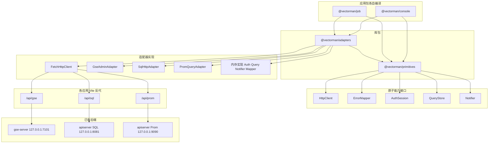

# 前端分层架构

Feature Name: frontend-layered-architecture
Updated: 2026-09-06

## Description

vectorman 前端 v1 交付分层骨架与多包工作区：`@vectorman/primitives` 提供五个原子能力接口与内存实现，`@vectorman/adapters` 提供 HTTP 与后端协议适配器，`@vectorman/console` 与 `@vectorman/job` 各自装配并独立 `dev`/`build`。业务页面列为后续范围。

依赖方向只允许向下：应用页面 -> 业务模块 -> 原子能力 / 领域适配器接口 <- 适配器实现。库包不依赖应用包。

技术栈：React + Vite + TypeScript，npm workspaces 根目录 `frontend/`。

## Architecture

分层自上而下：应用装配入口 -> 页面 -> 业务模块 -> 原子能力接口 -> 适配器实现 -> 开发期反代 -> 后端 HTTP。



包依赖规则：

- `@vectorman/primitives` 零运行时依赖，不从 `react` 导入类型，不依赖 adapters 与 apps。
- `@vectorman/adapters` 只依赖 `@vectorman/primitives`；`FetchHttpClient` 是唯一调用浏览器 `fetch` 的模块。
- 应用包依赖两个库包；页面与业务模块只依赖接口与适配器对外类型，不 import `fetch`。
- 每个应用的装配入口是该应用内唯一 `new` 具体实现的地方。两个应用各自持有独立的内存会话、QueryStore、Notifier 实例。

## Components and Interfaces

### 目录

```text
frontend/
  package.json                 # workspaces: packages/*, apps/*
  package-lock.json
  packages/
    primitives/                # @vectorman/primitives
      package.json
      src/
        error.ts
        http.ts
        mapper.ts
        session.ts
        query.ts
        notifier.ts
        memory/
          session.ts
          query.ts
          notifier.ts
          mapper.ts
        index.ts
      src/*.test.ts
    adapters/                  # @vectorman/adapters
      package.json
      src/
        http/fetch-client.ts
        gse/admin.ts
        dataplane/sql.ts
        dataplane/prom.ts
        index.ts
      src/**/*.test.ts
  apps/
    console/                   # @vectorman/console
      package.json
      vite.config.ts
      tsconfig.json
      index.html
      src/
        main.tsx
        app/App.tsx
        features/.gitkeep
        pages/.gitkeep
    job/                       # @vectorman/job
      package.json
      vite.config.ts
      tsconfig.json
      index.html
      src/
        main.tsx
        app/App.tsx
        features/.gitkeep
        pages/.gitkeep
```

根 `package.json` scripts：

| script | 作用 |
| --- | --- |
| `npm run test -w @vectorman/primitives` | 原子能力单元测试 |
| `npm run test -w @vectorman/adapters` | 适配器单元测试 |
| `npm run dev -w @vectorman/console` | 控制台开发服务器 |
| `npm run build -w @vectorman/console` | 控制台独立产物 |
| `npm run dev -w @vectorman/job` | 作业应用开发服务器 |
| `npm run build -w @vectorman/job` | 作业应用独立产物 |

应用包通过 workspace 协议依赖库包，例如 `"@vectorman/primitives": "*"`。Vite 用 `resolve.dedupe` 保证 React 单实例。库包以 TypeScript 源码被应用直接引用（`exports` 指向 `src/index.ts`），v1 不为库包单独产出 dist。

### 错误契约

与后端 `GseError` / `DataplaneError` 对齐。稳定 `code`：

| code | 含义 |
| --- | --- |
| `not_found` | 资源不存在 |
| `invalid_argument` | JSON/参数无法解析或缺字段 |
| `query_failed` | 后端执行失败 |
| `unimplemented` | 未实现的协议或函数 |
| `unavailable` | 网络不可达或超时 |
| `unauthorized` | 会话无效（v1 预留） |

```ts
type AppError = { code: string; message: string }
```

`ErrorMapper.map(input)`：

- HTTP JSON 含 `code`：使用该 `code`；`message` 取 `error` 或 `message` 字段。
- Prom 形状 `{status:"error"}`：`code` 取 `errorType`，缺省 `query_failed`；`message` 取 `error`。
- 无 body 的 4xx/5xx：按状态码映射（404 -> `not_found`，400 -> `invalid_argument`，401/403 -> `unauthorized`，其余 `query_failed`）。
- `TypeError` / `AbortError`：`unavailable`。
- JSON 解析失败：`invalid_argument`。

### HttpClient

```ts
type HttpMethod = "GET" | "POST" | "PUT" | "PATCH" | "DELETE"

type RequestContext = {
  timeoutMs: number
  signal?: AbortSignal
  traceId?: string
}

type HttpRequest = {
  method: HttpMethod
  url: string
  headers?: Record<string, string>
  body?: unknown
  context?: RequestContext
}

type HttpResponse<T = unknown> = {
  status: number
  body: T
}

interface HttpClient {
  request<T>(req: HttpRequest): Promise<HttpResponse<T>>
}
```

默认 `timeoutMs = 15000`。超时用 `AbortController`；调用方传入的 `signal` 与超时控制器合并。

`FetchHttpClient` 构造注入 `AuthSession` 与 `ErrorMapper`：

- 成功：`response.ok` 且 body 可按 JSON 解析（空 body 视为 `null`）。
- 失败：抛出 `AppError`（Promise reject），不返回 `{ok:false}` 联合类型。业务侧用 try/catch 或 `QueryStore`。
- 会话非空且含 `token` 时附加 `Authorization: Bearer <token>`。
- 每次请求附加 `X-Trace-Id`：使用 `context.traceId`，缺省由客户端生成。

### AuthSession

```ts
type Session = {
  token?: string
  subject?: string
}

interface AuthSession {
  get(): Session | null
  set(session: Session): void
  clear(): void
}
```

v1：`MemoryAuthSession` 保存在实例字段，不使用模块级单例，这样 console 与 job 同时运行时会话互不影响。刷新页面后为 `null`。不写 `localStorage`。

### QueryStore

按查询键保存一条状态。接口与 React 解耦；后续页面可用 `useSyncExternalStore` 订阅。

```ts
type QueryStatus = "idle" | "loading" | "success" | "error"

type QueryRecord<T> = {
  status: QueryStatus
  data?: T
  error?: AppError
}

interface QueryStore {
  get<T>(key: string): QueryRecord<T>
  setLoading(key: string): void
  setSuccess<T>(key: string, data: T): void
  setError(key: string, error: AppError): void
  subscribe(key: string, listener: () => void): () => void
}
```

`MemoryQueryStore`：实例内 `Map<string, QueryRecord>` + 按 key 的 listener 集合。`get` 对未知 key 返回 `{status:"idle"}`。

### Notifier

```ts
type NoticeLevel = "success" | "warning" | "error"

type Notice = {
  id: string
  level: NoticeLevel
  message: string
}

interface Notifier {
  success(message: string): void
  warning(message: string): void
  error(error: AppError): void
  subscribe(listener: (notice: Notice) => void): () => void
}
```

`MemoryNotifier`：实例内内存队列，上限 50 条，超出丢弃最早一条。`error` 使用 `error.message`。v1 装配入口不渲染 Toast。

### 后端适配器

三个适配器均注入 `HttpClient`。URL 只用相对前缀。位于 `@vectorman/adapters`。

`GseAdminAdapter` 前缀 `/api/gse`：

| 方法 | HTTP | 路径 |
| --- | --- | --- |
| `listHosts` | GET | `/api/gse/hosts` |
| `upsertHost` | POST | `/api/gse/hosts` |
| `getHost` | GET | `/api/gse/hosts/{host_id}` |
| `deleteHost` | DELETE | `/api/gse/hosts/{host_id}` |
| `listAccessPoints` | GET | `/api/gse/access-points` |
| `upsertAccessPoint` | POST | `/api/gse/access-points` |
| `getAccessPoint` | GET | `/api/gse/access-points/{id}` |
| `deleteAccessPoint` | DELETE | `/api/gse/access-points/{id}` |
| `listAgents` | GET | `/api/gse/agents` |
| `upsertAgent` | POST | `/api/gse/agents` |
| `getAgent` | GET | `/api/gse/agents/{agent_id}` |
| `deleteAgent` | DELETE | `/api/gse/agents/{agent_id}` |
| `listAgentConfigs` | GET | `/api/gse/agent-configs` |
| `upsertAgentConfig` | POST | `/api/gse/agent-configs` |
| `getAgentConfig` | GET | `/api/gse/agent-configs/{agent_id}` |

DTO 与 `crates/gse-server-core/src/ledger.rs` 字段同名：`Host`、`AccessPoint`、`Agent`、`AgentConfig`。路径参数做 `encodeURIComponent`。

`SqlHttpAdapter` 前缀 `/api/sql`：

- `execute(sql: string, params: unknown[]): Promise<{columns: string[]; rows: unknown[][]}>`
- 请求：`POST /api/sql/v1/sql`，body `{"sql","params"}`

`PromQueryAdapter` 前缀 `/api/prom`：

- `queryInstant(expr: string, time?: string): Promise<PromEnvelope>`
- `queryRange(expr: string, start: string, end: string, step: string): Promise<PromEnvelope>`
- `PromEnvelope = { status: string; data?: unknown; error?: string; errorType?: string }`
- 路径：`GET /api/prom/api/v1/query`、`GET /api/prom/api/v1/query_range`
- 当 `status === "error"`，适配器抛出经 `ErrorMapper` 映射的 `AppError`

每个应用自己的 `vite.config.ts` 配置相同反代，剥掉前端前缀，后端收到原路径：

| 浏览器路径 | target | rewrite |
| --- | --- | --- |
| `/api/gse/hosts` | `http://127.0.0.1:7101` | `/hosts` |
| `/api/sql/v1/sql` | `http://127.0.0.1:8081` | `/v1/sql` |
| `/api/prom/api/v1/query` | `http://127.0.0.1:9090` | `/api/v1/query` |

每个应用 `server.allowedHosts` 含 `.monkeycode-ai.online`。

### 装配入口

每个应用的 `main.tsx` 各自一次性构造：

1. `MemoryAuthSession`、`JsonErrorMapper`、`MemoryQueryStore`、`MemoryNotifier`
2. `FetchHttpClient({ session, mapper })`
3. 三个后端适配器
4. 通过 React Context 把上述实例交给该应用的 `App`

`@vectorman/console` 的 `App.tsx` 渲染 “console composition ready”。
`@vectorman/job` 的 `App.tsx` 渲染 “job composition ready”。
均不调用后端。后续业务页面写入各自 `pages/` 与 `features/`。

后续新增应用（例如 cmdb）：在 `apps/` 下新建包，依赖两个库包，复制装配入口模式，独立 `build`。

## Data Models

见上节 TypeScript 类型。GSE DTO 与 ledger 对齐：

| 类型 | 必填字段 |
| --- | --- |
| Host | `host_id`, `inner_ip` |
| AccessPoint | `id`, `name`, `server_ip`, `rpc_port` |
| Agent | `agent_id`, `host_id`, `token` |
| AgentConfig | `agent_id`, `host_id` |

其余字段可选，缺省为空字符串或 `null`，与 serde `default` 一致。

## Correctness Properties

- `@vectorman/primitives` 不 import `@vectorman/adapters`、`react`、任一应用包。
- `FetchHttpClient` 是唯一 `fetch` 调用点，位于 `@vectorman/adapters`。
- 适配器 URL 以 `/api/gse`、`/api/sql`、`/api/prom` 开头。
- `AuthSession.get()` 在 `clear()` 之后返回 `null`。
- `QueryStore` 同一 key 的状态为 idle/loading/success/error 四者之一。
- `Notifier` 订阅者收到的 `error` 级 `message` 等于传入 `AppError.message`。
- 适配器测试零真实网络。
- `npm run build -w @vectorman/job` 不读取 console 的 dist。
- 内存实现按实例隔离，两个应用运行时不共享 Session / QueryStore / Notifier。

## Error Handling

| 场景 | 行为 |
| --- | --- |
| 网络失败 / 超时 | `HttpClient` reject，`code=unavailable` |
| 请求/响应 JSON 非法 | `code=invalid_argument` |
| GSE 4xx/5xx JSON `{code,error}` | 原样映射 |
| Prom `status=error` | 适配器 reject，映射 `errorType`/`error` |
| 空会话 | 仍发请求，无 `Authorization` |
| Notifier 无订阅者 | 消息进队列，不抛错 |

## Test Strategy

测试框架：Vitest，挂在对应库包内。不启动 gse-server / apiserver。

1. `@vectorman/primitives`：`JsonErrorMapper`、`MemoryAuthSession`、`MemoryQueryStore`、`MemoryNotifier`。
2. `@vectorman/adapters`：`FetchHttpClient` 用 stub `fetch`；三个适配器注入假 `HttpClient` 断言 method、url、body。
3. 应用包 v1 不强制页面测试；装配入口可用静态渲染确认文案（可选）。

## References

[^1]: (Filename) - [GSE HTTP 管理口](crates/gse-server-core/src/http.rs)
[^2]: (Filename) - [GSE ledger DTO](crates/gse-server-core/src/ledger.rs)
[^3]: (Filename) - [dataplane SQL/Prom HTTP](.monkeycode/specs/dataplane-layered-storage/design.md)
[^4]: (Filename) - [本 feature 需求](.monkeycode/specs/frontend-layered-architecture/requirements.md)
