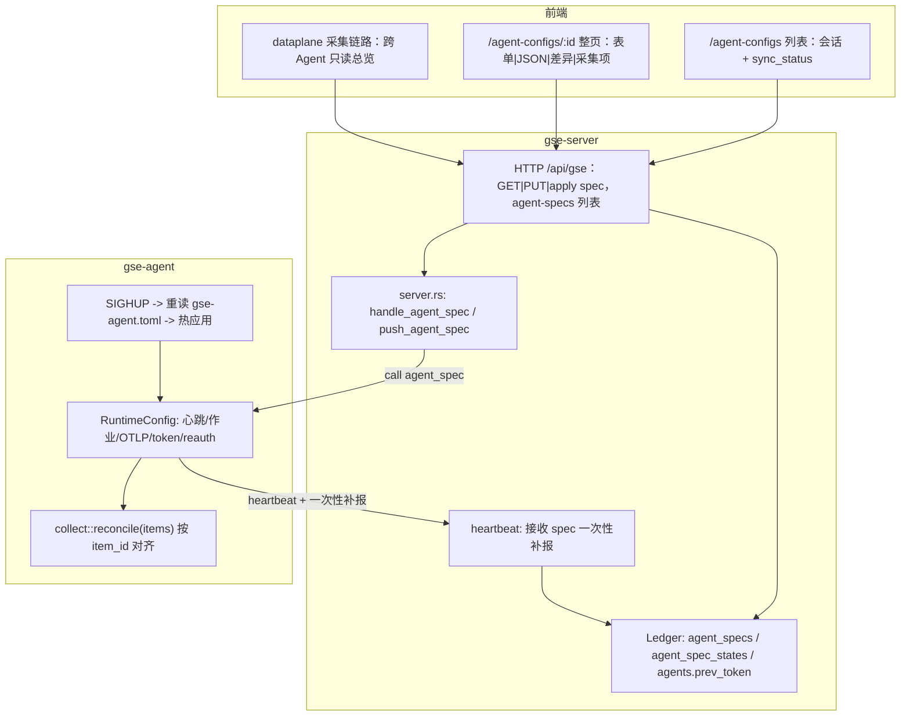
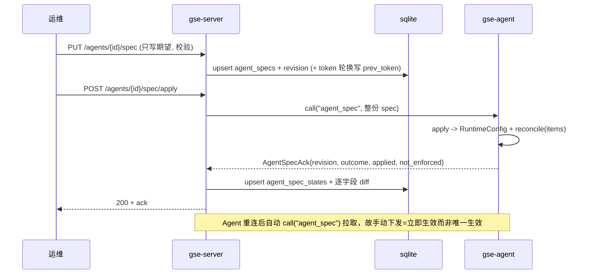

# Agent 配置中心（per-Agent spec：下发 + 热加载 + 生效核验）

Feature Name: gse-agent-config-center
Updated: 2026-09-29

## Description

**一台 Agent 一份 spec**：`spec = {params, items}` —— `params` 是 Agent 运行参数，`items` 是这台 Agent 的采集项数组。
Server 只提供三个动作：**取 spec / 存 spec / 下发 spec**。保存只写期望；下发是手动、**单台 Agent**、整份；
Agent 热应用不重启进程；生效值回来做逐字段 diff 与可视化。

三条链路：

1. **下发**：RPC `agent_spec`（双侧同名注册）取代既有 `collect_items` 通道；Agent 认证后自动拉取（重连即收敛），
   手动下发按钮只决定「不必等重连、立即生效」。
2. **热加载**：Agent 侧 `RuntimeConfig` 持有可变参数（心跳周期 `AtomicU64`、作业执行器 `RwLock`、
   OTLP 参数 `RwLock`、token、`Notify` 触发重连）；采集项按 `item_id` 对齐（复用既有 `reconcile`）；
   另支持 `SIGHUP` 重读本地文件并热应用。
3. **核验**：Agent 回执 `AgentSpecAck`（含全量生效 spec 与 `not_enforced`），Server 算逐字段 diff 落库，
   心跳带一次性补报兜底。

同时落下两个模型收敛：**采集项不再是一等资源**（没有 `collect_items` 的增删改查，也不再有 `agent_ids`），
**`agent_configs` 台账整体退役**（并入 spec）。

## Architecture



一次下发：



## Components and Interfaces

### 改动范围（Impact Map）

行数为**当前实际行数**（2026-09-29 核），用于估算改动量级，不是改动行数。

**Rust（4 crate + 2 bin）**

| 位置 | 现有行数 | 变更 |
| --- | --- | --- |
| `crates/gse-proto/src/lib.rs` | 740 | 新增 `SpecParams` / `SpecItem` / `AgentSpecWire` / `AgentSpecPush` / `AgentSpecAck` / `HeartbeatReply`；`Heartbeat` 增可选一次性补报；**删除** `CollectItem.agent_ids` 与 `CollectItemsReply` |
| `crates/gse-server-core/src/ledger.rs` | 2448 | 新增两表与 `AgentSpec` / `AgentSpecState` / `SpecDiff` + CRUD + 一次性搬运；`agents` 增 `prev_token`；**删除** `AgentConfig` 与 `CollectItem` 的台账 CRUD（全文件 ~36 处引用，25 个测试需改） |
| `crates/gse-server-core/src/http.rs` | 2800 | 新增 4 条路由（列表 + spec 三动作）+ 6 条校验 + 脱敏；**删除** `/collect-items*` 与 `/agent-configs*` 整组路由（~33 处引用，26 个测试需改） |
| `crates/gse-server-core/src/server.rs` | 1646 | `handle_collect_items` / `push_collect_items(_to)` → `handle_agent_spec` / `push_agent_spec`；`auth` 支持 `prev_token` 双凭据并在用新 token 成功后清理；`heartbeat` 接收补报并返回 `HeartbeatReply`（~31 处引用，16 个测试需改） |
| `crates/gse-server-core/src/lib.rs` | 29 | 导出调整 |
| `crates/gse-server-core/tests/e2e.rs` | — | 受影响用例 |
| `crates/gse-agent-core/src/spec_apply.rs`（新） | 0 | spec → `RuntimeConfig` 的应用、`outcome` / `not_enforced` 判定、不可变字段防御（纯逻辑，可单测）；预估 ~200 行 |
| `crates/gse-agent-core/src/lib.rs` | 325 | `run`/`connect_once` 引入 `Arc<RuntimeConfig>`；注册 `agent_spec` handler；认证后拉取；SIGHUP 监听；心跳补报与 `reauth`；删 `collect_items` 注册与 `pull_collect_items` |
| `crates/gse-agent-core/src/job.rs` | 556 | 暴露 `JobConfig` 读访问器（小改） |
| `crates/gse-agent-core/src/collect/mod.rs` | 565 | OTLP 参数改 `RwLock`；`Control::Items` → `Control::SpecChanged`（参数与 items 一起对齐）；只对 `apm_otlp` 项强制重对齐；`reconcile` 复用不动 |
| `crates/gse-agent-core/src/config.rs` | 336 | 不改逻辑；注释写明优先级与 SIGHUP |
| `bins/gse-agent/src/main.rs` | 89 | `cfg_path` 传给 `run()`（供 SIGHUP 重读） |
| `bins/gse-agent/gse-agent.toml.example` | — | 注明「可被下发覆盖」、优先级、`SIGHUP` 重读 |
| `bins/dataserver/src/http.rs` | 2108 | **删除** 5 条 `/v1/collect-items*` 路由，新增只读 `GET /v1/agent-specs` 转发（14 个测试需改） |
| `bins/dataserver/src/cleanup.rs` | 768 | `fetch_live_items` 数据源由 `/api/gse/collect-items` 改为 `/api/gse/agent-specs`；`parse_collect_items` → `parse_live_items`（按 `item_id` 去重，`retention_days` 冲突取最大值）（7 个测试需改） |
| `bins/dataserver/tests/e2e.rs` | — | 受影响用例 |

**前端（2 app + 1 package）**

| 位置 | 现有行数 | 变更 |
| --- | --- | --- |
| `frontend/packages/adapters/src/gse/admin.ts` | 126 | **删除** `listAgentConfigs` / `upsertAgentConfig` / `getAgentConfig`；新增 `listAgentSpecs` / `getAgentSpec` / `putAgentSpec` / `applyAgentSpec`；`AgentConfig` 类型 → `AgentSpec` / `SpecParams` / `SpecItem` / `SpecDiff` |
| `frontend/packages/adapters/src/dataplane/ingest.ts` | 149 | **删除** `CollectItem` 的 5 个 CRUD 方法（`GET/POST/PUT/DELETE /v1/collect-items*`），新增只读 `listAgentSpecs`（`GET /v1/agent-specs`）；`ingest.test.ts` 同步改 |
| `frontend/packages/adapters/src/dataplane/collect-form.ts`（**迁入**） | 207 | 采集项表单值 ↔ `collector` / `storage` JSON 的映射。**必须从 `apps/dataplane` 迁到 adapters**：新的采集项编辑在 `apps/node`，分层规则禁止 app 之间互相 import |
| `frontend/apps/dataplane/src/features/collect-form.ts` + `.test.ts`（**迁出**） | 207 + 221 | 同上；`collect-form.test.ts` 跟着迁并改 import |
| `frontend/apps/node/src/pages/agent-configs-page.tsx` | 124 | 重写为列表（会话状态 / `sync_status` / `revision` / 时间戳 / 操作） |
| `frontend/apps/node/src/pages/agent-config-page.tsx`（新） | 0 | 整页详情四视图（分组表单 / 原始 JSON / 逐字段差异 / 采集项编辑）；预估 ~400 行 |
| `frontend/apps/node/src/features/ledger/use-agent-specs.ts`（改名重写） | 52 | 由 `use-agent-configs.ts` 改名：`list` / `getOne` / `put` / `apply` |
| `frontend/apps/node/src/features/ledger/spec-diff.ts`（新） | 0 | 纯函数：`sync_status` 派生、diff 行、`items` 增删改分组、脱敏占位判定 |
| `frontend/apps/node/src/{app/App.tsx,index.ts}` | — | 新增 `/agent-configs/{agent_id}` 路由与导出 |
| `frontend/apps/console/src/app/App.tsx` | 57 | 新增子路由（console 是唯一构建入口） |
| `frontend/apps/dataplane/src/pages/collect-page.tsx` | 407 | 由「全局可编辑列表」改为「跨 Agent 只读总览 + 跳转编辑」 |
| `frontend/apps/dataplane/src/features/use-collect.ts` | 102 | 改写为「Agent spec 目录」hook（`items` 从各 Agent 的 spec 展平）。**注意：`metrics-page.tsx` 也用它取 `list` / `agents` 填选择器**，不能简单删掉 |
| `frontend/apps/dataplane/src/pages/metrics-page.tsx` | — | 跟随改动 `use-collect` 的返回值（1 处 import + 解构） |

**文档与部署**

| 位置 | 变更 |
| --- | --- |
| `README.md` 能力清单 + `docs/gse能力介绍.md` | 破坏性变更与「配置中心」口径 |
| `packaging/deploy/k8s/README.md` | 两处排障 `curl` 打在将被删除的路由上（`/api/gse/agents/<node>/collect-items`、`DELETE /api/gse/collect-items/<id>`），改为 spec 路径 |
| `.monkeycode/docs/testcases/node.md` | 节点页测试用例按新页面结构更新 |
| `.monkeycode/specs/{README,vmctl-collect-chain,gse-dataplane-ingest,gse-node-app,observability-hardening,frontend-layered-architecture,gse-server-cmdb}` | 交叉引用与失效口径回改（已先完成） |

**改动量级**

- 触及 6 个 Rust 目标（4 crate + 2 bin）共 ~12.4k 行、2 个前端 app + 1 个前端 package 共 ~1.2k 行；
  实际改动（含测试）估 **900–1300 行**，其中删除多于新增。
- 新增文件 4 个（`spec_apply.rs`、`agent-config-page.tsx`、`use-agent-specs.ts`、`spec-diff.ts`），
  迁移文件 1 个（`collect-form.ts` + 测试）。
- 接口面：删 **9** 条 HTTP 路由（gse-server 4 + dataserver 5）、删 **1** 个 RPC 通道（`collect_items`）、
  加 **1** 个（`agent_spec`）；台账删 2 张表的全部 CRUD、加 2 张新表 + 1 列。
- 需改的既有测试：`gse-server-core`（ledger 25 / http 26 / server 16）与 `dataserver`（http 14 / cleanup 7）
  中涉及 collect_items、agent_configs 的用例，是本次最容易漏的部分。

**不改什么**

- `dataserver` 的接入（`/v1/ingest`）、查询（SQL / Prom / logs / traces / edges / ebpf / apm / ts）与五类存储层；
- 采集器实现本身（`collect/{metrics,logfile,k8s,otlp,ebpf}.rs` 与 `reconcile` 的 diff 逻辑）；
- 作业协议与作业执行；eBPF 内核态程序；
- `vmctl` 源码（本期不做 CLI）；
- **不新增任何第三方依赖**。


**不新增任何第三方依赖**：Rust 侧 `tokio` 已带 `signal` feature（`tokio = { features = ["full"] }`），
`libc` 已在 `gse-agent-core`；前端无新依赖。

### 协议（`crates/gse-proto`）

```rust
/// Agent 运行参数。下行为期望值（含敏感字段），上行为生效值（敏感字段恒为 None）。
#[derive(Debug, Clone, PartialEq, Serialize, Deserialize, Default)]
pub struct SpecParams {
    #[serde(default)] pub heartbeat_interval_secs: u64,
    #[serde(default)] pub allowed_interpreters: Vec<String>,
    #[serde(default)] pub job_default_interpreter: String,
    #[serde(default)] pub max_concurrent_jobs: usize,
    #[serde(default)] pub job_work_dir: Option<String>,
    #[serde(default)] pub otlp_enabled: bool,
    #[serde(default)] pub otlp_listen: String,
    #[serde(default)] pub otlp_max_body_bytes: usize,
    /// 敏感：仅下行为 Some，Agent 回执恒为 None。
    #[serde(default, skip_serializing_if = "Option::is_none")] pub otlp_token: Option<String>,
    #[serde(default)] pub otlp_allowed_cidrs: Vec<String>,
    /// 敏感：仅下行为 Some，Agent 回执恒为 None。
    #[serde(default, skip_serializing_if = "Option::is_none")] pub token: Option<String>,
    /// 本期仅记录，进 not_enforced。
    #[serde(default)] pub cpu_limit_percent: Option<i64>,
    #[serde(default)] pub mem_limit_percent: Option<i64>,
    #[serde(default)] pub log_level: String,
}

/// 一条采集项。归属由所在 spec 决定，**没有 agent_ids**。
#[derive(Debug, Clone, PartialEq, Serialize, Deserialize)]
pub struct SpecItem {
    pub item_id: String,
    pub name: String,
    /// metrics_host | log_file | log_k8s_stdout | apm_otlp | ebpf_network | ebpf_tcp | ebpf_process | ebpf_syscall
    pub kind: String,
    pub enabled: bool,
    pub collector: serde_json::Value,
    pub storage: serde_json::Value,
}

/// 一台 Agent 的完整期望状态。
#[derive(Debug, Clone, PartialEq, Serialize, Deserialize, Default)]
pub struct AgentSpecWire {
    #[serde(default)] pub params: SpecParams,
    #[serde(default)] pub items: Vec<SpecItem>,
}

/// Server → Agent（推送与拉取应答共用）。`revision` 为空表示无期望 spec。
#[derive(Debug, Clone, PartialEq, Serialize, Deserialize, Default)]
pub struct AgentSpecPush {
    #[serde(default)] pub revision: String,
    #[serde(default)] pub spec: Option<AgentSpecWire>,
}

/// Agent → Server 应用回执。outcome ∈ applied | unchanged | partial | rejected。
#[derive(Debug, Clone, PartialEq, Serialize, Deserialize)]
pub struct AgentSpecAck {
    pub revision: String,
    pub outcome: String,
    pub applied: AgentSpecWire,
    #[serde(default)] pub not_enforced: Vec<String>,
    #[serde(default)] pub detail: String,
}

/// 心跳应答：这份补报是否已被服务端落库（false 时 Agent 下一拍继续带）。
#[derive(Debug, Clone, PartialEq, Serialize, Deserialize, Default)]
pub struct HeartbeatReply {
    #[serde(default)] pub spec_synced: bool,
}
```

`Heartbeat` 增可选字段（避免每拍重复传输）：

```rust
    /// 生效 spec 一次性补报：连接后首拍、每次应用后的下一拍各带一次，
    /// 服务端确认（HeartbeatReply::spec_synced）后清除。
    #[serde(default, skip_serializing_if = "Option::is_none")]
    pub spec: Option<AgentSpecAck>,
```

### 数据模型（server sqlite）

```sql
-- 期望 spec：一台 Agent 一行 JSON。独立新表 —— sqlite 侧只有
-- `CREATE TABLE IF NOT EXISTS`，给旧表加列对既有库不生效。
CREATE TABLE IF NOT EXISTS agent_specs (
    agent_id   TEXT PRIMARY KEY,
    revision   TEXT NOT NULL,          -- sha256(规范化 JSON) 前 16 位
    spec       TEXT NOT NULL,          -- AgentSpecWire（含敏感字段明文，读出时脱敏）
    updated_at TEXT NOT NULL
);

-- 生效状态（Agent 上报 + diff 派生）。
CREATE TABLE IF NOT EXISTS agent_spec_states (
    agent_id     TEXT PRIMARY KEY,
    revision     TEXT NOT NULL,        -- 空字符串 = Agent 报的是本地基线
    applied      TEXT NOT NULL,        -- AgentSpecWire（敏感字段恒为 null）
    diff         TEXT NOT NULL,        -- {"params": {"字段": {"desired":..,"applied":..}},
                                       --  "items": {"added":[..],"removed":[..],"changed":[..]}}
    not_enforced TEXT NOT NULL,
    outcome      TEXT NOT NULL,        -- applied | unchanged | partial | rejected
    detail       TEXT NOT NULL DEFAULT '',
    reported_at  TEXT NOT NULL
);

-- 既有 agents 表新增（一次性 ALTER，失败即列已存在，忽略）：
--   ALTER TABLE agents ADD COLUMN prev_token TEXT;
```

```rust
#[derive(Debug, Clone, PartialEq, Serialize, Deserialize)]
pub struct AgentSpec {
    pub agent_id: String,
    pub revision: String,
    pub spec: gse_proto::AgentSpecWire,
    pub updated_at: String,
}

#[derive(Debug, Clone, PartialEq, Serialize, Deserialize)]
pub struct AgentSpecState {
    pub agent_id: String,
    pub revision: String,
    pub applied: gse_proto::AgentSpecWire,
    pub diff: SpecDiff,
    pub not_enforced: Vec<String>,
    pub outcome: String,
    pub detail: String,
    pub reported_at: String,
}

#[derive(Debug, Clone, Default, PartialEq, Serialize, Deserialize)]
pub struct SpecDiff {
    /// 逐字段：字段名 → {desired, applied}（只比非敏感字段）。
    pub params: std::collections::BTreeMap<String, FieldPair>,
    /// 采集项按 item_id 的增/删/改。
    pub items: ItemDiff,
}

#[derive(Debug, Clone, PartialEq, Serialize, Deserialize)]
pub struct FieldPair {
    pub desired: serde_json::Value,
    pub applied: serde_json::Value,
}

#[derive(Debug, Clone, Default, PartialEq, Serialize, Deserialize)]
pub struct ItemDiff {
    pub added: Vec<String>,
    pub removed: Vec<String>,
    pub changed: Vec<String>,
}
```

**revision**：`hashutil::sha256_hex(serde_json::to_string(&spec)?.as_bytes())[..16]`。
`AgentSpecWire` 是派生 `Serialize` 的结构体，字段顺序固定 → 同内容必得同 revision；
敏感字段参与哈希（token 轮换 → revision 变化），但不参与 diff 展示。

**存储取舍**：整份 spec 存一行 JSON，因此「哪些 Agent 采了 X」需要遍历所有行在内存里聚合。
当前规模是每集群数十台 Agent、每台数十条采集项，可接受；若将来需要按采集项检索，
再拆 `agent_spec_items(agent_id, item_id)` 表并回填（`ponytail:` 级取舍，已记在此处）。

### 服务端接口

| Method | Path | 语义 |
| --- | --- | --- |
| GET | `/api/gse/agent-specs` | 列表：每台 Agent 的 `{agent_id, host_id, session_state, sync_status, updated_at, reported_at, desired: {revision, spec}, applied: {revision, outcome, spec, not_enforced}, diff}`，脱敏；供配置中心列表与采集链路总览共用（合并返回避免 N+1） |
| GET | `/api/gse/agents/{agent_id}/spec` | 同上结构的单台版本 |
| PUT | `/api/gse/agents/{agent_id}/spec` | 整体覆盖期望 spec（**不推送**）；校验见 requirements R2 |
| POST | `/api/gse/agents/{agent_id}/spec/apply` | 下发整份 spec 并返回 `{ok, ack}` |

删除的路由：`/api/gse/collect-items`、`/api/gse/collect-items/{id}`、`/api/gse/agent-configs`、
`/api/gse/agent-configs/{agent_id}`（含其全部方法）。

### dataserver 侧口径

`bins/dataserver` 不存台账，只有两处耦合需要跟着改：

| 位置 | 现状 | 改为 |
| --- | --- | --- |
| `http.rs`（5 条路由） | 读写转发 `/v1/collect-items*` → `/api/gse/collect-items*` | 只读转发 `GET /v1/agent-specs` → `/api/gse/agent-specs`；其余删除 |
| `cleanup.rs::fetch_live_items` | `GET /api/gse/collect-items` 取 live 项算保留窗口 | `GET /api/gse/agent-specs`，遍历各 Agent `desired.spec.items` 展平 |

保留窗口的去重口径（`parse_live_items`）：按 `item_id` 归并，`kind` 取首个非空值，
`retention_days` **取所有 Agent 中的最大值** —— 同一条采集项现在可能在不同 Agent 的 spec 里被改成不同的
保留天数，取最大值是保守方向（宁可不提早删数据）；eBPF 类仍走 `ebpf_retention::retention_days`。

服务端函数（`server.rs`）：

```rust
/// Agent → Server：拉取本 Agent 的期望 spec；未认证返回空 revision。
async fn handle_agent_spec(conn_agent_id: Option<&str>, ledger: &Ledger) -> AgentSpecPush;

/// Server → Agent：推送期望 spec 并等待回执；离线会话返回 `agent_offline`。
/// 成功后把 ack 落 state（含逐字段 diff）。
pub async fn push_agent_spec(
    ledger: &Ledger, registry: &SessionRegistry, agent_id: &str,
) -> Result<gse_proto::AgentSpecAck, GseError>;
```

**`token` 轮换（requirements R7）**：`PUT spec` 时若 `token` 发生实际变更，
在同一写路径内 `agents.prev_token = 旧值`、`agents.token = 新值`；`handle_auth` 对
`token` 与 `prev_token` 都做比较；认证成功且使用的是新值时清 `prev_token`。

### Agent 侧运行时

```rust
/// 进程级可变状态：心跳、作业、采集、重连共享。
pub struct RuntimeConfig {
    /// 不可变身份与地址（不下发，只用于上报展示）。
    agent_id: String,
    server_addr: String,
    /// 心跳周期（秒），心跳循环每轮 load。
    heartbeat_interval_secs: AtomicU64,
    /// 作业执行器，参数变更后整体重建；handler 每次取最新 clone。
    job_executor: RwLock<job::JobExecutor>,
    /// 采集侧共享参数（OTLP 已在 CollectShared 内改 RwLock）。
    collector: Arc<collect::CollectShared>,
    /// 已应用的 revision（空 = 本地基线）。
    applied_revision: RwLock<String>,
    /// 待补报的生效快照（心跳携带，服务端确认后清除）。
    pending_ack: Mutex<Option<gse_proto::AgentSpecAck>>,
    /// token 变更 → 通知重连。
    reauth: tokio::sync::Notify,
}
```

热加载映射（与 requirements R6 表一致）：

| 内容 | 实现 |
| --- | --- |
| `heartbeat_interval_secs` | `AtomicU64::store`，心跳循环每轮 `load` |
| 作业四项 | `job_executor.write()` 换新实例，新作业看到新值 |
| `otlp_*` + `items` | `CollectShared::set_otlp_runtime` 后发 `Control::SpecChanged`，supervisor 重跑 `reconcile`；只对 `kind == "apm_otlp"` 的项清 fingerprint（保住 `log_file` 的 tail 位置） |
| `token` | 存新值 + `reauth.notify_one()`；`run()` 以 backoff=1 重连重认证 |
| `cpu/mem/log_level` | 仅记录进 `applied` 与 `not_enforced` |

**SIGHUP 本地重读**：`run()` 里 `tokio::signal::unix::signal(SignalKind::hangup())`（`#[cfg(unix)]`），
收到后 `load_config(cfg_path)`：
- 成功 → 以文件值构造 `SpecParams` 并走**同一条 apply 路径**（不入 `applied_revision`，
  即"本地基线" revision 保持空），日志 `spec_reloaded source=file`；
- 失败 → 保留当前配置，日志 `spec_reload_failed` 后继续（不清空、不退出）。
`cfg_path` 由 `bins/gse-agent` 传入（当前 `main.rs` 已有 `GSE_AGENT_CONFIG` 解析，改为传给 `run`）。

**`outcome` 判定**（`spec_apply.rs`，纯函数）：

| 条件 | outcome |
| --- | --- |
| payload 差异含 `server_addr` / `agent_id` 变更 | `rejected`（零状态改动） |
| `revision` 与 `applied_revision` 相同 | `unchanged`（不重启任何采集器、不重建执行器） |
| 其余全部生效且 `not_enforced` 非空 | `partial` |
| 其余全部生效 | `applied` |

`not_enforced` 是**本次 payload 实际带值的字段**子集（`cpu_limit_percent` 为 `None` 就不列）。

**revision 不落盘**：进程重启后以本地文件为基线（`applied_revision = ""`），
认证成功后立即拉取期望 spec 覆盖——与 requirements R5 的"重连即收敛"一致。

### 一次性迁移

`migrate_legacy_tables()`，在 `Ledger::init` 之后调用，幂等（`agent_specs` 非空则跳过）：

```text
specs: BTreeMap<agent_id, AgentSpecWire> = {}
1) SELECT * FROM agent_configs
   → specs[agent_id].params = {cpu_limit_percent, mem_limit_percent, log_level}（其余走 default）
2) SELECT * FROM collect_items
   → for item in rows: for agent_id in item.agent_ids:
        specs[agent_id].items.push(SpecItem{ item_id, name, kind, enabled, collector, storage })
3) for (agent_id, spec) in specs: upsert agent_specs(agent_id, revision(spec), spec, now)
```

要点：同一条全局采集项被 N 台 Agent 共用 → 展开成 **N 份独立拷贝**，此后互不影响（刻意的语义变更）；
旧两表保留建表语句（既有库继续可开）但不再有 CRUD，注释标注「遗留表，仅供一次性搬运」。

## Correctness Properties

1. **rev 幂等**：同内容重复保存 → revision 不变；同 revision 重复下发 → `unchanged`，不重启采集器/不重建执行器/不断连。
2. **脱敏写回**：请求里敏感字段等于哨兵 → 保留原值且 revision 不变；原值为空时收到哨兵 → 400。
3. **不可变字段防御**：下发 payload 含 `server_addr` / `agent_id` 变更 → `rejected`，状态零改动。
4. **重连即收敛**：Agent 认证成功必拉取期望 spec；因此 `sync_status` 不会长期停在 `stale`（离线除外）。
5. **未实现字段不静默**：`cpu/mem/log_level`（有值时）恒出现在 `not_enforced`，并出现在响应与页面标注里。
6. **spec 内删除即停采**：某 Agent 的 spec 去掉一条采集项后下发 → 该采集项停止（按 `item_id` 对齐），
   其余采集项的采集位置不受影响。
7. **离线不写状态**：目标离线时 apply 返回 `agent_offline`，`agent_spec_states` 不被改动。
8. **搬运幂等且展开正确**：一条全局采集项 + 3 个 agent_ids → 3 台 Agent 各有 1 条同 `item_id` 的采集项；
   重复启动不重复写。
9. **校验拦在写入前**：心跳周期超 `timeout/3`、`item_id` 重复/为空、`kind` 不在白名单、
   `agent_id` 不存在或为 `apply` → 400，且台账无任何改动。
10. **敏感不外泄**：任何 HTTP 响应、日志、错误消息里不出现 `token` / `otlp_token` 明文。
11. **坏重读不致命**：`SIGHUP` 时配置文件损坏 → 保留当前生效配置并继续运行，且不重连。
12. **dataserver 保留清理不误删**：同一 `item_id` 在多台 Agent 的 spec 里 `retention_days` 不一致时取最大值；
    GSE 不可达时 `cleanup` 必须保持现有「报错并跳过」行为，SHALL NOT 因取不到 live 项而按默认天数删数据。

## Error Handling

| 场景 | 服务端行为 | HTTP | 前端 |
| --- | --- | --- | --- |
| 目标无会话 / 非 Online | 不写 state | 409 `agent_offline` | toast + 状态保持 `stale` |
| `agent_id` 不在台账 | 拒绝写入 | 404 `not_found` | 表单已按台账下拉，正常不可达 |
| 心跳周期超 `timeout/3` | 拒绝写入 | 400 `invalid_argument` | 表单内联报错并给上限 |
| `item_id` 重复 / 为空 / `kind` 非法 | 拒绝写入 | 400 `invalid_argument` | 表单内联报错 |
| 哨兵写回但原值为空 | 拒绝 | 400 `invalid_argument` | 表单内联报错 |
| payload 含不可变字段变更 | 由 Agent 拒绝 | 200 + `ack.outcome=rejected` | 红色提示（正常路径不可达） |
| Agent 回 `unchanged` | 刷新 state 时间戳 | 200 | 显示「已同步」 |
| 心跳补报 revision 与库不符 | 刷新 state + diff | — | 列表状态切换 |
| `SIGHUP` 时配置文件损坏 | — | — | Agent 日志 `spec_reload_failed`，配置不变 |
| `agent_id == "apply"` | 拒绝写入 | 400 | 表单校验拒绝 |

## Test Strategy

**Rust 单测**

- `ledger.rs`：spec upsert 幂等（同内容 revision 不变）；脱敏写回保留旧值；token 轮换写 `prev_token`；
  diff 计算（`params` 多/单/零字段、`items` 增删改）；迁移展开与幂等（含"只出现在 collect_items
  里的 Agent"也要建 spec）。
- `http.rs`：三条新路由 + 列表；六条结构性校验各一个用例（含 `apply` 保留字）；
  **列表/详情响应体不含 token 明文**（核心断言）；旧路由返回 404。
- `server.rs`：`push_agent_spec_reaches_online_agent`（镜像既有 `collect_items_reaches_online_agent`
  的假 agent 注册法）；离线分支不写 state；`handle_agent_spec` 空 revision 分支；
  `auth` 双凭据（新 token、prev_token、已清理后 prev 失效）。
- `gse-agent-core`：`spec_apply` 表驱动（四种 outcome、不可变字段拒绝、`not_enforced` 子集、
  `items` 增删改对齐目标）；revision 稳定性；心跳周期原子量生效；`JobExecutor` 重建后新白名单/上限可见；
  `otlp_*` 变更只重启 `apm_otlp` 项（计数 runner 断言）；`token` 变更触发 `Reauth`；
  **SIGHUP 成功重读** 与 **坏文件保留原配置** 各一个用例。

- `dataserver`：`parse_live_items` 的去重与 `retention_days` 取最大值（含同一 `item_id` 跨 Agent 不一致、
  多 Agent 去重后条目数正确）；GSE 不可达时保留清理仍返回错误并跳过。

**端到端（本地双进程 + 真机）**

1. 起 server + agent → `PUT` 期望 spec（含 1 条 `log_file`）→ `apply` → 断言 ack 与页面一致、stream 增长。
2. 改 `heartbeat_interval_secs` 下发 → 心跳间隔变化且 `client_id` 不变（未重连）。
3. spec 内删掉那条采集项 → 下发 → 该 stream 停止增长，其它采集项不受影响。
4. 改 `token`（宽限生效）下发 → 重连成功（`client_id` 变化）→ 下一次 `prev_token` 已清、旧 token 认证被拒。
5. 停 server、改本地 TOML、`kill -HUP` agent → 本地值生效；server 恢复后自动拉取被期望值覆盖（下发赢）。
6. 旧库升级：造一份含 `agent_configs` + 多 agent `collect_items` 的库 → 启动 → 断言展开成 per-agent spec。
7. 真机（debian12-agent / cloud2-agent / testbkee 路径）复跑 1/3/5，记录实际值到 tasklist 下方。

**前端 vitest**

- `spec-diff.test.ts`：`sync_status` 四种取值派生；diff 行生成；`not_enforced` 标注；脱敏占位「留空不修改」；
  `items` 增删改渲染。
- `use-agent-specs`：apply 失败落 error 且不误报成功。

**检查点**：`cargo test --workspace` + `npm run test --workspace=@vectorman/node,dataplane`；
`cargo clippy --workspace` 无新增告警。

## Pitfalls

1. **sqlite 无迁移框架**：只有 `CREATE TABLE IF NOT EXISTS`，不给既有表加列 —— 必须新表；
   `agents.prev_token` 是唯一的例外，只能用 `ALTER TABLE ... ADD COLUMN` 且忽略「列已存在」错误。
2. **同名方法双侧注册**：`agent_spec` 必须像 `collect_items` 一样双侧注册；只注册一边得到「未知方法」
   而不是报错，表现为静默不生效。
3. **凭据不回声**：`applied` 与 diff 里恒不出现 `token` / `otlp_token`；实现成"原样回声"会让凭据
   每 30 秒过一次网络并进 sqlite。
4. **token 轮换的原子性**：`prev_token` 与新 token 必须同一次写；漏掉 `prev_token` 就会重演
   「Agent 换 token 后永久失联」。清理 `prev_token` 的时机是**用新 token 认证成功**，不是时间窗。
5. **`JobExecutor` 重建的并发语义**：换实例时在跑作业仍持旧信号量许可，瞬时并发可略超新上限
   （上界 = 在跑作业数）。接受，不要为此写动态缩容。
6. **OTLP 重对齐粒度**：图省事「配置变更就清空全部 fingerprint」会让 `log_file` 重启并丢 tail 位置；
   必须只对 `apm_otlp` 项强制重对齐。
7. **心跳补报不能只发一次**：发一次丢了就永久 `stale`。用 `HeartbeatReply::spec_synced` 做确认重传。
8. **SIGHUP 读坏文件**：必须先解析成功再替换运行时状态；先替换再解析会让一次手滑清空配置。
9. **路由保留字**：`/agents/{agent_id}/spec` 与未来的静态段同前缀，`agent_id = "apply"` 有被吃掉的风险 →
   写入路径显式拒绝该值。
10. **破坏性变更的静默失败面**：删掉 `/collect-items*` 与 `/agent-configs*` 后，dataplane 采集链路页与
    任何既有脚本会直接 404。前端改动与 README 标注是本 feature 的必做项，不是可选项。
11. **整份 JSON 存储的检索代价**：「哪些 Agent 采了 X」是内存聚合，无索引。规模上来要么加
    `agent_spec_items` 表，要么把聚合下推到 dataserver；本期接受。
12. **迁移的语义不可逆**：全局采集项展开成 N 份拷贝后再也不联动 —— 这是刻意的（用户要求 per-agent 独立），
    但必须写进发布说明，否则会被当成 bug。
13. **管理面无鉴权**（observability-hardening 待办 1.19）：本 feature 让 7101 端口等价于
    「可改所有 Agent 行为」的入口。上线前需收口鉴权，或在部署说明里保证该端口不可达。
14. **`cpu/mem/log_level` 的诚实性**：不要因为「看起来生效了」把它们从 `not_enforced` 里去掉；
    升级路径是作业子进程 `setrlimit` + Agent 日志级别门控，另有独立任务。
15. **采集项模型的耦合面不止 gse-server**：`bins/dataserver/src/http.rs` 的 5 条转发与
    `cleanup.rs::fetch_live_items` 的保留清理都直接读 `/api/gse/collect-items`。只改 gse-server 会让
    保留清理**静默失效**（取不到 live 项时不能回退成按默认天数删数据）。改采集项口径时必须把这两处一并改。
16. **前端 adapter 有两套**：dataplane 用 `adapters/src/dataplane/ingest.ts`（经 dataserver），
    console 用 `adapters/src/gse/admin.ts`（直连 gse-server）。两边的 collect-items 方法都要删，漏一边会编译通过但运行时 404。

## References

1. 现状代码：`crates/gse-agent-core/src/{config,lib,job}.rs`、`crates/gse-agent-core/src/collect/mod.rs`、
   `crates/gse-server-core/src/{config,ledger,http,server,hashutil}.rs`、`crates/gse-proto/src/lib.rs`。
2. 可抄的形状：`server.rs` 的 `handle_collect_items` / `push_collect_items` /
   `push_collect_items_to` 与测试 `collect_items_reaches_online_agent`；
   `collect/mod.rs` 的 `reconcile`（按 `item_id` 对齐，本 feature 直接复用）。
3. 前端：`.monkeycode/specs/{gse-node-app,frontend-layered-architecture}/`。
4. 需回改的既有 spec：`.monkeycode/specs/vmctl-collect-chain/`（collect 部分重新定范围）、
   `.monkeycode/specs/gse-dataplane-ingest/`（采集项下发通道改为随 spec）、
   `.monkeycode/specs/observability-hardening/`（ConfigMap 口径 + 1.19 鉴权）。
5. 会话活性与心跳语义：`.monkeycode/specs/gse-session-liveness/design.md`。
