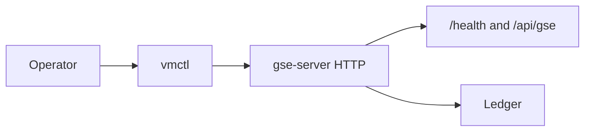

# vmctl HTTP Client

Feature Name: gse-cli
Updated: 2026-09-11

## Description

新增一次性 CLI 二进制 `vmctl`，用 HTTP 调用 gse-server 的 `/health`、Host/Agent 只读接口、作业提交/查询/重做，并支持 `--wait` 轮询终态。随 musl 发布包分发，安装与进程管理语义对齐 `dpc`。

## Architecture



`vmctl` 只做 HTTP 客户端。Agent 在线状态、作业下发与执行仍由 gse-server 与 gse-agent 完成。`vmctl` 不建立 geminio TCP、不读 `gse-agent.toml`。

命令到 HTTP 的映射：

| 命令 | 方法与路径 |
| --- | --- |
| `health` | `GET /health` |
| `hosts list` | `GET /api/gse/hosts` |
| `hosts get <host_id>` | `GET /api/gse/hosts/{host_id}` |
| `agents list` | `GET /api/gse/agents` |
| `agents get <agent_id>` | `GET /api/gse/agents/{agent_id}` |
| `jobs list` | `GET /api/gse/jobs` |
| `jobs get <job_id>` | `GET /api/gse/jobs/{job_id}` |
| `jobs submit` | `POST /api/gse/jobs` |
| `jobs rerun <job_id>` | `POST /api/gse/jobs/{job_id}/rerun` |
| `--wait` | 提交成功后循环 `GET /api/gse/jobs/{job_id}` |

## Components and Interfaces

### bins/vmctl

新 workspace member，布局对齐 `bins/dpc`：

- `src/main.rs`：clap 入口、退出码映射、读写标准流。
- `src/lib.rs`：URL 拼接、HTTP 调用、Script File 读取、Wait 轮询，供单元测试直接调用。

全局参数：

- `--url`：Base URL，默认 `http://127.0.0.1:7101`，去尾部 `/` 再拼接路径。
- 不发送鉴权头。
- `https` 使用 rustls（ureq 默认 TLS），CA 用 webpki-roots，避免 musl 静态链接依赖 OpenSSL。

子命令：

- `health`
- `hosts list` / `hosts get <host_id>`
- `agents list` / `agents get <agent_id>`
- `jobs list [--agent-id] [--status] [--limit]`
- `jobs get <job_id>`
- `jobs submit --agent-id <id> --script-file <path> [--interpreter] [--arg] [--env KEY=VAL] [--working-dir] [--timeout-secs] [--wait]`
- `jobs rerun <job_id> [--agent-id] [--interpreter] [--script-file] [--arg] [--env KEY=VAL] [--working-dir] [--timeout-secs] [--wait]`

`jobs submit` 的 `--agent-id` 与 `--script-file` 必填。`interpreter` 省略时 JSON 省略该字段，由 gse-server 填默认值。`jobs rerun` 未给出的覆盖字段不进请求体；无任何覆盖时 POST 空 body。

HTTP 客户端复用 `ureq` 2（与 `dpc` 相同），超时：连接 10 秒、读 30 秒。Wait 轮询间隔 1 秒、时限 300 秒，从第一次 GET 前起算。

### 打包与安装

- `Cargo.toml` workspace `members` 增加 `bins/vmctl`。
- `packaging/build-package.sh` 的 `COMPONENTS` 增加 `vmctl`。
- `install.sh` 接受 `vmctl`，`all` 包含 `vmctl`，按一次性 CLI 安装（无 systemd unit）。
- `ctl.sh` 对 `vmctl` 的管理动作非零退出，提示与 `dpc` 相同语义。

## Data Models

提交体与 gse-server `JobSubmit` 对齐：

```json
{
  "agent_id": "agent-1",
  "interpreter": "bash",
  "script": "echo ok",
  "args": ["--flag"],
  "env": {"LANG": "C"},
  "working_dir": "/tmp",
  "timeout_secs": 300
}
```

省略的可选字段不出现在 JSON 中。`script` 为 Script File 的完整文件内容（UTF-8）。

重做体与 `RerunRequest` 对齐，字段全部可选。`--script-file` 存在时填 `script`。

成功路径把服务端响应正文原样写到 stdout。Wait 结束时写最后一次作业 JSON。

## Correctness Properties

- Base URL 与路径拼接后为 `{base}/health` 或 `{base}/api/gse/...`，无双斜杠、无丢失前缀。
- v1 只发出需求列出的 GET/POST；不调用 Host/Agent 写接口、不调用 job-templates。
- `--wait` 省略时 submit/rerun 在 2xx 后立即退出 0。
- `--wait` 启用时终态 `succeeded` 退出 0；`failed`/`rejected`/`lost` 退出 1；作业 `timeout` 或 300 秒仍未终态退出 2。
- 4xx/5xx 与连接失败退出 1，正文或错误写 stderr。
- Script File 读失败退出 1，不发 POST。

## Error Handling

| 场景 | stdout | stderr | 退出码 |
| --- | --- | --- | --- |
| 2xx 且无 Wait | 响应 JSON | 空 | 0 |
| Wait 且 `succeeded` | 作业 JSON | 空 | 0 |
| 4xx/5xx | 空 | 响应正文 | 1 |
| 连接失败 / `--script-file` 不可读 | 空 | 错误文本 | 1 |
| Wait 且 `failed`/`rejected`/`lost` | 作业 JSON | 空 | 1 |
| Wait 且作业 `timeout` 或等待满 300 秒 | 作业 JSON | 空 | 2 |

clap 参数错误沿用 clap 默认（非零退出、帮助写 stderr）。

## Test Strategy

- URL 拼接：`http://127.0.0.1:7101` 与带尾斜杠的 Base URL 都得到 `/api/gse/agents`。
- Script File：读到完整内容；缺失文件返回错误。
- 退出码：用内存/本地 HTTP stub 覆盖 2xx、404、连接拒绝、Wait 终态与 300 秒超时（测试里把时限注入为毫秒级）。
- 命令映射：stub 记录 method+path+query+body，断言 submit/rerun/list 过滤器。
- 打包：`build-package.sh --bin-dir` 钩子目录补上 `vmctl` 可执行文件后，产物含 `vmctl/bin/vmctl`；`install.sh vmctl` 可安装；`ctl.sh vmctl start` 非零退出。

## References

[^1]: (Filename) - 需求文档 `.monkeycode/specs/gse-cli/requirements.md`
[^2]: (Filename#L73) - gse-server 路由 `crates/gse-server-core/src/http.rs`
[^3]: (Filename) - JobSubmit `crates/gse-server-core/src/server.rs`
[^4]: (Filename) - RerunRequest `crates/gse-server-core/src/rerun.rs`
[^5]: (Filename) - dpc 入口 `bins/dpc/src/main.rs`
[^6]: (Filename) - 打包脚本 `packaging/build-package.sh`
