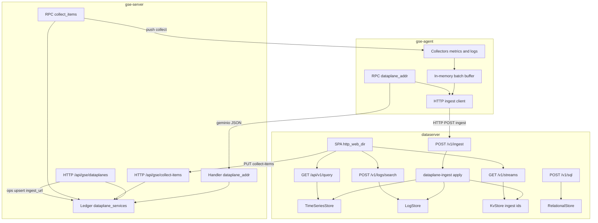
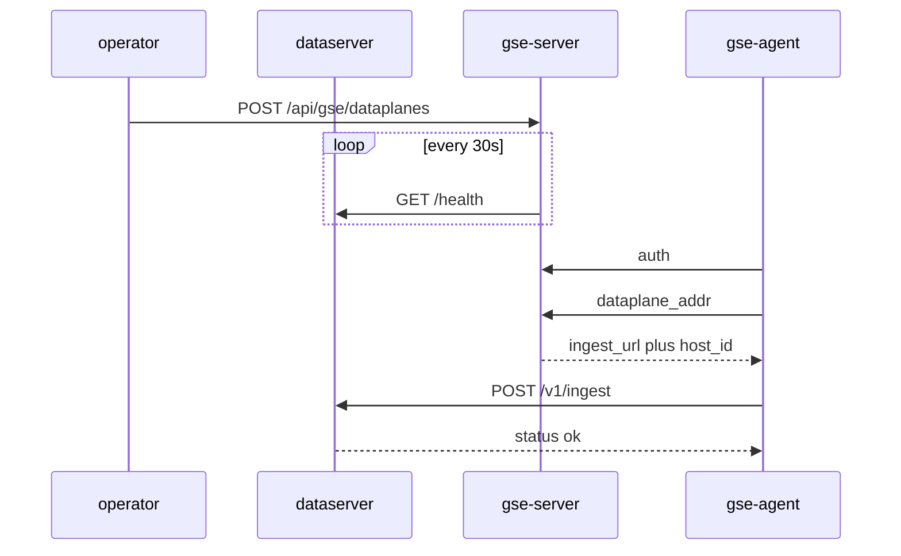
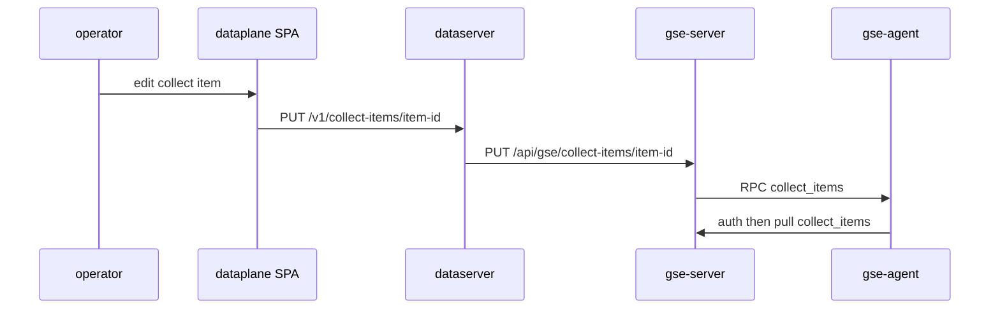

# dataserver 采集接入与查询

Feature Name: gse-dataplane-ingest
Updated: 2026-09-12

## Description

打通 Agent 采集到 dataserver 查询的路径。运维在 GSE Server 手工登记数据面 `ingest_url`；GSE 定期 `GET {ingest_url}/health` 探活；Agent 向 GSE 拉地址后直连 `dataserver` 写入批次。查询与采集链路由 dataserver 自带前端完成。采集以「采集项」为单位在该前端新建/编辑，写入 GSE sqlite，再经 RPC 下发 Agent。`dataserver` 不向 GSE 自登记。

v1 可运行采集项：`metrics_host`、`log_file`（单层路径 glob）、`log_k8s_stdout`（精确 namespace + Pod 名 glob，走 Kubernetes pod log API，对齐 `kubectl logs`）。每项含开始标记、攒批、清洗、保存周期（缺省 1 天）。APM / eBPF 只接入信封并按日志存储查询。可靠性：内存批次缓冲（默认上限 1000 条，重启丢失）、确认后丢弃、失败退避重试、缓冲满丢最旧；`record_id` 在 KvStore 去重。

现有 `bins/apiserver` 重命名为 `bins/dataserver`（Cargo package `dataserver`），SQL HTTP 与 Prom 查询保留，并增加接入、日志检索、流索引、保存周期清理与前端托管。无采集项则 Agent 不采集。

## Architecture



选路与写入分离：控制面 geminio 只传地址；采集字节走 Agent → dataserver HTTP。





crate 依赖只向下：`gse-agent-core` 依赖 `gse-proto` 与 `dataplane-ingest`（仅 DTO + HTTP 客户端，不打开本地引擎）；`dataserver` 依赖 `dataplane-ingest` 与五类存储 crate；`gse-server-core` 依赖 `gse-proto` 与 ledger sqlite。

## Components and Interfaces

### Workspace 变更

| 路径 | 职责 |
| --- | --- |
| `bins/dataserver` | 由 `bins/apiserver` 重命名；接入、SQL、Prom、日志检索、流索引、静态前端、采集项反代、保存周期清理 |
| `frontend/apps/dataplane` | `@vectorman/dataplane` Vite 应用：链路、指标、日志三页 |
| `crates/dataplane-ingest` | 信封 DTO、接入落盘、日志检索请求映射、record_id 去重 |
| `crates/gse-proto` | 新增 `DataplaneAddrRequest` / `DataplaneAddrReply`、`CollectItem`、`CollectItemsReply` |
| `crates/gse-server-core` | 表 `dataplane_services`、`collect_items`、HTTP 纳管、RPC `dataplane_addr` 与 `collect_items` |
| `crates/gse-agent-core` | 采集项运行时、文件 glob、K8s stdout、批次缓冲、拉地址、HTTP 上报 |
| `bins/dpc` | 新增 `logs` 子命令打 `POST /v1/logs/search`；默认 `--sql-url` 仍指向 8081 |

`apiserver` 名称不再出现在 workspace members 与打包脚本中。

### crates/dataplane-ingest

信封与记录用 serde JSON，字段名 snake_case。

```rust
DataEnvelope {
  batch_id: String,
  data_type: DataType, // metrics | logs | apm | ebpf
  data_id: String,
  agent_id: String,
  host_id: String,     // 可空
  sent_at_micros: i64,
  records: Vec<Value>, // 按 data_type 再反序列化
}

IngestReply {
  batch_id: String,
  accepted: u32,
  status: String, // ok | partial
  failures: Vec<RecordFailure>, // status=partial 时
}

RecordFailure { record_id: String, code: String, message: String }
```

`apply(envelope, ts, log, kv) -> Result<IngestReply, DataplaneError>`：

1. 校验 `data_type`、`agent_id`、`records` 非空。
2. 按类型解析每条记录；字段缺失记入 `failures`，继续下一条。
3. 去重键 `ingest/{record_id}`：`KvStore.exists` 为真则计入 `accepted` 且跳过写入。
4. `metrics`：`TimeSeriesStore.write(TsPoint { measurement, tags, field_name, field_value, timestamp })`；tags 合并信封的 `agent_id`、`data_id`（作为 `item_id`）、非空 `host_id`。
5. `logs` / `apm` / `ebpf`：映射为 `LogRecord` 后 `LogStore.append`；`LogRecord.id = record_id`。
6. 写入成功后 `KvStore.set(ingest/{record_id}, [])`。
7. 全部合法且无失败：`status=ok`。存在失败：`status=partial`。整批无法解析：返回 `invalid_argument`，调用方给 HTTP 400。
8. `accepted > 0` 时 upsert KvStore 键 `stream/{agent_id}/{data_type}/{data_id}`，值为 JSON `{"last_seen_micros": sent_at_micros, "accepted": n}`（`n` 为本批 accepted，覆盖写入最近一次即可）。

日志映射：

| data_type | level | message | 额外 labels |
| --- | --- | --- | --- |
| logs | 记录 `level` | 记录 `message` | `source` |
| apm | `status`（空则 `info`） | `{service} {operation} {duration_micros}us` | `trace_id` `span_id` `parent_span_id` `service` `operation` `duration_micros` `status` |
| ebpf | `info` | 记录 `message` | `event_type` `pid` `process_name` |

公共 labels（覆盖同名）：`data_type`、`agent_id`、`data_id`，以及非空 `host_id`。

`search(log, query) -> Vec<LogRecord>`：把 HTTP 过滤条件编成 `LogFilter`。扩展 `LogFilter` 增加 `limit: usize`（默认 100，上限 1000）；实现侧在 tantivy `TopDocs` 使用该值。当前 `labels` 以 `labels_json` 存储且未建索引，`trace_id` / `event_type` / `data_type` 等 label 条件是在取回 `TopDocs` 之后在应用层 post-filter 的，因此命中条数受 `MAX_LIMIT`（1000）扫描上限约束，只适合「过滤少量结果」，不适合「按 `trace_id` 取回一个 trace 的全部 span」。该缺陷与修复方案（索引字段提升 + `search_indexed` + 索引版本 v2）见 `/.monkeycode/specs/observability-data-model/design.md` 的「LogStore 索引版本 v2」，由 `apm-tracing` 实现。

`LogStore` 增加 `delete_matching(filter) -> u64`：按时间上界与 labels（至少 `data_id`）删除。dataserver 每小时拉一次 `collect_items`，对每项用 `retention_days` 调用删除；指标页默认 `query_range` 窗口不超过该周期。

### bins/dataserver

启动顺序：读配置 → 建数据路径 → 初始化五引擎 → 装配 `NoopAuth` → 绑定 SQL 口与 Prom 口 → stdout 一行 `sql_http=... prom_http=...`。不连接 GSE。

SQL 口（默认 `0.0.0.0:8081`）新增：

| 方法 | 路径 | 说明 |
| --- | --- | --- |
| POST | `/v1/ingest` | 请求体 `DataEnvelope`，响应 `IngestReply` |
| POST | `/v1/logs/search` | 见下方 JSON |
| GET | `/v1/streams` | 扫描 `stream/` 前缀，返回流列表 |
| GET | `/api/v1/query` | 与 Prom 口同一处理器，供前端同源查询 |
| GET | `/api/v1/query_range` | 同上 |

保留：`GET /health`、`POST /v1/sql`。原 Prom 口 `:9090` 继续监听。配置 `http_web_dir` 时，未匹配 API 的 GET 走 `ServeDir` + SPA 回退 `index.html`（实现对齐 gse-server）。

`GET /v1/streams` 响应：

```json
{
  "streams": [
    {
      "agent_id": "agent-1",
      "data_type": "metrics",
      "data_id": "host",
      "last_seen_micros": 1710000000000000,
      "accepted": 2
    }
  ]
}
```

键解析：`stream/{agent_id}/{data_type}/{data_id}`；`data_id` 可含 `/`，取第一段后为 `agent_id`，第二段为 `data_type`，其余为 `data_id`。

`POST /v1/logs/search` 请求：

```json
{
  "data_type": "logs",
  "agent_id": "agent-1",
  "host_id": null,
  "data_id": null,
  "from_ts": 0,
  "to_ts": 0,
  "level": null,
  "message_query": "error",
  "trace_id": null,
  "event_type": null,
  "labels": {},
  "limit": 100
}
```

未出现或 JSON `null` 的过滤字段不过滤。`from_ts` > `to_ts`（两者都有值）返回 HTTP 400。响应 `{"records":[...]}`，每条含 `id` `timestamp` `level` `message` `labels`。

配置增加：

| 项 | 环境变量 |
| --- | --- |
| `http_web_dir` | `DATASERVER_HTTP_WEB_DIR` |
| `gse_admin_url` | `DATASERVER_GSE_ADMIN_URL`（例如 `http://127.0.0.1:7101`） |

打包时把 `@vectorman/dataplane` 的 `dist` 放到 dataserver 的 `web/`。`gse_admin_url` 未配置时，采集项读写返回 `unavailable`。

采集项反代（SQL 口）：

| 方法 | 路径 | 转发 |
| --- | --- | --- |
| GET | `/v1/collect-items` | `GET {gse_admin_url}/api/gse/collect-items` |
| GET | `/v1/collect-items/{item_id}` | `GET .../collect-items/{item_id}` |
| PUT | `/v1/collect-items/{item_id}` | `PUT .../collect-items/{item_id}` |
| POST | `/v1/collect-items` | `POST .../collect-items` |
| DELETE | `/v1/collect-items/{item_id}` | `DELETE .../collect-items/{item_id}` |
| GET | `/v1/agents` | `GET {gse_admin_url}/api/gse/agents` |

### frontend/apps/dataplane

独立 Vite 应用 `@vectorman/dataplane`，由 dataserver SQL 口同源托管。复用 `@vectorman/primitives` 与 `@vectorman/adapters` 的 HttpClient；页面不挂进 `@vectorman/console`。

路由：

| 路径 | 页 | 行为 |
| --- | --- | --- |
| `/` | 采集链路 | `GET /v1/collect-items` 左连 `GET /v1/streams`（`data_id=item_id`）；列：名称、类型、目标 Agents、启用开关、last_seen、accepted；工具栏「新建采集项」+ 手动刷新；行内删除需确认 |
| `/metrics` | 指标 | 时间范围 + `agent_id`，默认两图 `cpu_usage`、`mem_usage`（`query_range`）；可展开 PromQL 输入，提交后同一接口查自定义表达式 |
| `/logs` | 日志 | 表单：data_type 下拉 `logs`/`apm`/`ebpf`（默认 `logs`）、agent_id、data_id、level、关键词、时间、limit；`POST /v1/logs/search`；结果列表 |

行操作：

| 操作 | 行为 |
| --- | --- |
| 新建 / 编辑 | 抽屉表单：名称、多选 `agent_ids`（`GET /v1/agents`）、类型、启用、采集端（路径 glob，或 namespace + Pod 名 glob + 可选容器名 + 可选 kubeconfig、开始标记、批次上限、上报间隔、清洗 include/exclude 正则、提取规则列表）、入库保存周期（天，缺省 1）。新建 `POST`，编辑 `PUT` |
| 查看详情 | 抽屉只读：采集项全部字段 + 最近接入 |
| 数据检索 | `metrics_host` → `/metrics?agent_id=&data_id=`；`log_file`/`log_k8s_stdout` → `/logs?agent_id=&data_id=&data_type=logs` |
| 启用开关 | `PUT` 只改 `enabled`；false 时 Agent 停该采集器，已入库数据可查，保存周期继续 |
| 删除 | 确认后 `DELETE /v1/collect-items/{item_id}`；链路表立刻少该行；已入库数据仍可在指标/日志页检索，直到保存周期清理 |

指标页与日志页工具栏提供「查询/刷新」按钮，无定时器。

开发态 Vite `server.proxy`：`/v1`、`/api`、`/health` → `http://127.0.0.1:8081`；`allowedHosts` 含 `.monkeycode-ai.online`。

`npm run build:dataplane` 产出 `frontend/apps/dataplane/dist`。

### GSE Server 纳管

sqlite 新表：

```sql
CREATE TABLE IF NOT EXISTS dataplane_services (
  service_id     TEXT PRIMARY KEY,
  ingest_url     TEXT NOT NULL,
  query_url      TEXT NOT NULL,
  status         TEXT NOT NULL DEFAULT 'unknown',
  last_seen_at   TEXT,
  registered_at  TEXT NOT NULL
);
```

`Ledger` 增加：`upsert_dataplane`、`list_dataplanes`、`get_dataplane`、`delete_dataplane`、`set_dataplane_status`、`pick_ingest_url(agent_id)`。

选路：取出全部 `status=online`，按 `service_id` 字典序排序，`idx = hash(agent_id) % len`（Rust `DefaultHasher` 对 `agent_id` 字节做一次），返回该条 `ingest_url`。online 集合变化时同一 Agent 允许换实例。空集合返回无地址。

探活任务（独立于 Agent liveness，默认 30s）：对每条登记记录 `GET {ingest_url}/health`，超时 3s。HTTP 200 且 body `{"status":"ok"}` → `online` 并写 `last_seen_at`；其它结果 → `offline`。新登记为 `unknown`，第一次探活前不被 `pick_ingest_url` 选中。

GSE 配置新增 `dataplane_probe_interval_secs`（默认 30），环境变量 `GSE_DATAPLANE_PROBE_INTERVAL`。

HTTP（均在 `/api/gse` 下）：

| 方法 | 路径 | 说明 |
| --- | --- | --- |
| GET | `/dataplanes` | 列表 |
| POST | `/dataplanes` | 运维登记/upsert，必填 `service_id` `ingest_url` `query_url`；写入后 `status=unknown`，等探活 |
| DELETE | `/dataplanes/{service_id}` | 删除登记 |
| GET | `/dataplanes/{service_id}` | 单条 |

| GET | `/collect-items` | 列表，可选 `?agent_id=` |
| POST | `/collect-items` | 新建，服务端生成 `item_id` |
| GET | `/collect-items/{item_id}` | 无行 404 |
| PUT | `/collect-items/{item_id}` | upsert 后向 `agent_ids` 中所有在线 Agent RPC `collect_items` |
| DELETE | `/collect-items/{item_id}` | 删除后同样下发剩余列表 |

`dataserver` 不调用 dataplanes 接口；采集项经 `gse_admin_url` 调 collect-items。运维把 Agent 能访问的 `ingest_url`（例如 `http://10.0.0.5:8081`）登记进 GSE；GSE 探活成功后 Agent 才能拉到该地址。

sqlite 表 `collect_items`：

```sql
CREATE TABLE IF NOT EXISTS collect_items (
  item_id TEXT PRIMARY KEY,
  agent_ids TEXT NOT NULL,
  name TEXT NOT NULL,
  kind TEXT NOT NULL,
  enabled INTEGER NOT NULL DEFAULT 1,
  collector_json TEXT NOT NULL,
  storage_json TEXT NOT NULL,
  updated_at TEXT NOT NULL
);
```

`kind`：`metrics_host` | `log_file` | `log_k8s_stdout`。

`collector_json` 按 kind：

```json
{
  "interval_secs": 15,
  "path_patterns": ["/var/log/app*.log"],
  "namespace": "default",
  "pod_name_pattern": "nginx-*",
  "container": "",
  "kubeconfig": "",
  "start_mode": "tail",
  "start_n": 0,
  "batch_max_records": 100,
  "flush_interval_secs": 5,
  "clean": {
    "include_regex": null,
    "exclude_regex": null,
    "extract": [
      { "kind": "regex", "expr": "user=(\\w+)", "label": "user" },
      { "kind": "json", "expr": "trace_id", "label": "trace_id" }
    ]
  }
}
```

`agent_ids` 为 JSON 字符串数组，至少 1 个。`metrics_host` 用 `interval_secs`；`log_file` 用 `path_patterns`（单层 glob，`*` 不跨目录）；`log_k8s_stdout` 用必填精确 `namespace`、`pod_name_pattern`、可选精确 `container`（空=该 Pod 全部容器）、可选 `kubeconfig`。日志类共用开始标记、攒批、清洗。

清洗顺序：include/exclude 正则 → extract。`regex` 把第一捕获组写入 `labels[label]`；`json` 把行解析为 JSON 后按点分路径（`a.b`）取值写入 label。某条规则未命中则跳过该规则，行仍上报。

`storage_json`：`{"retention_days": 1}`，缺省 1 天。

RPC 方法名 `dataplane_addr`（Agent → Server）：

```rust
DataplaneAddrRequest { agent_id: String }
DataplaneAddrReply {
  ok: bool,
  ingest_url: Option<String>,
  host_id: Option<String>,
  reason: Option<String>,
}
```

处理：连接必须已认证且 `agent_id` 与会话一致；`pick_ingest_url(agent_id)`；从 `agents` 表读 `host_id`。无 online 实例：`ok=false`，`reason` 说明，Agent 侧视为 `unavailable`。

RPC 方法名 `collect_items`（Server → Agent 下发整表；Agent → Server 拉取空 body）：

```rust
CollectItemsReply { items: Vec<CollectItem> }
CollectItem {
  item_id: String,
  agent_ids: Vec<String>,
  name: String,
  kind: String,
  enabled: bool,
  collector: serde_json::Value,
  storage: serde_json::Value,
}
```

Agent `call("collect_items")`：Server 返回 `agent_ids` 包含该 Agent 的采集项（可空）。保存后向列表中每个在线 Agent 各推一份过滤后的列表。Agent 热更新，按 `item_id` 对齐运行中的采集器。

### gse-agent 采集与上报

认证成功后立刻 `call("dataplane_addr")` 与 `call("collect_items")`。之后：本地尚无 `ingest_url`、或 ingest HTTP 得到 `unavailable` / 连接失败超过 3 次，再次拉地址。

Agent 本地 TOML 只含进程项（`server_addr`、`agent_id`、`token`、心跳、作业）。采集运行时状态为内存中的采集项列表；启动到第一次拉取前列表为空，不采集。

`log_file`：每个 `path_patterns` 做 glob，命中文件独立跟踪。某路径当前不存在：stderr 一行 `log path missing: ...`，该周期跳过，下一轮再匹配。清洗见上。信封 `data_id = item_id`。

`log_k8s_stdout`：对齐 `kubectl logs`（Kubernetes pod log API，不是读节点文件）。

1. 凭证：存在 in-cluster ServiceAccount 则用之；否则读 `kubeconfig`（空则 `~/.kube/config`）。
2. `GET /api/v1/namespaces/{namespace}/pods`，`metadata.name` 用 `pod_name_pattern` glob 过滤。
3. 对每个命中 Pod：`container` 非空则只跟该容器；空则对该 Pod spec 里每个 container 各开一条 follow。
4. `GET /api/v1/namespaces/{ns}/pods/{pod}/log?follow=true&container={c}&tailLines={n}`。`start_mode=tail` 且 `start_n>=1` 时 `tailLines=start_n`；`tail`+`0` 不传 `tailLines`（只跟新）。`head` 不传 `tailLines`，从 API 当前返回的流起点读。
5. 按行切分后走同一套清洗与攒批。`source` = `{namespace}/{pod}/{container}`。
6. 断线指数退避重连同一 URL。
7. 每 30 秒重新 list：新匹配的 Pod/容器开 follow，不再匹配的停掉。

指标（Linux `/proc`；`cpu_usage` 第一轮只打快照不发点）：

| measurement | field_name | field_value | tags |
| --- | --- | --- | --- |
| `cpu_usage` | `value` | 两次 `/proc/stat` 聚合非 idle 占比 0–100 | `agent_id`，可选 `host_id` |
| `mem_usage` | `value` | `(MemTotal-MemAvailable)/MemTotal*100` | 同上 |

`record_id`：`{agent_id}:{item_id}:{measurement}:{tag_fingerprint}:{timestamp}`。同一轮 `cpu_usage` 与 `mem_usage` 各一条。信封 `data_id = item_id`。tags 含 `item_id`。`disk_usage` / `net_bytes` 列入后续范围。

日志：每个 path 独立跟踪。内存保存 `inode + offset`。按 `\n` 切行，不完整行留在读缓冲。

启动定位（配置 `start_mode` + `start_n`，默认 `tail` / `0`）：

| 模式 | `start_n` | 行为 |
| --- | --- | --- |
| `head` | `n >= 1` | 从第 n 行开始读（跳过前 n-1 个换行），读到 EOF 后跟随新增 |
| `head` | `n = 0` 或非法 | 视为 `n = 1`（文件第一行） |
| `tail` | `n = 0` | seek 到当前 EOF，不读已有行 |
| `tail` | `n >= 1` | 先发出当前文件最后 n 行，再跟随新增 |

文件行数不足 n：`head` 从第一行可读处开始；`tail` 发出全部已有行。轮转（inode 变）后对新文件使用同一套起点规则。`level` 用整行大小写无关匹配：`fatal`/`error`/`warn`/`warning`/`debug`/`info`，先命中先用，否则 `info`。`data_id` 为该 path 字符串。`record_id`：`{agent_id}:{path}:{inode}:{offset}`。

批次缓冲：`VecDeque<DataEnvelope>`，统计所有 `records.len()` 之和。入队前若将超过 `max_records`，弹出最旧批次直到能放下；每丢一个批次 stderr 一行 `drop oldest batch data_type=... records=N`。上报成功或 `partial` 弹出该批。失败：指数退避 1–60s 后重试同一批（队头）。进程重启缓冲清空（v1 不做 WAL）。

HTTP 上报：`POST {ingest_url}/v1/ingest`，`Content-Type: application/json`，超时 10s。2xx 且 JSON `status` 为 `ok` 或 `partial`：确认。HTTP 400：确认（整批非法，改采集侧）。HTTP 5xx / 超时 / 连接失败：可重试。HTTP 503 或 body `code=unavailable`：可重试并触发重新拉地址。

采集与作业、心跳并行：独立 tokio 任务，共用同一 `End` 只用于 `dataplane_addr`。

### dpc

```bash
dpc logs --data-type logs --agent-id agent-1 --query error --limit 50
```

向 `--sql-url` 发 `POST /v1/logs/search`，stdout 打印 JSON。

## Data Models

### dataplane_services 行

```text
DataplaneService {
  service_id: String,
  ingest_url: String,
  query_url: String,
  status: String,       // unknown | online | offline
  last_seen_at: Option<String>,
  registered_at: String,
}
```

不变量：`service_id` 主键幂等 upsert；`pick_ingest_url` 只看 `online`；探活失败立刻 `offline`。

### 指标记录 JSON

```json
{
  "record_id": "agent-1:cpu_usage:a1:1710000000000000",
  "timestamp": 1710000000000000,
  "measurement": "cpu_usage",
  "tags": {"agent_id": "agent-1"},
  "field_name": "value",
  "field_value": 12.5
}
```

### 日志记录 JSON

```json
{
  "record_id": "agent-1:/var/log/app.log:123:456",
  "timestamp": 1710000000000000,
  "level": "error",
  "message": "listen failed",
  "source": "/var/log/app.log",
  "labels": {}
}
```

APM / eBPF 记录字段与 requirements Requirement 3 一致；v1 Agent 不产出这两类。这两类的端到端设计（OTLP 接入、trace 存储与查询、eBPF 采集与聚合、拓扑合并）见 `/.monkeycode/specs/apm-tracing/` 与 `/.monkeycode/specs/ebpf-observability/`，共用数据模型见 `/.monkeycode/specs/observability-data-model/`。

## Correctness Properties

- 同一 `record_id` 两次 `apply` 后，Prom 与日志检索各自只多一条业务数据（第二次只打 KvStore 命中）。
- Agent 在 `status=ok` 或 `partial` 或 HTTP 400 之后丢弃该批次，队头下一批才能发送。
- 缓冲占用按记录条数计；丢弃单位是整批。
- `dataplane_addr` 在未认证连接上返回 `ok=false`。
- 多个 online dataserver 时，同一 `agent_id` 在同一 online 集合上得到同一 `service_id`。
- 控制面 `auth` / `heartbeat` / `exec` / `job_exec` 行为与现网一致。
- `cpu_usage` 第一轮只打快照；`mem_usage` 第一轮即可写入。
- 日志 `head:n` 从第 n 行起读；`tail:0` 从 EOF 起；`tail:n` 先回放末 n 行。
- 采集以 GSE `collect_items` 为准；无采集项则不采集；热更新后按下发列表对齐采集器。
- `enabled=false` 停采，数据可查；删除配置后数据留到原保存周期，清理任务读 `retain/{item_id}`。
- 链路页以采集项为行：开关、新建/编辑、详情、数据检索、删除确认。

## Error Handling

| 场景 | 行为 |
| --- | --- |
| 信封缺 `data_type` / `agent_id` / 空 records | HTTP 400，`code=invalid_argument`，Agent 丢弃该批 |
| 单条缺字段 | 写入合法条，`status=partial`，Agent 确认该批 |
| dataserver 不可达 / 超时 / 5xx | Agent 退避重试；连续 3 次后重新 `dataplane_addr` |
| 无 online 数据面 | RPC `ok=false`；Agent 继续采集入缓冲并周期性重拉 |
| 探活失败 | 该实例 `offline`，不再被选中；恢复后下一轮探活再变 `online` |
| 日志 path 不存在 | 该 path 本周期跳过并 stderr 一行，下周期重试打开，其它 path 继续 |
| `/proc` 读取失败 | 本轮该 measurement 不上报，其它 measurement 继续 |
| 缓冲满 | 丢最旧整批，stderr 含 `data_type` 与条数 |
| `gse_admin_url` 未配或 GSE 不可达 | 采集配置 API `unavailable`；接入与查询仍可用 |
| PUT 配置时 Agent 离线 | GSE 落库成功；Agent 下次认证拉取后生效 |

## Test Strategy

- `dataplane-ingest`：四类信封往返；缺字段 partial；重复 `record_id` 第二次不写 ts/log（tempdir 上真引擎）。
- `LogFilter.limit`：append 3 条，limit=1 只回 1 条。
- dataserver httptest：`POST /v1/ingest` metrics 后 `GET /api/v1/query?query=cpu_usage` 能命中；`POST /v1/logs/search` 按 `data_type` 过滤；`GET /v1/streams` 出现对应流。
- 前端包：链路页列出采集项并可新建；行内开关与删除确认；编辑抽屉含类型、glob、K8s API 字段、开始标记、清洗、保存周期；检索带 item_id。
- ledger：upsert 后 status=unknown；mock `/health` 成功后 `pick_ingest_url` 能命中；探活失败后 pick 为空。
- 选路：两个 online 实例，同一 `agent_id` 连续 pick 结果相同；只留一台时所有 agent 都落到该台。
- RPC：认证后拿到 ingest_url；未认证拒绝；无 online 返回 ok=false。
- Agent 缓冲：入队超限丢最旧；ok/partial/400 出队；5xx 不出队。
- 指标：用固定 `/proc` 样例夹具算 cpu/mem（单元测试注入，不读真实 /proc）。
- 日志起点：临时文件 5 行，`tail:0` 不发旧行；`tail:2` 先发最后 2 行；`head:3` 从第 3 行起到 EOF。截断轮转后按同一套起点规则采新文件。
- collect_items：PUT 后 GET 字段一致；在线 Agent 收到列表后 disabled 的项停止采集。
- glob：临时目录 `app-1.log` 匹配 `app-*.log` 被采到；`other.log` 不被采到。
- k8s stdout：mock apiserver list pods + log follow；`namespace=default` 且 `pod_name_pattern=nginx-*` 采到流；其它 namespace 的 Pod 不请求 log；`container` 指定时只打该 container 查询参数。
- 清洗：exclude_regex 命中的行不上报；regex 提取第一捕获组写入 labels；json 点分路径写入 labels。
- 多 Agent：一条采集项 `agent_ids=["a1","a2"]`，两台在线 Agent 都收到该项。
- dataserver 反代：mock GSE 后 `POST /v1/collect-items` 转发成功。
- 保存周期：写入旧时间戳日志后跑清理，search 不再命中。删除采集项后仍按 `retain/` 到期清理。
- 集成：起 gse-server + dataserver + agent，经前端 API 打开 metrics，Prom 查到带 `agent_id` 的 `cpu_usage`。

不测 APM/eBPF 采集器。跨进程并发写同一 `data_path` 仍由调用方保证。

## References

[^1]: Requirements - 当前工作区 `/.monkeycode/specs/gse-dataplane-ingest/requirements.md`
[^2]: 存储层设计 - 当前工作区 `/.monkeycode/specs/dataplane-layered-storage/design.md`
[^3]: GSE 会话与 RPC - 当前工作区 `/.monkeycode/specs/gse-server-agent/design.md`
[^4]: 台账 HTTP - 当前工作区 `crates/gse-server-core/src/http.rs`
[^5]: 共享可观测数据模型 - 当前工作区 `/.monkeycode/specs/observability-data-model/design.md`
[^6]: APM trace 采集与查询 - 当前工作区 `/.monkeycode/specs/apm-tracing/design.md`
[^7]: eBPF 可观测采集 - 当前工作区 `/.monkeycode/specs/ebpf-observability/design.md`
| DELETE | `/v1/collect-items/{item_id}` | `DELETE .../collect-items/{item_id}` |
| GET | `/v1/agents` | `GET {gse_admin_url}/api/gse/agents`（前端多选 Agent） |
`DELETE` 先读该项 `retention_days`，写入 KvStore `retain/{item_id}` = JSON `{"until_micros": now + days}`，再转发 GSE。清理任务扫描 live `collect_items` 与 `retain/` 前缀：对每个 `item_id` 删除 `timestamp < now - retention`（live）或 `timestamp < until_micros`（已删项）的日志；到期后删 `retain/` 键。停用（`enabled=false`）不写 `retain/`，该项仍在 live 列表里按 `retention_days` 清理。
