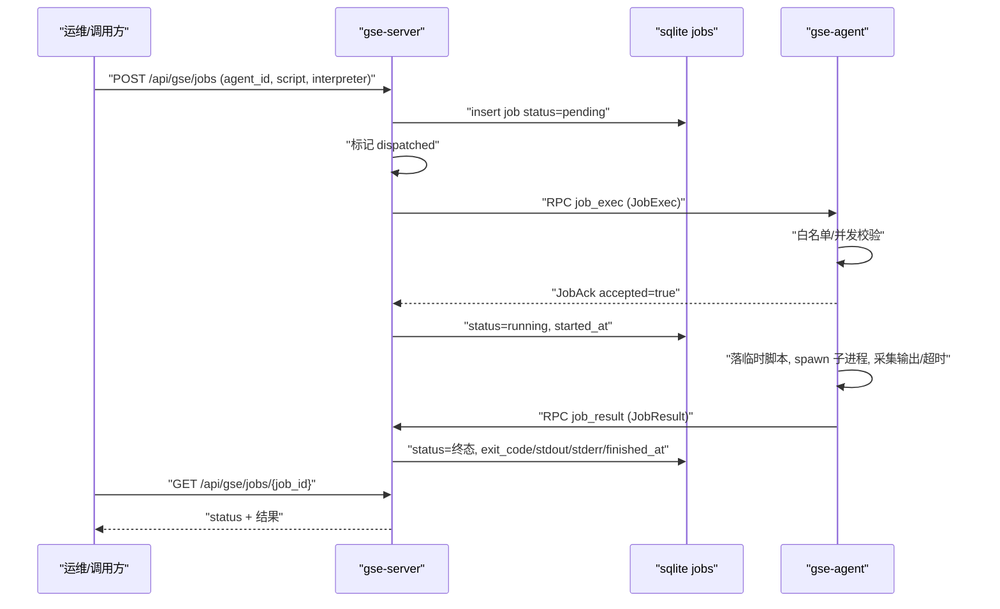
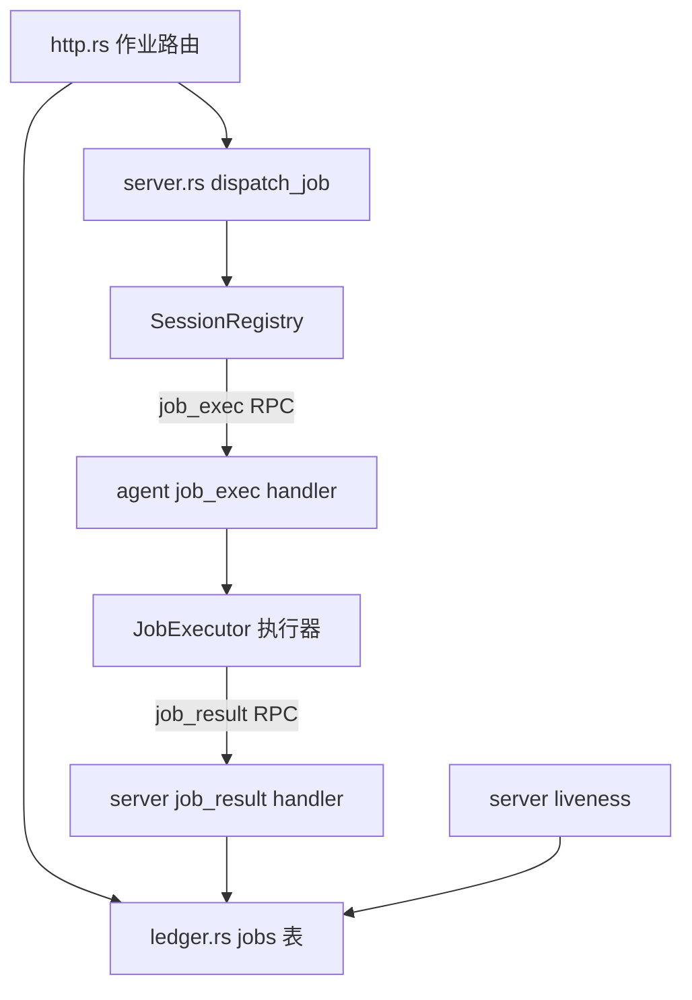
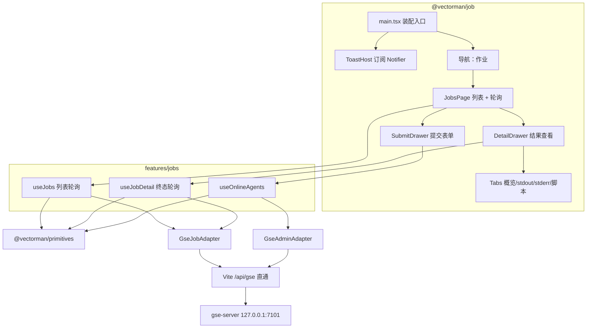

# GSE 作业脚本下发与执行协议

Feature Name: gse-job-execution
Updated: 2026-09-10

## Description

在既有 GSE 会话通道（认证、心跳、双向 RPC）之上，新增「异步作业」协议层：Server 受理作业提交、落库并下发内联脚本；Agent 以指定解释器执行脚本、采集输出与退出码；Agent 完成后经回传通道写回结果；发起方轮询查询。配套交付 `@vectorman/job` 作业平台前端。

v1 范围：

- 异步提交 + 轮询查询，无服务端推送。
- 脚本内联下发，解释器白名单 bash / sh / python3。
- 完整结果采集（退出码、信号、stdout、stderr、截断标记、起止时间）。
- 以执行超时作为唯一终止手段，不提供取消接口。
- 作业记录持久化到 sqlite `jobs` 表，Server 重启与 Agent 离线均有一致归宿。
- 作业平台前端 `@vectorman/job`：提交表单、列表跟踪、结果查看。

非目标（后续版本候选）：作业取消、实时流式输出、作业重试、cron 定时、作业依赖编排、Agent 端脚本库、多用户与权限控制。

## Architecture

### 作业全链路



### 状态机

```mermaid
stateDiagram-v2
    [*] --> "pending"
    "pending" --> "dispatched": "下发调用"
    "dispatched" --> "running": "ack accepted"
    "dispatched" --> "rejected": "ack rejected"
    "dispatched" --> "lost": "rpc error/timeout"
    "pending" --> "lost": "agent offline/restart"
    "dispatched" --> "lost": "agent offline/restart"
    "running" --> "succeeded": "exit_code = 0"
    "running" --> "failed": "非零退出/spawn 失败"
    "running" --> "timeout": "执行超时"
    "running" --> "lost": "agent offline/restart"
    "succeeded" --> [*]
    "failed" --> [*]
    "timeout" --> [*]
    "rejected" --> [*]
    "lost" --> [*]
```

终态：`succeeded`、`failed`、`timeout`、`rejected`、`lost`。终态记录不再变更。

### 组件关系



## Components and Interfaces

### crates/gse-proto（新增 DTO）

新增作业相关 DTO，序列化沿用 serde_json。既有 `Command` / `Receipt` 保留给通用指令与 `ping`，作业使用独立 RPC 方法，避免语义混叠。

```rust
/// 作业终态/中间态，serde snake_case。
pub enum JobStatus {
    Pending, Dispatched, Running,
    Succeeded, Failed, Timeout, Rejected, Lost,
}

/// Server → Agent：一次作业下发。
pub struct JobExec {
    pub job_id: String,
    pub interpreter: String,
    pub script: String,
    pub args: Vec<String>,
    pub env: std::collections::BTreeMap<String, String>,
    pub working_dir: Option<String>,
    pub timeout_secs: u64,
    pub stdout_limit_bytes: u64,
    pub stderr_limit_bytes: u64,
}

/// Agent → Server：受理应答（job_exec 的返回值）。
pub struct JobAck {
    pub job_id: String,
    pub accepted: bool,
    pub reason: Option<String>,
}

/// Agent → Server：执行终态回传。
pub struct JobResult {
    pub job_id: String,
    pub status: JobStatus,
    pub exit_code: Option<i32>,
    pub signal: Option<i32>,
    pub stdout: String,
    pub stdout_truncated: bool,
    pub stderr: String,
    pub stderr_truncated: bool,
    pub started_at_micros: i64,
    pub finished_at_micros: i64,
    pub error: Option<String>,
}
```

新增稳定错误码字符串（复用 `GseError` 承载）：`invalid_argument`、`unavailable`、`not_found`、`busy`、`interpreter_not_allowed`、`spawn_failed`、`rpc_error`。

### RPC 方法表（geminio）

| 方向 | 方法 | 请求 | 应答 |
| --- | --- | --- | --- |
| Server → Agent | `job_exec` | `JobExec` | `JobAck` |
| Agent → Server | `job_result` | `JobResult` | 空 Bytes |
| Server → Agent | `exec`（既有） | `Command` | `Receipt` |
| Agent → Server | `auth` / `heartbeat`（既有） | `AuthRequest` / `Heartbeat` | `AuthReply` / 空 Bytes |

`job_exec` 的 RPC 只承载「受理」语义：受理应答在 Agent 启动子进程前返回，避免与执行时长绑定。执行结果经独立的 `job_result` 上行调用回传。

### gse-agent-core（执行器）

- `job_exec` handler：解析 `JobExec` → 校验解释器白名单、根用户策略、并发上限 → 返回 `JobAck`；受理成功后 spawn 执行任务，并在任务结束时调用 Server 的 `job_result`。
- `JobExecutor` 职责：
  - 落临时脚本：`{job_work_dir|temp_dir}/gse-jobs/{job_id}.{ext}`，扩展名按解释器映射（bash/sh → `.sh`，python3 → `.py`），文件权限 0700。
  - spawn：`Command::new(interpreter).arg(script_path).args(args)`，`current_dir` 取 `working_dir`，环境为 Agent 环境叠加 `env`。
  - 采集：并发读取 stdout 与 stderr；各自累计到上限后停止累积并继续排空管道，避免子进程写阻塞；置 `*_truncated=true`。
  - 超时：以 `tokio::time::timeout` 包裹等待；超时后先发 SIGTERM，宽限 5 秒后 SIGKILL，记录 `signal` 并将状态置 `timeout`。
  - 退出：`ExitStatus` 正常退出取 `exit_code`，`code()==0` → `succeeded`，否则 `failed`；被信号终止取 `signal`。
  - 清理：无论成功失败，删除临时脚本文件。
  - 并发：进程内 `Semaphore` 或互斥计数，容量 `max_concurrent_jobs`，达到上限时受理应答返回 `busy`。
- `job_result` 调用方：复用已认证会话的 `End`，将 `JobResult` 作为 `job_result` RPC 请求发送，应答忽略；发送失败仅记日志（服务端会经离线逻辑兜底置 `lost`）。

### gse-server-core/server.rs（作业调度）

- `submit_job(agent_id, JobExec 参数) -> Result<JobRecord>`：校验在线会话 → 生成 job_id（单调序号 + 时间戳，见数据模型）→ 落库 `pending` → 下发。
- `dispatch_job(job_id)`：
  1. 读取会话 `End`，无会话或非 Online → 落库 `lost`（`unavailable`）。
  2. 落库 `dispatched`，`end.call("job_exec", JobExec)`，超时取 `timeout_secs + 10s`。
  3. 应答 `JobAck{accepted:true}` → 落库 `running`，`started_at` 取 Agent 回报（见下）。
  4. 应答 `JobAck{accepted:false}` → 落库 `rejected` + `error=reason`。
  5. RPC 错误/超时 → 落库 `lost`。
- `handle_job_result`：查询会话绑定的 agent_id，校验 `job.agent_id` 一致 → 若作业已终态则忽略 → 落库终态并刷新会话 `last_seen`。
- 离线兜底：`run_liveness` 检测会话进入 `Offline` 时，将该 agent 的 `pending`/`dispatched`/`running` 作业批量置 `lost`。
- `started_at` 由 Agent 在 `JobResult.started_at_micros` 回传；`running` 阶段先记 `dispatched` 时间，收到结果后以 Agent 时间为准覆盖用于审计展示。

### crates/gse-server-core/ledger.rs（jobs 表）

新增 `jobs` 表与 API：`insert_job`、`get_job`、`list_jobs(agent_id, status, limit)`、`mark_running`、`finish_job`、`mark_rejected`、`mark_lost_by_agent`、`mark_lost_inflight_on_startup`。所有写操作走自然键 `job_id` 幂等，终态写使用 `WHERE status NOT IN (终态)` 保证不可变。

### crates/gse-server-core/http.rs（作业接口）

在 `/api/gse` 前缀下新增：

| 方法 | 路径 | 说明 |
| --- | --- | --- |
| POST | `/api/gse/jobs` | 提交作业，201 返回作业记录（`pending`） |
| GET | `/api/gse/jobs` | 列表，支持 `?agent_id=&status=&limit=` |
| GET | `/api/gse/jobs/{job_id}` | 单作业详情，缺失 404 |

提交请求体：

```json
{
  "agent_id": "web-01",
  "interpreter": "bash",
  "script": "echo hello; exit 0",
  "args": ["-e"],
  "env": {"LANG": "C"},
  "working_dir": "/tmp",
  "timeout_secs": 300
}
```

HTTP 状态码映射：

| 场景 | HTTP | code |
| --- | --- | --- |
| 缺必填 / 解释器非法 / 超限 / 超时越界 | 400 | `invalid_argument` |
| 创建成功 | 201 | - |
| job_id 不存在 | 404 | `not_found` |
| Agent 非在线 | 409 | `unavailable` |
| 下发 RPC 失败 | 502 | `rpc_error` |
| 台账读写失败 | 500 | `query_failed` |

### 配置新增

gse-server（`crates/gse-server-core/src/config.rs`）：

| 配置项 | 默认值 | 环境变量 |
| --- | --- | --- |
| `jobs_enabled` | `true` | `GSE_SERVER_JOBS` |
| `job_default_timeout_secs` | `300` | `GSE_SERVER_JOB_TIMEOUT` |
| `job_max_timeout_secs` | `3600` | `GSE_SERVER_JOB_MAX_TIMEOUT` |
| `job_max_script_bytes` | `262144` | `GSE_SERVER_JOB_MAX_SCRIPT` |
| `job_stdout_limit_bytes` | `1048576` | `GSE_SERVER_JOB_STDOUT_LIMIT` |
| `job_stderr_limit_bytes` | `1048576` | `GSE_SERVER_JOB_STDERR_LIMIT` |

gse-agent（`crates/gse-agent-core/src/config.rs`）：

| 配置项 | 默认值 | 环境变量 |
| --- | --- | --- |
| `allowed_interpreters` | `["bash","sh","python3"]` | `GSE_AGENT_INTERPRETERS` |
| `job_default_interpreter` | `bash` | `GSE_AGENT_JOB_INTERPRETER` |
| `max_concurrent_jobs` | `1` | `GSE_AGENT_MAX_JOBS` |
| `job_work_dir` | 空（用系统临时目录） | `GSE_AGENT_JOB_WORK_DIR` |

Server 与 Agent 各自维护输出上限：Server 在下发时带上限，Agent 以此为准并以自身配置取较小值执行，双重约束。

## 作业平台前端（@vectorman/job）

### 定位与分层

`@vectorman/job` 复用 `@vectorman/primitives` 与 `@vectorman/adapters`，不新建数据层。页面只调业务 hooks；hooks 只调 `GseJobAdapter`（作业）与 `GseAdminAdapter`（取在线 Agent）；Ant Design 留在页面层。装配入口 `main.tsx` 独立构造内存会话、QueryStore 与 Notifier，不与 `node` / `console` 共享实例。



### 目录

```text
frontend/apps/job/
  package.json
  vite.config.ts
  tsconfig.json
  index.html
  src/
    main.tsx
    app/App.tsx                      # Layout + 导航 + ToastHost + Outlet
    app/ToastHost.tsx
    features/jobs/
      use-jobs.ts                    # 列表 + 轮询
      use-job-detail.ts              # 详情 + 终态轮询
      use-online-agents.ts           # 在线 Agent 选项
    pages/
      jobs-page.tsx
    ui/
      job-submit-drawer.tsx
      job-detail-drawer.tsx
      job-status-tag.tsx
      job-output.tsx                 # 等宽输出 + 截断提示
```

依赖：`react`、`react-dom`、`react-router-dom`、`antd`、`@ant-design/icons`、`@vectorman/primitives`、`@vectorman/adapters`。

### 适配器新增

`@vectorman/adapters/src/gse/jobs.ts` 新增 `GseJobAdapter`，前缀 `/api/gse`，与 `GseAdminAdapter` 并列导出：

| 方法 | HTTP | 路径 |
| --- | --- | --- |
| `submitJob(req)` | POST | `/api/gse/jobs` |
| `listJobs(filter)` | GET | `/api/gse/jobs?agent_id=&status=&limit=` |
| `getJob(jobId)` | GET | `/api/gse/jobs/{job_id}` |

```ts
type JobStatus =
  | "pending" | "dispatched" | "running"
  | "succeeded" | "failed" | "timeout" | "rejected" | "lost"

type Job = {
  job_id: string
  agent_id: string
  interpreter: string
  script: string
  args: string[]
  env: Record<string, string>
  working_dir?: string | null
  timeout_secs: number
  status: JobStatus
  exit_code?: number | null
  signal?: number | null
  stdout?: string | null
  stdout_truncated: boolean
  stderr?: string | null
  stderr_truncated: boolean
  error?: string | null
  created_at: string
  dispatched_at?: string | null
  started_at?: string | null
  finished_at?: string | null
  updated_at: string
}

type JobSubmitRequest = {
  agent_id: string
  interpreter?: string
  script: string
  args?: string[]
  env?: Record<string, string>
  working_dir?: string
  timeout_secs?: number
}
```

`useOnlineAgents` 复用既有 `GseAdminAdapter.listAgents()`，过滤 `status === "online"` 作为提交表单的 Agent 选项。

### Vite 反代与部署

`vite.config.ts` 与 `node` 一致：`/api/gse` 直通 `http://127.0.0.1:7101`（gse-server 路由原生带 `/api/gse` 前缀，不 rewrite）；`server.allowedHosts = ['.monkeycode-ai.online']`。

gse-server 的 `http_web_dir` 一次只托管一个前端产物，`node` 与 `job` 二选一。前端产物采用独立静态服务托管，或后续合并为统一前端入口；本期按独立静态服务设计，开发态经 Vite proxy 直通。

> **架构修订（2026-09-10）**：已采用统一前端入口。`@vectorman/job` 收敛为 UI 包（导出页面与 Runtime Provider），由 `@vectorman/console` 组合，唯一产物 `apps/console/dist` 交由 gse-server `http_web_dir` 托管。作业平台的路由与业务代码不变，仅导航与装配入口迁到 console。

### 路由

| path | 页面 |
| --- | --- |
| `/` | 重定向 `/jobs` |
| `/jobs` | 作业列表 + 提交抽屉 + 详情抽屉 |

抽屉开关用页面本地 state，不进 URL（与 `node` 一致）。刷新回到列表、抽屉关闭。

### 轮询策略

- `useJobs`：挂载即 `listJobs`；当返回列表存在非终态作业时 `setInterval(5000)` 持续刷新，全部到达终态后清除定时器；手动刷新或提交成功后重新开始轮询。轮询失败只 `Notifier.warning`，保留上一份成功数据并继续轮询。
- `useJobDetail`：打开详情即 `getJob`；作业非终态时 `setInterval(3000)` 刷新，到达终态清除定时器；关闭抽屉清除定时器。
- 两个 hook 在组件卸载时清除各自定时器。

### 页面交互

工具栏：提交作业、手动刷新、Agent 过滤（Select，来源 `useOnlineAgents`，含「全部」）、状态过滤（Select，含「全部」）。

列表列：

| 列 | 说明 |
| --- | --- |
| job_id | 主键 |
| agent_id | 目标节点 |
| interpreter | 解释器 |
| status | `JobStatusTag` |
| created_at | 创建时间 |
| started_at | 开始时间 |
| duration | 完成时取 `finished_at - started_at` |
| exit_code | 终态退出码 |

行操作：查看（打开详情抽屉）。

提交抽屉（create）：

| 字段 | 控件 | 校验 |
| --- | --- | --- |
| agent_id | Select（在线 Agent） | 必填 |
| interpreter | Select（bash / sh / python3） | 默认 bash |
| script | TextArea（等宽） | 非空 |
| args | Input（每行一项，或空格分隔） | 可选 |
| working_dir | Input | 可选 |
| timeout_secs | InputNumber | 默认 300，范围 1..3600 |

提交中禁用提交按钮；提交成功 `Notifier.success`、关闭抽屉、刷新列表；提交失败 `Notifier.error`，保留表单内容。

详情抽屉（view）Tabs：

- 概览：状态、退出码或信号、`error`、解释器、agent_id、创建/开始/结束时间、超时值。
- 标准输出：`<pre>` 等宽渲染；`stdout_truncated` 为真时顶部 `Alert` 提示已截断。
- 标准错误：同上，依据 `stderr_truncated`。
- 脚本：只读展示提交的脚本正文。

空态与加载：Table `loading`；无数据展示空态文案。

### 状态 Tag 映射

| status | Tag 颜色 |
| --- | --- |
| `pending` | default |
| `dispatched` | processing |
| `running` | processing（加蓝） |
| `succeeded` | success（绿） |
| `failed` | error（红） |
| `timeout` | warning（橙） |
| `rejected` | warning（洋红） |
| `lost` | default（灰） |

### QueryStore 键

| key | 数据 |
| --- | --- |
| `jobs.list` | Job[]（应用过滤后的最近一次结果） |
| `jobs.one.{job_id}` | Job |
| `agents.online` | Agent[] |

## Data Models

### jobs 表（sqlite）

```sql
CREATE TABLE IF NOT EXISTS jobs (
    job_id            TEXT PRIMARY KEY,
    agent_id          TEXT NOT NULL,
    interpreter       TEXT NOT NULL,
    script            TEXT NOT NULL,
    args              TEXT NOT NULL DEFAULT '[]',
    env               TEXT NOT NULL DEFAULT '{}',
    working_dir       TEXT,
    timeout_secs      INTEGER NOT NULL,
    status            TEXT NOT NULL,
    exit_code         INTEGER,
    signal            INTEGER,
    stdout            TEXT,
    stdout_truncated  INTEGER NOT NULL DEFAULT 0,
    stderr            TEXT,
    stderr_truncated  INTEGER NOT NULL DEFAULT 0,
    error             TEXT,
    created_at        TEXT NOT NULL,
    dispatched_at     TEXT,
    started_at        TEXT,
    finished_at       TEXT,
    updated_at        TEXT NOT NULL
);
CREATE INDEX IF NOT EXISTS idx_jobs_agent   ON jobs(agent_id, created_at);
CREATE INDEX IF NOT EXISTS idx_jobs_status  ON jobs(status);
```

`args` / `env` 以 JSON 文本存储；`created_at` 等时间戳沿用 `ledger_stamp()` 的 UTC 字符串，`started_at` / `finished_at` 的微秒值同时可由 `JobResult` 提供。脚本正文入库用于审计，受 `job_max_script_bytes` 限制。

### job_id 生成

进程内单调序号 + 提交时间戳组合，形如 `job-{unix_millis}-{seq}`，保证单 Server 实例唯一；跨实例由 sqlite 主键冲突兜底重试。既有 `CMD_SEQ` 模式可复用（`server.rs`）。

### 会话绑定

`handle_conn` 为每个连接维护 `Arc<Mutex<Option<String>>>`，认证成功时写入 agent_id。`job_result` handler 读取该值作为调用者身份，用于归属校验，避免信任载荷内的 agent_id。

## Correctness Properties

- job_id 在 Server 内唯一；重复提交生成不同 job_id。
- 终态不可变：`succeeded` / `failed` / `timeout` / `rejected` / `lost` 一旦写入，结果字段不再被后续写覆盖。
- `job_result` 幂等：同一 job 的重复回传只保留首次终态。
- 归属校验：`JobResult.job_id` 对应的 `agent_id` 必须等于该会话认证的 agent_id，否则丢弃。
- 每 Agent 并发运行作业数不超过 `max_concurrent_jobs`。
- 采集输出不超过各自上限，超限时截断标记为真且内容为前 N 字节的合法 UTF-8 边界（按字节截断后 `from_utf8_lossy`）。
- 超时作业的子进程被终止，无遗留孤儿进程；临时脚本文件在任务结束时删除。
- 会话离线或 Server 重启后，不存在停留在 `pending` / `dispatched` / `running` 的历史作业。
- `job_result` 或 `job_exec` 的往返会刷新会话 `last_seen`，与心跳共同维持在线判定。
- `@vectorman/job` 源码不出现 `fetch(`；`@vectorman/primitives` / `@vectorman/adapters` 不依赖 `antd`。
- 作业列表在全部作业到达终态后无残留轮询定时器；组件卸载后无残留定时器。
- 详情抽屉在作业到达终态后停止轮询。
- 提交表单在 `agent_id` 为空、脚本为空或 `timeout_secs` 越界时不发请求。
- 截断输出的 `JobOutput` 渲染截断提示。
- `JobStatus` 到 Tag 颜色的映射对八种状态均有定义。

## Error Handling

| 场景 | 行为 |
| --- | --- |
| 目标 Agent 无会话或非 Online | `submit_job` 返回 `unavailable`，HTTP 409 |
| 解释器不在 Server 白名单 | 提交阶段 400 `invalid_argument` |
| 脚本为空或超上限 | 提交阶段 400 `invalid_argument` |
| interpreter 不在 Agent 本地白名单 | `JobAck{accepted:false, reason:"interpreter_not_allowed"}` → `rejected` |
| Agent 并发已满 | `JobAck{accepted:false, reason:"busy"}` → `rejected` |
| 临时脚本写入失败 | 受理应答拒绝 `spawn_failed`；已受理则结果回传 `failed` + `error` |
| 子进程 spawn 失败 | `JobResult{status:failed, error}` |
| 脚本非零退出 | `JobResult{status:failed, exit_code}` |
| 执行超时 | 终止子进程，`JobResult{status:timeout, signal}` |
| 下发 RPC 错误/超时 | 落库 `lost`，错误码 `rpc_error` / `unavailable` |
| `job_result` 归属不符 | 丢弃并记告警，作业保持原状态 |
| Server 重启存在在途作业 | 启动时将 `pending`/`dispatched`/`running` 置 `lost` |
| 会话运行期离线 | liveness 将该 agent 在途作业置 `lost` |
| 台账读写失败 | HTTP 500 `query_failed`，仅记日志不影响其他作业 |
| 前端提交时 Agent 不在线（409） | Toast warning 提示 Agent 不在线，表单保持打开与内容 |
| 前端提交参数非法（400） | Toast error 展示后端 message，表单保持 |
| 前端列表 / 详情请求失败 | Toast error / warning，保留上一份数据，表格空态展示 message |
| 前端轮询失败 | Toast warning，保留上一份列表并继续轮询 |
| 前端提交缺少必填或超时越界 | 阻止提交，Toast warning 指出字段 |

## Test Strategy

- `gse-proto`：`JobExec` / `JobAck` / `JobResult` / `JobStatus` 序列化往返与错误码字符串稳定。
- `ledger.rs`：jobs 建表幂等、CRUD、`mark_running`/`finish_job` 状态流转、终态不可覆盖、按 agent_id/status 过滤、启动恢复将 in-flight 置 `lost`。
- `JobExecutor` 单元测试（Agent 侧，隔离进程执行）：
  - `echo hello` 成功，stdout 捕获、exit_code=0。
  - `exit 3` → `failed` 且 exit_code=3。
  - stderr 写入被捕获；超上限触发截断标记。
  - `sleep` 超时 → 状态 `timeout`，子进程被终止。
  - 非白名单解释器 → `interpreter_not_allowed`。
  - 并发占满时第二次受理 → `busy`。
  - 任务结束后临时脚本文件不存在。
- `http.rs`：提交校验（缺字段、非法解释器、超时越界、脚本超限、Agent 离线 409）、201 返回、列表过滤、单作业 404、静态托管不受影响。
- 端到端（`crates/gse-server-core/tests/e2e.rs` 扩展）：Server + Agent 双进程，HTTP 提交 → 轮询至 `succeeded` 校验 stdout/exit_code；失败脚本 → `failed`；超时脚本 → `timeout`；杀掉 Agent 后提交或在途作业 → `lost`；并发提交第二次 → `rejected`；重启 Server 后在途作业 → `lost`。
- 兼容性：既有 `auth` / `heartbeat` / `exec` / `ping` 用例保持通过，新增 RPC 不影响旧路径。
- 前端（`@vectorman/job`，Vitest，不启动后端）：
  - `GseJobAdapter` 注入假 `HttpClient`，断言 `submitJob` / `listJobs`（含查询参数）/ `getJob` 的 method、url、body。
  - `useJobs`：加载、非终态时轮询启动、全部终态后定时器清除、卸载清除、轮询失败保留旧数据并 warning。
  - `useJobDetail`：打开即取、非终态轮询、终态停止、关闭清除。
  - 提交表单：必填与超时范围校验阻止请求；提交成功后刷新并关闭；409 时保留表单。
  - `JobStatusTag`：八种状态均有稳定颜色映射。
  - `JobOutput`：截断标记为真时渲染提示。

## References

[^1]: Requirements - 当前工作区 `/.monkeycode/specs/gse-job-execution/requirements.md`
[^2]: GSE 能力介绍 - 当前工作区 `/docs/gse能力介绍.md`
[^3]: 会话与信令现有实现 - 当前工作区 `/crates/gse-server-core/src/server.rs`
[^4]: Agent 执行入口现状（仅 ping） - 当前工作区 `/crates/gse-agent-core/src/lib.rs`
[^5]: 台账实现 - 当前工作区 `/crates/gse-server-core/src/ledger.rs`
[^6]: HTTP 路由现状 - 当前工作区 `/crates/gse-server-core/src/http.rs`
[^7]: 既有 DTO - 当前工作区 `/crates/gse-proto/src/lib.rs`
[^8]: geminio-rs 双向 RPC（`register` / `call`） - `https://github.com/singchia/geminio-rs`
[^9]: 节点管理前端 - 当前工作区 `/.monkeycode/specs/gse-node-app/design.md`
[^10]: 前端分层架构 - 当前工作区 `/.monkeycode/specs/frontend-layered-architecture/design.md`
[^11]: 既有 GSE 适配器 - 当前工作区 `/frontend/packages/adapters/src/gse/admin.ts`
[^12]: 作业应用占位 - 当前工作区 `/frontend/apps/job/src/app/App.tsx`
