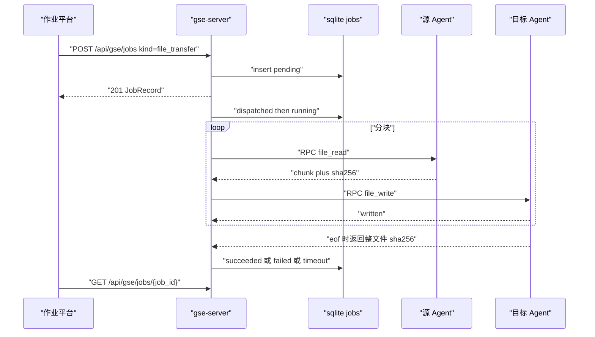
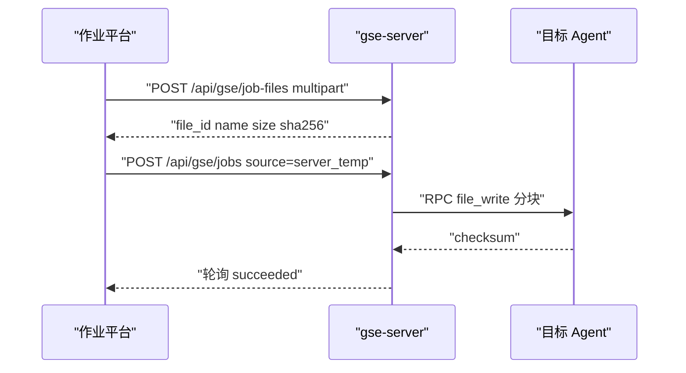
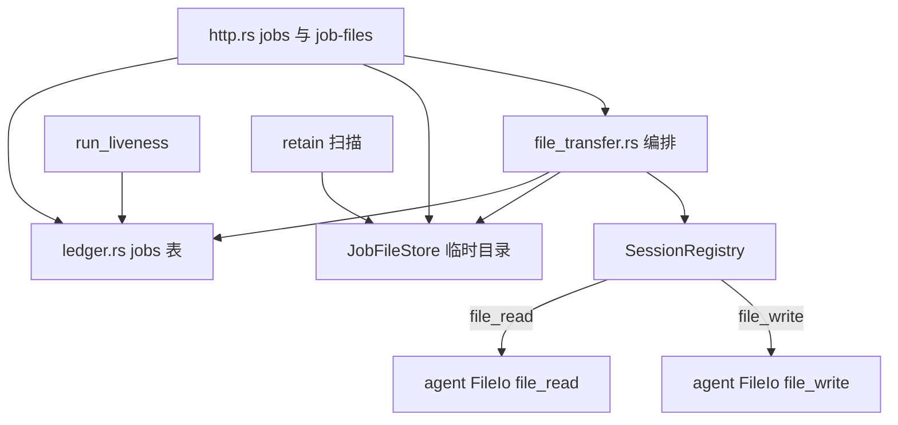

# GSE 作业文件传输

Feature Name: gse-job-file-transfer
Updated: 2026-09-18

## Description

在既有 GSE 作业（脚本下发）之上新增作业种类 `file_transfer`：运维人员提交源端与目标端，GSE Server 经已认证 geminio 会话把单个文件从源读到目标。字节一律经 Server 中转，源 Agent 与目标 Agent 不直连。

v1 范围：

- 作业种类：`script`（既有）与 `file_transfer`（本 feature）共存于同一 `jobs` 表与同一状态机。
- 源端：在线 Agent 绝对路径，或控制台 multipart 上传后得到的 Server 临时文件 `file_id`。
- 目标端：一个在线 Agent 绝对路径，或 Server 临时目录（以 `file_id` 隔离）。
- 传输：Server 编排分块 RPC（`file_read` / `file_write`），HTTP 提交立即返回 `job_id`，调用方轮询。
- 完整性：SHA-256；单文件上限缺省 64 MiB；超时沿用作业 `timeout_secs`。
- 前端：作业平台提交抽屉增加「文件传输」入口、上传回填、列表种类列、详情展示源/目标/字节/校验和。

非目标：目录递归、断点续传、P2P、多目标广播、流式进度推送、对象存储、脚本模板/另存为模板（文件作业不进入模板）。

## Architecture

### 已确认的实现选择

| 项 | 选择 |
| --- | --- |
| 目标路径已存在 | 作业 `failed`，错误码 `already_exists`；不覆盖已有文件 |
| Agent 路径范围 | 任意绝对路径，权限跟 Agent 进程 uid |
| 临时文件下载 | `GET /api/gse/job-files/{file_id}`，详情页提供下载 |

### 中转模型


三种作业路径：

| 路径 | 源 | 目标 | Server 角色 |
| --- | --- | --- | --- |
| Agent → Agent | `file_read` | `file_write` | 中转缓冲（可落临时文件，也可边读边写） |
| Agent → Server 临时目录 | `file_read` | 本机落盘 | 目标即 Temp Store |
| Server 临时目录 → Agent | 本机读取 | `file_write` | 源即 Temp Store |

控制台上传不是作业：`POST /api/gse/job-files` 写入 Temp Store 并返回 `file_id`，随后可作为文件作业的源端。

### Agent → Agent 时序



HTTP 提交在落库后立即返回，传输在 Server 后台任务中执行，避免把 64 MiB 拷贝绑在 HTTP 超时上。脚本作业仍同步等待 `job_exec` 受理应答；文件作业的「受理」由 Server 自身完成。

### 控制台上传后下发



### 状态机

复用 gse-job-execution 状态机：`pending` → `dispatched` → `running` → 终态（`succeeded` / `failed` / `timeout` / `rejected` / `lost`）。

| 迁移 | 文件作业触发条件 |
| --- | --- |
| pending → dispatched | 后台任务启动，开始访问源或目标会话 |
| dispatched → running | 首次 `file_read` 或本机打开源文件成功 |
| running → succeeded | 目标落盘 SHA-256 与源一致 |
| running → failed | 源不存在/非普通文件/无读权限、超限、写入失败、校验不一致 |
| running → timeout | 传输墙钟达到 `timeout_secs` |
| dispatched/running → lost | 源或目标 Agent 会话离线 |
| pending → lost | Server 重启时仍处于非终态的文件作业（与脚本作业 `mark_lost_inflight_on_startup` 一致） |

`rejected` 预留给 Agent 明确拒绝分块 RPC（例如路径非法）。v1 Agent 对可判定的路径错误直接在该次 RPC 返回错误，Server 记 `failed`。

### 组件关系



不复用 `dataplane-file`：那是 dataserver 对象存储（相对路径、`.dpmeta`）。GSE Temp Store 活在 `gse-server-core`，按 `file_id` 隔离。

## Components and Interfaces

### crates/gse-proto（新增 DTO）

作业 RPC 继续用 serde_json + `Bytes`，与 `job_exec` 一致。文件字节放在 JSON 的 `data_b64`（标准 Base64），每块缺省 1 MiB，编码后约 1.33 MiB，避免单 RPC 塞入整文件。

```rust
/// Server → Agent：按偏移读取普通文件一块。
pub struct FileReadReq {
    pub job_id: String,
    pub path: String,
    pub offset: u64,
    pub length: u64,
}

pub struct FileReadReply {
    pub job_id: String,
    pub size: u64,
    pub offset: u64,
    pub eof: bool,
    pub data_b64: String,
    pub chunk_sha256: String,
    /// 仅 eof=true 时填写整文件 SHA-256。
    pub file_sha256: Option<String>,
    pub error: Option<String>,
}

/// Server → Agent：按偏移写入；eof=true 且最终路径不存在时 rename 就位并回传整文件校验和。
pub struct FileWriteReq {
    pub job_id: String,
    pub path: String,
    pub offset: u64,
    pub eof: bool,
    pub data_b64: String,
    pub chunk_sha256: String,
    /// eof=true 时由 Server 带上源文件 SHA-256，Agent 比对。
    pub file_sha256: Option<String>,
}

pub struct FileWriteReply {
    pub job_id: String,
    pub written: u64,
    pub eof: bool,
    pub file_sha256: Option<String>,
    pub error: Option<String>,
}
```

稳定错误码（经 `GseError.code` 或 `File*Reply.error`）：既有 `invalid_argument`、`unavailable`、`not_found`、`rpc_error`；新增 `file_too_large`、`checksum_mismatch`、`not_a_file`、`permission_denied`、`already_exists`。

`offset=0` 的 `file_read` 兼作探测：Agent 用 `metadata` 判断存在性、是否普通文件、大小；超限时 `error=file_too_large` 且不返回数据。

### RPC 方法表

| 方向 | 方法 | 请求 | 应答 |
| --- | --- | --- | --- |
| Server → Agent | `file_read` | `FileReadReq` | `FileReadReply` |
| Server → Agent | `file_write` | `FileWriteReq` | `FileWriteReply` |
| Server → Agent | `job_exec`（既有） | `JobExec` | `JobAck` |
| Agent → Server | `job_result`（既有） | `JobResult` | 空 Bytes |

文件作业不走 `job_exec` / `job_result`。编排在 Server 进程内完成，Agent 只做同步分块读写。

每块 RPC 超时：`min(30s, 剩余作业超时)`。整次传输墙钟超时取作业 `timeout_secs`（缺省 300，上限 `job_max_timeout_secs`）。

### gse-agent-core（FileIo）

新增 `crates/gse-agent-core/src/file_io.rs`，在 `lib.rs` 注册 `file_read` / `file_write`。不占用 `JobExecutor` 的脚本并发信号量（脚本与文件传输可并行）。

路径规则：

- 必须是绝对路径；相对路径返回 `invalid_argument`。
- 拒绝空路径；按字节打开用户给出的路径（跟随符号链接，权限以进程 uid 为准）。
- `file_read`：目标必须是普通文件；目录或缺失返回 `not_a_file` / `not_found`。
- `file_write`：`offset=0` 时若最终路径已存在：普通文件返回 `already_exists`，目录返回 `not_a_file`；不修改已有路径。父目录缺失则 `create_dir_all`。
- 写入使用旁路文件 `{path}.gse-tmp-{job_id}`，全部块成功且校验一致后，仅当最终路径仍不存在时 `rename` 就位。最终路径已存在则删旁路文件并返回 `already_exists`。失败或超时时删除旁路文件。

`file_read` 实现要点：`File::open` → 若 `offset==0` 先读 `metadata.len()`，超过 Server 在请求中隐含的上限（见下）则报 `file_too_large`；`seek(offset)` 读最多 `length` 字节；块 SHA-256；`eof` 当 `offset+read >= size`；整文件 SHA-256 在 eof 时对文件再扫一遍（v1 文件 ≤ 64 MiB，可接受）。Server 在 `FileReadReq` 之外通过第一块 `size` 判断上限：Agent 侧再加一道，上限取 `length` 不负责全局 max，由 Server 在发现 `size > job_max_file_bytes` 后停止后续块。

为让 Agent 也能拒绝超限，`FileReadReq` 增加 `max_bytes: u64`，Agent 在 `metadata.len() > max_bytes` 时返回 `file_too_large`。

### gse-server-core/file_transfer.rs（编排）

`submit_file_job(...)`：

1. `jobs_enabled` 关闭则 `unavailable`。
2. 校验源/目标必填、类型合法、超时范围。
3. 源与目标均为 Agent 且 `agent_id` 与规范化路径相同 → 400 `invalid_argument`。
4. 两端均为 `server_temp` → 400 `invalid_argument`（v1 不支持临时目录互拷）。
5. 涉及的 Agent 必须 Online，否则 409 `unavailable`。
6. 源为 `server_temp` 时 `JobFileStore::head(file_id)`，缺失 404 `not_found`。
7. 生成 `job_id`（沿用 `job-{micros}-{seq}`），`kind=file_transfer`，`agent_id` 取「列表主键」：目标为 Agent 则用目标，否则用源 Agent。
8. `insert_job` 状态 `pending`，`interpreter=""`，`script=""`。
9. `tokio::spawn` 后台 `run_file_transfer(job_id)`，HTTP 立即返回当前记录。

`run_file_transfer`：

1. 置 `dispatched`；记录 `started_at`。
2. 用 `timeout_secs` 包住整段传输。
3. 源为 Agent：循环 `file_read`（`offset` 递增，`length=job_file_chunk_bytes`，`max_bytes=job_max_file_bytes`）。第一块得到 `size`，超限则 `failed` + `file_too_large`。
4. 源为 Temp Store：按块读本地 `content`。
5. 目标为 Agent：对应偏移 `file_write`；最后一块 `eof=true` 并带 `file_sha256`。
6. 目标为 Temp Store：写入新 `file_id`（等于本次 `job_id` 对应的文件标识 `file-{job_id}`），`meta.json` 记录原始名（源路径 basename 或上传名）。
7. 目标回传 SHA-256 与源不一致 → `failed` + `checksum_mismatch`，Agent 侧已删除旁路文件。
8. 成功：`finish_job(succeeded)`，写入 `file_bytes`、`file_sha256`、`file_name`；目标为 Temp Store 时结果里带 `file_id`。
9. RPC 失败或会话离线：`lost`。墙钟超时：`timeout`，并尽力向目标发一个空 `eof` 取消（v1 可只删旁路：超时后 Server 停止发块，Agent 旁路文件在下次同 `job_id` 写入或 liveness 时不自动清；约定超时后 Server 再调一次 `file_write` `{offset:0,eof:true,data空, path, abort:true}` 过于额外）。v1：超时只停 Server 循环；Agent 旁路文件若 10 分钟无后续块则删除。实现上 Agent 对每个 `job_id` 记录上次写入时间，新 `file_write offset=0` 覆盖；残留由 Agent 启动时扫 `*.gse-tmp-*` 删除。

边读边写，Server 内存只保留当前块。Agent → Agent 不强制落完整临时文件。

### crates/gse-server-core/job_file_store.rs

目录布局：

```text
{job_file_dir}/{file_id}/meta.json
{job_file_dir}/{file_id}/content
```

`meta.json`：

```json
{
  "file_id": "file-1710000000000-0",
  "file_name": "app.log",
  "size_bytes": 1234,
  "sha256": "hex",
  "created_at": "2026-09-18T00:00:00.000000Z"
}
```

- `file_id`：上传为 `file-{micros}-{seq}`；作业写入临时目录为 `file-{job_id}`，保证按作业隔离且可再当源。
- `put` 同样走旁路文件再 rename。
- `get` / `head` / `delete`；缺失 `not_found`。
- `list_expired(now, retain_secs)` 供清理任务使用。

`file_id` 字符集：`[A-Za-z0-9._-]`，拒绝 `..` 与路径分隔符。

### HTTP（`/api/gse`）

| 方法 | 路径 | 说明 |
| --- | --- | --- |
| POST | `/api/gse/jobs` | 扩展：`kind=file_transfer` 时走文件提交；缺省或 `script` 保持原脚本提交 |
| GET | `/api/gse/jobs` | 列表；`?agent_id=` 匹配 `agent_id` 或源/目标 Agent |
| GET | `/api/gse/jobs/{job_id}` | 详情，含种类与文件字段 |
| POST | `/api/gse/job-files` | multipart 字段名 `file`，写入 Temp Store |
| GET | `/api/gse/job-files/{file_id}` | 下载正文（`Content-Disposition` 用原始文件名）；用户故事「暂存后再分发或下载」 |
| DELETE | `/api/gse/job-files/{file_id}` | 删除临时文件 |
| GET | `/api/gse/job-files` | 列出未过期临时文件元信息（供表单选择源端） |

脚本提交体保持不变。文件提交体：

```json
{
  "kind": "file_transfer",
  "source": {
    "type": "agent",
    "agent_id": "web-01",
    "path": "/var/log/app.log"
  },
  "destination": {
    "type": "agent",
    "agent_id": "web-02",
    "path": "/tmp/app.log"
  },
  "timeout_secs": 300
}
```

源为临时目录：

```json
{
  "kind": "file_transfer",
  "source": { "type": "server_temp", "file_id": "file-1710000000000-0" },
  "destination": { "type": "agent", "agent_id": "web-02", "path": "/tmp/app.log" }
}
```

目标为临时目录：

```json
{
  "kind": "file_transfer",
  "source": { "type": "agent", "agent_id": "web-01", "path": "/var/log/app.log" },
  "destination": { "type": "server_temp" }
}
```

`POST /jobs` 用 `kind` 字段分流；serde 可先读 `kind` 再反序列化其余。缺字段 400 并点名。

上传响应 201：

```json
{
  "file_id": "file-1710000000000-0",
  "file_name": "pkg.tar",
  "size_bytes": 4096,
  "sha256": "hex"
}
```

上传超过 `job_max_file_bytes`：边收边计，超限停写、删不完整目录，400 `invalid_argument`（消息含上限）。`Content-Length` 若已超限可提前 400。

HTTP 状态码：

| 场景 | HTTP | code |
| --- | --- | --- |
| 缺字段 / 同源同路径 / 超时越界 / 超限上传 / 非法 file_id | 400 | `invalid_argument` |
| 创建作业或上传成功 | 201 | - |
| 临时文件或作业不存在 | 404 | `not_found` |
| 源或目标 Agent 非在线 | 409 | `unavailable` |
| 分块 RPC 失败（仅后台记作业，不在提交 HTTP 上） | - | `rpc_error` / `lost` |

重做：文件作业允许 `POST /jobs/{id}/rerun`，复制 `kind` 与源/目标；源为 `server_temp` 且文件已删则 404。覆盖字段仅 `timeout_secs` 与目标 Agent/路径（可选）。另存为模板：文件作业详情隐藏该按钮。

### 配置

gse-server：

| 配置项 | 默认值 | 环境变量 |
| --- | --- | --- |
| `job_max_file_bytes` | `67108864`（64 MiB） | `GSE_SERVER_JOB_MAX_FILE` |
| `job_file_dir` | 空：`{db 所在目录}/job-files` | `GSE_SERVER_JOB_FILE_DIR` |
| `job_file_retain_secs` | `86400` | `GSE_SERVER_JOB_FILE_RETAIN` |
| `job_file_chunk_bytes` | `1048576` | `GSE_SERVER_JOB_FILE_CHUNK` |
| `job_file_cleanup_interval_secs` | `600` | `GSE_SERVER_JOB_FILE_CLEANUP` |

gse-agent：无新增必填项。旁路文件扫残留在启动时执行一次。

清理任务与 dataplane probe 类似，挂在 Server 运行循环：每隔 `job_file_cleanup_interval_secs` 删除 `created_at + retain` 已过期的 `{file_id}/` 目录。

### 前端（@vectorman/job）

适配器 `GseJobAdapter` 扩展：

| 方法 | HTTP |
| --- | --- |
| `submitJob` | 已有；body 可含 `kind` 与 source/destination |
| `uploadJobFile(file: File)` | POST `/api/gse/job-files` multipart |
| `listJobFiles()` | GET `/api/gse/job-files` |
| `deleteJobFile(fileId)` | DELETE `/api/gse/job-files/{id}` |
| `downloadJobFileUrl(fileId)` | GET 路径，供 `<a>` 下载 |

`Job` 增加：

```ts
kind?: "script" | "file_transfer"
source?: FileEndpoint
destination?: FileEndpoint
file_name?: string | null
file_bytes?: number | null
file_sha256?: string | null
file_id?: string | null
```

`FileEndpoint`：`{ type: "agent", agent_id: string, path: string } | { type: "server_temp", file_id?: string }`。

提交抽屉：顶部 Radio「脚本 / 文件传输」。文件表单字段：

| 字段 | 控件 |
| --- | --- |
| 源类型 | Select：Agent 路径 / 已上传文件 / 立即上传 |
| 源 Agent + 路径 | 在线 Agent Select + 绝对路径 Input |
| 上传 | `Upload` 单文件，成功后回填 `file_id` |
| 已有临时文件 | Select（`listJobFiles`） |
| 目标类型 | Select：Agent 路径 / Server 临时目录 |
| 目标 Agent + 路径 | 目标为 Agent 时必填 |
| timeout_secs | 与脚本作业相同 |

列表增加「种类」列：脚本 / 文件传输。`agent_id` 列对文件作业展示列表主键（目标 Agent 或源 Agent）。

详情：`kind=file_transfer` 时展示源端、目标端、`file_name`、`file_bytes`、`file_sha256`、`file_id`（若有）、失败原因；隐藏 stdout/stderr/脚本。目标或结果带 `file_id` 时提供下载按钮。隐藏「另存为模板」。

轮询策略不变。

## Data Models

### jobs 表增量（sqlite 幂等 ALTER，风格同 `template_id` / `rerun_of`）

```sql
ALTER TABLE jobs ADD COLUMN kind TEXT NOT NULL DEFAULT 'script';
ALTER TABLE jobs ADD COLUMN source_json TEXT;
ALTER TABLE jobs ADD COLUMN dest_json TEXT;
ALTER TABLE jobs ADD COLUMN file_name TEXT;
ALTER TABLE jobs ADD COLUMN file_bytes INTEGER;
ALTER TABLE jobs ADD COLUMN file_sha256 TEXT;
ALTER TABLE jobs ADD COLUMN file_id TEXT;
```

`source_json` / `dest_json` 存 `FileEndpoint` JSON。脚本作业这些列为 NULL，`kind='script'`。

`JobRecord` / `NewJob` 增加对应字段；序列化给前端时 `kind` 缺省 `"script"`，旧客户端可忽略新字段。

`list_jobs(agent_id, ...)`：当 `agent_id` 有值时 SQL 为 `agent_id = ? OR source_json LIKE` 改为结构化：在 insert 时冗余 `source_agent_id` / `dest_agent_id` 会更干净。为少加列，v1 用：

```sql
WHERE (?1 IS NULL OR agent_id = ?1
   OR source_json LIKE '%"agent_id":"' || ?1 || '"%'
   OR dest_json LIKE '%"agent_id":"' || ?1 || '"%')
```

LIKE 对 `agent_id` 字符集（现有 id 无引号）可接受。若实现时更愿意加列，可再 ALTER `source_agent_id` / `dest_agent_id`；推荐加列避免 JSON LIKE：

```sql
ALTER TABLE jobs ADD COLUMN source_agent_id TEXT;
ALTER TABLE jobs ADD COLUMN dest_agent_id TEXT;
```

推荐方案：加 `source_agent_id` / `dest_agent_id`，列表过滤 `agent_id=? OR source_agent_id=? OR dest_agent_id=?`。

### JobFileStore 不进 sqlite

元数据只在 `meta.json`。作业结果里的 `file_id` 指向目录。过期删除不回写 jobs 表（历史作业仍显示当时的 `file_id`，下载 404）。

## Correctness Properties

- 脚本作业提交路径、RPC、状态机与表字段行为保持不变；`kind` 缺省 `script`。
- 文件作业与脚本作业共用终态不可变：`finish_job` 仍 `WHERE status NOT IN (终态)`。
- 单文件：源路径必须是普通文件；不递归目录。
- 单目标：`destination` 只含一个端点。
- 中转：源 Agent 与目标 Agent 之间无新连接。
- 隔离：每个临时文件独占 `{job_file_dir}/{file_id}/`。
- 完整性：成功终态时 `file_sha256` 等于源内容 SHA-256，且目标可读内容与之相同。
- 目标不覆盖：最终路径在传输前已存在则 `failed` + `already_exists`，原文件不变；成功时最终路径是新创建的完整文件。
- 上限：源 `size > job_max_file_bytes` 或上传超限时不把超限字节留给 Temp Store。
- 超时：墙钟到达后不再发起新分块，作业为 `timeout`。
- 离线：liveness 将相关 Agent 的非终态文件作业置 `lost`（`mark_lost_by_agent` 已按 `agent_id` 批量更新；需扩展为同时匹配 `source_agent_id` / `dest_agent_id`）。
- `file_id` 不可含路径分量，打开文件不会逃出 `job_file_dir`。

## Error Handling

| 条件 | 作业状态 / HTTP | code |
| --- | --- | --- |
| 缺源或目标字段 | HTTP 400 | `invalid_argument` |
| 同源同 Agent 同路径 | HTTP 400 | `invalid_argument` |
| 两端都是 server_temp | HTTP 400 | `invalid_argument` |
| Agent 不在线 | HTTP 409 | `unavailable` |
| 源 file_id 不存在（提交时） | HTTP 404 | `not_found` |
| 源路径缺失 | 作业 `failed` | `not_found` |
| 源不是普通文件 | 作业 `failed` | `not_a_file` |
| 源无读权限 / 目标无写权限 | 作业 `failed` | `permission_denied` |
| 源大小超限 | 作业 `failed` | `file_too_large` |
| 上传超限 | HTTP 400 | `invalid_argument` |
| 目标路径已存在 | 作业 `failed` | `already_exists` |
| 目标写入失败 | 作业 `failed` | `rpc_error` 或 IO 信息 |
| 校验不一致 | 作业 `failed` | `checksum_mismatch` |
| 传输超时 | 作业 `timeout` | - |
| 传输中会话掉线 | 作业 `lost` | - |
| 删除不存在的 file_id | HTTP 404 | `not_found` |

`JobRecord.error` 存 code；详细路径与 IO 消息可附在同一字符串 `code: detail`，前端优先展示 code，详情抽屉展示全文。

## Test Strategy

### proto / FileIo 单测

- DTO JSON 往返。
- 绝对路径通过、相对路径拒绝。
- 读普通文件分块与 eof、sha256。
- 读目录 / 缺失。
- 写父目录自动创建；目标已存在则 `already_exists`；旁路 rename 仅在最终路径不存在时就位。
- 块 `chunk_sha256` 错误则拒绝写入。

### JobFileStore 单测

- put/get/head/delete；非法 `file_id`。
- 超期列出与删除；作业间目录不互相覆盖。

### httptest（gse-server-core/http.rs）

- `POST /jobs` `kind=file_transfer` 缺字段 400；离线 Agent 409。
- 同源同路径 400。
- 源 file_id 不存在 404。
- `POST /job-files` 小文件 201；超限 400。
- `GET/DELETE /job-files/{id}` 命中与 404。
- 脚本作业回归：无 `kind` 的原提交仍 201。

### e2e（bins 或 gse-server-core/tests）

两个 in-process Agent + Server：

1. Agent A 写源文件，提交 A→B，B 路径内容与 SHA-256 一致，作业 `succeeded`。
2. Agent A → Server 临时目录，响应含 `file_id`，`GET` 下载字节一致。
3. 上传 → 下发到 Agent B。
4. 源不存在 → `failed` + `not_found`。
5. 构造超过上限的源 → `failed` + `file_too_large`。
6. 传输中停掉源或目标 Agent → `lost`。
7. 目标路径已有普通文件 → `failed` + `already_exists`，原文件内容不变。

前端：`jobs.ts` 与提交表单纯函数测 endpoint 构造；抽屉按 kind 切换字段（vitest）。

## References

- gse-job-execution 设计：`.monkeycode/specs/gse-job-execution/design.md`
- 本 feature 需求：`.monkeycode/specs/gse-job-file-transfer/requirements.md`
- `JobRecord` / `jobs` 表：`crates/gse-server-core/src/ledger.rs`
- `submit_job` / `dispatch_job`：`crates/gse-server-core/src/server.rs`
- `JobExec` RPC：`crates/gse-proto/src/lib.rs`
- Agent `job_exec` 注册：`crates/gse-agent-core/src/lib.rs`
- 前端作业适配器：`frontend/packages/adapters/src/gse/jobs.ts`
