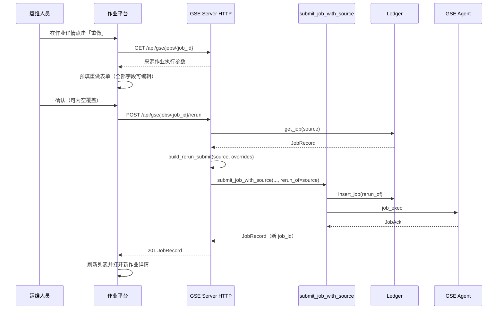

# 历史作业重做（Job Rerun）

Feature Name: gse-job-rerun
Updated: 2026-09-10

## Description

本 feature 在既有作业执行链路（gse-job-execution）与作业模板（gse-job-templates）之上，提供「历史作业重做」：运维人员在作业详情触发「重做」后，作业平台以来源作业的全部执行参数预填提交表单，允许编辑后提交；SERVER 以合并后的参数创建一条新的独立作业并下发，新作业通过 `rerun_of` 记录来源作业。

设计要点：

- 重做不改写来源作业，新作业拥有独立 job_id 与独立终态。
- 重做入口同时支持「原样重做」（请求体为空，直接继承来源作业参数）与「编辑后重做」（请求体提供部分或全部参数覆盖）。
- 参数合并发生在 SERVER 侧，合并结果复用 `submit_job` 的既有校验与下发语义，前端只负责预填与展示。
- 来源作业可取任意状态；重做只读取参数，不与来源作业的执行过程交互。

## Architecture



职责边界：

- HTTP 层：路由、来源作业加载、JSON 反序列化、错误码映射，不实现合并逻辑。
- `rerun.rs`：把来源作业与覆盖请求合并为 `JobSubmit`，是唯一的合并实现。
- `submit_job_with_source`：统一承载模板提交与重做提交，负责校验、落库、派发。
- Ledger：新增 `rerun_of` 列与读写，且遵循既有迁移模式。

## Components and Interfaces

### Ledger 扩展（crates/gse-server-core/src/ledger.rs）

- `JobRecord` 新增字段 `rerun_of: Option<String>`（`#[serde(default)]`）。
- `NewJob` 新增字段 `rerun_of: Option<String>`。
- `init` 中在 `migrate_jobs_template_id` 之后调用 `migrate_jobs_rerun_of`：用 `PRAGMA table_info(jobs)` 检测 `rerun_of`，缺失时 `ALTER TABLE jobs ADD COLUMN rerun_of TEXT`，重复调用幂等。
- `insert_job` 的 INSERT 列与参数增加 `rerun_of`；`row_to_job` 读取 `field_opt_text(columns, row, "rerun_of")`。

### 合并模块（crates/gse-server-core/src/rerun.rs，新增）

```rust
#[derive(Debug, Clone, Default, Deserialize)]
pub struct RerunRequest {
    pub agent_id: Option<String>,
    pub interpreter: Option<String>,
    pub script: Option<String>,
    pub args: Option<Vec<String>>,
    pub env: Option<BTreeMap<String, String>>,
    pub working_dir: Option<String>,
    pub timeout_secs: Option<u64>,
}

pub fn build_rerun_submit(source: &JobRecord, req: RerunRequest) -> JobSubmit;
```

合并规则（未提供即继承来源作业）：

1. `agent_id`：`req.agent_id` 去空白非空时覆盖，否则取 `source.agent_id`。
2. `interpreter`：`req.interpreter` 为 `Some` 时覆盖，否则取 `source.interpreter`。
3. `script`：`req.script` 为 `Some` 时覆盖，否则取 `source.script`。
4. `args`：`req.args` 为 `Some` 时覆盖（含显式空数组表示清空），否则取 `source.args`。
5. `env`：`req.env` 为 `Some` 时覆盖（含显式空对象表示清空），否则取 `source.env`。
6. `working_dir`：`req.working_dir` 为 `Some("")` 或全空白时置为 `None`（显式清空），`Some(非空)` 覆盖，`None` 继承。
7. `timeout_secs`：`req.timeout_secs` 为 `Some` 时覆盖，否则取 `source.timeout_secs`。

`build_rerun_submit` 产出 `JobSubmit`，其中 `interpreter` 与 `timeout_secs` 均置 `Some`，交由 `submit_job_with_source` 统一校验与解析默认值。

### Server 提交入口（crates/gse-server-core/src/server.rs）

- 新增通用函数 `submit_job_with_source(ledger, registry, cfg, req, template_id, rerun_of)`，承载现有 `submit_job_with_template` 的全部校验、落库与派发逻辑。
- `submit_job_with_template(..., template_id)` 改为调用 `submit_job_with_source(..., template_id, None)`；`submit_job` 保持不变。
- 新增 `submit_rerun(ledger, registry, cfg, source: &JobRecord, req: RerunRequest)`：调用 `build_rerun_submit` 后以 `template_id = None`、`rerun_of = Some(source.job_id.clone())` 调用 `submit_job_with_source`。

### HTTP 接口（crates/gse-server-core/src/http.rs）

新增路由：`POST /api/gse/jobs/{job_id}/rerun`。

Handler `rerun_job`：

1. `admin.ledger.get_job(job_id)`；`None` → 404 `not_found`。
2. 反序列化 `RerunRequest`（请求体可省略，等价于空对象）。
3. 校验运行环境：`admin.registry` 与 `admin.cfg` 缺失 → 503 `unavailable`（管理端口独立部署场景，与 `create_job` 一致）。
4. `submit_rerun(...)`，成功返回 `201 JobRecord`，失败按 `job_status` 映射。

错误码沿用既有 `job_status`：`invalid_argument` → 400、`not_found` → 404、`already_exists`/`unavailable` → 409、其余 → 500。

### 前端适配器（frontend/packages/adapters/src/gse/jobs.ts）

- `Job` 新增 `rerun_of?: string | null`。
- 新增类型：

```ts
export type JobRerunRequest = {
  agent_id?: string;
  interpreter?: string;
  script?: string;
  args?: string[];
  env?: Record<string, string>;
  working_dir?: string;
  timeout_secs?: number;
};
```

- `GseJobAdapter` 新增方法：

```ts
rerunJob(jobId: string, req: JobRerunRequest = {}): Promise<Job> {
  return this.http
    .request<Job>({ method: "POST", url: `${PREFIX}/jobs/${enc(jobId)}/rerun`, body: req })
    .then((r) => r.body);
}
```

### 作业平台（frontend/apps/job/src）

- `features/jobs/use-jobs.ts` 新增 `rerun(jobId, req)`：调用 `jobs.rerunJob` 后刷新列表并返回新作业。
- 新增 `ui/job-rerun-drawer.tsx`：以来源作业预填 `agent_id`、`interpreter`、`script`、`argsText`、`envText`、`timeout_secs`、`working_dir` 全部字段；复用 `parseArgs`、`JOB_INTERPRETERS`；新增 `parseEnv`/`formatEnv` 处理 `KEY=VALUE` 多行文本。确认后构造 `JobRerunRequest`（发送全部字段，未编辑即来源值），交给 `onConfirm`。
- `ui/job-detail-drawer.tsx`：新增「重做」按钮，props 增加 `onRerun?: (job: Job) => void`；详情 `Descriptions` 增加「来源作业」项展示 `job.rerun_of`。
- `pages/jobs-page.tsx`：新增 `rerunJob` 状态与 `JobRerunDrawer`，把 `onRerun` 传给 `JobDetailDrawer`；重做成功后刷新列表、关闭重做抽屉并打开新作业详情。

## Data Models

jobs 表新增列：

```sql
ALTER TABLE jobs ADD COLUMN rerun_of TEXT;
```

作业记录新增字段：

| 字段 | 类型 | 说明 |
|------|------|------|
| rerun_of | TEXT NULL | 重做作业的来源作业 job_id；手工提交、模板提交与历史记录为 NULL |

重做请求体（全部可选，省略表示继承来源作业）：

| 字段 | 类型 | 说明 |
|------|------|------|
| agent_id | string? | 目标 Agent；空字符串在合并后触发 `invalid_argument` |
| interpreter | string? | 解释器；空值解析为 `bash` |
| script | string? | 脚本正文；空正文触发 `invalid_argument` |
| args | string[]? | 参数列表；显式空数组表示清空 |
| env | object? | 环境变量；显式空对象表示清空 |
| working_dir | string? | 工作目录；显式空字符串表示清空 |
| timeout_secs | number? | 超时秒数；须在 `1..=job_max_timeout_secs` |

## Correctness Properties

1. 来源作业不变性：任何重做请求都不修改来源作业的任何字段（状态、结果与参数保持一致）。
2. 引用完整性：重做作业的 `rerun_of` 等于请求路径中的 `job_id`，且该 job_id 在请求时存在于台账。
3. 唯一性：每次重做生成新的 job_id，同一来源作业的多次重做互不相同。
4. 合并确定性：对同一来源作业与同一 `RerunRequest`，`build_rerun_submit` 产出相同结果；未提供的字段等于来源作业对应字段。
5. 参数来源一致：来源作业若来自模板，重做使用其已展开的脚本正文，且重做作业 `template_id` 为 NULL。
6. 校验一致：合并后的脚本字节数、超时范围与解释器处理与 `submit_job` 完全一致。
7. 终态独立：重做作业的状态与结果字段不受来源作业后续变化影响。
8. 向后兼容：`rerun_of` 缺失历史库可幂等迁移；历史作业与手工提交作业的 `rerun_of` 为 NULL。

## Error Handling

| 场景 | HTTP | 错误码 | 触发点 |
|------|------|--------|--------|
| 来源 job_id 不存在 | 404 | not_found | handler `get_job` |
| 合并后 agent_id 为空 | 400 | invalid_argument | `submit_job_with_source` |
| 合并后脚本为空或超字节上限 | 400 | invalid_argument | `submit_job_with_source` |
| 合并后超时为 0 或超最大上限 | 400 | invalid_argument | `submit_job_with_source` |
| 目标 Agent 无在线会话 | 409 | unavailable | `submit_job_with_source` |
| jobs 功能被禁用 | 409 | unavailable | `submit_job_with_source` |
| 无进程内 server（仅管理端口） | 503 | unavailable | handler 运行环境检查 |
| 请求体 JSON 非法 | 400 | invalid_argument | `from_json_err` |
| 解释器不在白名单 | — | — | 复用既有语义：SERVER 受理后由 Agent 以 `rejected` 回传原因 |

失败的重做请求不产生作业记录（insert 之前完成全部校验），台账保持无副作用。

## Test Strategy

后端（crates/gse-server-core）：

- `rerun.rs` 单元测试：空请求全继承；逐字段覆盖；`working_dir` 显式清空；`args`/`env` 显式清空；`agent_id` 去空白；`timeout_secs` 覆盖。
- Ledger 测试：`rerun_of` 写入并读回；`migrate_jobs_rerun_of` 幂等；旧表结构升级后写入成功；手工/模板作业 `rerun_of` 为 NULL。
- HTTP 测试：空体重做复制来源参数；部分覆盖生效；来源 404；离线 Agent 409；脚本超限 400；模板来源重做 `template_id` 为 NULL；两次重做 job_id 不同；无进程内 server 503。
- e2e（tests/e2e.rs）：提交作业至 succeeded → 重做 → 新作业 succeeded、`rerun_of` 指向来源、来源记录未变。

前端（frontend）：

- adapters 测试：`rerunJob` 使用 `POST /api/gse/jobs/{id}/rerun` 与请求体。
- `job-rerun-drawer` 测试：来源作业预填全部字段；编辑后提交携带覆盖值；`parseEnv`/`formatEnv` 往返。
- `job-detail-drawer` 测试：`rerun_of` 展示与「重做」按钮回调。

验证命令：`cargo test -p gse-server-core`；`cd frontend && npm test`；`npx tsc -p apps/job/tsconfig.json --noEmit`。

## References

[^1]: (crates/gse-server-core/src/server.rs) - `submit_job` / `submit_job_with_template` / `dispatch_job`
[^2]: (crates/gse-server-core/src/ledger.rs) - `JobRecord` / `NewJob` / `insert_job` / `row_to_job` / `migrate_jobs_template_id`
[^3]: (crates/gse-server-core/src/http.rs) - 作业与模板路由、`job_status`、`save_job_as_template`
[^4]: (crates/gse-server-core/src/template.rs) - `TemplateInput` / `expand` / `ExpandedJob::into_submit`
[^5]: (frontend/packages/adapters/src/gse/jobs.ts) - `GseJobAdapter` / `Job` / `JobSubmit`
[^6]: (frontend/apps/job/src/ui/job-detail-drawer.tsx) - 作业详情与「另存为模板」
[^7]: (frontend/apps/job/src/ui/job-submit-drawer.tsx) - 提交表单字段与 `parseArgs`
[^8]: (frontend/apps/job/src/pages/jobs-page.tsx) - 页面状态与提交编排
