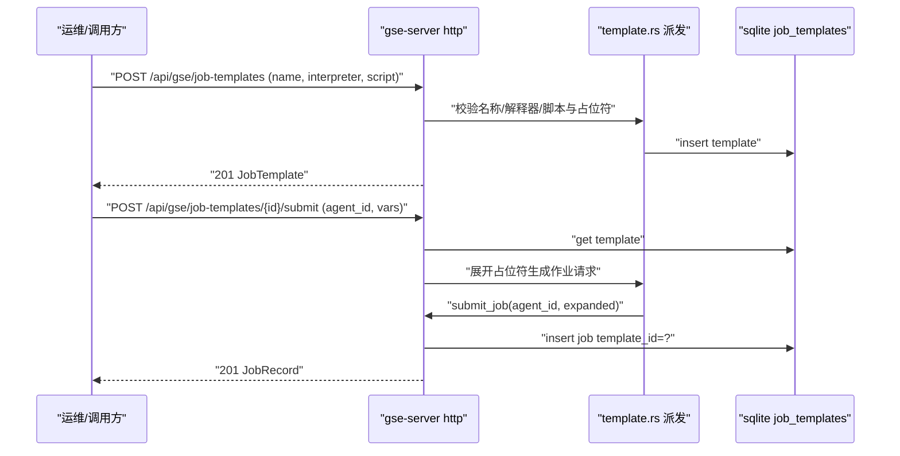
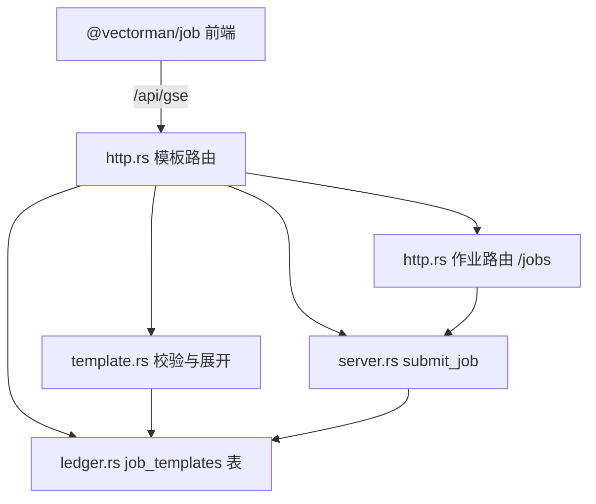
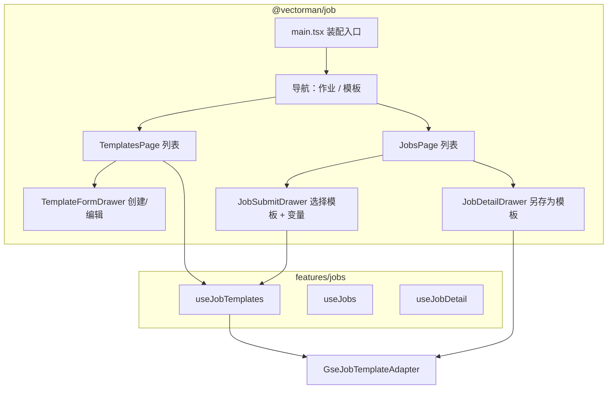

# GSE 作业模板

Feature Name: gse-job-templates
Updated: 2026-09-10

## Description

在 gse-job-execution 之上新增「作业模板」：把可复用的执行参数（解释器、脚本正文、参数、环境变量、工作目录、超时值）保存为命名模板，供作业平台选择模板快速提交；支持模板 CRUD、`${name}` 变量占位符与提交时展开、从已有作业「另存为模板」。

范围决策（已与用户确认）：

- 模板由 GSE Server 持久化到台账并共享（新增 `job_templates` 表 + `/api/gse/job-templates` 接口）。
- 模板支持 `${name}` 命名占位符，出现在脚本、参数、环境变量值与工作目录中，提交时填入取值。
- 模板不绑定 Agent，目标 `agent_id` 在提交时指定。

非目标（后续版本候选）：模板版本历史、模板分类/标签、模板导入导出、模板级权限、定时/批量下发。

模板仅描述作业请求，不改变作业下发通道、执行与结果回传语义；模板展开发生在 Server 侧，Agent 不感知模板。

## Architecture

### 模板生命周期



### 组件关系



## Components and Interfaces

### crates/gse-server-core/src/template.rs（新增）

模板领域逻辑与展开，独立于 HTTP 与 RPC；模板不进入 Agent 通道，因此 DTO 不放入 `gse-proto`。

```rust
/// 台账中的模板记录。
pub struct JobTemplate {
    pub template_id: String,
    pub name: String,
    pub description: Option<String>,
    pub interpreter: String,
    pub script: String,
    pub args: Vec<String>,
    pub env: std::collections::BTreeMap<String, String>,
    pub working_dir: Option<String>,
    pub timeout_secs: u64,
    pub created_at: String,
    pub updated_at: String,
}

/// 创建/更新模板的输入。
pub struct TemplateInput {
    pub name: String,
    pub description: Option<String>,
    pub interpreter: String,
    pub script: String,
    pub args: Vec<String>,
    pub env: std::collections::BTreeMap<String, String>,
    pub working_dir: Option<String>,
    pub timeout_secs: Option<u64>,
}
```

- `extract_variables(input) -> BTreeSet<String>`：用 `\$\{([A-Za-z_][A-Za-z0-9_]*)\}` 扫描脚本、参数、env 值、工作目录。
- `validate_placeholders(input) -> Result<(), GseError>`：扫描所有 `${...}`；名称不匹配 `[A-Za-z_][A-Za-z0-9_]*` 即返回 `invalid_argument`。
- `expand(input, vars) -> Result<ExpandedJob, GseError>`：对声明变量逐一替换；缺失取值返回 `invalid_argument`；额外变量忽略。
- 复用作业约束：脚本字节数 ≤ `job_max_script_bytes`，展开后 timeout ≤ `job_max_timeout_secs`，解释器默认 `bash`、按 Server 白名单校验（与 `submit_job` 相同规则）。

`ExpandedJob` 即现有 `JobSubmit` 的可下发形态（agent_id + interpreter/script/args/env/working_dir/timeout_secs），直接交给 `server::submit_job`。

### crates/gse-server-core/src/ledger.rs（job_templates 表）

新增 `job_templates` 表与 API：`insert_template`、`get_template`、`get_template_by_name`、`list_templates`、`update_template`、`delete_template`。

- `name` 加 `UNIQUE` 约束；`insert_template`/`update_template` 捕获 sqlite 唯一冲突（扩展错误码 2067 / 消息含 `UNIQUE`）并映射为 `already_exists`。
- `template_id` 生成复用 `job_id` 模式：`tpl-{unix_millis}-{seq}`（进程内静态序号），跨实例由主键冲突兜底重试。
- `args`/`env` 以 JSON 文本存储，读写经 `serde_json`，与 `jobs` 表一致。

`jobs` 表新增来源列（用于 Requirement 4.4 / 7.4）：

```sql
ALTER TABLE jobs ADD COLUMN template_id TEXT;
```

sqlite 不支持 `ADD COLUMN IF NOT EXISTS`，`init` 中先 `PRAGMA table_info(jobs)`，缺列时执行 `ALTER`。`JobRecord` 与 `NewJob` 增加 `template_id: Option<String>`；既有测试字面量补 `template_id: None`。

### crates/gse-server-core/src/http.rs（模板接口）

在 `/api/gse` 前缀下新增：

| 方法 | 路径 | 说明 |
| --- | --- | --- |
| POST | `/api/gse/job-templates` | 创建模板，201 返回 `JobTemplate` |
| GET | `/api/gse/job-templates` | 列表，支持 `?name=&limit=` |
| GET | `/api/gse/job-templates/{template_id}` | 单模板，缺失 404 |
| PUT | `/api/gse/job-templates/{template_id}` | 更新模板，200 返回 `JobTemplate` |
| DELETE | `/api/gse/job-templates/{template_id}` | 删除模板，204 |
| POST | `/api/gse/job-templates/{template_id}/submit` | 展开并提交作业，201 返回 `JobRecord` |
| POST | `/api/gse/jobs/{job_id}/save-as-template` | 以作业创建模板，201 返回 `JobTemplate` |

创建/更新/提交请求体：

```json
{
  "name": "collect-logs",
  "description": "采集指定服务日志",
  "interpreter": "bash",
  "script": "tar czf /tmp/${svc}.tgz /var/log/${svc}",
  "args": [],
  "env": {"LANG": "C"},
  "working_dir": "/tmp",
  "timeout_secs": 120
}
```

```json
{
  "agent_id": "web-01",
  "vars": {"svc": "nginx"}
}
```

```json
{
  "name": "collect-logs-copy"
}
```

HTTP 状态码映射（与既有作业接口风格一致）：

| 场景 | HTTP | code |
| --- | --- | --- |
| 缺必填 / 解释器非法 / 脚本超限 / 超时越界 / 占位符非法 / 缺变量取值 | 400 | `invalid_argument` |
| 创建或另存成功 | 201 | - |
| 查询/更新/删除目标不存在 | 404 | `not_found` |
| 模板名重复 | 409 | `already_exists` |
| 提交时目标 Agent 非在线 | 409 | `unavailable` |
| 进程内无 Server 或作业被禁用 | 503 | `unavailable` |
| 台账读写失败 | 500 | `query_failed` |

Handler 复用 `submit_job` 的既有错误映射；`/jobs/{job_id}/save-as-template` 读取 `JobRecord` 构造 `TemplateInput`（不复制 `template_id`）。

### crates/gse-server-core/src/lib.rs

导出 `JobTemplate`、`TemplateInput`、`template::{expand, extract_variables, validate_placeholders}`（供测试与 HTTP 使用）。

### 适配器新增（@vectorman/adapters）

`frontend/packages/adapters/src/gse/templates.ts`，前缀 `/api/gse`，与 `GseJobAdapter` 并列导出：

| 方法 | HTTP | 路径 |
| --- | --- | --- |
| `listTemplates(q)` | GET | `/api/gse/job-templates?name=&limit=` |
| `getTemplate(id)` | GET | `/api/gse/job-templates/{id}` |
| `createTemplate(req)` | POST | `/api/gse/job-templates` |
| `updateTemplate(id, req)` | PUT | `/api/gse/job-templates/{id}` |
| `deleteTemplate(id)` | DELETE | `/api/gse/job-templates/{id}` |
| `submitTemplate(id, req)` | POST | `/api/gse/job-templates/{id}/submit` |
| `saveJobAsTemplate(jobId, name)` | POST | `/api/gse/jobs/{job_id}/save-as-template` |

```ts
type JobTemplate = {
  template_id: string
  name: string
  description?: string | null
  interpreter: string
  script: string
  args: string[]
  env: Record<string, string>
  working_dir?: string | null
  timeout_secs: number
  created_at: string
  updated_at: string
}

type TemplateInput = {
  name: string
  description?: string
  interpreter?: string
  script: string
  args?: string[]
  env?: Record<string, string>
  working_dir?: string
  timeout_secs?: number
}

type TemplateSubmitRequest = {
  agent_id: string
  vars?: Record<string, string>
}
```

`GseJobTemplateAdapter` 构造注入 `HttpClient`，与既有适配器一致；`submitTemplate` 返回 `Job`（复用 `GseJobAdapter` 的 `Job` 类型）。

### 作业平台前端（@vectorman/job）

导航新增「模板」，Runtime 增 `templates: GseJobTemplateAdapter`；模板 CRUD 页面与提交页解耦。



目录新增（其余沿用既有）：

```text
frontend/apps/job/src/
  features/jobs/
    use-job-templates.ts     # 列表 + CRUD + 变量提取
  pages/
    templates-page.tsx
  ui/
    template-form-drawer.tsx # 创建/编辑模板
    template-vars-form.tsx   # 变量取值输入（提交时）
```

- `useJobTemplates`：`listTemplates` 加载；`create`/`update`/`remove` 成功后刷新列表并 `Notifier.success`；`extractVariables(template)` 由脚本/参数/env/工作目录本地正则提取，供提交表单渲染变量输入项。
- `TemplateFormDrawer`：字段 name/description/interpreter/script/args/working_dir/timeout_secs；提交前做必填与范围校验；保存后刷新。
- `JobSubmitDrawer` 增加模板 `Select`（可选）。选中后调用 `useJobTemplates` 的模板数据预填解释器/脚本/参数/超时/工作目录，并在脚本区下方渲染 `${name}` 变量输入项；提交时若选择了模板，改调 `submitTemplate(template_id, { agent_id, vars })`，否则走原 `submitJob`。
- `JobDetailDrawer` 增加「另存为模板」按钮，弹出输入名称后调 `saveJobAsTemplate`，成功提示。

### 路由与查询键

| path | 页面 |
| --- | --- |
| `/` | 重定向 `/jobs` |
| `/jobs` | 作业列表 + 提交抽屉 + 详情抽屉 |
| `/templates` | 模板列表 + 表单抽屉 |

QueryStore 键新增 `templates.list`、`templates.one.{template_id}`；沿用 `jobs.list`、`jobs.one.{job_id}`、`agents.online`。

## Data Models

### job_templates 表（sqlite）

```sql
CREATE TABLE IF NOT EXISTS job_templates (
    template_id    TEXT PRIMARY KEY,
    name           TEXT NOT NULL UNIQUE,
    description    TEXT,
    interpreter    TEXT NOT NULL,
    script         TEXT NOT NULL,
    args           TEXT NOT NULL DEFAULT '[]',
    env            TEXT NOT NULL DEFAULT '{}',
    working_dir    TEXT,
    timeout_secs   INTEGER NOT NULL,
    created_at     TEXT NOT NULL,
    updated_at     TEXT NOT NULL
);
CREATE INDEX IF NOT EXISTS idx_templates_name ON job_templates(name);
```

### jobs 表变更

```sql
ALTER TABLE jobs ADD COLUMN template_id TEXT;
```

`created_at` / `updated_at` 沿用 `ledger_stamp()` 的 UTC 字符串；`template_id` 可空，历史作业与手工提交作业为 `NULL`。

## Correctness Properties

- 模板名唯一：并发创建同名模板时仅一个成功，另一个返回 `already_exists`。
- `template_id` 在 Server 内唯一，重复提交生成不同 ID。
- 占位符名称集合稳定：`extract_variables` 对同一模板多次调用结果一致。
- 展开闭合：对模板声明的每个变量都提供取值时，展开结果不含 `${...}` 残留；缺失任一取值则拒绝且不产生作业记录。
- 展开结果满足作业约束（脚本字节数、超时上限、解释器白名单），否则不产生作业记录。
- 模板删除后，已提交作业的 `template_id` 值保留为历史引用，不因删除变为 `NULL`。
- 更新模板不改动已生成作业的任何字段。
- `GseJobTemplateAdapter` 请求 URL 前缀为 `/api/gse`，与既有适配器一致。
- `@vectorman/job` 源码不出现 `fetch(`；模板相关 hooks 仅在组件卸载或数据到达后清除定时器/请求。
- 提交表单选择模板后，变量输入项覆盖模板声明的全部变量；未选择模板时不发送 `vars`。

## Error Handling

| 场景 | 行为 |
| --- | --- |
| 创建/更新缺 name/interpreter/script | 400 `invalid_argument` |
| 模板名重复 | 409 `already_exists` |
| 占位符名称不合法 | 400 `invalid_argument` |
| 脚本字节数或超时超限 | 400 `invalid_argument` |
| 从模板提交缺 agent_id | 400 `invalid_argument` |
| 缺模板声明的变量取值 | 400 `invalid_argument` |
| 模板 / 作业不存在 | 404 `not_found` |
| 目标 Agent 非在线 | 409 `unavailable` |
| 进程内无 Server 或作业禁用 | 503 `unavailable` |
| 台账唯一约束冲突 | 映射 409 `already_exists`，仅记日志 |
| 台账读写失败 | 500 `query_failed` |
| 前端模板列表/详情请求失败 | Toast warning，保留上一份数据 |
| 前端模板保存校验失败 | 阻止提交，Toast warning 指出字段 |
| 前端另存为模板失败 | Toast error，保留弹窗 |

## Test Strategy

- `ledger.rs`：`job_templates` 建表幂等、CRUD、name 唯一冲突、按 name 过滤、`jobs.template_id` 迁移幂等（重复 init 不报错）。
- `template.rs`：占位符提取（脚本/参数/env/工作目录）、非法名称拒绝、缺失变量拒绝、额外变量忽略、展开结果无残留、展开后超限拒绝。
- `http.rs`：创建 201、缺字段 400、重名 409、列表过滤、单模板 404、更新 200、删除 204、从模板提交 201 且作业记录带 `template_id`、缺变量 400、另存为模板 201、无进程内 Server 时提交 503。
- 端到端（`tests/e2e.rs` 扩展）：创建模板 → 用模板提交 → 轮询到 `succeeded` 且 stdout 为变量替换后的结果；另存为模板 → 再次提交成功。
- 前端（Vitest，不启动后端）：
  - `GseJobTemplateAdapter` 注入假 `HttpClient`，断言各方法的 method/url/body。
  - `useJobTemplates`：加载、创建后刷新、删除后刷新、失败提示。
  - 变量提取：仅脚本、含 args/env/工作目录、无变量返回空集。
  - `JobSubmitDrawer`：选择模板预填字段并渲染变量项；提交调用 `submitTemplate` 且携带 vars；未选模板走 `submitJob`。
  - `TemplateFormDrawer`：必填/超时范围校验阻止请求。
- 兼容性：gse-job-execution 既有后端与前端用例保持通过；`jobs` 表加列不破坏既有插入与查询。

## References

[^1]: Requirements - 当前工作区 `/.monkeycode/specs/gse-job-templates/requirements.md`
[^2]: 作业执行设计 - 当前工作区 `/.monkeycode/specs/gse-job-execution/design.md`
[^3]: 台账实现 - 当前工作区 `/crates/gse-server-core/src/ledger.rs`
[^4]: HTTP 路由与错误映射 - 当前工作区 `/crates/gse-server-core/src/http.rs`
[^5]: 作业调度入口 - 当前工作区 `/crates/gse-server-core/src/server.rs`
[^6]: 既有作业适配器 - 当前工作区 `/frontend/packages/adapters/src/gse/jobs.ts`
[^7]: 作业平台前端 - 当前工作区 `/frontend/apps/job/src/pages/jobs-page.tsx`
[^8]: 前端分层架构 - 当前工作区 `/.monkeycode/specs/frontend-layered-architecture/design.md`
