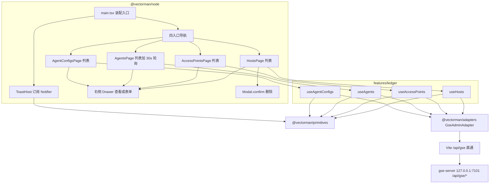

# GSE 节点管理前端

Feature Name: gse-node-app
Updated: 2026-09-07

## Description

`@vectorman/node` 是 GSE Server 台账的运维控制台。运维在同一应用内用四张列表管理主机、接入点、Agent、Agent 运行时配置。登记、查看、编辑在列表右侧抽屉完成；删除走确认框。Agent 列表停留期间每 30 秒刷新运行状态。本期交付需求与设计；实现依赖已冻结的 `@vectorman/primitives` 与 `@vectorman/adapters`。

## Architecture

应用包在 `frontend/apps/node`。页面只调业务模块；业务模块只调 `GseAdminAdapter` 与五个原子能力。Ant Design 留在页面层。



工作区应用包：`@vectorman/console`、`@vectorman/job` 保持装配入口占位；`@vectorman/node` 是本期唯一带业务页面的应用。

生产托管：`node` 的 dist 构建产物放入 gse-server 的 `http_web_dir` 指定目录，同一 HTTP 端口由 `ServeDir` 托管（SPA 回退 `index.html`），页面与 `/api/gse` API 同源同端口，无需额外网关。开发态则经 Vite proxy 直通。

## Components and Interfaces

### 目录

```text
frontend/apps/node/                 # @vectorman/node
  package.json
  vite.config.ts
  tsconfig.json
  index.html
  src/
    main.tsx
    app/App.tsx                     # Layout + 导航 + ToastHost + Outlet
    app/ToastHost.tsx
    features/ledger/
      use-hosts.ts
      use-access-points.ts
      use-agents.ts
      use-agent-configs.ts
    pages/
      hosts-page.tsx
      access-points-page.tsx
      agents-page.tsx
      agent-configs-page.tsx
    ui/
      ledger-drawer.tsx             # 查看 / 登记 / 编辑 三种模式
      masked-token.tsx
```

依赖：`react`、`react-dom`、`react-router-dom`、`antd`、`@ant-design/icons`、`@vectorman/primitives`、`@vectorman/adapters`。

`vite.config.ts`：`server.allowedHosts = ['.monkeycode-ai.online']`；`/api/gse` proxy 直通后端前缀（不 rewrite），target `http://127.0.0.1:7101`。gse-server 侧台账 API 原生挂在 `/api/gse` 前缀（见 `crates/gse-server-core/src/http.rs`），前端包路径与后端一致，两端共同演进。

### 装配入口

`main.tsx` 构造独立实例（不与 console/job 共享内存）：

1. `MemoryAuthSession`、`JsonErrorMapper`、`MemoryQueryStore`、`MemoryNotifier`
2. `FetchHttpClient({ session, mapper })`
3. `GseAdminAdapter`（本期页面只用这一个适配器）
4. React Context 注入 `App`

空会话仍发请求。无登录页。

### 路由

| path | 页面 |
| --- | --- |
| `/` | 重定向 `/hosts` |
| `/hosts` | 主机列表 + 抽屉 |
| `/access-points` | 接入点列表 + 抽屉 |
| `/agents` | Agent 列表 + 抽屉 + 轮询 |
| `/agent-configs` | 配置列表 + 抽屉 |

抽屉开关用页面本地 state，不进 URL。刷新回到对应列表、抽屉关闭。

### 布局

`App.tsx`：Ant Design `Layout`。左侧 `Menu` 四个入口。内容区 `Table`。右侧 `Drawer`。顶层 `ToastHost` 订阅 `Notifier`，用 `message` 或 `notification` API 渲染。`ConfigProvider` 使用 `zhCN`。

行操作：查看、编辑、删除（配置表无删除）。工具栏：登记 / 预登记 / 保存，以及手动刷新。

### 业务 hooks

每个 hook 注入 `GseAdminAdapter`、`QueryStore`、`Notifier`。QueryStore 键：

| key | 数据 |
| --- | --- |
| `hosts.list` | Host[] |
| `hosts.one.{id}` | Host |
| `accessPoints.list` | AccessPoint[] |
| `agents.list` | Agent[] |
| `agents.one.{id}` | Agent |
| `agentConfigs.list` | AgentConfig[] |

成功写操作后：`Notifier.success`，重新 `list*`。失败：`Notifier.error`，列表保持 QueryStore 中上一份 success 数据。提交中 `setLoading`，抽屉提交按钮 `disabled`。

`useAgents`：挂载列表时立刻 `listAgents`，`setInterval(30000)`；卸载 `clearInterval`。轮询失败只 `Notifier.warning`，不把列表打成 error。抽屉打开时轮询继续。

### 抽屉三种模式

| mode | 主键 | 提交 |
| --- | --- | --- |
| view | 只读 | 无提交 |
| create | 可填 | upsert |
| edit | 只读 | upsert |

打开 edit/view 时按主键 `get*`。`not_found`：抽屉内文案 + 关闭按钮。

Agent token：

- 列表列不渲染 token
- create：必填明文输入
- view / edit：`MaskedToken`，默认 `••••`，显示/复制；edit 提交用 `getAgent` 返回的原 token

`host_id`、`access_point_id` 为 `Input`，无 Select。

Agent 配置无删除按钮。`log_level` 空则提交 `"info"`，与后端默认一致。

### 删除

`Modal.confirm`。正文含主键。Agent 额外一句：将同时清理运行时配置与活跃会话。取消不发请求。

### 表单字段

与 `crates/gse-server-core/src/ledger.rs` 对齐。前端必填与后端 `require` 一致。

Host：必填 `host_id`、`inner_ip`；可选 `hostname`、`os_type`、`os_version`、`cpu_spec`、`mem_spec`。

AccessPoint：必填 `id`、`name`、`server_ip`、`rpc_port`；可选 `file_port`、`data_port`。端口空串提交 `null`。

Agent：create 必填 `agent_id`、`host_id`、`token`；可选 `access_point_id`、`version`、`install_path`。`status` / `last_heartbeat_at` 只读，create 不提交（后端强制 `unknown`）。

AgentConfig：必填 `agent_id`、`host_id`；可选 `cpu_limit_percent`、`mem_limit_percent`、`log_level`。

空必填：阻止提交，`Notifier.warning` 指出字段名。

## Data Models

复用 `@vectorman/adapters` 的 GSE DTO，不在 node 包再定义一份。

列表列：

| 页面 | 列 |
| --- | --- |
| 主机 | host_id, inner_ip, hostname, os_type, os_version |
| 接入点 | id, name, server_ip, rpc_port |
| Agent | agent_id, host_id, status, last_heartbeat_at, version |
| 配置 | agent_id, host_id, cpu_limit_percent, mem_limit_percent, log_level |

`status` 用 Tag：online 绿、offline 灰、unknown 默认。

## Correctness Properties

- `@vectorman/node` 源码不出现 `fetch(`。
- primitives / adapters 不依赖 `antd`。
- Agent 列表卸载后无残留 interval。
- 编辑 Agent 的请求 body 中 `token` 等于最近一次 `getAgent` 的 `token`。
- 配置页 DOM 无删除按钮。
- 删除确认取消后不调用 `delete*`。

## Error Handling

| 场景 | 行为 |
| --- | --- |
| 列表失败 | QueryStore error + Toast；表格空态展示 message |
| 写失败 | Toast error；抽屉保持打开；列表保持旧数据 |
| 单条 not_found | 抽屉内提示，可关闭 |
| 轮询失败 | Toast warning；保留上一份列表 |
| 复制 token 失败 | Toast warning |

## Test Strategy

实现阶段再写测试。设计约定：

1. hooks 注入假 `GseAdminAdapter`，覆盖 list/upsert/delete 与 Agent 轮询启停。
2. `MaskedToken`：默认掩码、显示、复制。
3. 编辑 Agent：假 get 返回 token `abc`，提交 body.token 仍为 `abc`。
4. 页面测试不启动 gse-server。

## References

[^1]: (Filename) - [本 feature 需求](.monkeycode/specs/gse-node-app/requirements.md)
[^2]: (Filename) - [前端分层架构](.monkeycode/specs/frontend-layered-architecture/design.md)
[^3]: (Filename) - [GSE HTTP](crates/gse-server-core/src/http.rs)
[^4]: (Filename) - [ledger DTO](crates/gse-server-core/src/ledger.rs)
