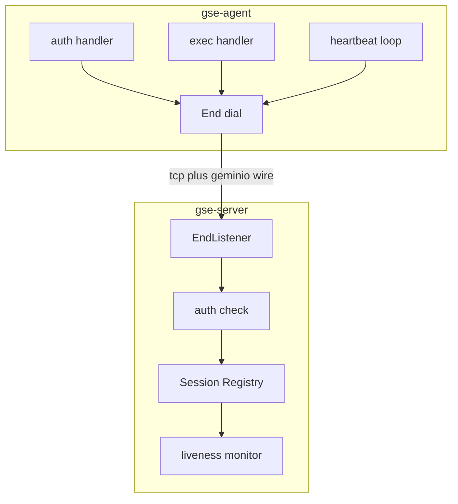

# GSE Server 与 Agent 最小闭环

Feature Name: gse-server-agent
Updated: 2026-09-05

## Description

实现 GSE 全局调度引擎的底座闭环：`gse-server` 与 `gse-agent` 两个二进制组件。

- `gse-server` 为上层模块（Task / File / Proc / Data）提供统一的 Agent 会话管理与信令上下行通道。
- `gse-agent` 部署在目标机器，主动外连 Server，接受下行指令并回传结果。

传输层采用 geminio-rs（singchia/geminio 的 Rust 移植）：单连接上实现双向 RPC、确认消息与流复用。v1 复用其双向 RPC 承载全部控制面信令。

v1 交付链路：Agent 主动连接 → 认证（agent-id + token）→ 心跳保活 → 会话管理 → 下行指令 / 上行回执，以 `ping/pong` 为例指令验证端到端。

## 技术选型

| 决策点 | 选择 | 说明 |
| --- | --- | --- |
| 传输协议 | geminio-rs（git 依赖） | 与 job 平台规划技术栈统一；双向 RPC 天然覆盖上下行 |
| geminio 引用方式 | `git = "https://github.com/singchia/geminio-rs"` | 0.1.0-dev 未发布 crates.io，锁定 git rev 保证可复现 |
| 代码组织 | workspace 新增 `bins/gse-server`、`bins/gse-agent`、`crates/gse-proto` | 共享 DTO 放入 gse-proto |
| 复用 dataplane | 配置加载复用 dataplane-core 模式，错误码复用 `DataplaneError` | 会话 v1 为内存态，暂不持久化 |
| 认证 | agent-id + token | Server 维护静态 token 表 |

## Architecture

### 拓扑

Agent 永远主动外连 Server，无公网入口的机器也能被管理。`geminio` 中 Agent 是 dial 方，Server 是 listen 方；连接建立后双向 RPC 均可发起。



### 会话状态机

```mermaid
stateDiagram-v2
    [*] --> "Authenticating"
    "Authenticating" --> "Online": auth ok
    "Authenticating" --> "Closed": auth fail
    "Online" --> "Checking": no msg 60s
    "Checking" --> "Online": heartbeat before 90s
    "Checking" --> "Offline": 90s no msg
    "Online" --> "Closed": conn closed
    "Checking" --> "Closed": conn closed
    "Offline" --> "Closed": session evicted
```

## Components and Interfaces

### crates/gse-proto

共享 DTO，序列化用 serde_json，通过 geminio 的 `Bytes` 载荷传输。

- `AuthRequest { agent_id: String, token: String }`
- `AuthReply { ok: bool, reason: Option<String> }`
- `Heartbeat { agent_id: String, ts_micros: i64 }`
- `Command { id: String, name: String, payload: Bytes }`
- `Receipt { command_id: String, ok: bool, message: Option<String> }`
- `GseError { code: String, message: String }`（对 `DataplaneError` 的别名映射）

### bins/gse-server

职责：监听、认证、会话注册、liveness、指令路由。

- `EndListener::bind(listen_addr, ListenOptions::default())` 后循环 `accept()`，每个连接 spawn 处理任务。
- 注册 RPC handler：`auth`、`heartbeat`。
- Agent 认证通过后，按 agent-id 将 `End` 存入会话注册表；拒绝的认证调用方返回 `AuthReply { ok: false }`。
- 对上层模块暴露 `SessionManager`（同进程 API，v1 无网络协议）：
  - `list_sessions() -> Vec<SessionInfo>`
  - `send_command(agent_id, name, payload) -> Result<Receipt, GseError>`
- 下行指令通过 `server_end.call("exec", serde_json(Command))`；`exec` 的 RPC 返回值即回执。
- liveness：每个会话记录 `last_seen`，心跳 `heartbeat` 或任意下行响应更新；超时窗口 90 秒。
- 配置：`listen` 地址、`auth.enabled`、Agent token 表（`[agents]` 段）、心跳区间与超时。环境变量覆盖前缀 `GSE_`。

### bins/gse-agent

职责：外连、认证、心跳、指令执行。

- `dial(server_addr, DialOptions::default())` 建立连接。
- 连接建立后先发起 `auth` RPC；被拒或网络错误则停止重连，以非零退出码结束。
- 注册 RPC handler：`exec`（v1 仅支持 `ping`，回传 `pong`；未知指令返回 `ok: false`）。
- 心跳循环：每 30 秒发起 `heartbeat` RPC。
- 断线重连：指数退避 1 秒至 60 秒，重连成功后重新认证并恢复心跳。
- 配置：`server_addr`、`agent_id`、`token`、心跳区间。环境变量覆盖前缀 `GSE_`。

### 复用 dataplane

- 配置解析顺序与 dataplane-core 一致：默认值 → TOML → 环境变量。
- 错误统一落到 `DataplaneError`（`code` 稳定字符串），RPC 回执出错时编码为 `GseError`。

## Data Models

### 会话注册表（内存）

```text
Session {
  agent_id: String,
  end: Arc<End>,
  state: SessionState,      // Online / Checking / Offline / Closed
  last_seen_micros: i64,
  connected_at_micros: i64,
}
```

- key：`agent_id`
- 不变量：每个 agent-id 至多一个活跃会话；新认证成功会替换旧会话。

### 认证表（配置文件）

```toml
[agents]
web-01 = "token-a"
web-02 = "token-b"
```

## Correctness Properties

- 认证失败或 agent-id 未登记，Server 不建立会话，Agent 停止重连并退出。
- 会话注册表保证同一 agent-id 只有一个活跃 `End`。
- v1 心跳间隔 30 秒、超时窗口 90 秒：Agent 侧 3 次心跳窗口内必须恢复，否则判离线。
- 下行指令的 RPC 超时即回执失败，不阻塞其他会话。
- 任意单条上行或下行消息失败只影响当前会话，不影响其他 Agent。
- geminio 单连接上的双向 RPC 天然保证请求与应答关联（消息标识由库维护）。

## Error Handling

| 场景 | 行为 |
| --- | --- |
| Agent 连接后认证被拒 | Server 回 `AuthReply{ok:false}`；Agent 以非零退出码结束 |
| Agent 连不上 Server | 指数退避重连，1–60 秒；持续失败期间本地不执行任务 |
| 指令目标离线 | `send_command` 返回 `GseError`，code `unavailable` |
| 未知指令（非 ping） | Agent 回 `Receipt{ok:false}`，message 含指令名 |
| 超时窗口内无心跳 | 会话置 Offline，通知订阅方（v1 仅日志） |
| 配置文件缺失或非法 | 进程退出码 1，stderr 含 `config_invalid` 与路径 |

## Test Strategy

- `gse-proto`：DTO 序列化往返。
- 认证：合法 token 建会话；非法 token / 未登记 id 拒绝。
- 会话唯一性：同 agent-id 重复认证后注册表仅一个活跃会话。
- 信令：Server 下发 `ping` 得 `pong`，回执携带相同 command-id。
- 心跳：Agent 周期心跳刷新 last_seen；停止心跳后按窗口转向 Checking → Offline。
- 重连：断连后 Agent 指数退避重连并重新认证。
- 双向可调用性：Agent 也能向 Server 发起 RPC（心跳即用例）。
- 集成测试在 CI 用两个进程（gse-server + gse-agent）跑通 auth + ping/pong。

## References

[^1]: Requirements - 当前工作区 `/.monkeycode/specs/gse-server-agent/requirements.md`
[^2]: geminio-rs README - 双向 RPC / 消息传递 / 流复用（Rust 移植，0.1.0-dev）
[^3]: geminio-rs `rpc_echo` 示例 - `EndListener::bind` / `accept` / `dial` / `register` / `call`