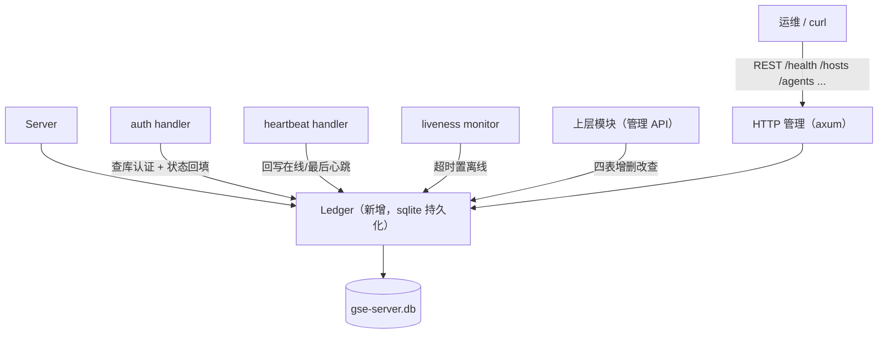

# GSE Server 资产台账（CMDB 化）

Feature Name: gse-server-cmdb
Updated: 2026-09-06

## Description

GSE Server 引入 sqlite 持久化的四张台账表，接管 Agent 预登记、查库认证与运行状态回写；接入点表同时承载 Server 自身信息登记，为后期多 Server 高可用预留。本期“只登记不选路”：Agent 仍通过本地配置直连当前 Server，接入点表仅作台账。台账经 gse-server-core 同进程 `Ledger` Rust API 支撑，并对外提供独立 HTTP 管理端口供运维预登记与查询。

## 架构

### 模块拓扑

gse-server-core 新增 `ledger` 模块，复用 dataplane-sql 的 `SqliteRelationalStore` 与 dataplane-core 的 `SqlValue`，在现有 auth / heartbeat / liveness 链路旁挂接回写；`http` 模块以 axum 暴露管理路由。



### 数据流

1. 启动：`Server::bind` 打开 `Ledger(db)`，执行建表 DDL，然后 upsert 本 Server 的接入点记录。
2. 认证：Agent 发起 `auth` → `handle_auth` 改查 `Ledger::check_auth(agent_id, token)`；通过则建会话并将 agents 状态置 online + 更新 last_heartbeat。
3. 心跳：`heartbeat` handler 在刷新会话 last_seen 的同时异步回写 agents 表。
4. 存活：liveness 将会话推进到 Offline 时同步将 agents 状态置 offline。
5. 管理：上层模块通过 `Server.ledger` 调用增删改查。

## 组件与接口

### crates/gse-server-core/src/ledger.rs

对 `SqliteRelationalStore` 的语义化封装，持有 `Arc<Mutex<Connection>>`（由 SqliteRelationalStore 内部提供），全部访问通过 `spawn_blocking` 落库。

```rust
pub struct Ledger { store: SqliteRelationalStore }

impl Ledger {
    pub fn new(db_path: &str) -> Result<Self, String>;
    pub async fn init(&self) -> Result<(), String>;          // 建表 + 迁移

    // hosts
    pub async fn upsert_host(&self, h: &Host) -> Result<(), GseError>;
    pub async fn get_host(&self, id: &str) -> Result<Option<Host>, GseError>;
    pub async fn list_hosts(&self) -> Result<Vec<Host>, GseError>;
    pub async fn remove_host(&self, id: &str) -> Result<(), GseError>;

    // access_points
    pub async fn upsert_access_point(&self, ap: &AccessPoint) -> Result<(), GseError>;
    pub async fn get_access_point(&self, id: &str) -> Result<Option<AccessPoint>, GseError>;
    pub async fn list_access_points(&self) -> Result<Vec<AccessPoint>, GseError>;
    pub async fn remove_access_point(&self, id: &str) -> Result<(), GseError>;

    // agents
    pub async fn upsert_agent(&self, a: &Agent) -> Result<(), GseError>;
    pub async fn get_agent(&self, id: &str) -> Result<Option<Agent>, GseError>;
    pub async fn list_agents(&self) -> Result<Vec<Agent>, GseError>;
    pub async fn remove_agent(&self, id: &str) -> Result<(), GseError>;

    // agents 运行态
    pub async fn check_auth(&self, agent_id: &str, token: &str) -> Result<bool, GseError>;
    pub async fn mark_online(&self, agent_id: &str, now: &str) -> Result<(), GseError>;
    pub async fn mark_heartbeat(&self, agent_id: &str, now: &str) -> Result<(), GseError>;
    pub async fn mark_offline(&self, agent_id: &str) -> Result<(), GseError>;

    // agent_configs
    pub async fn upsert_agent_config(&self, c: &AgentConfig) -> Result<(), GseError>;
    pub async fn get_agent_config(&self, agent_id: &str) -> Result<Option<AgentConfig>, GseError>;
    pub async fn list_agent_configs(&self) -> Result<Vec<AgentConfig>, GseError>;
}
```

### bins/gse-server 集成

- `Server` 新增 `ledger: Arc<Ledger>`。
- `Server::bind`：以 `cfg.db` 打开 Ledger、`init()` 建表、解析 `cfg.listen` 生成 `AccessPoint` 自登记。
- `handle_auth`：数据源切到 `ledger.check_auth`；认证通过后 `ledger.mark_online`。
- `handle_heartbeat`：会话 touch 之外调用 `ledger.mark_heartbeat`（异步，不阻塞 RPC 应答）。
- `run_liveness`：会话推进至 Offline 时 `ledger.mark_offline`。
- 配置文件 `[agents]` 段移除，认证开关 `auth_enabled` 保留。
- `Server::run` 同时启动 HTTP 管理服务（`http_enabled` 开启时）。

### crates/gse-server-core/src/http.rs

axum 0.8 实现的轻量管理路由，直接绑定 `Arc<Ledger>`。该模块不依赖会话层，仅操作台账。

| 方法 | 路径 | 说明 |
| --- | --- | --- |
| GET | `/health` | 存活探测 |
| GET / POST | `/hosts` | 主机列表 / 登记主机 |
| GET / DELETE | `/hosts/{host_id}` | 查询 / 删除单个主机 |
| GET / POST | `/access-points` | 接入点列表 / 登记 |
| GET / DELETE | `/access-points/{id}` | 查询 / 删除接入点 |
| GET / POST | `/agents` | Agent 列表 / 预登记 |
| GET / DELETE | `/agents/{agent_id}` | 查询（含运行状态）/ 删除 Agent |
| GET / POST | `/agent-configs` | 运行时配置列表 / 保存 |
| GET | `/agent-configs/{agent_id}` | 查询单个配置 |

- 请求/响应均为 JSON；`Host` / `AccessPoint` / `Agent` / `AgentConfig` 复用 ledger 模型（serde Serialize/Deserialize）。
- 登记接口做必填字段校验，失败返回 4xx + 错误消息。
- v1 管理接口不鉴权，仅监听内网/回环地址，`http_listen` 默认 `127.0.0.1:7101`。

### 配置变更（gse-server-core/src/config.rs）

| 配置项 | 默认值 | 环境变量 |
| --- | --- | --- |
| `db`（新增） | `gse-server.db` | `GSE_SERVER_DB` |
| `http_enabled`（新增） | `true` | `GSE_SERVER_HTTP_LISTEN`（设置即启用） |
| `http_listen`（新增） | `127.0.0.1:7101` | `GSE_SERVER_HTTP_LISTEN` |
| `[agents]`（移除） | - | - |
| 其余（listen/auth_enabled/heartbeat_*）不变 | - | - |

### Cargo 依赖

- `gse-server-core` 新增依赖：`dataplane-sql`（workspace）、`dataplane-core`（workspace，透传已有）、`axum = "0.8"`（与 apiserver 保持一致）、`serde/serde_json`（已有）。
- HTTP 测试需要 `tower` 的 `ServiceExt`（dev-dependencies）。

## 数据模型

### hosts

```sql
CREATE TABLE IF NOT EXISTS hosts (
  host_id   TEXT PRIMARY KEY,
  inner_ip  TEXT NOT NULL,
  hostname  TEXT NOT NULL DEFAULT '',
  os_type   TEXT NOT NULL DEFAULT '',
  os_version TEXT NOT NULL DEFAULT '',
  cpu_spec  TEXT NOT NULL DEFAULT '',
  mem_spec  TEXT NOT NULL DEFAULT '',
  created_at TEXT NOT NULL
);
```

### access_points

```sql
CREATE TABLE IF NOT EXISTS access_points (
  id         TEXT PRIMARY KEY,
  name       TEXT NOT NULL,
  server_ip  TEXT NOT NULL,
  rpc_port   INTEGER NOT NULL,
  file_port  INTEGER,
  data_port  INTEGER,
  created_at TEXT NOT NULL
);
```

`file_port` / `data_port` 本期占位，可为 NULL。

### agents

```sql
CREATE TABLE IF NOT EXISTS agents (
  agent_id      TEXT PRIMARY KEY,
  host_id       TEXT NOT NULL,
  access_point_id TEXT,
  token         TEXT NOT NULL,
  version       TEXT NOT NULL DEFAULT '',
  install_path  TEXT NOT NULL DEFAULT '',
  status        TEXT NOT NULL DEFAULT 'unknown',
  last_heartbeat_at TEXT,
  registered_at TEXT NOT NULL
);
```

`status` 取值：`online` / `offline` / `unknown`。token v1 明文存储，后续可哈希。

### agent_configs

```sql
CREATE TABLE IF NOT EXISTS agent_configs (
  agent_id       TEXT PRIMARY KEY,
  host_id        TEXT NOT NULL,
  cpu_limit_percent INTEGER,
  mem_limit_percent INTEGER,
  log_level      TEXT NOT NULL DEFAULT 'info',
  updated_at     TEXT NOT NULL
);
```

## 正确性属性

- 四表均以自然键（host_id / id / agent_id / agent_id）为主键，幂等 upsert。
- 认证以 `agents` 表为准：token 一致且状态无禁入概念；`auth_enabled=false` 时跳过校验仍建会话。
- agents 运行状态与会话状态一致：认证成功 Online、心跳保持 Online、liveness 超时 Offline。
- 单条 SQL 写入失败只影响该请求，`handle_heartbeat` 回写失败不阻断 RPC 应答（日志记录）。
- 建表/打开失败属于启动故障，Server 退出并记录原因。
- 本机并发写 sqlite 由 `SqliteRelationalStore` 内部 `Mutex` 串行化；跨进程写同一库不做文件锁（与 dataplane 约定一致）。

## 错误处理

| 场景 | 行为 |
| --- | --- |
| 数据库打开/建表失败 | Server 退出，退出码 1，stderr 含原因 |
| Ledger 查询失败 | 返回 `GseError`（映射自 `DataplaneError`），调用方可见 |
| 未登记 agent-id 认证 | `AuthReply{ok:false}`，Agent 停止重连退出 |
| token 不匹配 | 同上 |
| 心跳回写失败 | 仅记录日志，不影响认证/会话 |
| auth_enabled=false | 跳过 token 校验，正常建会话 |

## 测试策略

- 单元测试（`ledger.rs`）：建表 DDL 幂等；四表增删改查；upsert 幂等覆盖；check_auth 已登记/未登记/错 token。
- 认证测试：预登记通过、未登记拒绝、token 错误拒绝、auth 关闭直通。
- 状态回写测试：认证后 online+last_heartbeat；心跳推进 last_heartbeat；liveness 超时置 offline。
- 自登记测试：bind 后 access_points 含本 Server 一行；重复 bind 幂等。
- 配置测试：新增 `db` 字段默认值与 `GSE_SERVER_DB` 覆盖；`[agents]` 段不再被读取；`http_listen` 默认与覆盖。
- HTTP 接口测试：用 axum Router + `tower` 对 `/health`、四表增删改查做请求级断言（201/200/404、JSON 校验失败）。
- 集成测试：在真实 sqlite 临时库上重放现有 e2e（认证、心跳、ping/pong），并断言 agents 表状态随之变化。