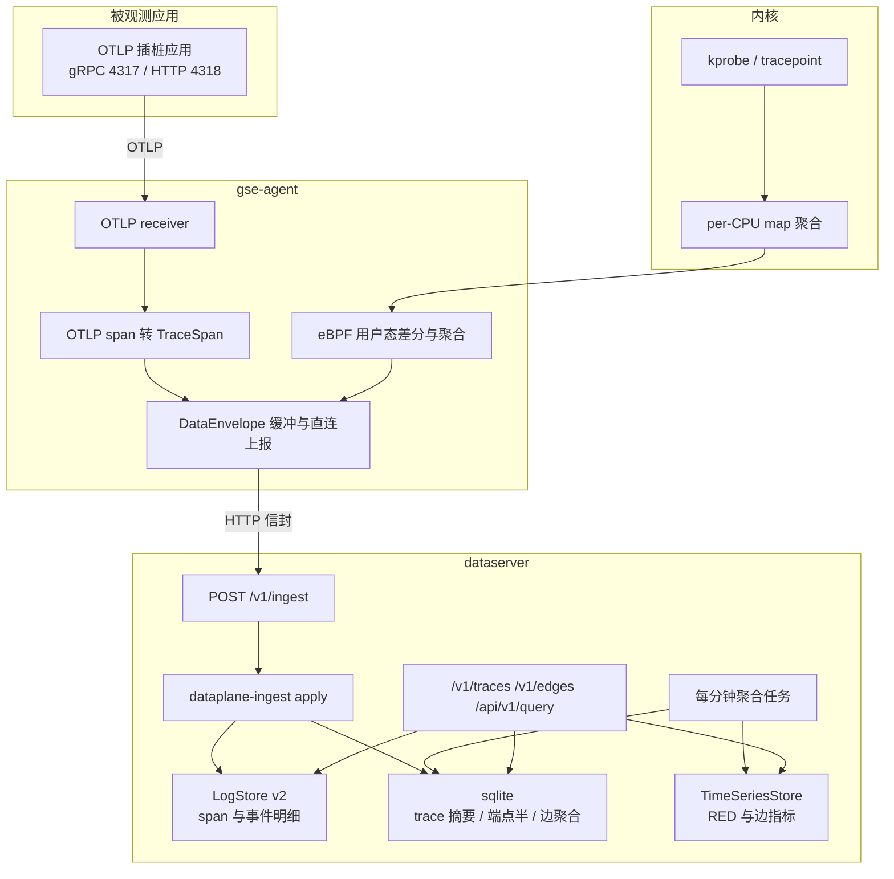
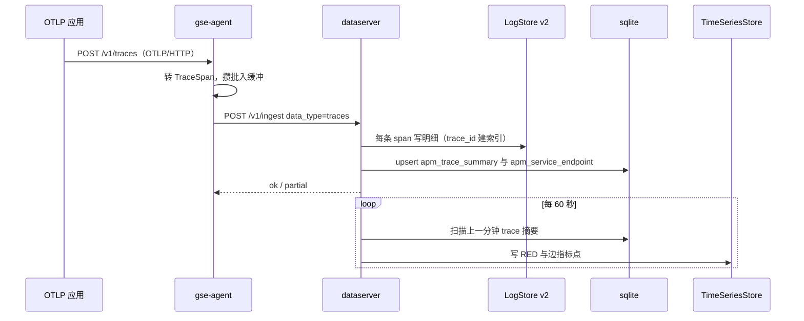

# 可观测共享数据模型

Feature Name: observability-data-model
Updated: 2026-09-23

## Description

本文件是 `apm-tracing` 与 `ebpf-observability` 两份 spec 的共享数据模型基线，只定义跨 feature 共用的部分：接入信封扩展、OTel span 映射、拓扑边统一模型、服务标识反查、聚合指标命名规范、以及共享存储能力变更（`LogStore` 索引版本 v2、sqlite 观测表、`TimeSeriesStore` 保留能力）。共享部分共涉及三份 spec：本文、`apm-tracing`、`ebpf-observability`；存储层能力由 `dataplane-ts-retention` 交付。

不单独承载可交付功能：接入链路（Agent 缓冲、直连上报、采集项下发）继承 `gse-dataplane-ingest`；trace 语义与查询语义归 `apm-tracing`；内核采集与聚合归 `ebpf-observability`。

本期只交付设计，不写代码。两份 spec 的 tasklist 均为待实施清单。

设计日期基线：`dataplane-ingest`、`dataplane-log`、`dataplane-ts`、`dataplane-sql` 与 `gse-agent-core` 的 2026-09-23 状态。

## Architecture



统一原则：Agent 只负责「采集 + 就近聚合 + 转封上行」，dataserver 负责「落库 + 关联 + 聚合 + 查询」。同一份服务拓扑来自两条独立通路（span 派生的 client/server 配对、eBPF 派生的连接边），通过指标 label `source` 区分与合并，不互相覆盖。

## Components and Interfaces

### 信封扩展

`DataEnvelope` 结构不变，`data_type` 取值扩展两个：

| data_type | records 元素 | 落库 | 承载 feature |
| --- | --- | --- | --- |
| `metrics` | `MetricRecord` | TimeSeriesStore | 既有 + eBPF 指标 |
| `logs` | `LogRecord` | LogStore | 既有 |
| `apm` | `ApmRecord` | LogStore | 既有，保留兼容，新链路不再使用 |
| `ebpf` | `EbpfRecord` | LogStore | 既有，eBPF 原始事件（默认关闭） |
| `traces` | `TraceSpan` | LogStore（明细）+ sqlite（摘要） | apm-tracing |
| `ebpf_edges` | `EbpfEdge` | sqlite（边聚合）+ TimeSeriesStore（边指标） | ebpf-observability |
| `ebpf_profiles` | `EbpfProfile` | FileStore（折叠栈压缩产物）+ sqlite 索引 | ebpf-observability（P3） |

兼容性：`data_type` 是 `enum` 序列化为字符串，旧 dataserver 收到新取值返回 `invalid_argument` 并整批拒绝。因此新类型上线要求 Agent 与 dataserver 同步升级；Agent 侧采集项默认关闭，未升级 dataserver 也不会有新类型流量。信封字段不新增、不删改，`records` 仍为 JSON 对象数组。

结构体归属：`TraceSpan` / `SpanEvent` / `SpanLink` / `EbpfEdge` 定义在本文；`EbpfProfile` 定义在 `/.monkeycode/specs/ebpf-observability/design.md`（P3）。

### TraceSpan（OTel 语义）

`data_type=traces` 的 records 元素。字段命名对齐 OpenTelemetry Trace 数据模型与语义约定，保留原始 OTLP 字段以便无损回溯。

```rust
struct TraceSpan {
    record_id: String,        // "{trace_id}:{span_id}"
    timestamp: i64,           // Unix 微秒 = start_unix_nano / 1000，信封与保留期用
    trace_id: String,         // 16 字节 hex，小写
    span_id: String,          // 8 字节 hex，小写
    parent_span_id: String,   // 根 span 为空串
    name: String,             // OTel span name
    kind: String,             // internal | server | client | producer | consumer
    start_unix_nano: i64,
    end_unix_nano: i64,
    status_code: String,      // unset | ok | error
    status_message: String,
    trace_flags: u8,          // 低 bit 为 sampled
    service: String,          // resource["service.name"]，缺失时 "unknown_service"
    resource: BTreeMap<String, String>,
    scope_name: String,
    scope_version: String,
    attributes: BTreeMap<String, String>,
    events: Vec<SpanEvent>,
    links: Vec<SpanLink>,
    dropped_attributes: u32,
    dropped_events: u32,
    dropped_links: u32,
    collector: String,        // otlp | ebpf
    labels: BTreeMap<String, String>,
}

struct SpanEvent { name: String, time_unix_nano: i64, attributes: BTreeMap<String, String> }
struct SpanLink  { trace_id: String, span_id: String, attributes: BTreeMap<String, String> }
```

字段映射固定规则（Agent 转封时执行，dataserver 不再改写）：

| 来源（OTLP） | 目标 | 规则 |
| --- | --- | --- |
| `resource.attributes["service.name"]` | `service` | 缺失取 `"unknown_service"`（对齐 OTel 默认值） |
| `resource.attributes` 全量 | `resource` | key 保持 OTel 原名（`k8s.pod.name`、`host.name`、`deployment.environment` 等） |
| `instrumentation_scope.name/version` | `scope_name` / `scope_version` | 直取 |
| `attributes`（span 级） | `attributes` | AnyValue 统一字符串化：整数、浮点、布尔转字面量；数组按 JSON 字符串；不支持嵌套对象，超一层转 JSON |
| `events` / `links` | `events` / `links` | 全量保留，`time_unix_nano` 直取 |
| `dropped_*_count` | `dropped_attributes/events/links` | 直取，用于判断数据是否被截断 |
| `status.code` | `status_code` | `STATUS_CODE_UNSET/OK/ERROR` → `unset/ok/error` |
| `trace_id` / `span_id` | 同名字段 | 强制小写 hex；长度非 32/16 视为非法记录 |

字符集与长度约束：单条序列化后超过 256 KiB 记入 `IngestReply.failures`（`code=invalid_argument`），不做静默截断；`attributes` 与 `events` 的条数上限由 Agent 采集项控制（见 apm-tracing），转封时不额外裁剪。

### EbpfEdge（拓扑边统一模型）

`data_type=ebpf_edges` 的 records 元素。一条记录代表一个「聚合桶」（默认 10 秒）内的同一条连接边，不产生每连接事件。

```rust
struct EbpfEdge {
    record_id: String,        // "{agent_id}:{bucket_start_micros}:{src_ip}:{src_port}:{dst_ip}:{dst_port}:{protocol}"
    timestamp: i64,           // bucket 起点，Unix 微秒
    bucket_micros: i64,       // 桶宽，默认 10_000_000
    protocol: String,         // tcp | udp
    src_ip: String,
    src_port: u16,
    dst_ip: String,
    dst_port: u16,
    src_pod: String,          // cgroup → 容器/Pod，取不到为空
    src_container_id: String,
    src_process: String,      // 发起方进程名
    src_service: String,      // Agent 侧取不到时为空，dataserver 反查回填
    dst_service: String,      // 同上
    connections: u64,         // 桶内新建连接数
    bytes_sent: u64,
    bytes_recv: u64,
    duration_micros_sum: u64, // 桶内连接存续时长之和
    duration_micros_max: u64,
    tcp_retrans: u64,
    tcp_resets: u64,
    failures: u64,            // 连接失败数
    failure_reason: String,   // ok | refused | timeout | unreachable | ""
    latency_hist: Vec<u64>,   // log2 直方图槽，槽 i 表示 [2^i, 2^(i+1)) 微秒
    source: String,           // 固定 "ebpf"
    labels: BTreeMap<String, String>,
}
```

不变量：`record_id` 在同一 Agent 内唯一且幂等（同桶重发被 KvStore 去重）；`connections >= 1`；`failures <= connections`；`latency_hist` 槽位下标上限由 Agent 采集项 `hist_slots` 控制（默认 24）。

### 服务标识与反查

OTLP 与 eBPF 两路数据的服务名对齐依赖一张端点半表，由 dataserver 维护，是拓扑合并的唯一依据。

```sql
CREATE TABLE IF NOT EXISTS apm_service_endpoint (
  service         TEXT NOT NULL,
  instance_id     TEXT NOT NULL,
  pod_name        TEXT NOT NULL DEFAULT '',
  node_name       TEXT NOT NULL DEFAULT '',
  host_ip         TEXT NOT NULL DEFAULT '',
  listen_port     INTEGER NOT NULL DEFAULT 0,
  collector       TEXT NOT NULL,      -- otlp | ebpf
  first_seen_ts   INTEGER NOT NULL,
  last_seen_ts    INTEGER NOT NULL,
  PRIMARY KEY (service, instance_id)
);
CREATE INDEX IF NOT EXISTS apm_service_endpoint_ip_port ON apm_service_endpoint(host_ip, listen_port);
```

静态服务名映射表（可在前端配置，供无插桩应用与未识别 IP 归一，见下文「反查顺序」）：

```sql
CREATE TABLE IF NOT EXISTS apm_service_alias (
  alias_id      TEXT PRIMARY KEY,   -- 服务端生成
  match_kind    TEXT NOT NULL,      -- process_name | process_prefix | pod_prefix | cidr
  match_value   TEXT NOT NULL,      -- 进程名 / 前缀 / Pod 名前缀 / CIDR
  service       TEXT NOT NULL,      -- 目标服务名
  enabled       INTEGER NOT NULL DEFAULT 1,
  note          TEXT NOT NULL DEFAULT '',
  updated_ts    INTEGER NOT NULL
);
CREATE INDEX IF NOT EXISTS apm_service_alias_match ON apm_service_alias(match_kind, match_value);
```

写入路径：

1. OTLP：每次写入 span 时，用 `resource["service.name"]`、`resource["service.instance.id"]`（缺失用 `service + pod_name` 合成）、`resource["k8s.pod.name"]`、`resource["k8s.node.name"]`、`resource["host.ip"]` upsert 一行，`collector=otlp`。
2. eBPF：Agent 只能提供 `dst_ip`、`dst_port`、`dst_pod`、`src_process`。dataserver 写边时按固定反查顺序：
   1. 静态映射 `apm_service_alias`（`enabled=1`）：按 `process_name` → `process_prefix` → `pod_prefix` → `cidr` 逐类命中，同类多条时取 `updated_ts` 最新者；
   2. 动态端点表 `apm_service_endpoint`：先 `(host_ip, listen_port)` 精确命中，再 `(pod_name)` 命中；
   3. 都未命中时落 `unknown-<ip>`。

   命中后回填 `src_service` / `dst_service` 并落库；反查到 `unknown-*` 时不写入端点表，避免污染。
3. 反查结果在 dataserver 内存中缓存 60 秒（包括未命中的负面结果），避免每批一次 sqlite 查询。
4. 静态映射表变更后立即失效缓存（前端保存时通过 `gse_admin_url` 同源接口触发版本号递增），使配置修改无需重启 dataserver。

该表保留期与 APM 聚合一致（默认 30 天，独立于 trace 明细的 3 天），因为服务名映射需要长期稳定。

### 聚合指标命名规范

Prom 查询侧通过 `TimeSeriesStore` 暴露。约束来自现有引擎：一个 point 只有一个数值 field（`TsPoint.field_value: f64`），没有 histogram 类型，因此所有指标都是 1 分钟粒度的标量点，分位数由 dataserver 聚合时算好，用 `field_name` 区分。

多值指标（同一 measurement 下要暴露多个数值）用 **label `field`** 区分，`TsPoint.field_name` 固定为 `value`。原因见下方 Pitfalls：tsink 里 field 不是序列身份，同 measurement+labels 的不同 `field_name` 会互相覆盖（实测一次 instant 查询只剩最后写入的那一个）。

| measurement | `field` label | 维度 labels | 来源 | feature |
| --- | --- | --- | --- | --- |
| `apm_service_requests_total` | `value` | `service` `operation` `span_kind` `status` `source` | spans | apm-tracing |
| `apm_service_errors_total` | `value` | `service` `operation` `span_kind` `source` | spans | apm-tracing |
| `apm_service_duration_micros` | `avg` `p50` `p95` `p99` `max` | `service` `operation` `span_kind` `source` | spans | apm-tracing（耗时按状态合并：labels 无 `status`） |
| `apm_edge_requests_total` | `value` | `src_service` `dst_service` `span_kind` `status` `source` | spans + ebpf | 共享 |
| `apm_edge_errors_total` | `value` | `src_service` `dst_service` `span_kind` `source` | spans + ebpf | 共享 |
| `apm_edge_duration_micros` | `avg` `p95` | `src_service` `dst_service` `span_kind` `source` | spans | 共享 |
| `ebpf_edge_bytes_total` | `value` | `src_service` `dst_service` `src_ip` `dst_ip` `dst_port` `protocol` `direction` | ebpf | ebpf-observability |
| `ebpf_edge_connections_total` | `value` | `src_service` `dst_service` `dst_port` | ebpf | ebpf-observability |
| `ebpf_tcp_retrans_total` | `value` | `src_service` `dst_service` | ebpf | ebpf-observability |
| `ebpf_tcp_failures_total` | `value` | `src_service` `dst_service` `reason` | ebpf | ebpf-observability |
| `ebpf_process_exec_total` | `value` | `process_name` `service` `container_id` | ebpf | ebpf-observability |
| `ebpf_process_exit_total` | `value` | `process_name` `service` `container_id` `exit_code` | ebpf | ebpf-observability |
| `ebpf_syscall_duration_micros` | `avg` `p95` | `op` `process_name` `service` | ebpf | ebpf-observability（P2） |
| `ebpf_syscall_failures_total` | `value` | `op` `errno` `service` | ebpf | ebpf-observability（P2） |
| `ebpf_dns_duration_micros` | `avg` `p95` | `query_name` `rcode` `service` | ebpf | ebpf-observability（P2） |
| `ebpf_dns_timeouts_total` | `value` | `service` | ebpf | ebpf-observability（P2） |
| `ebpf_cpu_profile_samples_total` | `value` | `service` `process_name` | ebpf | ebpf-observability（P3） |

命名规则：单位后缀出现在 measurement 中（`_micros` / `_bytes`），不放在 field 名；`total` 结尾表示「该分钟桶内的计数」（非累积计数器），查询侧用 `sum by (...)` 聚合；`source` 固定为 `otlp` 或 `ebpf`，拓扑页需要合并两路时用 `sum by (src_service, dst_service)`。

拓扑合并查询（前端固定表达式）：

```promql
sum by (src_service, dst_service) (apm_edge_requests_total)
sum by (src_service, dst_service) (apm_edge_duration_micros{field="p95"})
```

同一分钟内两路都有数据时求和是刻意行为：两路观测到的调用属于同一逻辑边。若需要区分来源，加 `source="otlp"` 或 `source="ebpf"`。

### 共享存储能力变更

#### LogStore 索引版本 v2

现状缺陷（2026-09-23 代码）：`crates/dataplane-log` 的 schema 只有 `timestamp`、`level`、`message`、`id` 参与索引，`labels` 存为 `labels_json` 且注册为 `STORED`（非索引）。`search` 的实现是先按时间/level/message 取 `TopDocs`（上限常量 `MAX_LIMIT = 1000`），再在应用层对 `labels` 做 post-filter。因此按 `trace_id` 拉一个 trace 的全部 span 在实现上不可行：命中的 span 会被 TopDocs 截断，且扫描上限与 trace 的 span 数无关。`delete_matching` 走 `DELETE_SCAN_LIMIT = 100_000` 的同一条 post-filter 路径。

v2 变更：

| 变更 | 内容 |
| --- | --- |
| 新增索引字段 | `trace_id`、`service`、`data_id`，三者均为 `STRING \| INDEXED \| STORED`；`data_id` 用于按采集项定位与保留期清理 |
| 新增 trait 方法 | `async fn search_indexed(&self, filter: IndexedLogFilter) -> Result<Vec<LogRecord>, DataplaneError>`，全部条件走倒排索引，不做 post-filter |
| 时间排序 | `IndexedLogFilter.order` 支持 `asc` / `desc`（瀑布图与列表用 asc，检索页用 desc）；实现用 `TopDocs::with_limit(n).order_by_fast_field(timestamp)` |
| 明细上限 | `IndexedLogFilter.limit` 默认 100、上限 10_000（trace 详情需要一次拉完一个 trace） |
| 版本文件 | `{data_path}/logs/schema_version` 写入 `2`；打开时版本不符或文件缺失且目录已有索引 → 在 `{data_path}/logs-v2/` 新建索引，旧目录保留只读，stderr 输出一行 `log index schema upgraded: rebuilding into logs-v2, old index kept at logs` |
| 不再静默降级 | 版本不符时不复用旧目录，避免 v2 字段 `get_field` 失败导致启动错误 |

```rust
struct IndexedLogFilter {
    from_ts: Option<i64>,
    to_ts: Option<i64>,
    trace_id: Option<String>,
    service: Option<String>,
    data_id: Option<String>,
    level: Option<String>,
    message_query: Option<String>,
    limit: usize,
    order: TimeOrder, // Asc | Desc
}
```

`LogFilter`（含 post-filter 的 labels 全匹配）保留，供通用日志检索与 `delete_matching` 继续使用；`delete_matching` 增加「重复调用直到返回 0」的循环约定，写入两份 spec 的清理任务。

索引重建影响：按 3 天明细保留，重建成本可接受；重建窗口内 trace 详情可能缺历史数据，前端展示 `partial` 标记（`apm_trace_summary.span_count` 与实际返回条数不一致时提示）。

#### sqlite 观测表

`RelationalStore` 只有 `execute(sql, params)`，无迁移框架。观测表由 dataserver 启动时执行 `CREATE TABLE IF NOT EXISTS` + `INSERT OR IGNORE` 版本行完成初始化。

```sql
CREATE TABLE IF NOT EXISTS obs_schema_meta (
  key   TEXT PRIMARY KEY,
  value TEXT NOT NULL
);
-- key = 'schema_version'，value = '1'

CREATE TABLE IF NOT EXISTS apm_trace_summary (
  trace_id         TEXT PRIMARY KEY,
  start_ts         INTEGER NOT NULL,   -- 该 trace 全部 span 的最小 start（微秒）
  max_end_ts       INTEGER NOT NULL DEFAULT 0, -- 最大 end（微秒），duration 由两者相减重算
  duration_micros  INTEGER NOT NULL,
  root_service     TEXT NOT NULL,
  root_operation   TEXT NOT NULL,
  root_start_ts    INTEGER NOT NULL DEFAULT 0, -- 当前根 span 的 start，用于跨 flush 比较
  span_count       INTEGER NOT NULL,
  error_count      INTEGER NOT NULL,
  status           TEXT NOT NULL,       -- ok | error
  services_json    TEXT NOT NULL,       -- ["gateway","order-api"]
  collector        TEXT NOT NULL,       -- otlp | ebpf
  agent_id         TEXT NOT NULL,
  host_id          TEXT NOT NULL DEFAULT '',
  data_id          TEXT NOT NULL,
  updated_ts       INTEGER NOT NULL
);
CREATE INDEX IF NOT EXISTS apm_trace_summary_start ON apm_trace_summary(start_ts);
CREATE INDEX IF NOT EXISTS apm_trace_summary_duration ON apm_trace_summary(duration_micros);
CREATE INDEX IF NOT EXISTS apm_trace_summary_root ON apm_trace_summary(root_service, root_operation);

CREATE TABLE IF NOT EXISTS ebpf_edges (
  agent_id         TEXT NOT NULL,
  bucket_ts        INTEGER NOT NULL,
  protocol         TEXT NOT NULL,
  src_ip           TEXT NOT NULL,
  src_port         INTEGER NOT NULL,
  dst_ip           TEXT NOT NULL,
  dst_port         INTEGER NOT NULL,
  src_service      TEXT NOT NULL,
  dst_service      TEXT NOT NULL,
  src_pod          TEXT NOT NULL DEFAULT '',
  src_process      TEXT NOT NULL DEFAULT '',
  connections      INTEGER NOT NULL,
  failures         INTEGER NOT NULL,
  bytes_sent       INTEGER NOT NULL,
  bytes_recv       INTEGER NOT NULL,
  duration_sum     INTEGER NOT NULL,
  duration_max     INTEGER NOT NULL,
  tcp_retrans      INTEGER NOT NULL,
  tcp_resets       INTEGER NOT NULL,
  failure_reason   TEXT NOT NULL DEFAULT '',
  labels_json      TEXT NOT NULL DEFAULT '{}',
  PRIMARY KEY (agent_id, bucket_ts, src_ip, src_port, dst_ip, dst_port, protocol)
);
CREATE INDEX IF NOT EXISTS ebpf_edges_bucket ON ebpf_edges(bucket_ts);
CREATE INDEX IF NOT EXISTS ebpf_edges_svc ON ebpf_edges(src_service, dst_service, bucket_ts);
```

`obs_schema_meta` 的版本在满足以下任一条件时递增：列增删、主键变化、语义变化。dataserver 启动读到更高版本时以 `config_invalid` 退出，不做自动降级。

已发生的版本变更：

| 版本 | 变更 | 原因 |
| --- | --- | --- |
| 2 | `apm_trace_summary` 增加 `root_start_ts` | 摘要按「根 span 取 `start_ts` 最小者」维护，根可能晚到或跨多次 flush 才到，必须把当前根的 start 也存下来才能比较；`ALTER TABLE ... ADD COLUMN` 由 dataserver 启动时的迁移步骤执行（新库的 CREATE 已含该列，重复列错误被忽略） |

#### TimeSeriesStore 保留能力（本期交付）

现状（2026-09-23）：`TimeSeriesStore` trait 只有 `write` / `query_instant` / `query_range`，`TsinkTimeSeriesStore::new` 只设了 `data_path` 与 `TimestampPrecision::Microseconds`，因此聚合指标**无法按保留期清理**。

底层 tsink 0.10.2 已具备所需能力，只是没被启用与透出：

| tsink 能力 | 现状 | 用途 |
| --- | --- | --- |
| `StorageBuilder::with_retention(Duration)` | 缺省 14 天但 `retention_enforced = false`，即窗口存在但不执行 | 全局保留窗口 |
| `Storage::delete_series(SeriesSelection)` | 本地引擎由 engine 的 `deletion` 模块实现（trait 默认实现返回 `InvalidConfiguration`） | 按 measurement + label matchers + 时间范围写墓矴 |
| `StorageBuilder::with_cardinality_limit` / `with_memory_limit` / `with_wal_size_limit` | 缺省均为不限 | 基数与内存保护 |
| `Storage::observability_snapshot()` | 未透出 | 保留/内存/WAL/compaction 统计 |

因此本项由新增的第 4 份 spec **`/.monkeycode/specs/dataplane-ts-retention/`** 交付，本期不再列为外部依赖：

1. `TimeSeriesStore` 新增 `delete_series(TsSeriesSelection)` 与 `storage_stats()`；`TsinkTimeSeriesStore::new` 改为接受 `TsRetentionConfig`。
2. `dataserver` 配置项 `ts_retention_days`（默认 30）、`ts_retention_enforced`（默认 true）、`ts_cardinality_limit`（默认 2_000_000）与 `dataserver_ts_*` 自监控指标。
3. `apm-tracing` 与 `ebpf-observability` 的聚合指标清理改为依赖该 spec，并在各自的清理任务章节引用。

注意语义边界：tsink 的保留窗口是全局的，不是按序列；「每个采集项不同保留期」由 `delete_series` 的定时墓矴实现（全局窗口 + 按 `item_id` matcher 补齐），代价是删除只写墓矴、磁盘由 compaction 回收，不立即释放。

## Data Models

### 端到端数据流



### 幂等与去重

现有 `apply` 用 KvStore `ingest/{record_id}` 去重，新类型沿用：

- `traces`：`record_id = "{trace_id}:{span_id}"`，重复上报不重复写明细；`apm_trace_summary` 的 `start_ts` 取全部 span 的最小 start、`max_end_ts` 取最大 end，`duration_micros` 由两者相减重算（维护方式见 `apm-tracing` 的摘要累加器）。
- `ebpf_edges`：`record_id` 同上；桶记录天然可重放，重复写入时 sqlite 用主键冲突覆盖（后写覆盖前写，同一桶数据应一致）。

### 时间语义

| 场景 | 字段 | 单位 |
| --- | --- | --- |
| 信封记录时间、保留期、时间过滤 | `timestamp` | Unix 微秒 |
| span 精确起止 | `start_unix_nano` / `end_unix_nano` | Unix 纳秒 |
| span 事件时间 | `SpanEvent.time_unix_nano` | Unix 纳秒 |
| 聚合桶 | `EbpfEdge.timestamp` / `bucket_micros` | Unix 微秒 |
| 聚合指标点 | `TsPoint.timestamp` | Unix 微秒，桶起点 |

`timestamp = start_unix_nano / 1000` 的整除截断是唯一允许的精度损失，反查精确时间用 `start_unix_nano`。

## Correctness Properties

- 信封字段不新增：任一新类型记录都带 `record_id` 与 `timestamp`，旧校验逻辑（`data_type`/`agent_id`/非空 `records`）继续成立。
- 同一 `record_id` 重放：`traces` 不新增明细、不增加 `apm_trace_summary.span_count`；`ebpf_edges` 覆盖同桶。
- 一个 trace 的 span 可一次取全：`search_indexed({trace_id, order: asc, limit: 10000})` 返回条数等于 `apm_trace_summary.span_count`（除非索引重建窗口）。
- `parent_span_id` 为空的 span 只有一个被认作根：同 trace 多个根时取 `start_ts` 最小者，`apm_trace_summary.status` 在该 trace 任一 span `status_code=error` 时为 `error`。
- 服务名映射稳定：同一 `(host_ip, listen_port)` 在端点表生命周期内反查结果不变；表过期后新数据回落 `unknown-<ip>`。
- 指标单位一致：所有 `*_micros` 指标值为微秒，所有 `*_bytes` 为字节，所有 `*_total` 为该分钟桶计数。
- `source` label 只取 `otlp` 或 `ebpf`；合并查询不需要额外条件即可跨源求和。
- 旧 `data_type=apm` 数据仍可查询，且不参与新的 `apm_service_*` 聚合。

## Error Handling

| 场景 | 行为 |
| --- | --- |
| span 缺 `trace_id` / `span_id` 或长度不符 | 该条记入 `IngestReply.failures`（`invalid_argument`），其余记录继续，`status=partial` |
| 单条 span 序列化超过 256 KiB | 同上，不截断 |
| `service.name` 缺失 | 落 `unknown_service`，不拒绝 |
| `ebpf_edges` 桶字段缺失 | 整条失败记 `failures`，其余继续 |
| Agent 侧取不到服务名 | 留空，由 dataserver 反查；反查失败落 `unknown-<ip>` |
| sqlite 写失败 | 整批返回 `query_failed`，Agent 退避重试；LogStore 明细可能已写入，靠幂等去重避免重复 |
| `obs_schema_meta` 版本高于代码支持 | dataserver 启动以 `config_invalid` 退出，stderr 一行说明 |
| LogStore 索引版本不符 | 新建 `logs-v2/`，旧目录保留，stderr 一行；服务继续启动 |
| 聚合点超保留窗口 | 由 `dataplane-ts-retention` 处理：`write` 返回 `invalid_argument`，接入应答记入 `failures`；`ts_retention_enforced` 缺省 true |
| 聚合指标基数达上限 | `write` 返回 `query_failed` 含 `cardinality`；靠 `dataserver_ts_series_count` 监控 |
| trace 详情返回条数少于 `span_count` | 响应带 `partial: true` 与 `expected_span_count` |

## Test Strategy

共享模型的测试项由两份 spec 的实现阶段覆盖，本文件只列口径：

- 信封往返：六种 `data_type` 各一条 JSON 往返，字段不丢。
- OTel 映射：构造带 `resource`、`attributes`（含 int/float/bool/array/嵌套对象）、`events`、`links`、`dropped_*_count` 的 span，断言映射表逐行成立。
- `trace_id` / `span_id` 大小写归一：大写输入产出小写存储，重复上报判定为同一条。
- `search_indexed`：写 3 个 trace 各 5 条 span 与 20 条普通日志，断言按 `trace_id` 只回该 trace 的 5 条、`limit=10000` 不被截断、`order=asc` 按 `timestamp` 升序。
- 索引版本：用 v1 schema 目录启动，断言新建 `logs-v2/` 且旧目录未被改写。
- 端点反查：先写 OTLP span 建立 `apm_service_endpoint`，再写同 `(host_ip, listen_port)` 的 eBPF 边，断言 `dst_service` 被回填；清空端点表后断言回落 `unknown-<ip>`。
- 幂等：同一 `record_id` 的 `traces` 重放两次，`apm_trace_summary.span_count` 仍为 1。
- 指标命名：跑一次聚合，断言 measurement、`field_name`、维度 label 与规范表一致，且所有 `*_micros` 值为微秒量级。
- 合并查询：同一分钟 otlp 与 ebpf 各写一条边指标，`sum by (src_service,dst_service)` 等于两者之和。
- 版本与兼容：新类型发往未升级 dataserver 返回 `invalid_argument` 且不落库。

## References

[^1]: 采集接入与信封 - 当前工作区 `/.monkeycode/specs/gse-dataplane-ingest/design.md`
[^2]: 存储分层 - 当前工作区 `/.monkeycode/specs/dataplane-layered-storage/design.md`
[^3]: APM 需求与实现设计 - 当前工作区 `/.monkeycode/specs/apm-tracing/design.md`
[^4]: eBPF 需求与实现设计 - 当前工作区 `/.monkeycode/specs/ebpf-observability/design.md`
[^5]: 日志存储实现 - 当前工作区 `crates/dataplane-log/src/lib.rs`
[^6]: 时序存储实现 - 当前工作区 `crates/dataplane-ts/src/lib.rs`
[^7]: 时序保留与删除 - 当前工作区 `/.monkeycode/specs/dataplane-ts-retention/design.md`
