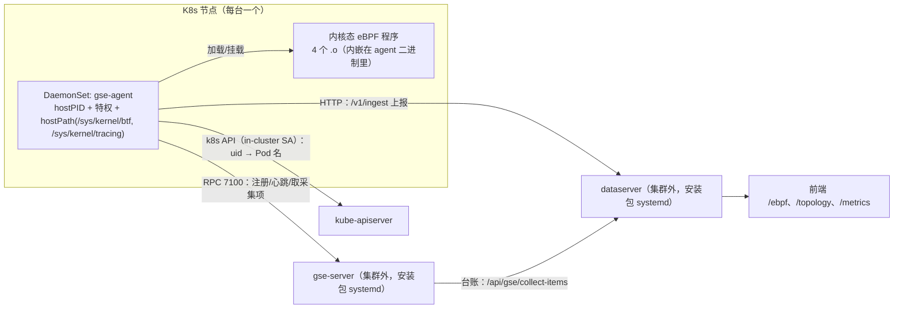

# 设计：可观测加固与真集群验证

**Feature Name:** observability-hardening
**Updated:** 2026-09-25

## Description

本 feature 不新增采集能力，做三件事：

1. **把验证范围从单机扩到真集群**：以 DaemonSet 形态在自建 Kubernetes 集群（节点内核 ≥5.8、带 BTF）
   部署 gse-agent，验证 eBPF 四类采集项可用、**容器/Pod 反查**与**服务名归一到 Pod 名**在真集群成立、
   卸载无残留；
2. **把容量口径写成可验收判据**：定义「不丢数据」的判据（四项丢弃计数 + 采集侧与接入侧对账），
   在真实负载下**被动观测**（不造压）并记录实测规模；
3. **把规格与实现对齐**：修正需求 9.3 的旧差分口径、设计里的图表选型与不存在的占位路由，
   收口 DNS 的挂载点/覆盖面冲突，并明确记录本版**不做**的事项（浏览器 e2e、helm charts、DNS、P3）。

代码改动仅限于：新增一份最小 K8s 清单、删除悬空的工作流、文档修正。**不改任何已交付采集项的数据模型与指标命名。**

## Architecture



**目标平台（2026-09-25 用户确认为 cloud3 的 k3s 单节点）**。已在该集群用只读短命 Pod 实测前提：

| 项 | 实测 | 对清单的影响 |
| --- | --- | --- |
| 内核 | `6.8.0-48-generic`（Ubuntu 24.04，k3s v1.37，containerd） | 满足 ≥ 5.8；BPF 内存走 memcg 记账（不受 `ulimit -l` 的 8 MiB 限制） |
| BTF | `/sys/kernel/btf/vmlinux` 存在（6.0 MB） | hostPath 挂 `/sys/kernel/btf` 可行 |
| tracefs | `/sys/kernel/tracing/events/sock/inet_sock_set_state/format` 可读 | hostPath 挂 `/sys/kernel/tracing` 可行（代码读的就是这个路径） |
| hostPID | 容器内可见 271 个宿主进程 | 容器/Pod 反查前提成立 |
| 特权 | `CapEff` 全量 | `privileged: true` 生效 |
| registry | **集群内没有 registry** | 镜像走 `docker save \| ssh <node> k3s ctr images import -`（k3s 官方方式） |

要点：

- **（2026-09-25 用户决定，口径更新）server 侧整体上集群**：gse-server / dataserver / console 以
  Deployment（单副本、`strategy: Recreate`）+ NodePort Service 跑在 k3s 里，数据走
  节点 hostPath（`/opt/vectorman-k8s/*`），web dist 打进镜像（不再挂载）。
  Agent 的 `server_addr` 指向 `vectorman.xiaoyxq.top:30710`（RPC NodePort，域名只做 DNS A 解析）。
  材料见 `packaging/deploy/k8s/server-stack.yaml` 与 README 第 5b 节（含 cloud3 实测结论）。
  CLI（`dpc`/`vmctl`）不进集群；helm 化仍排 v1.3。
- **（2026-09-26 更新，已知风险）dataserver 无鉴权对外**：`config.toml` 的 `[auth] enabled = false`，
  公网入口 `https://dataserver.xiaoyxq.top` 只经 Traefik 加 TLS，**没有认证**。
  实测已存在公网主动探测（cloud2 的 8081 上有非本项目主机的长连接）。
  收敛方式与 gse-server 对齐：开 `[auth] enabled = true` + 客户端带 token；
  登记为 tasklist 1.19（用户决定本轮不做）。**在此之前，dataserver 的对外入口等同公开接口。**
- **（2026-09-26 更新）发布口径改为 cops CD**：server 侧的期望状态由 cops 仓库的
  `apps/vectorman/k8s.yaml`（`DEPLOY_MODE=k8s / DEPLOY_TARGET=cloud3`）管理，与
  `server-stack.yaml` **同构**（同为 18 个对象）。`server-stack.yaml` 保留为
  「不经 cops 的手工部署参考」。
  差异只有三处：镜像来自 `ghcr.io/abrance/vectorman-server:<tag>`（取代本地导入）、
  配置放在 `k8s.yaml` 内的 ConfigMap（取代 `conf/*.toml` 同步到主机）、
  Deployment 的 podTemplate 带 ConfigMap checksum 注解（内容变则自动滚动）。
- **Agent 看到的是宿主机视图**：`hostPID: true` 让容器内 `/proc` 即宿主机 procfs，
  因此 `crates/gse-agent-ebpf/src/cgroup.rs` 读 `/proc/<pid>/cgroup` 能拿到宿主机的 cgroup 路径
  （含 `pod<uid>` 与容器 ID），无需额外挂载 `/proc`，也不需要改代码。
- **Pod 名反查**复用既有实现：`collect/k8s.rs::list_pod_name_index`（`uid → name`，命名空间为空时列全部）
  + `cgroup::ProcessResolver::with_pod_names`（TTL 300s）；凭据走 in-cluster ServiceAccount，RBAC 只给 `pods get/list`。

## Components and Interfaces

### 新增：`packaging/deploy/k8s/`

一份自包含的最小清单 + 造镜像脚本 + 操作文档（`kubectl apply -f` 即可）：

```
Dockerfile                   # FROM scratch + 静态 musl 二进制
build-image.sh               # 造镜像；--import <ssh-host> 直接送进 k3s
gse-agent-daemonset.yaml     # 下面这 6 个对象
README.md                    # 节点前提核验、造镜像、台账登记、apply/灰度、验证、回滚、已知限制
```

清单里共 7 个对象（Namespace / ServiceAccount / ClusterRole / ClusterRoleBinding / ConfigMap / Secret / DaemonSet）：

```yaml
apiVersion: v1
kind: Namespace
metadata: { name: vectorman }
---
apiVersion: v1
kind: ServiceAccount
metadata: { name: gse-agent, namespace: vectorman }
---
apiVersion: rbac.authorization.k8s.io/v1
kind: ClusterRole
metadata: { name: gse-agent-pods-read }
rules:
  - apiGroups: [""]
    resources: ["pods"]
    verbs: ["get", "list"]
---
apiVersion: rbac.authorization.k8s.io/v1
kind: ClusterRoleBinding
metadata: { name: gse-agent-pods-read }
roleRef: { apiGroup: rbac.authorization.k8s.io, kind: ClusterRole, name: gse-agent-pods-read }
subjects:
  - { kind: ServiceAccount, name: gse-agent, namespace: vectorman }
---
apiVersion: v1
kind: ConfigMap
metadata: { name: gse-agent-conf, namespace: vectorman }
data:
  gse-agent.toml: |
    server_addr = "vectorman.xiaoyxq.top:30710"   # server 的 RPC NodePort（域名只做 DNS A 解析）
    agent_id = "node-1"                # 实际用 Downward API 覆盖为节点名
    token = ""
    heartbeat_interval_secs = 30
    otlp_enabled = false
---
apiVersion: apps/v1
kind: DaemonSet
metadata: { name: gse-agent, namespace: vectorman }
spec:
  selector: { matchLabels: { app: gse-agent } }
  template:
    metadata: { labels: { app: gse-agent } }
    spec:
      serviceAccountName: gse-agent
      hostPID: true                    # 容器内 /proc = 宿主机视图（cgroup 反查依赖）
      tolerations: [{ operator: Exists }]   # 控制面节点也要跑
      containers:
        - name: gse-agent
          image: vectorman-gse-agent:1.2.0
          securityContext:
            privileged: true           # 等价能力：CAP_BPF + CAP_PERFMON（需 pod 无 userns 限制）
          env:
            - { name: GSE_AGENT_CONFIG, value: /etc/vectorman/gse-agent.toml }
            - name: GSE_AGENT_ID       # 按节点稳定，避免重启后变新 Agent
              valueFrom: { fieldRef: { fieldPath: spec.nodeName } }
            - name: GSE_AGENT_TOKEN
              valueFrom: { secretKeyRef: { name: gse-agent-token, key: token } }
          volumeMounts:
            - { name: conf, mountPath: /etc/vectorman, readOnly: true }
            - { name: btf, mountPath: /sys/kernel/btf, readOnly: true }
            - { name: tracing, mountPath: /sys/kernel/tracing, readOnly: true }
            - { name: tmp, mountPath: /tmp }
          resources:
            requests: { cpu: 50m, memory: 128Mi }
            limits: { memory: 512Mi }
      volumes:
        - { name: conf, configMap: { name: gse-agent-conf } }
        - { name: btf, hostPath: { path: /sys/kernel/btf, type: Directory } }
        - { name: tracing, hostPath: { path: /sys/kernel/tracing, type: DirectoryOrCreate } }
        - { name: tmp, emptyDir: {} }   # scratch 镜像没有 /tmp（作业功能会用到系统临时目录）
```

接口与依赖：

| 依赖 | 用途 | 缺失时的行为 |
| --- | --- | --- |
| `/sys/kernel/btf/vmlinux`（hostPath，只读） | 内核结构体偏移（网络/TCP 项；syscall 项不需要） | 对应采集项不采集，能力指标报原因 |
| `/sys/kernel/tracing`（hostPath，只读） | tracepoint `format` 字段偏移 | 用文档化兜底布局（有日志提示） |
| `/proc`（由 `hostPID` 提供） | 容器/Pod 反查、进程名、进程 CPU 采样 | 反查退化为空（边记录不带容器信息） |
| in-cluster SA（RBAC: pods get/list） | `uid → Pod 名` 索引 | 退回 uid（`src_pod` 为 uid），不影响其它采集项 |
| gse-server（集群外） | 注册/心跳/采集项下发 | Agent 退避重连；期间不上报 |
| dataserver（集群外） | `/v1/ingest` 上报 | 上行缓冲积压，超上限时**淘汰最旧并计数**（`agent_ebpf_buffer_dropped_total`） |

### 镜像与交付

本版**不引入镜像构建流水线**，也不假设有 registry。材料是：

- `packaging/deploy/k8s/Dockerfile`：`FROM scratch` + 静态链接（musl）的 `gse-agent` 二进制
  （不需要基础镜像、不需要 libc；实测镜像 10.7 MB，容器里 `--version` 正常）；
- `packaging/deploy/k8s/build-image.sh --pkg <发布包目录> [--version <tag>] [--import <ssh-host>]`：
  本机 `docker build`，`--import` 时 `docker save | ssh <host> 'k3s ctr images import -'`
  （containerd socket 只有 root 能连：脚本先试直连，失败则退回 `sudo -n k3s ctr`）；
- 集群里有 registry 时改走 `docker push`，把清单里的 `image:` 换成仓库地址即可。

**已实测的交付链路**（2026-09-25，cloud3）：`docker build` → `docker save | ssh cloud3 'sudo -n k3s ctr images import -'`
→ 6 秒导入完成、`k3s ctr images ls` 能查到 `vectorman-gse-agent:<tag>`（10.2 MiB，linux/amd64）。

镜像流水线（多架构、签名）与 charts 一起排到 v1.3。

### 删除：`.github/workflows/helm-ci.yml`

其触发条件是 `charts/**`，而仓库当前**没有** `charts/` 目录（v1.0.8 起即如此），属悬空配置。
v1.3 恢复 charts 时一并恢复该工作流。

### 集群凭据与 TLS 信任（实施期发现的阻塞）

k3s/kubeadm 的 apiserver 用**集群自签 CA**，而 Agent 的 HTTP 客户端（ureq + rustls）默认只信
webpki 的公有根 —— 因此 Pod 名反查在自签集群上会以 `invalid peer certificate: UnknownIssuer` 失败，
`src_pod` 静默退化成 uid（功能看着"在跑"，其实没生效）。

修法（作用域最小化，**不用** `SSL_CERT_FILE` 这类全局环境变量）：

1. `K8sCredential` 增加 `ca_pem`：in-cluster 读 `/var/run/secrets/kubernetes.io/serviceaccount/ca.crt`，
   kubeconfig 读 `certificate-authority`（相对路径按 kubeconfig 所在目录解析）或
   `certificate-authority-data`（base64 内联 PEM，k3s 写出的形态）；
2. `kubeconfig::tls_config(ca_pem)` 用该 CA 构建 rustls 配置（**只信任该 CA**），
   只装到 apiserver 客户端上；上行到 gse-server/dataserver 的流量不受影响；
3. 凭据解析函数改为可测形态（`resolve_in(sa_dir, kubeconfig)`），并用一对
   **CA + 叶证书**（自签的 CA 证书不能当服务端证书，webpki 会报 `CaUsedAsEndEntity`）
   起本地 TLS 服务做握手测试：带 CA 成功、不带 CA 被拒。

## Data Models

本 feature **不新增数据表、不新增指标**。验证只用既有数据面：

| 用途 | 名称 | 位置 |
| --- | --- | --- |
| 能力状态 | `agent_ebpf_capability`（`available`/`kernel_release`/`reason`） | Agent → 时序库；`GET /v1/ebpf/capability` |
| 丢弃计数 | `agent_ebpf_buffer_dropped_total`、`agent_ebpf_rate_limited_total`、`agent_ebpf_map_overflow_dropped_total`、`agent_ebpf_read_errors_total` | Agent → 时序库 |
| 吞吐 | `agent_ebpf_flushes_total`、`agent_ebpf_edges_total`、`agent_ebpf_metric_points_total` | Agent → 时序库 |
| 接入侧对账 | `dataserver_ingest_batches_total{data_type,status}`、`dataserver_ingest_records_total{data_type,result}` | dataserver 自监控口 |
| 业务面 | `ebpf_edge_connections_total`、`ebpf_process_exec_total`、`ebpf_syscall_duration_micros` | 时序库 |
| 反查结果 | 边记录的 `src_container_id`/`src_pod`（`POST /v1/edges/search`） | sqlite `ebpf_edges` |

## 容量口径：什么算「不丢数据」

**判据（缺一不可）**：

1. **四项丢弃计数为 0**：`buffer_dropped` / `rate_limited` / `map_overflow_dropped` / `read_errors`；
   任一非 0 时必须在结论里给出原因与规模（例如「限流触发的丢弃属于按设计丢弃」）。
2. **对账**：`agent_ebpf_edges_total`（Agent 侧产出）与
   `dataserver_ingest_records_total{data_type="ebpf_edges",result="accepted"}`（服务端入库）
   的差额不超过「一个上报周期内产出的记录数」（在途批次）；差额稳定说明没有静默丢失。
3. **旁证**：`dataserver_ingest_records_total{data_type="ebpf",result="invalid"}` 为 0
   （非法记录会在这里现身）；`epbf_edges` 行数与查询接口 `total` 一致。

**为什么以「计数」而不是「精确条数」为判据**：采集侧与接入侧的统计口径不同（前者按产出记录数、
后者按接入记录数，且 edge 记录按 `record_id` 覆盖写），逐条对齐不可行；
计数为 0 + 差额有界是可重复、可自动核对的判据。

**规模的记录方式**：验证时记录实测值（节点活跃连接数、Agent 数、每秒事件数），
目标量级是「单节点 1 万活跃连接、5 个 Agent」；达不到就如实记录（本版不造压）。

## 内核态风险与上线安全

这一节回答运维最关心的问题：**eBPF 内核态逻辑会不会把主机搞崩、出事怎么退**。

### 结论

**在「程序通过 verifier 校验」的前提下，内核态程序不可能通过破坏内存把内核搞崩。**
理由（这是 eBPF 的安全模型本身，不是本项目的额外保证）：

1. **加载前静态校验**：verifier 会证明内存访问有界、循环有界（5.3+ 允许有界循环）、
   只调用白名单辅助函数、栈用量在限内；**不满足就拒绝加载**，程序根本不会运行。
2. **我们能写什么**：只写**自己的 map 与 ringbuf 条目**；对内核内存只读，且读内核/用户内存都走
   fault-tolerant 辅助函数（失败返回错误码，不会 oops）。
3. **运行期异常**：单次执行失败只会中止该次执行（返回错误），不会破坏内核状态。
4. **没有用会改变目标进程行为的手段**：不用 `bpf_override_return`/`bpf_send_signal`，
   不用 uprobe（需求 6.6 的口径）。

### 真实风险（按严重度）

| 风险 | 严重度 | 表现 | 缓解 |
| --- | --- | --- | --- |
| verifier 拒绝加载 | 低（不可用） | 采集项不可用，`agent_ebpf_capability` 报原因 | 已实现：只降级该项，其它采集项照常 |
| **挂载热路径带来的开销** | **中（最现实）** | 节点 CPU 抬升；极端下软锁告警 | per-CPU 累加（不按事件唤醒用户态）、入口处令牌桶 `rate_allow`、`max_events_per_sec` + 突发容量、map 容量上限、ringbuf 尽力而为、`max_cpu_percent` 连续 5 分钟超限标记降级 |
| 某内核版本上挂特定 kprobe 出问题 | 极低 | 加载/挂载失败或内核告警 | 优先 tracepoint（`ebpf_network`/`ebpf_process` 全用 tracepoint，ABI 稳定）；kprobe 只挂 5 个稳定网络函数；灰度观察 `dmesg` |
| 内核自身缺陷（verifier/kprobe bug） | 极低但非零 | 内核 oops | 灰度 + 回滚（见下）；无法由应用层彻底消除，只能控制影响面 |

**实测旁证**：本机（6.1）跑 `ebpf_syscall`（挂在 `sys_enter_read/write` 这类极热路径）时，
8 秒内触发 3322 次限流丢弃 —— 说明闸门在高频场景下确实生效，且进程/机器保持正常。

### 灰度与回滚

灰度顺序（每步观察 10–30 分钟）：

```bash
# 1) 单节点先上：用 nodeSelector 只调度到一台
kubectl -n vectorman patch ds gse-agent -p '{"spec":{"template":{"spec":{"nodeSelector":{"kubernetes.io/hostname":"<node>"}}}}}'

# 2) 加载后确认程序与 map 数量、以及内核有没有抱怨
kubectl -n vectorman logs ds/gse-agent --tail=50          # 期望：挂载计划 8/8（syscall）等
sudo bpftool prog list | grep -c -E 'tracepoint|kprobe'   # 与采集项声明的数量一致
sudo dmesg -T | tail -50 | grep -Ei 'verifier|bpf|kprobe|soft lockup|call trace'   # 期望无输出

# 3) 看丢弃与开销
#    Prom: sum(agent_ebpf_buffer_dropped_total)、agent_ebpf_cpu_percent、agent_ebpf_degraded
#    节点: top / pidstat -p $(pgrep -f gse-agent) 1

# 4) 确认无残留（回滚演练）
kubectl -n vectorman delete ds gse-agent      # 或在前端停用采集项
sudo bpftool prog list | grep -c gse || echo "无残留"
sudo bpftool map list  | grep -c gse || echo "无残留"
```

**回滚手段**（按代价从低到高）：① 前端停用该采集项（任务被 abort → `Ebpf` drop → detach + 删 map）；
② 删除 DaemonSet；③ 停掉节点的 gse-agent 服务。**都不需要改内核、不需要重启节点。**

## Correctness Properties（验证矩阵）

每条都要有**命令 + 期望 + 证据落盘**（结论写入 `ebpf-observability/todo.md` 的验证结论一节）。

| # | 场景 | 步骤 | 期望 |
| --- | --- | --- | --- |
| V1 | DaemonSet 部署 | `kubectl apply -f packaging/deploy/k8s/gse-agent-daemonset.yaml` | 每个节点 1 个 Pod `Ready`；日志无 `config_invalid`/`preflight` 失败 |
| V2 | GSE 纳管 | 台账预登记各节点 Agent（`agent_id = nodeName`）；`GET /api/gse/agents` | 状态 `online`；心跳持续推进 |
| V3 | eBPF 能力 | 下发四类采集项；`GET /v1/ebpf/capability` | 每个 `item_id` 一条 `available=true`，`kernel_release` 正确 |
| V4 | 内核态挂载 | `bpftool prog list` / `logs` | 程序数与挂载计划一致（syscall 8 / network 7 / tcp 3 / process 3） |
| V5 | 容器/Pod 反查 | `POST /v1/edges/search` | `src_container_id` 为真实容器 ID；`src_pod` 为**真实 Pod 名**（不是 `pod<uid>`） |
| V6 | 服务名归一命中 Pod | 端点表里有该 Pod 名登记的端点（由 OTLP span 写入）；查边 | 该边 `src_service`/`dst_service` 命中服务名，而不是 `unknown-<ip>` |
| V7 | 端到端数据 | `GET /v1/streams`、`/v1/edges/search`、Prom 查询 | 出现 `ebpf_edges`/`metrics`/`ebpf` 流；边有量；`ebpf_edge_connections_total` 有值 |
| V8 | 容量与丢弃（被动） | 观察四项丢弃计数与对账差额 | 四项丢弃计数为 0（或原因已记录）；差额 ≤ 一个周期的产出 |
| V9 | 重启幂等 | `kubectl delete pod` 后重建 | 重新挂载成功；同 `record_id` 覆盖写，无重复计数 |
| V10 | 卸载无残留 | 停用采集项 / 删 DaemonSet | `bpftool prog list`、`bpftool map list` 无残留 |
| V11 | 降级路径 | 在没有 BTF 或无特权的环境（可本机模拟）启动 | 仅该项不可用并报原因；其它采集项正常 |
| V12 | 限流与缓冲（单机） | 见下方回归清单 | 丢弃计数可见、日志有记录、机器正常 |

### 单机回归清单（V12，不在集群造压）

```bash
# 1) 限流触发：高频 syscall 场景（真实负载已足够，或本机跑检查点工具）
sudo -E ./target/debug/examples/checkpoint --kind ebpf_syscall --seconds 8
#   期望：日志出现「本周期被限流丢弃 N 个事件」；Prom agent_ebpf_rate_limited_total > 0

# 2) 缓冲淘汰：dataserver 不上报（或指向不存在的地址）+ 持续产数据
sudo -E ./target/debug/examples/checkpoint --kind ebpf_network --seconds 20 \
  --ingest-url http://127.0.0.1:1
#   期望：出现 `gse-agent: drop oldest batch ...` 日志，且 agent_ebpf_buffer_dropped_total > 0

# 3) 复位失败不重复、不丢（drain 语义）
#   连续两轮采样同一进程的稳定 key（如专用进程循环 openat），每轮计数应≈真实调用数
```

## Error Handling

| 情形 | 行为 | 可见性 |
| --- | --- | --- |
| 内核 < 5.8 / 无 BTF / 无权限 | 只降级该项 | `agent_ebpf_capability` 的 `reason`；`/ebpf` 页能力卡片 |
| verifier 拒绝加载 | 只降级该项，按退避重试（30s×2 上限 600s） | 日志 + 能力指标 |
| kprobe 目标函数不存在/被内联 | 挂载失败 → 同上 | 日志（含 aya 错误链）+ 能力指标 |
| tracepoint `format` 缺字段 | 网络/TCP 项拒绝采集；syscall 项的 `filename` 缺失只丢路径 | 日志；能力指标 |
| map 满 | 丢新键并累加 `OVERFLOW_SLOT` | `agent_ebpf_map_overflow_dropped_total` |
| ringbuf 满 | 丢弃慢样本/原始事件（尽力而为） | 计数在内核态，用户态周期读走 |
| dataserver 不可达 | 上行缓冲积压，超上限淘汰最旧 | `agent_ebpf_buffer_dropped_total` + 日志 |
| k8s API 不可达 | `src_pod` 退回 uid | 边记录字段 + 一行日志（不刷屏） |

## Test Strategy

| 层 | 手段 | 是否进 CI |
| --- | --- | --- |
| 单机内核态/用户态 | 既有 453 个 Rust 用例 + 本 feature 的 V12 回归清单 | ✅ 用例进 CI；清单人工执行 |
| 集群验证 | V1–V11 矩阵，命令 + 期望 + 证据落盘 | ❌ 需真集群 |
| K8s 清单语法 | `kubectl apply --dry-run=client -f`（apply 前必做） | ❌（不在 CI 引入 kubectl/模板校验，避免新依赖） |
| 前端 | 现有 jsdom + 真实接口（146 用例） | ✅ 已是目标态（本版**不引入**浏览器 e2e） |

## Pitfalls

- **本机验证时踩过、集群验证同样会踩的坑**（写下来省时间）：
  - 用 `cmd | tail -N` 看输出会**吞掉退出码**，失败被当成成功（`scripts/build-ebpf.sh` 就因此被误判过）；
    判断成败用 `cmd >/tmp/out 2>&1; echo $?; tail -n /tmp/out`。
  - 在进程还活着时删 `gse-server.db`（或 dataserver 的 `data_path`）→ `attempt to write a readonly database`；
    tsink 还会进入 fail-fast（报 `Storage is shutting down`，掩盖真因）。先确认无残留进程/端口空闲再删。
  - 旧进程占端口会让 `curl` 打到旧实例（表现为「数据面一直 offline」），排查前先 `ps` + 端口确认。
  - **`hostPID: true` 是容器/Pod 反查的前提**：没有它，容器内 `/proc` 只有自己的进程，
    `src_container_id` 全空、`src_pod` 也拿不到；不要试图用 hostPath 挂 `/proc` 到别的路径
    （代码里的 `proc_root` 默认是 `/proc`，且 `hostPID` 已经解决）。
  - 特权容器里 BPF map 的 memlock 限制可能不足（老的 rlimit 语义）：若加载报
    `RLIMIT_MEMLOCK` 相关错误，加 `ulimits.memlock: -1` 或确认内核使用 memcg 记账（5.11+ 默认）。
  - Pod 名索引按 TTL 300s 刷新：新扩出来的 Pod 最多 5 分钟后才出现在 `src_pod` 里，
    验证时别把它当 bug。
- **不要**为了验证而改数据模型或指标命名（Requirement 8.4）：口径变更会让升级后的数据不可比。

## References

1. 需求与验收：`.monkeycode/specs/observability-hardening/requirements.md`
2. 实施拆分：`.monkeycode/specs/observability-hardening/tasklist.md`
3. eBPF 特性的遗留项与验证结论：`.monkeycode/specs/ebpf-observability/todo.md`
4. eBPF 设计（挂载点、map 布局、CFG 下发）：`.monkeycode/specs/ebpf-observability/design.md`
5. 容器/Pod 反查实现：`crates/gse-agent-ebpf/src/cgroup.rs`、`crates/gse-agent-core/src/collect/k8s.rs`
6. 上行缓冲与丢弃计数：`crates/gse-agent-core/src/collect/buffer.rs`、`crates/gse-agent-core/src/collect/ebpf.rs`
7. 接入侧计数：`bins/dataserver/src/http.rs`
8. 检查点工具（单机验证）：`crates/gse-agent-ebpf/examples/checkpoint.rs`
9. 安装与启停：`packaging/deploy/install.sh`、`packaging/deploy/ctl.sh`
