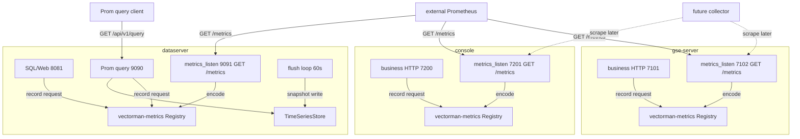
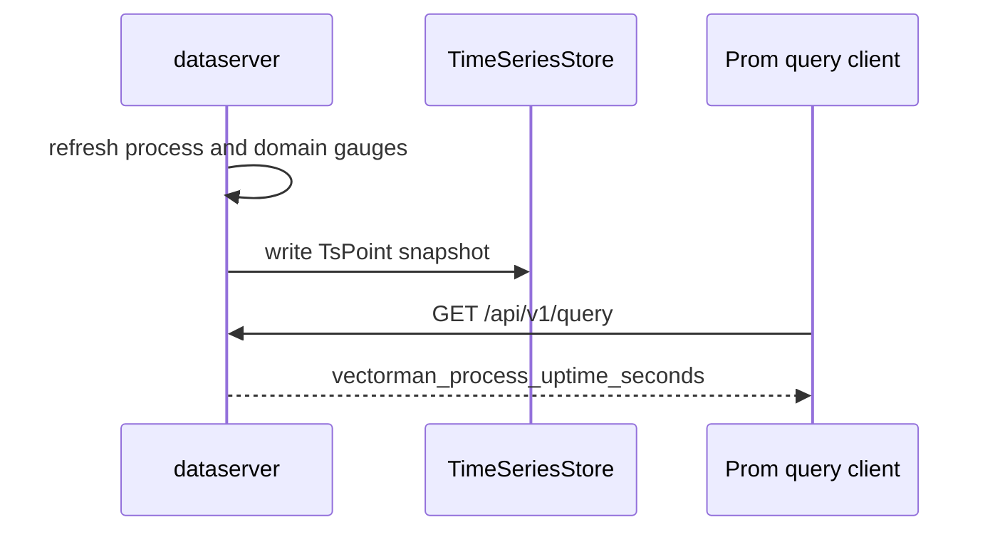

# 服务端组件自监控

Feature Name: server-self-monitoring
Updated: 2026-09-21

## Description

为 `gse-server`、`dataserver`、`console` 补齐自监控。每个进程绑定独立 `metrics_listen`，对外 `GET /metrics` 输出 Prometheus 文本。组件只暴露接口，由后续采集逻辑抓取其它进程。`dataserver` 额外按 60s 周期把本进程样本写入本进程 `TimeSeriesStore`。

与 Agent `metrics_host` 采集隔离：自监控指标名统一 `vectorman_` 前缀，恒定标签 `data_id=self`。SQL/Web 口已有的前端路由 `/metrics` 保持 SPA 页面。

## 技术选型

| 决策点 | 选择 | 说明 |
| --- | --- | --- |
| 共享实现 | 新建 `crates/vectorman-metrics` | 与 `vectorman-version` 一样沉淀通用 crate，避免三份 registry / 编码逻辑 |
| 指标库 | `prometheus-client` | 官方客户端，Registry 可同时做文本编码与样本快照 |
| 普罗接口位置 | 独立 `metrics_listen` | 避开 dataserver SQL/Web 口 SPA `/metrics` |
| 缺省监听 | 回环端口 | gse-server `127.0.0.1:7102`，dataserver `127.0.0.1:9091`，console `127.0.0.1:7201` |
| 上报 | 仅 dataserver 本进程落盘 | gse-server / console 只暴露 `/metrics`；跨组件入库留给后续采集 |
| dataserver 落盘 | 直写 `TimeSeriesStore` | 无信封、无 KvStore 去重 |
| HTTP 埋点 | axum middleware + `MatchedPath` | `path` 用路由模板；未匹配记为 `unmatched` |
| 进程采样 | Linux `/proc/self/stat` 与 `/proc/self/status` | RSS 取 `VmRSS`，CPU 取 `utime+stime` / CLK_TCK |
| bind 失败 | 进程退出码 1 | 与 dataserver sql/prom 口一致 |
| instance 标签 | 业务 HTTP 监听地址 | gse-server `http_listen`，dataserver `sql_http.listen`，console `listen` |

## Architecture



`dataserver` 落盘时序：刷新进程表盘 -> 刷新业务量 gauge -> 从 Registry 抽出样本 -> `ts.write`。



## Components and Interfaces

### crates/vectorman-metrics

共享 crate，workspace member。对外类型：

- `SelfMetrics::new(component, instance) -> Arc<SelfMetrics>`
  - `component`：`gse-server` / `dataserver` / `console`
  - `instance`：业务 HTTP 监听地址
  - 注册进程指标、HTTP 指标族，并给每条序列打上 `component`、`instance`、`data_id=self`
- `SelfMetrics::http_layer() -> Middleware`：记录业务口请求
- `SelfMetrics::metrics_router() -> axum::Router`：仅 `GET /metrics`
- `SelfMetrics::serve_metrics(listen) -> impl Future`：绑定独立口
- `SelfMetrics::set_gauge(name, value)` / `inc_counter(name, by)`：业务量
- `SelfMetrics::snapshot(now_micros) -> Vec<TsPoint>`：当前样本，histogram 展开为 `_bucket`/`_sum`/`_count`
- `SelfMetrics::flush_loop(interval, sink)`：仅 dataserver 使用，周期刷新进程指标并调用 `MetricsSink`

`MetricsSink`：

```text
async fn write(&self, points: &[TsPoint]) -> Result<(), String>
```

v1 只实现 `LocalTsSink`：持有 `Arc<dyn TimeSeriesStore>`，逐点 `write`。

进程采样失败时跳过本轮对应 gauge，其余指标照常编码与落盘。

HTTP 中间件：

- 读取 `MatchedPath`，没有则 `path=unmatched`
- 完成后 `inc` `vectorman_http_requests_total{method,path,status}`
- `observe` `vectorman_http_request_duration_seconds{method,path}`
- histogram 桶：`0.005, 0.01, 0.025, 0.05, 0.1, 0.25, 0.5, 1, 2.5, 5, 10`

`GET /metrics` 处理：刷新进程 gauge 与业务量 gauge -> `prometheus-client` 文本编码 -> `Content-Type: text/plain; version=0.0.4; charset=utf-8`。编码失败返回 500 与纯文本错误。该路由不经过 HTTP 埋点中间件。

业务量 gauge 通过 `SelfMetrics::on_scrape(callback)` 在编码前调用，供 gse-server / console / dataserver 填入当前会话数、应用数等。

### bins/dataserver

- `Config` 增加 `metrics_http: HttpListenConfig` 缺省 `127.0.0.1:9091`，`self_metrics_interval_secs` 缺省 60
- 环境变量 `DP_METRICS_HTTP_LISTEN`、`DP_SELF_METRICS_INTERVAL`
- 启动时构造 `SelfMetrics`，SQL 口与 Prom 查询口都挂 `http_layer`
- 第三个 `axum::serve` 绑定 `metrics_http.listen`
- `flush_loop` 使用 `LocalTsSink`
- 接入处理在 `accepted`/`failures` 上调用计数器
- bind 失败与 sql/prom 口相同：进程退出码 1

### crates/gse-server-core + bins/gse-server

- `ServerConfig` 增加 `metrics_listen` 缺省 `127.0.0.1:7102`
- 环境变量 `GSE_SERVER_METRICS_LISTEN`
- `Server::run` 在 HTTP 管理口之外再 `serve_metrics`
- 管理口 router 挂 `http_layer`
- scrape 前回调刷新：`vectorman_gse_agents_online` = ledger 中 `status=online` 的 agent 数；`vectorman_gse_sessions` = `registry.list().len()`

### bins/console

- `ConsoleConfig` 增加 `metrics_listen` 缺省 `127.0.0.1:7201`
- 环境变量 `CONSOLE_METRICS_LISTEN`
- 业务 router 挂 `http_layer`；独立口 `serve_metrics`
- scrape 前回调刷新 `vectorman_console_apps` = `catalog.list().len()`

### 配置示例增量

`config.toml.example`：

```toml
[metrics_http]
listen = "127.0.0.1:9091"

self_metrics_interval_secs = 60
```

`gse-server.toml.example`：

```toml
metrics_listen = "127.0.0.1:7102"
```

`console.toml.example`：

```toml
metrics_listen = "127.0.0.1:7201"
```

## Data Models

### 普罗指标

| 名称 | 类型 | 额外标签 | 来源 |
| --- | --- | --- | --- |
| `vectorman_process_cpu_seconds_total` | counter | | `/proc/self/stat` |
| `vectorman_process_resident_memory_bytes` | gauge | | `/proc/self/status` VmRSS |
| `vectorman_process_uptime_seconds` | gauge | | 进程启动时刻 |
| `vectorman_http_requests_total` | counter | `method`,`path`,`status` | HTTP 中间件 |
| `vectorman_http_request_duration_seconds` | histogram | `method`,`path` | HTTP 中间件 |
| `vectorman_gse_agents_online` | gauge | | gse-server ledger |
| `vectorman_gse_sessions` | gauge | | session registry |
| `vectorman_ingest_records_accepted_total` | counter | | dataserver ingest |
| `vectorman_ingest_records_failed_total` | counter | | dataserver ingest |
| `vectorman_console_apps` | gauge | | console catalog |

公共标签：`component`、`instance`、`data_id="self"`。

直方图落盘时拆成：

- `vectorman_http_request_duration_seconds_bucket` + 标签 `le`
- `vectorman_http_request_duration_seconds_sum`
- `vectorman_http_request_duration_seconds_count`

`field_name` 一律 `value`，`timestamp` 为落盘时刻 Unix 微秒。

### TsPoint 落盘（仅 dataserver）

与 `dataplane-ts::TsPoint` 相同。measurement 等于普罗指标名（histogram 用 `_bucket` / `_sum` / `_count` 后缀），tags 与普罗文本标签一致。

## Correctness Properties

- 同一 `dataserver` 进程的普罗文本与落盘样本：同名、同标签集、同数值类型拆分规则。
- `data_id=self` 的序列与 `cpu_usage` / `mem_usage` 可共存于同一 TSDB。
- dataserver SQL/Web 口在配置了 `http_web_dir` 时，`GET /metrics` 仍返回 SPA。
- metrics 口请求不增加 `vectorman_http_requests_total`。
- gse-server / console 仅服务 `GET /metrics`，样本留在进程内 Registry。
- 落盘或进程采样失败时，业务 HTTP 与 geminio 监听保持可用。

## Error Handling

| 场景 | 行为 |
| --- | --- |
| `metrics_listen` bind 失败 | 进程退出码 1 |
| `/proc` 读取失败 | 跳过本轮进程指标，编码其余指标 |
| 文本编码失败 | `GET /metrics` 返回 500 纯文本 |
| 本地 `TimeSeriesStore.write` 失败 | stderr 记录，下一周期重试 |

## Test Strategy

- `vectorman-metrics` 单测：registry 编码含 `vectorman_process_uptime_seconds` 与 `component`；HTTP 中间件对一次请求增加 counter；snapshot 的 tags 与文本标签一致；histogram 展开含 `_bucket`。
- dataserver httptest：独立 router 上 `GET /metrics` 200；配置 web_dir 时 SQL 口 `GET /metrics` 仍为 SPA；调用 `flush` 后 `query_instant("vectorman_process_uptime_seconds")` 命中 `component="dataserver"`。
- gse-server httptest：管理口中间件记录请求；metrics router 返回文本，含 `vectorman_gse_sessions`。
- console httptest：`GET /metrics` 含 `vectorman_console_apps`。

## References

[^1]: Prometheus text exposition format - [exposition formats](https://prometheus.io/docs/instrumenting/exposition_formats/)
[^2]: 当前工作区 `/crates/dataplane-ts/src/lib.rs` - `TimeSeriesStore` / `TsPoint`
[^3]: 当前工作区 `/bins/dataserver/src/http.rs` - SQL 口 SPA fallback 占用 `/metrics`
