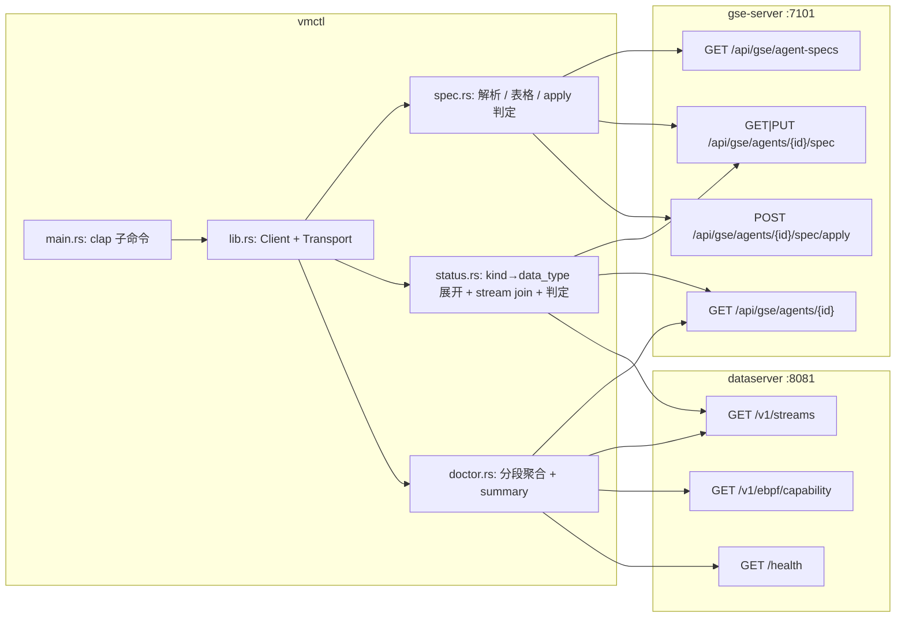
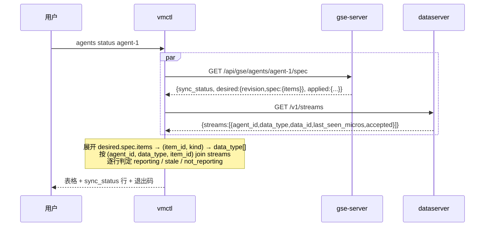

# vmctl 采集链路子命令（per-Agent spec 读写 + 生效核验）

Feature Name: vmctl-collect-chain
Updated: 2026-09-30

## Description

`vmctl` 增加九个能力（全部落在**既有 `agents` 子命令**下，不新增顶层命令）：

| 命令 | 方法 + 路径 | 输出 |
| --- | --- | --- |
| `agents specs [--table] [--agent-id]` | `GET /api/gse/agent-specs` | 透传 / 表格 |
| `agents spec get <id>` | `GET /api/gse/agents/{id}/spec` | 透传 |
| `agents spec put <id> -f\|--json` | `PUT /api/gse/agents/{id}/spec` | 透传 |
| `agents spec apply <id>` | `POST /api/gse/agents/{id}/spec/apply` | 透传 |
| `agents status <id>` | `GET spec` + `GET /v1/streams` + `GET /api/gse/agents/{id}` | 自渲染表格 |
| `agents doctor <id>` | 上面两条 + Agent 台账 + `/v1/ebpf/capability` + `/health` | 自渲染分段 |

**纯客户端 feature**：服务端三条 spec 路由与数据面两条读路由都已实现于 `main`，本 feature 一行服务端代码都不改。

前四个命令是「代理 + 透传」，忠实反映服务端语义（revision、脱敏、双 Option 参数）。
后两个是 **join**：把「期望 spec（GSE）」与「实际流索引（dataserver）」按 `(item_id, data_type)` 拼起来，
这是 CLI 存在的理由 —— 页面上要切两个系统看，CLI 一条命令给结论。

## Architecture



`agents status` 的时序（两个数据源并发取，避免串行叠加延迟）：



## Components and Interfaces

### workspace 变更表

| 文件 | 现状行数 | 改动 |
| --- | --- | --- |
| `bins/vmctl/src/main.rs` | 262 | `Command::Agents` 分支下新增 `specs` / `spec {get,put,apply}` / `status` / `doctor` 五个 `Subcommand` 变体与参数；新增 `put` 的 `-f` / `--json` 互斥校验；新增 `--data-url` 顶层参数；新模块 `mod status; mod doctor; mod spec;`（二进制内私有模块，不进 lib） |
| `bins/vmctl/src/status.rs` | 新增 | `KIND_DATA_TYPES` 映射、`status_report(...)`、`render_status(...)`、退出码判定；单测覆盖映射与判定边界 |
| `bins/vmctl/src/doctor.rs` | 新增 | 分段聚合 `doctor_report(...)`、`render_doctor(...)`、`summary:` 行；单测覆盖「全绿 / 段缺失 / Agent 404 短路」 |
| `bins/vmctl/src/spec.rs` | 新增 | `agent_specs_rows(body)`（容错解析，失败返回 `None` → 调用方透传）、`render_specs_table(...)`、`render_spec_get_table(...)`、`read_json_object(path_or_literal)` |
| `bins/vmctl/src/lib.rs` | 1379 | 新增 `pub struct DataClient`（只读 GET，`--data-url` + 同一 `Transport`）与 `Client::agents_specs/spec_get/spec_put/spec_apply/agent_get` 六个方法；`Output::ok` 等已有构造函数复用 |
| `bins/vmctl/Cargo.toml` | — | 无新依赖（`serde_json` / `clap` / `ureq` 已在） |

**不动的**：`crates/**`、`bins/dpc/**`、`bins/gse-server/**`、`bins/dataserver/**`、`frontend/**`。

### `data` 子命名空间：复用 `dpc` 的同一份实现（2026-10-01 追加）

要求是「把 `dpc` 的能力放进 `vmctl` 二进制」，而**不是**把 865 行查询代码拷一份。
做法是把 `dpc` 拆成 `lib` + `bin`，`vmctl` 依赖它的 lib：

| 文件 | 改动 |
| --- | --- |
| `bins/dpc/src/lib.rs` | 由原 `main.rs` 改名而来；`Cli` / `Command` / `TsCommand` / `DpcError` / `run` 全部 `pub`；新增 `pub struct Endpoints { sql_url, prom_url }` 与 `pub fn dispatch(endpoints, command)` |
| `bins/dpc/src/main.rs` | 变薄：`Cli::parse()` → `dpc::dispatch`（**行为、输出、退出码一字不变**） |
| `bins/dpc/Cargo.toml` | 增加 lib target（路径默认 `src/lib.rs`）；`[[bin]]` 保持 |
| `bins/vmctl/Cargo.toml` | 依赖 `dpc = { path = "../dpc" }`（不引入新三方依赖：`dpc` 已有的 `clap`/`ureq`/`serde_json`/`urlencoding`/`dataplane-core` 都是现成的） |
| `bins/vmctl/src/main.rs` | 新增顶层 `Command::Data { #[command(subcommand)] command: dpc::Command }`；两个全局参数 `--data-url`（加 `alias = "sql-url"`）与新增 `--prom-url`；派发时构造 `dpc::Endpoints` 调 `dpc::dispatch` |

clap 组合要点：`dpc::Command` 是独立的 `Subcommand` enum，直接作为 `vmctl` 顶层变体的字段即可嵌套出
`vmctl data query ...`；`--sql-url` 用 **alias**（而不是第二个字段）保证只有一个真源，`--help` 里仍显示 `--data-url`。

#### 数据面地址口径（上一版修订记录要求的「先统一」）

| 用途 | 参数 | 缺省 | 说明 |
| --- | --- | --- | --- |
| dataserver SQL 口（`/v1/streams`、`/v1/logs/search`、`/v1/ts/*`、`/v1/traces/*`、`/v1/edges/search`、`/v1/ebpf/*`） | 全局 `--data-url`（别名 `--sql-url`） | `http://127.0.0.1:8081` | `agents status` / `doctor` 本来就用它；现在 `data` 共用同一个值 |
| dataserver Prom 查询口（`/api/v1/query`） | 全局 `--prom-url` | `http://127.0.0.1:9090` | 仅 `data query` 用 |

两个缺省值与 `dpc` 一一对应，所以从 `dpc` 迁过来的命令**只改命令名**：
`dpc --sql-url X --prom-url Y logs …` ⇔ `vmctl --data-url X --prom-url Y data logs …`。

#### 为什么 `data` 不走 `vmctl` 的 `Transport`

`vmctl` 自己的命令走 `lib.rs` 的 `Transport` trait（可注入 `Mock` 做单测）。`data` **刻意不复用**它：

- 这些命令是**纯透传**（请求体由 5 个纯函数构造、响应正文原样落 stdout），业务逻辑全在 `dpc` 里，
  已有单测；再经 `vmctl` 的 `Transport` 包一层只是把同一份逻辑拆到两个测试体系。
- `dpc` 的实现依赖 `dataplane_core::ErrorCode` 的错误口径（`code=` 的输出）；套 `Transport` 要改 `dpc` 内部，
  违反「不改 `dpc` 行为」。
- 代价：`data` 子命令没有 `Mock` 级单测。补偿：`dpc` 的 5 个单测继续盖构造逻辑，
  `vmctl` 侧只测**命令树与参数绑定**（不联网）。

#### 输出与退出码

与 `dpc` 完全一致：成功 = 正文落 stdout + 0；失败 = `url=… reason=… code=…` 落 stderr + 1。
`vmctl` 的 `main` 里 `data` 分支不自己包错误（直接返回 `ExitCode`），否则会出现两套错误前缀。

#### `data` 里唯一会改数据的命令

`data ts delete`（`POST /v1/ts/delete`，按序列删历史点）。文档与 `--help` 必须点明；
其余 10 个命令全部只读。不加额外交互确认 —— 它与 `dpc ts delete` 同能力，加了反而两边不一致。

### Transport 复用（不新增网络层）

`UreqTransport` 已支持四件事：`Empty` / `Json` / `MultipartFile` 请求体、`Authorization: Bearer` 注入、
超时、`ureq::Error::Status` 与 `Transport` 错误到 `String` 的归一。
`DataClient` 与 `Client` 共用同一个 `&T: Transport` 实例，**只换 base URL**：

```rust
pub struct DataClient<'a, T: Transport> {
    pub base_url: String,
    pub transport: &'a T,
}
```

判据：`status` / `doctor` 对数据面只有 `GET`，`ureq` 的 `Transport::send` 已够，无需第二个 transport 实现。
`--data-url` 缺省 `http://127.0.0.1:8081`（与 `dpc` 的 `--sql-url` 缺省一致），使「单机默认」两边一致。

### 数据模型（只读消费，不新增结构）

GSE 侧 `GET /api/gse/agents/{id}/spec` 的响应（`crates/gse-server-core/src/http.rs::AgentSpecView`，
已脱敏）：

```jsonc
{
  "agent_id": "agent-1",
  "host_id": "host-1",
  "session_state": "online",            // online|checking|offline|closed|absent
  "sync_status": "stale",               // synced|stale|rejected|unspecified|unknown
  "updated_at": "2026-09-30T10:00:00Z", // 无期望时 null
  "reported_at": "2026-09-30T10:00:05Z",// 无上报时 null
  "desired": {
    "revision": "a1b2c3d4e5f60718",
    "spec": {
      "params": { "heartbeat_interval_secs": 30, "otlp_enabled": false, /* ... */ },
      "items": [
        { "item_id": "i-1", "name": "host metrics", "kind": "metrics_host",
          "enabled": true, "collector": { "interval_secs": 15 }, "storage": { "retention_days": 7 } }
      ]
    }
  },
  "applied": {
    "revision": "a1b2c3d4e5f60718",
    "outcome": "applied",               // applied|rejected|partial
    "spec": { "params": { /* token 恒为 null */ }, "items": [ /* ... */ ] },
    "not_enforced": ["cpu_limit_percent", "mem_limit_percent", "log_level"],
    "detail": ""
  },
  "diff": { "params": { /* 字段名 → {desired, applied} */ }, "items": { "added": [], "removed": [], "changed": [] } }
}
```

`desired` / `applied` / `diff` 三者**都可能为 `null`**（从未保存 / 从未上报），
解析必须按 `Option` 处理，不能 `unwrap`。

**实测修正（2026-09-30）**：`updated_at` / `reported_at` **不是** ISO 时间戳，而是台账的序列字符串
（形如 `1790831429653846-7`，`{unix_micros}-{seq}`）—— 见上面实测夹具。CLI 只做透传显示，
**不解析成时间**（解析一个会随实现变的私有格式是自找的）。

### Agent 台账的两个端点不一样（实测踩到）

| 端点 | 返回 | 有 `session_state`？ | 有 `token`？ |
| --- | --- | --- | --- |
| `GET /api/gse/agents/{id}` | 裸 `ledger::Agent` | ❌ | ✅ **明文** |
| `GET /api/gse/agents`（列表） | `AgentView`（`flatten` Agent + 两个字段） | ✅ | ✅ 明文 |

两条后果：

1. **`session_state` / `job_channel_available` 只能从列表端点取**。只查单台端点会拿到空串，
   而 `doctor` 的退出码依赖 `session_state == "online"` —— 修前实测输出 `session_state: ` 空值，
   把「在线」误判成「不在线」。所以 `doctor` 必须**同时**查两个端点（并发，成本一样）。
2. **两个端点都明文回 `token`**（未脱敏）。因此 `doctor` / `status` **不得透传**这些响应，
   只能渲染字段白名单（段 1/段 2 都是白名单字段，无 `token`）。
   这是本 feature 自己引入的一条约束：`agents get`（既有命令）透传仍会显示 token，属既有行为，
   不在本 feature 修（改它会让现有脚本的解析结果变化），但新增命令不得复制它。

数据面 `GET /v1/streams` 的响应（`bins/dataserver/src/http.rs::streams`）：

```jsonc
{ "streams": [ { "agent_id": "agent-1", "data_type": "metrics", "data_id": "i-1",
                 "last_seen_micros": 1759222800000000, "accepted": 412 } ] }
```

**key 口径**：`data_id == item_id`、`agent_id == spec 的 agent_id`、`data_type ∈ 表五`。
三个都相等才算这个采集项在该类型上有数据。

### kind → data_type 映射（判定核心）

```rust
/// 一个采集项可能产出多个 data_type。依据是 `EbpfItemKind::emits_edges()`（仅 Network 为真）
/// 与各采集器的 push 调用点（见 design 参考脚注 1）。
const KIND_DATA_TYPES: &[(&str, &[&str])] = &[
    ("metrics_host",    &["metrics"]),
    ("log_file",        &["logs"]),
    ("log_k8s_stdout",  &["logs"]),
    ("apm_otlp",        &["traces"]),
    ("ebpf_network",    &["ebpf_edges"]),
    ("ebpf_tcp",        &["metrics"]),   // 只出指标，不出边记录
    ("ebpf_process",    &["metrics"]),
    ("ebpf_syscall",    &["metrics"]),
];
```

**`ebpf_tcp` 不是 `ebpf_edges`（真集群实测抓到）**：`EbpfItemKind::emits_edges()` 只对
`Network` 为真 —— `ebpf_tcp` 与 `ebpf_network` 用不同的聚合 map（`TCP_AGG` vs `CONN_AGG`），
若两边都发边记录，同一个 `record_id` 会被后写的覆盖（sqlite 主键覆盖写），两侧数据互相丢。

初版把 `ebpf_tcp` 写成 `ebpf_edges`，在 2026-10-01 的 cloud3 验收中把一个**健康的**
`ebpf_tcp` 采集项报成了 `not_reporting`（该采集项在 `metrics` 上 `accepted=11`）。
现已加测试 `ebpf_kinds_follow_emits_edges_contract` 把这个表锚在代码契约上。

注意 `ebpf_*` 还会往 `ebpf`（原始事件）写，但**原始事件是可选开关**（`raw_events_enabled`），
把它纳入核验会把「刻意关掉原始事件」误判成采集故障，故**不纳入**。`accepted` 只看聚合/指标这两类。

## Correctness Properties

### P1 判定函数是纯函数

`classify(stream: Option<&StreamRow>, interval_secs: u64, now_micros: i64) -> Verdict` 不读时钟、不发请求。
`now_micros` 由调用方传入 → 单测可直接构造七个边界（无 stream / 恰好等于阈值 / 阈值 -1µs / 阈值 +1µs /
`last_seen` 在未来 / `interval_secs = 0` / `interval_secs` 缺失）。

判定：

```
threshold = max(3 * interval_secs, 60) 秒
last_seen 存在 且 now - last_seen <= threshold*1e6  → reporting
last_seen 存在 且 now - last_seen  >  threshold*1e6  → stale
last_seen 不存在                                      → not_reporting
数据面不可达                                          → unknown（由调用方短路，不进纯函数）
```

`interval_secs` 归一：缺失 / 非数字 / ≤ 0 → 15。

### P2 有副作用的东西只做一次

`agents status` 的两个远端调用**并发**（`std::thread::scope` 两个 `join`），
不引入 async runtime（`vmctl` 现为纯同步）。判据：`ureq` 阻塞 + 两个请求相互独立，
线程比引 `tokio` 便宜得多。

### P3 解析失败一律退回透传

`agents specs` / `agents spec get` 的表格渲染**只读 JSON**：
解析失败（不是对象 / 缺数组 / 字段类型不符）→ 打印原始 body，退出码 0。
理由：这两个命令的第一职责是「拿到正文」，表格是增强；把「字段改名」变成 CLI 退出码 1
会让运维在服务端升级期彻底失去这两个命令。

例外：`--agent-id` 过滤需要解析数组才能过滤；解析失败时**仍透传全量正文**并在 stderr 提示
「响应不是预期结构，已输出全量」。**`status` / `doctor` 不做此前置** —— 它们是计算型命令，缺字段即失败。

### P4 退出码与「判据」一一对应

| 命令 | 0 | 1 |
| --- | --- | --- |
| `specs` / `spec get` / `spec put` / `spec apply` | HTTP 2xx | 非 2xx、本地参数 / 文件错误 |
| `status` | 全部 enabled 项 `reporting` **且** `sync_status == "synced"` | 其余（含数据面不可达） |
| `doctor` | `session_state=online` + 数据面 health ok + `sync_status=synced` + 全部 enabled 项 `reporting` | 其余 |

`status` / `doctor` 的判定**不看** `status`（心跳口径）字段 —— 心跳新鲜但会话死正是本仓库踩过的坑
（`gse-session-liveness`），会话口径才是「能不能下发」的判据。

## Error Handling

| 场景 | 行为 |
| --- | --- |
| 传输失败（连不上 / 超时） | stderr `url=<url> reason=<transport> code=<n/a>`；退出码 1 |
| 4xx / 5xx | stderr 原样响应体 + `url=<url> code=<status>`；退出码 1 |
| `spec get` 404 | stderr 服务端正文（`agent X 没有 spec`）；退出码 1 |
| `spec apply` 409 | stderr 服务端正文（agent_offline）；退出码 1 |
| `spec put` 400 | stderr 服务端正文（`build_spec_item` 的 `unsupported kind` 等）；退出码 1 |
| `-f`/`--json` 都缺 / 都给 | 本地报错，**不发请求**；退出码 1 |
| `-f` 文件不存在 / 非 JSON 对象 | 本地报错，文件路径写进 stderr；退出码 1 |
| `status` 的 `GET spec` 404 | 报错并退出，**不请求 streams**（无主体可核验）；退出码 1 |
| `status` 的 streams 不可达 | data_type 行全部 `unknown`，末行给原因；退出码 1 |
| `doctor` 段 1 Agent 404 | 报错并退出，不强求其余段；退出码 1 |
| `doctor` 段 4/5 不可达 | 该段标 `unknown`，**继续**其余段；末行 summary 记明 |
| 响应不是预期结构（仅表格渲染） | 退回透传全文；退出码 0 |
| 未知 kind | 该行标 `unknown_kind`，**不参与**退出码判定（新 kind 不该让旧 CLI 失败） |

## Test Strategy

### 单元（`cargo test -p vmctl`，无网络）

1. **映射表**：八类 kind 逐个断言 data_type 展开；未知 kind → `unknown_kind`。
2. **判定边界**：P1 的七组边界，直接用 `classify` 纯函数断言。
3. **间隔归一**：`collector` 缺 `interval_secs` / `"60"`（字符串）/ `0` / `-1` → 15。
4. **表格渲染**：正常响应 / `desired = null` / `applied = null` / 响应是数组而非对象（退回透传）。
5. **真实响应夹具**：把服务端实测响应（含 `diff` 与 `not_enforced`）存为字符串常量，
   断言 `specs --table` 与 `status` 的渲染行数，避免「手写夹具掩盖字段漂移」的老坑。
6. **put 参数校验**：`-f` + `--json` 同时给 → 报错且**未调用 transport**（用既有的 `FakeTransport` 计数）。
7. **doctor 短路**：段 1 404 时后续 transport 调用次数为 0。
8. **输出纯度**：断言错误信息不含请求体内容（防 `token` 泄漏）。

### 集成（`#[ignore]` + 环境变量，对真实服务）

- `VECTORMAN_E2E_URL` / `VECTORMAN_E2E_DATA_URL` 都设置时运行：
  `specs` 对真实 gse-server、`status` 对真实 dataserver（本机起，真采集数据）。
- 无环境变量时整体跳过（CI 保持绿），与 `frontend/apps/dataplane/src/pages/ebpf-live.test.tsx` 同一约定。

### 手工（验收时执行，结论写回 `tasklist.md`）

- 对 cloud3 / testbkee 真集群执行五条命令，记录退出码与关键输出。

## Pitfalls

- **`sync_status` 与 `status` 不是一回事**：前者是 spec 同步（revision 比对），后者是心跳。
  `status` / `doctor` 必须用 `session_state`（会话口径）判「能否下发」，用 `sync_status` 判「是否已下发」，
  两个都不能用 `status`。用 `status` 会在死会话上给出「online，全绿」的错误结论。
- **`desired` / `applied` / `diff` 可为 null**：三处 `Option`。`desired = null` 时 `status` 应报
  「未保存过 spec，请先 spec put」，而不是打印空表当成功。
- **`spec put` 不能补默认值**：服务端 `SpecParamsInput` 用 `double_option` 区分「字段缺失」（不修改）
  与「显式 null」（清空）。CLI 若照自己的默认值补全，会把「不修改」变成「改成默认」——
  典型后果是 `allowed_interpreters` 被重置成默认集，Agent 上原有解释器配置静默丢失。
- **`token` / `otlp_token` 只在 `desired` 里出现**：`applied` 恒为 null（脱敏）。
  任何「期望 vs 生效」的字段比较都不得把 token 当差异，否则会对每台 Agent 误报 `stale`。
  本 feature 的差异展示**只透传服务端算好的 `diff`**，不在 CLI 重算。
- **`GET /api/gse/agent-specs` 会列出「有 spec 但台账无此 Agent」的行**（服务端刻意行为，
  见 `list_agent_specs`）—— 表格里 `session_state` 会是空串，不要当成 bug。
- **`accepted` 是累计值**，不是速率。判「还活着」只能看 `last_seen_micros`；
  用 `accepted` 变化率需要两次采样，本 feature 不做（YAGNI，要趋势去 Prom）。
- **表头不能只打 `data_type`**：`ebpf_process` 与 `metrics_host` 都是 `metrics`，
  只打 data_type 会让两行看起来一样。必须同时打 `item_id`。
- **不要为 `status` 引入 async**：`vmctl` 是纯同步 `ureq` 客户端，为了两个 GET 引 `tokio`
  会把二进制从 ~2MB 撑到 ~4MB 且拖慢 `cargo build`。`std::thread::scope` 两行解决。
- **表格输出不要用 `\t` 对齐**：`item_id` / `agent_id` 长度差异大（`serde-k8s` 风格的长 ID），
  tab 在不同终端宽度不同。用空格填充到固定列宽，与 `vmctl jobs list` 现状一致。
- **`--table` 是增强不是替换**：默认透传（与 `dpc` 语义一致），`--table` 才渲染。
  反过来做会让现有脚本在 `vmctl` 升级后解析失败。
- **`data` 不要另起一套地址参数**：`--sql-url` 只能是 `--data-url` 的别名（clap `alias`），
  否则「同一个 SQL 口两个名字、两套缺省」迟早漂移 —— 这正是上一版修订记录要求「先统一」的那个坑。
- **别把 `data::Command` 展开成 `vmctl` 的顶层子命令**：顶层已固定为 `health|hosts|agents|jobs`（+ 本次 `data`），
  把 11 个查询命令铺到顶层会把 `--help` 淹掉，也与初稿的 `vmctl data ...` 命名空间不一致。
- **`dpc` 拆 lib 时不要顺手「美颜」它的输出**：`dpc` 已有脚本在用（`url=… reason=… code=…` 被解析）。
  本次只做可见性修改（`pub`）、不改任何格式化逻辑。
- **`data` 分支不要重复包错误**：`vmctl::main` 已有 `Output` 的错误打印，
  `dpc::dispatch` 也自带 `url=… reason=… code=…`。两边都包会出现双前缀。

## References

1. 采集器 push 调用点（kind → data_type 映射的依据）：
   `crates/gse-agent-core/src/collect/ebpf.rs`（`EbpfSink::{edges,metrics,raw_events}` → `ebpf_edges` / `metrics` / `ebpf`）、
   `metrics.rs`（`DATA_TYPE_METRICS`）、`logfile.rs` 与 `k8s.rs`（`DATA_TYPE_LOGS`）、`otlp.rs`（`DATA_TYPE_TRACES`）。
2. 服务端三条路由与视图：`crates/gse-server-core/src/http.rs`（`ledger_routes` 第 127–133 行、
   `AgentSpecView` 第 634 行、`SpecPutBody` / `SpecParamsInput` 第 1022–1069 行）。
3. revision 与 diff 口径：`crates/gse-server-core/src/spec.rs`。
4. 数据面流索引：`bins/dataserver/src/http.rs::streams`（第 518 行）。
5. 规格基线：`.monkeycode/specs/gse-agent-config-center/requirements.md` R12（服务端范围与破坏性变更）、
   `design.md`「服务端接口」节。
6. 会话 vs 心跳口径的坑：`.monkeycode/specs/gse-session-liveness/`（心跳新鲜但会话已死的真实事故）。
7. `dpc` 的现状语义与 `--sql-url` 缺省：`bins/dpc/src/main.rs`。
