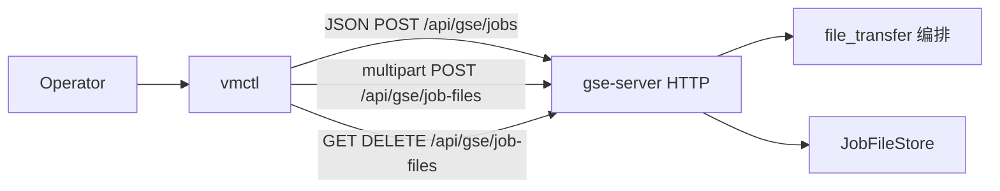
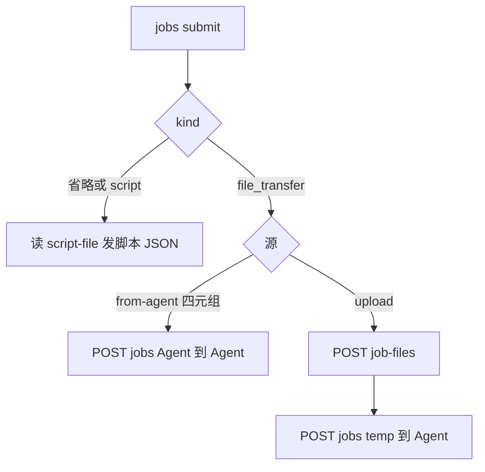

# vmctl 文件传输

Feature Name: vmctl-file-transfer
Updated: 2026-09-21

## Description

扩展既有 `bins/vmctl` HTTP 客户端：`jobs submit` 增加 `--kind file_transfer`，提交 Agent 互传或「本地上传后下发到 Agent」；新增 `jobs files` 管理 Server 临时文件；`jobs rerun` 增加 `--dest-path`。gse-server 传输协议、编排与前端入口保持不变。

## Architecture



`vmctl` 仍只做 HTTP 客户端：不建立 geminio、不读 `gse-agent.toml`、不直连 Agent 文件系统。本地 `--upload` / `jobs files upload` 读的是运维机路径。

### 命令到 HTTP

| 命令 | 方法与路径 |
| --- | --- |
| `jobs submit --kind script` 或省略 `--kind` | 既有 `POST /api/gse/jobs` 脚本体 |
| `jobs submit --kind file_transfer` 互传 | `POST /api/gse/jobs` 文件体 |
| `jobs submit --kind file_transfer --upload` | `POST /api/gse/job-files` 然后 `POST /api/gse/jobs` |
| `jobs files list` | `GET /api/gse/job-files` |
| `jobs files upload --file` | `POST /api/gse/job-files` |
| `jobs files download <file_id> --output` | `GET /api/gse/job-files/{file_id}` 写本地文件 |
| `jobs files delete <file_id>` | `DELETE /api/gse/job-files/{file_id}` |
| `jobs rerun --dest-path` | 既有 `POST /api/gse/jobs/{id}/rerun`，body 可含 `dest_path` |
| `--wait` | 提交成功后循环 `GET /api/gse/jobs/{job_id}` |

### 提交分流



clap 层把 `--agent-id`、`--script-file` 改为可选；必填规则在 `vmctl` 库内按 kind 校验，以便错误信息走 stdout/stderr 约定而不是仅依赖 clap。

## Components and Interfaces

### bins/vmctl/src/main.rs

`JobsCmd::Submit` 增加：

| 参数 | 说明 |
| --- | --- |
| `--kind` | `script` 或 `file_transfer`，省略为 `script` |
| `--from-agent` | 源 Agent id |
| `--from-path` | 源绝对路径 |
| `--to-agent` | 目标 Agent id |
| `--to-path` | 目标绝对路径 |
| `--upload` | 运维机本地文件路径 |

`JobsCmd::Rerun` 增加 `--dest-path`。

新增嵌套：

```text
jobs files list
jobs files upload --file <path>
jobs files download <file_id> --output <path>
jobs files delete <file_id>
```

### bins/vmctl/src/lib.rs

`JobSubmitSpec` 增加 `kind`、`from_agent`、`from_path`、`to_agent`、`to_path`、`upload`。`kind` 缺省 `"script"`。

`JobRerunSpec` 增加 `dest_path: Option<String>`，非空时写入 rerun JSON。

`jobs_submit`：

1. `kind` 规范化为小写后只能是 `script` 或 `file_transfer`。
2. `script`：保持现有读文件、组 `JobSubmitBody` 的路径；`--from-agent` / `--upload` 等文件标志若出现则退出码 1。
3. `file_transfer`：`--script-file` 若出现则退出码 1。
4. 互传：四元组齐全时发文件 JSON。
5. `--upload`：读本地字节 → multipart 上传 → 解析 JSON `file_id` → 发 `source: server_temp` + `destination: agent`。
6. 成功后走既有 `after_job_write` / `--wait`。

`Transport` 现仅 `GET`/`POST` + 文本 body，无法承载 multipart、DELETE、二进制下载。扩展为：

```rust
pub enum RequestBody<'a> {
    Empty,
    Json(&'a str),
    MultipartFile {
        field: &'a str,
        filename: &'a str,
        data: &'a [u8],
    },
}

pub struct HttpResponse {
    pub status: u16,
    pub body: Vec<u8>,
}

pub trait Transport {
    fn send(&self, method: &str, url: &str, body: Option<&str>) -> Result<(u16, String), String>;
    fn exchange(&self, method: &str, url: &str, body: RequestBody<'_>) -> Result<HttpResponse, String>;
}
```

既有 `send` 保留，内部改为调用 `exchange` 再 `String::from_utf8_lossy`，避免改散全部脚本作业测试。`UreqTransport::exchange`：

- `GET`/`POST`/`DELETE`。
- `Json`：`Content-Type: application/json`。
- `MultipartFile`：构造 `multipart/form-data` 体，字段名固定 `file`。
- 响应 body 保持字节；`jobs files download` 直接写入 `--output`。
- 连接超时仍 10 秒；`exchange` 的读超时 300 秒，覆盖最大 64 MiB 上传/下载。

单测 `FakeTransport` 实现 `exchange`，记录 method、url、body 变体。

### 校验表

| kind | 合法输入 | 非法 |
| --- | --- | --- |
| 省略 / `script` | `--agent-id` + `--script-file` | 同时带 `--from-agent` 或 `--upload` |
| `file_transfer` 互传 | `--from-agent --from-path --to-agent --to-path` | 缺任一；与 `--upload` 同时出现；带 `--script-file` |
| `file_transfer` 上传下发 | `--upload --to-agent --to-path` | 缺目标；本地不可读；与 `--from-agent` 同时出现 |

路径空字符串按缺失处理。vmctl 不校验路径是否绝对；绝对路径规则由 gse-server 返回 400。

## Data Models

互传提交体：

```json
{
  "kind": "file_transfer",
  "source": {
    "type": "agent",
    "agent_id": "web-01",
    "path": "/var/log/app.log"
  },
  "destination": {
    "type": "agent",
    "agent_id": "web-02",
    "path": "/tmp/app.log"
  },
  "timeout_secs": 300
}
```

上传后下发的第二步：

```json
{
  "kind": "file_transfer",
  "source": {
    "type": "server_temp",
    "file_id": "file-1710000000000-0"
  },
  "destination": {
    "type": "agent",
    "agent_id": "web-02",
    "path": "/opt/pkg.tar"
  }
}
```

`file_id` 从上传响应 JSON 的 `file_id` 字段读取；缺失则退出码 1，不发第二步 POST。

重做覆盖：

```json
{
  "agent_id": "web-03",
  "dest_path": "/tmp/app.log",
  "timeout_secs": 120
}
```

省略的覆盖字段不出现在 JSON 中。无覆盖时 POST 空 body，与现网 rerun 一致。

`jobs files download` 成功时 stdout 为空（避免把二进制打到终端）；`jobs files delete` 遇 204 时 stdout 为空、退出码 0。

## Correctness Properties

- 省略 `--kind` 的 `jobs submit` 请求体与 gse-cli 脚本提交字节级兼容：无 `kind` 字段或等价于服务端缺省脚本。
- `file_transfer` 请求体不含 `script`、`interpreter`、`args`、`env`、`working_dir`。
- `--upload` 成功后才提交作业；上传失败零作业。
- `--wait` 只轮询作业，不轮询 `job-files`。
- `jobs files download` 把原始字节写入 `--output`，不按 UTF-8 解码。
- 文件相关请求省略鉴权头；Base URL 拼接规则与 gse-cli 相同。

省略 `--kind` 时 JSON 是否带 `"kind":"script"`：不带，保持现有客户端兼容。显式 `--kind script` 同样省略 `kind` 字段。

## Error Handling

| 场景 | stdout | stderr | 退出码 |
| --- | --- | --- | --- |
| 脚本/文件提交 2xx 且无 Wait | 作业 JSON | 空 | 0 |
| Wait 且 `succeeded` | 作业 JSON | 空 | 0 |
| kind 非法、标志冲突、路径缺失、本地文件不可读 | 空 | 错误文本 | 1 |
| 上传 4xx/5xx | 空 | 响应正文 | 1 |
| 提交 4xx/5xx | 空 | 响应正文 | 1 |
| Wait 且 `failed`/`rejected`/`lost` | 作业 JSON | 空 | 1 |
| Wait 且作业 `timeout` 或满 300 秒 | 作业 JSON | 空 | 2 |
| `jobs files download` 2xx | 空 | 空 | 0 |
| `jobs files download` 写盘失败 | 空 | 错误文本 | 1 |
| `jobs files delete` 204 | 空 | 空 | 0 |
| 连接失败 | 空 | 错误文本 | 1 |

clap 用法错误沿用 clap 默认。

## Test Strategy

- 脚本回归：省略 `--kind` 的 submit stub 仍为无 `kind` 的脚本 JSON；`--script-file` 缺失文件退出 1。
- 互传：stub 断言 `POST /api/gse/jobs` body 的 `kind`/`source`/`destination`。
- 上传下发：先 `POST /api/gse/job-files` multipart 字段 `file`，再 `POST /api/gse/jobs` 且 `source.file_id` 等于上传响应。
- 冲突：`--kind file_transfer` 带 `--script-file`；`--upload` 与 `--from-agent` 同时出现；未知 `--kind`。
- `jobs rerun --dest-path`：body 含 `dest_path`。
- `jobs files`：list GET、upload multipart、download 写临时文件内容与源字节一致、delete DELETE。
- Wait：文件作业终态退出码与脚本作业相同（复用注入的短时限）。

## References

[^1]: (Filename) - 本需求 `.monkeycode/specs/vmctl-file-transfer/requirements.md`
[^2]: (Filename) - gse-cli `.monkeycode/specs/gse-cli/design.md`
[^3]: (Filename) - 文件作业 HTTP `.monkeycode/specs/gse-job-file-transfer/design.md`
[^4]: (Filename) - vmctl 入口 `bins/vmctl/src/main.rs`
[^5]: (Filename) - vmctl 客户端 `bins/vmctl/src/lib.rs`
[^6]: (Filename) - job-files 路由 `crates/gse-server-core/src/http.rs`
